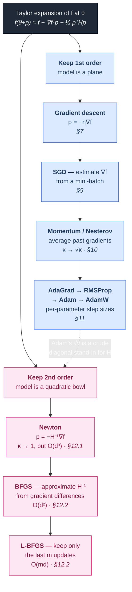
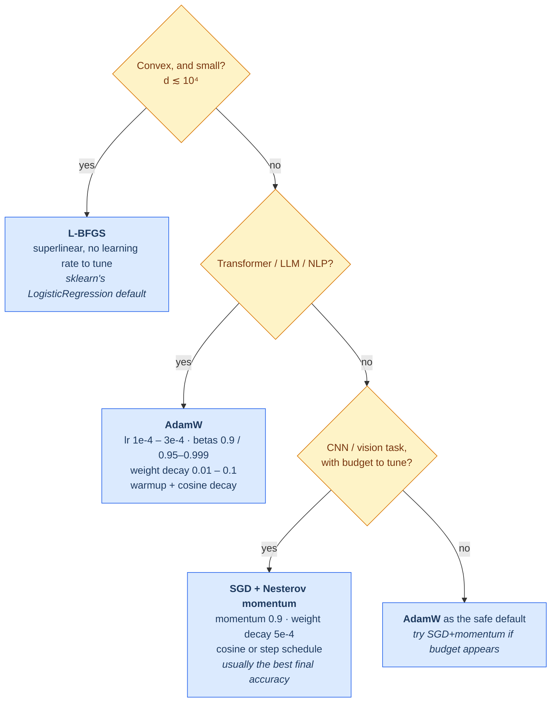

# 00.02 — Calculus and Optimization

> **Prerequisites**: [00.01 Linear Algebra](../01-linear-algebra/) — especially §11 (quadratic
> forms, definiteness) and §14 (matrix calculus).
> **You will be able to**: derive gradient descent and its convergence rate, explain why your
> learning rate diverges at exactly the value it does, derive the SVM dual, and know when Adam
> is the wrong choice.

---

## Table of contents

1. [Learning is optimization](#1-learning-is-optimization)
2. [Derivatives, gradients, and what they mean](#2-derivatives-gradients-and-what-they-mean)
3. [Jacobians and Hessians](#3-jacobians-and-hessians)
4. [Taylor expansion — the master tool](#4-taylor-expansion--the-master-tool)
5. [Critical points and optimality conditions](#5-critical-points-and-optimality-conditions)
6. [Convexity](#6-convexity)
7. [Gradient descent, derived](#7-gradient-descent-derived)
8. [Why conditioning decides your learning rate](#8-why-conditioning-decides-your-learning-rate)
9. [Stochastic gradient descent](#9-stochastic-gradient-descent)
10. [Momentum and acceleration](#10-momentum-and-acceleration)
11. [Adaptive methods](#11-adaptive-methods)
12. [Second-order methods](#12-second-order-methods)
13. [Constrained optimization: Lagrange and KKT](#13-constrained-optimization-lagrange-and-kkt)
14. [Duality](#14-duality)
15. [Non-smooth optimization: subgradients and proximal methods](#15-non-smooth-optimization-subgradients-and-proximal-methods)
16. [Convergence rates, compared](#16-convergence-rates-compared)
17. [Practical guidance](#17-practical-guidance)
18. [Common misconceptions](#18-common-misconceptions)

---

## 1. Learning is optimization

Strip away the vocabulary and essentially all of supervised machine learning is one statement:

$$\boxed{\;\hat{\boldsymbol{\theta}} = \arg\min_{\boldsymbol{\theta}}\;
\underbrace{\frac{1}{n}\sum_{i=1}^{n} L\big(y_i, f(\mathbf{x}_i; \boldsymbol{\theta})\big)}_{\text{empirical risk}}
\;+\; \underbrace{\lambda\,\Omega(\boldsymbol{\theta})}_{\text{regularizer}}\;}$$

Choosing a model means choosing $f$. Choosing what "wrong" means is choosing $L$. Choosing what
you believe about the parameters before seeing data is choosing $\Omega$. **Everything else —
this entire chapter — is the machinery for actually finding the $\arg\min$.**

This framing, *empirical risk minimization*, is worth taking seriously because it makes the
central difficulty visible. We minimize the average loss on the sample we have, but we care about
the expected loss on data we have never seen ([notation §4](../../docs/notation.md)). The
optimizer's job is to minimize the first; whether that helps with the second is a separate
question, answered in [05.01](../../05-model-evaluation/01-bias-variance-and-theory/).

A useful consequence: **a better optimizer is not always a better model.** Driving training loss
to zero faster can make generalization worse. Keep the two goals separate in your head.

---

## 2. Derivatives, gradients, and what they mean

### 2.1 The derivative

$$f'(x) = \lim_{h\to 0}\frac{f(x+h)-f(x)}{h}$$

Read it as: *if I nudge the input by a tiny $h$, the output changes by about $f'(x)\cdot h$.* The
derivative is an exchange rate between input perturbations and output perturbations. That reading
generalizes to everything below.

### 2.2 Partial derivatives and the gradient

For $f: \mathbb{R}^{d}\to\mathbb{R}$, the partial derivative $\partial f/\partial x_j$ nudges
coordinate $j$ and holds the rest fixed. Stack them:

$$\nabla f(\mathbf{x}) = \begin{bmatrix}
\partial f/\partial x_1 \\ \vdots \\ \partial f/\partial x_d
\end{bmatrix} \in \mathbb{R}^{d}$$

### 2.3 The gradient is the direction of steepest ascent — proof

This is asserted constantly and proved rarely. It takes two lines.

The **directional derivative** of $f$ along a *unit* vector $\mathbf{u}$ is the rate of change of
$f$ as you move along $\mathbf{u}$:

$$D_{\mathbf{u}}f(\mathbf{x}) = \lim_{h\to 0}\frac{f(\mathbf{x}+h\mathbf{u}) - f(\mathbf{x})}{h}
= \nabla f(\mathbf{x})^{\top}\mathbf{u}$$

We want the unit $\mathbf{u}$ that maximizes this. By Cauchy-Schwarz,

$$\nabla f^{\top}\mathbf{u} \le \Vert \nabla f\Vert _2\,\Vert \mathbf{u}\Vert _2 = \Vert \nabla f\Vert _2$$

with equality **if and only if** $\mathbf{u}$ points along $\nabla f$. Therefore

$$\mathbf{u}^{\star} = \frac{\nabla f}{\Vert \nabla f\Vert _2}, \qquad
D_{\mathbf{u}^\star} f = \Vert \nabla f\Vert _2$$

So: the gradient points in the steepest *ascent* direction, its negative in the steepest *descent*
direction, and its magnitude is the slope in that direction. $\blacksquare$

Two corollaries worth keeping:

- **Steepest descent is only steepest locally.** It is the best direction for an infinitesimal
  step, which is not the best direction for a finite step. §8 shows how badly these differ.
- **"Steepest" depends on the norm.** Cauchy-Schwarz above uses $\ell_2$. Measure distance with a
  different norm and you get a different steepest direction — which is exactly what natural
  gradient methods and Adam are doing (§11).

### 2.4 Level sets and orthogonality

A **level set** is $\{\mathbf{x} : f(\mathbf{x}) = c\}$ — a contour line. Moving along a contour,
$f$ doesn't change, so the directional derivative along it is zero:
$\nabla f^{\top}\mathbf{u} = 0$. Hence:

$$\textbf{the gradient is always perpendicular to the level set through that point.}$$

This is the geometric fact behind Lagrange multipliers (§13). Keep it.

---

## 3. Jacobians and Hessians

### 3.1 Jacobian — the derivative of a vector-valued function

For $\mathbf{f}:\mathbb{R}^{n}\to\mathbb{R}^{m}$:

$$\mathbf{J} = \frac{\partial \mathbf{f}}{\partial\mathbf{x}} \in \mathbb{R}^{m\times n},
\qquad J_{ij} = \frac{\partial f_i}{\partial x_j}$$

The Jacobian is the **best linear approximation** to $\mathbf{f}$ near $\mathbf{x}$. And by the
chain rule (00.01 §14.3), Jacobians compose by multiplication:

$$\mathbf{J}_{g\circ f} = \mathbf{J}_{g}\,\mathbf{J}_{f}$$

A neural network is a composition, so its Jacobian is a product of per-layer Jacobians. That
product is backpropagation, and the fact that products of matrices have eigenvalues that grow or
shrink geometrically (00.01 §10.2) is precisely the vanishing/exploding gradient problem.

### 3.2 Hessian — the matrix of second derivatives

$$\mathbf{H} = \nabla^{2}f(\mathbf{x}) \in\mathbb{R}^{d\times d},
\qquad H_{ij} = \frac{\partial^{2}f}{\partial x_i \partial x_j}$$

For twice continuously differentiable $f$, mixed partials commute (Clairaut/Schwarz), so
**$\mathbf{H}$ is symmetric** — and therefore, by the spectral theorem (00.01 §11.1), it has real
eigenvalues and an orthonormal eigenbasis. Everything in §5 and §8 depends on this.

The Hessian measures **curvature**: how fast the gradient itself changes. Large eigenvalue =
steeply curved direction (the gradient changes fast, so you must step carefully); small eigenvalue
= nearly flat direction (you can step far).

---

## 4. Taylor expansion — the master tool

Almost every optimization algorithm is "approximate $f$ locally by a polynomial, minimize the
polynomial, repeat".

$$f(\mathbf{x} + \mathbf{p}) = f(\mathbf{x}) + \nabla f(\mathbf{x})^{\top}\mathbf{p}
+ \tfrac{1}{2}\mathbf{p}^{\top}\nabla^{2}f(\mathbf{x})\,\mathbf{p} + O(\Vert \mathbf{p}\Vert ^{3})$$

| Truncate at | Model of $f$ | Minimizing it gives |
|---|---|---|
| 1st order | a plane | **gradient descent** (with a step size, since a plane has no minimum) |
| 2nd order | a quadratic bowl | **Newton's method** |
| 2nd order, approximate $\mathbf{H}$ | a cheaper bowl | **quasi-Newton (BFGS, L-BFGS)** |
| 2nd order, diagonal $\mathbf{H}$ | axis-aligned bowl | **Adam and friends**, loosely |

That table is the whole of §7-§12 in advance. Everything below is a consequence of which
truncation you pick and how you handle the error term:

The dashed edge is the point worth carrying away: **the adaptive methods are second-order
methods in disguise.** Adam's $\sqrt{\hat{\mathbf{v}}}$ is a cheap diagonal estimate of curvature,
which is why it helps on exactly the ill-conditioned problems §8 describes.

---

## 5. Critical points and optimality conditions

**First-order necessary condition.** If $\mathbf{x}^{\star}$ is a local minimum of a
differentiable $f$, then $\nabla f(\mathbf{x}^{\star}) = \mathbf{0}$.

*Why:* if the gradient were nonzero, moving along $-\nabla f$ would strictly decrease $f$
(by §2.3), contradicting minimality.

Points where $\nabla f = \mathbf{0}$ are **critical points** — but they need not be minima.

**Second-order conditions.** At a critical point, the first-order term vanishes and Taylor gives

$$f(\mathbf{x}^{\star} + \mathbf{p}) \approx f(\mathbf{x}^{\star}) + \tfrac{1}{2}\mathbf{p}^{\top}\mathbf{H}\mathbf{p}$$

So the local shape is entirely decided by the quadratic form $\mathbf{p}^{\top}\mathbf{H}\mathbf{p}$ —
and by 00.01 §11.2 that is decided by the signs of $\mathbf{H}$'s eigenvalues:

| Hessian at critical point | All eigenvalues | Point is |
|---|---|---|
| positive definite | $> 0$ | strict local **minimum** |
| positive semidefinite | $\ge 0$ | minimum or flat (inconclusive) |
| indefinite | mixed signs | **saddle point** |
| negative definite | $< 0$ | strict local **maximum** |

### 5.1 Why high-dimensional loss surfaces are full of saddles, not bad minima

Take a critical point of a $d$-dimensional loss and treat the signs of the $d$ Hessian eigenvalues
as roughly independent coin flips. The probability that *all* $d$ are positive — the condition for
a local minimum — is about $2^{-d}$.

For $d = 10^{6}$ parameters, that is $2^{-10^{6}}$. **Essentially every critical point of a large
network is a saddle point.**

This reframes the classic worry. The folk fear about neural networks is "gradient descent will get
stuck in a bad local minimum." The modern understanding, supported by both this counting argument
and empirical work (Dauphin et al. 2014; Choromanska et al. 2015), is the opposite: bad local
minima are rare in high dimensions, most critical points are saddles, and the minima that do exist
tend to have similar loss values. The real difficulty is **slow escape from saddle plateaus** —
regions where the gradient is tiny but you are not at a minimum. Momentum (§10) helps precisely
because it accumulates velocity across such flat stretches.

---

## 6. Convexity

Convexity is the property that separates "we can guarantee a global optimum" from "we hope for
the best."

### 6.1 Definitions

A **set** $\mathcal{C}$ is convex if the segment between any two of its points stays inside it:

$$\mathbf{x},\mathbf{y}\in\mathcal{C},\ \theta\in[0,1]
\;\Longrightarrow\; \theta\mathbf{x}+(1-\theta)\mathbf{y}\in\mathcal{C}$$

A **function** $f$ is convex if it lies below its own chords:

$$f(\theta\mathbf{x}+(1-\theta)\mathbf{y}) \le \theta f(\mathbf{x}) + (1-\theta)f(\mathbf{y})$$

### 6.2 Three equivalent characterizations

For differentiable $f$, these are equivalent:

$$
\begin{aligned}
\textbf{(0th order)}\quad & f(\theta\mathbf{x}+(1-\theta)\mathbf{y}) \le \theta f(\mathbf{x})+(1-\theta)f(\mathbf{y})\\
\textbf{(1st order)}\quad & f(\mathbf{y}) \ge f(\mathbf{x}) + \nabla f(\mathbf{x})^{\top}(\mathbf{y}-\mathbf{x})\\
\textbf{(2nd order)}\quad & \nabla^{2}f(\mathbf{x}) \succeq 0 \quad\text{for all }\mathbf{x}
\end{aligned}
$$

The **first-order** version is the most useful: *the tangent plane at any point is a global
underestimator of $f$.* It gives the headline theorem immediately.

### 6.3 The theorem that makes convexity matter

> **For a convex $f$, every local minimum is a global minimum. If $f$ is strictly convex, the
> minimum is unique.**

*Proof.* Let $\mathbf{x}^{\star}$ be a local minimum, so $\nabla f(\mathbf{x}^{\star}) = \mathbf{0}$.
By the first-order condition, for any $\mathbf{y}$:

$$f(\mathbf{y}) \ge f(\mathbf{x}^{\star}) + \underbrace{\nabla f(\mathbf{x}^{\star})^{\top}}_{=\ \mathbf{0}^{\top}}(\mathbf{y}-\mathbf{x}^{\star}) = f(\mathbf{x}^{\star})$$

No point anywhere is better. $\blacksquare$

That is why convexity is worth so much: **$\nabla f = \mathbf{0}$ becomes a certificate of global
optimality**, and any convergent descent method finds the answer.

### 6.4 Which ML problems are convex?

| Convex ✓ | Non-convex ✗ |
|---|---|
| Linear regression (OLS, Ridge, Lasso, Elastic Net) | Neural networks (any hidden layer) |
| Logistic regression | Gaussian mixture models / EM |
| SVMs (primal and dual) | k-means |
| Softmax regression | Matrix factorization |
| SVD / PCA (via eigenvalue problems) | Most deep learning, all of it in practice |

**Why linear regression is convex**: $\nabla^{2}J = 2\mathbf{X}^{\top}\mathbf{X} \succeq 0$
always (00.01 §11.2). Add ridge and it becomes $2(\mathbf{X}^{\top}\mathbf{X}+\lambda\mathbf{I})
\succ 0$ — *strictly* convex, hence a unique minimum even when $\mathbf{X}$ is rank-deficient.
That single line explains why ridge regression always has a unique solution and OLS does not.

**Why neural networks are not**: permutation symmetry alone kills it. Swap two hidden units (and
their weights) and you get a different parameter vector with identical loss. So minima come in
combinatorially many equivalent copies, and a function with multiple isolated global minima
cannot be convex.

### 6.5 Useful convexity facts

- Non-negative weighted sums of convex functions are convex → **loss + regularizer is convex if both are**
- Composition with an affine map preserves convexity → $L(\mathbf{X}\mathbf{w})$ is convex in
  $\mathbf{w}$ whenever $L$ is convex. **This is why linear models are so well-behaved.**
- Pointwise maximum of convex functions is convex → the **hinge loss**
  $\max(0, 1-y\hat{y})$ is convex
- All $\ell_p$ norms ($p \ge 1$) are convex → **$\ell_1$ and $\ell_2$ regularization are convex**;
  $\ell_0$ is not, which is exactly why Lasso exists as a tractable surrogate

**Strong convexity.** $f$ is $\mu$-strongly convex if $\nabla^{2}f \succeq \mu\mathbf{I}$ for some
$\mu > 0$ — curved at least as much as a $\mu$-quadratic in every direction. This buys *linear*
convergence rates (§16) rather than merely sublinear ones. Ridge's $\lambda\mathbf{I}$ term makes
the objective $2\lambda$-strongly convex, which is a third distinct benefit of ridge, alongside the
statistical and numerical ones.

---

## 7. Gradient descent, derived

Take the first-order Taylor model at $\boldsymbol{\theta}_t$:

$$f(\boldsymbol{\theta}_t + \mathbf{p}) \approx f(\boldsymbol{\theta}_t) + \nabla f(\boldsymbol{\theta}_t)^{\top}\mathbf{p}$$

Minimizing this over $\mathbf{p}$ is unbounded — a plane goes down forever. So restrict to a small
trust region $\Vert \mathbf{p}\Vert _2 \le \epsilon$. Within that ball, the minimizer is the steepest
descent direction (§2.3), giving

$$\boxed{\;\boldsymbol{\theta}_{t+1} = \boldsymbol{\theta}_t - \eta\,\nabla f(\boldsymbol{\theta}_t)\;}$$

The learning rate $\eta$ is exactly the trust-region radius: **how far you believe the linear
approximation before it stops being trustworthy.** That is the correct mental model for tuning it.

### 7.1 The descent guarantee

Suppose $\nabla f$ is $L$-Lipschitz ($\Vert \nabla f(\mathbf{x})-\nabla f(\mathbf{y})\Vert \le L\Vert \mathbf{x}-\mathbf{y}\Vert $;
equivalently $\nabla^{2}f \preceq L\mathbf{I}$). Then the standard descent lemma gives

$$f(\boldsymbol{\theta}_{t+1}) \le f(\boldsymbol{\theta}_t) - \eta\left(1 - \frac{L\eta}{2}\right)\Vert \nabla f(\boldsymbol{\theta}_t)\Vert ^{2}$$

The bracket is positive exactly when $\eta < 2/L$. So:

$$\boxed{\;\eta < \frac{2}{L} = \frac{2}{\lambda_{\max}(\mathbf{H})} \;\Longrightarrow\; \text{guaranteed decrease}\;}$$

**Your learning rate is bounded by the largest curvature in the problem**, and $\eta = 1/L$
maximizes the guaranteed decrease. This is not a heuristic — it is the reason a learning rate that
worked yesterday diverges today when you change the feature scaling.

---

## 8. Why conditioning decides your learning rate

Here is the most important practical result in this chapter. Take the simplest nontrivial case, a
quadratic:

$$f(\boldsymbol{\theta}) = \tfrac{1}{2}\boldsymbol{\theta}^{\top}\mathbf{H}\boldsymbol{\theta},
\qquad \mathbf{H} = \mathbf{Q}\boldsymbol{\Lambda}\mathbf{Q}^{\top} \succ 0$$

Gradient descent gives $\boldsymbol{\theta}_{t+1} = (\mathbf{I}-\eta\mathbf{H})\boldsymbol{\theta}_t$.
Rotate into the eigenbasis with $\mathbf{z} = \mathbf{Q}^{\top}\boldsymbol{\theta}$ and the
coordinates **decouple completely**:

$$z_i^{(t+1)} = (1-\eta\lambda_i)\,z_i^{(t)}
\qquad\Longrightarrow\qquad
z_i^{(t)} = (1-\eta\lambda_i)^{t}\,z_i^{(0)}$$

Each eigendirection converges independently, at its own geometric rate $|1-\eta\lambda_i|$. Now
read off the consequences:

**1. Stability.** Convergence in direction $i$ requires $|1-\eta\lambda_i| < 1$, i.e.
$\eta < 2/\lambda_i$. To be stable in *every* direction:

$$\eta < \frac{2}{\lambda_{\max}}$$

Exceed it and the sharpest direction oscillates with growing amplitude — the loss explodes. **The
largest eigenvalue alone caps your learning rate.**

**2. Speed.** The slowest direction is the flattest, $\lambda_{\min}$, converging at rate
$|1-\eta\lambda_{\min}|$. With $\eta$ capped by $\lambda_{\max}$, the flat direction crawls.

**3. The optimal learning rate.** Balancing the two extreme rates,
$1-\eta\lambda_{\min} = -(1-\eta\lambda_{\max})$, gives

$$\eta^{\star} = \frac{2}{\lambda_{\min}+\lambda_{\max}},
\qquad\text{rate} = \frac{\lambda_{\max}-\lambda_{\min}}{\lambda_{\max}+\lambda_{\min}}
= \frac{\kappa - 1}{\kappa + 1}$$

where $\kappa = \lambda_{\max}/\lambda_{\min}$ is the condition number of the Hessian (00.01 §15).

**4. The punchline.** Iterations needed for accuracy $\epsilon$:

$$t = O\!\left(\kappa \log\frac{1}{\epsilon}\right)$$

$\kappa = 1$ → converges in one step. $\kappa = 10^{4}$ → ten thousand times slower. The
characteristic zig-zag of gradient descent in a narrow valley *is* this phenomenon: bouncing across
the steep direction while inching along the flat one.

### 8.1 What this tells you to do

| Action | Effect | Why |
|---|---|---|
| **Standardize features** | shrinks $\kappa(\mathbf{X})$, hence $\kappa(\mathbf{H})$ | a feature in dollars and one in years produce wildly different curvatures |
| **Batch/layer normalization** | keeps $\kappa$ small *during* training | activation scales drift as weights change |
| **Momentum** | improves $\kappa$ to $\sqrt{\kappa}$ | §10 |
| **Adam** | approximates a diagonal rescaling of $\mathbf{H}$ | §11 |
| **Newton's method** | makes $\kappa = 1$ exactly | §12 — and this is *why* it converges so fast |
| **Ridge penalty** | $\kappa \to (\lambda_{\max}+\lambda)/(\lambda_{\min}+\lambda)$ | strictly smaller for $\lambda>0$ |

Feature scaling is not cosmetic housekeeping. It is a direct intervention on your convergence rate,
and this derivation is the reason.

---

## 9. Stochastic gradient descent

The full gradient costs $O(n)$ per step. For large $n$ that is unaffordable, and it is also
wasteful: early in training, a rough direction is fine.

$$\boldsymbol{\theta}_{t+1} = \boldsymbol{\theta}_t - \eta\,\nabla f_{\mathcal{B}}(\boldsymbol{\theta}_t),
\qquad \nabla f_{\mathcal{B}} = \frac{1}{|\mathcal{B}|}\sum_{i\in\mathcal{B}}\nabla L_i$$

**Unbiasedness.** If $\mathcal{B}$ is sampled uniformly at random, then
$\mathbb{E}[\nabla f_{\mathcal{B}}] = \nabla f$. The mini-batch gradient is a noisy but *correct*
estimate — which is what makes the whole thing work.

**Variance.** For a batch of size $B$ drawn with replacement,
$\mathrm{Var}[\nabla f_{\mathcal{B}}] = \sigma^{2}/B$. So gradient noise falls as $1/B$, but
compute cost rises as $B$: to halve the noise you quadruple the work. This is the reason very large
batches give diminishing returns.

| | Full-batch GD | Mini-batch SGD | Single-sample SGD |
|---|---|---|---|
| Cost per step | $O(n)$ | $O(B)$ | $O(1)$ |
| Gradient noise | none | moderate | high |
| Hardware use | good | **best** | poor (no parallelism) |
| Escapes saddles | poorly | **yes — noise helps** | yes |

**Convergence needs a decaying step size.** With constant $\eta$, SGD does not converge to the
optimum; it reaches a noise ball of radius $O(\eta\sigma^{2})$ around it and bounces there forever.
The classical Robbins-Monro conditions for convergence are

$$\sum_{t}\eta_t = \infty \quad\text{(steps sum to enough distance to arrive)},
\qquad \sum_{t}\eta_t^{2} < \infty \quad\text{(noise is eventually damped)}$$

satisfied by $\eta_t = \eta_0/t$, though in deep learning cosine and step schedules with warmup
work better in practice. This is the theory behind learning-rate decay: **you decay not because
the model is "nearly done", but because you must shrink the noise ball to land in it.**

**The noise is a feature.** Gradient noise helps escape saddle points and sharp minima. The
empirical observation that small-batch SGD often generalizes better than large-batch training
(Keskar et al. 2017) is usually attributed to this — noise biases the search toward flatter minima.

---

## 10. Momentum and acceleration

Gradient descent in a narrow valley wastes almost all its motion oscillating across the valley.
Momentum fixes this by averaging: oscillating components cancel, consistent components accumulate.

**Heavy ball (Polyak, 1964)**

$$\mathbf{v}_{t+1} = \beta\mathbf{v}_t + \nabla f(\boldsymbol{\theta}_t),
\qquad \boldsymbol{\theta}_{t+1} = \boldsymbol{\theta}_t - \eta\,\mathbf{v}_{t+1}$$

The velocity is an exponentially weighted average of past gradients with effective horizon
$1/(1-\beta)$ steps. $\beta = 0.9$ averages over roughly the last 10 gradients; $\beta = 0.99$ over
100. On a consistently downhill stretch the velocity approaches $1/(1-\beta)$ times the gradient —
so momentum with $\beta = 0.9$ takes steps up to **10× larger** than plain GD.

**Nesterov accelerated gradient (1983)** evaluates the gradient at the *lookahead* point:

$$\mathbf{v}_{t+1} = \beta\mathbf{v}_t + \nabla f(\boldsymbol{\theta}_t - \eta\beta\mathbf{v}_t),
\qquad \boldsymbol{\theta}_{t+1} = \boldsymbol{\theta}_t - \eta\mathbf{v}_{t+1}$$

Since you know momentum will carry you to $\boldsymbol{\theta}_t - \eta\beta\mathbf{v}_t$ anyway,
measure the slope *there*. It gives a correction that acts like a brake before overshooting.

**Why this matters — the rate.** On smooth strongly convex problems:

| Method | Iterations for $\epsilon$ accuracy |
|---|---|
| Gradient descent | $O(\kappa\log(1/\epsilon))$ |
| **Nesterov momentum** | $O(\sqrt{\kappa}\log(1/\epsilon))$ |

And $O(\sqrt{\kappa})$ is **optimal** for any first-order method (Nemirovski-Yudin lower bound) —
no method that only sees gradients can do better. For $\kappa = 10^{4}$ that is a 100× reduction in
iterations, for one extra vector of memory. Momentum is close to a free lunch, which is why it is
essentially always on.

---

## 11. Adaptive methods

The idea: give every parameter its own learning rate, scaled by how large its gradients have
historically been. Rarely-updated parameters get large steps; frequently-updated ones get small.

**AdaGrad (2011)** — accumulate squared gradients forever:

$$\mathbf{s}_t = \mathbf{s}_{t-1} + \mathbf{g}_t^{2},
\qquad \boldsymbol{\theta}_{t+1} = \boldsymbol{\theta}_t - \frac{\eta}{\sqrt{\mathbf{s}_t}+\epsilon}\odot\mathbf{g}_t$$

Excellent for sparse features (each rare feature keeps a large rate). Fatal flaw: $\mathbf{s}_t$
only grows, so the effective learning rate decays monotonically to zero and training stalls.

**RMSProp (2012)** — replace the sum with an exponential moving average, so old gradients are
forgotten:

$$\mathbf{s}_t = \rho\mathbf{s}_{t-1} + (1-\rho)\mathbf{g}_t^{2}$$

**Adam (2015)** — RMSProp plus momentum, plus a bias correction:

$$
\begin{aligned}
\mathbf{m}_t &= \beta_1\mathbf{m}_{t-1} + (1-\beta_1)\mathbf{g}_t & &\text{1st moment (momentum)}\\
\mathbf{v}_t &= \beta_2\mathbf{v}_{t-1} + (1-\beta_2)\mathbf{g}_t^{2} & &\text{2nd moment (scale)}\\
\hat{\mathbf{m}}_t &= \mathbf{m}_t/(1-\beta_1^{t}), \quad \hat{\mathbf{v}}_t = \mathbf{v}_t/(1-\beta_2^{t}) & &\text{bias correction}\\
\boldsymbol{\theta}_{t+1} &= \boldsymbol{\theta}_t - \eta\,\hat{\mathbf{m}}_t/(\sqrt{\hat{\mathbf{v}}_t}+\epsilon)
\end{aligned}
$$

**Where the bias correction comes from.** Initialize $\mathbf{m}_0 = \mathbf{0}$ and unroll:

$$\mathbf{m}_t = (1-\beta_1)\sum_{i=1}^{t}\beta_1^{t-i}\mathbf{g}_i$$

If the gradients have a roughly stationary mean $\mathbb{E}[\mathbf{g}]$, then

$$\mathbb{E}[\mathbf{m}_t] \approx \mathbb{E}[\mathbf{g}]\,(1-\beta_1)\sum_{i=1}^{t}\beta_1^{t-i}
= \mathbb{E}[\mathbf{g}]\,(1-\beta_1^{t})$$

So $\mathbf{m}_t$ underestimates by exactly the factor $(1-\beta_1^{t})$ — at $t=1$ with
$\beta_1 = 0.9$, a 10× underestimate. The identical argument gives $\mathbb{E}[\mathbf{v}_t]
\approx \mathbb{E}[\mathbf{g}^{2}](1-\beta_2^{t})$.

**But the step size depends on the *ratio*, and that is where it gets interesting.** Both moments
are biased toward zero, so you might expect the biases to cancel. They do not, because
$\beta_2 = 0.999$ decays far more slowly than $\beta_1 = 0.9$:

$$\frac{\text{uncorrected step}}{\text{corrected step}}
= \frac{\mathbf{m}_t / \sqrt{\mathbf{v}_t}}{\hat{\mathbf{m}}_t/\sqrt{\hat{\mathbf{v}}_t}}
= \frac{1-\beta_1^{t}}{\sqrt{1-\beta_2^{t}}}$$

| $t$ | 1 | 5 | 10 | 50 | 100 | 500 | 5000 |
|---|---|---|---|---|---|---|---|
| inflation factor | 3.2× | 5.8× | **6.5×** | 4.5× | 3.2× | 1.6× | 1.00× |

The second moment is the *more* underestimated of the two, and it sits under a square root in
the denominator — so without correction **Adam takes steps up to 6.5× too large**, peaking around
step 10 and staying above 1.5× for several hundred iterations.

This is the opposite of the intuition most people carry ("the estimates start at zero, so the
steps must start small"). The correction is not there to stop Adam from stalling; it is there to
stop it from bolting. And it is a large part of why **learning-rate warmup** is standard for
transformer training: warmup suppresses exactly the window where this bias is worst, and
correcting the bias does not fully remove the problem because the early second-moment estimate is
also extremely *noisy*, not merely biased.

Experiment 3 in [`from_scratch.py`](from_scratch.py) measures this ratio against the formula
above.

**AdamW (2019)** — decouple weight decay from the adaptive scaling:

$$\boldsymbol{\theta}_{t+1} = \boldsymbol{\theta}_t - \eta\left(\hat{\mathbf{m}}_t/(\sqrt{\hat{\mathbf{v}}_t}+\epsilon) + \lambda\boldsymbol{\theta}_t\right)$$

In vanilla Adam, adding $\lambda\Vert \boldsymbol{\theta}\Vert ^{2}$ to the loss puts $\lambda\boldsymbol{\theta}$
into $\mathbf{g}_t$, where it gets divided by $\sqrt{\hat{\mathbf{v}}_t}$ — so parameters with large
gradient history get *less* regularization, which is backwards. AdamW applies decay directly to the
weights. **This is why every modern transformer is trained with AdamW, not Adam.**

### 11.1 Should you use Adam?

| Use Adam/AdamW when | Use SGD+momentum when |
|---|---|
| Transformers, LLMs, NLP | Convolutional nets on vision benchmarks |
| Sparse gradients, embeddings | You can afford to tune a schedule |
| GANs, RL | You want the best final test accuracy |
| You need something that works without tuning | Reproducing published vision results |

The honest summary: **Adam is faster to a good answer; well-tuned SGD+momentum often reaches a
better final one** on vision tasks. Adam's adaptive scaling is a diagonal approximation to
curvature, which is a real advantage when parameter scales differ wildly (as in transformers) and
a mild disadvantage when they don't.

---

## 12. Second-order methods

### 12.1 Newton's method

Minimize the *second-order* Taylor model exactly. Setting the gradient of the quadratic model to
zero:

$$\nabla f(\boldsymbol{\theta}) + \mathbf{H}\mathbf{p} = \mathbf{0}
\;\Longrightarrow\;
\boxed{\;\mathbf{p} = -\mathbf{H}^{-1}\nabla f\;}$$

**Why it's so fast.** The Newton step rescales the problem by $\mathbf{H}^{-1}$, which in the
eigenbasis divides direction $i$ by $\lambda_i$ — making every direction's effective curvature
exactly 1. It sets $\kappa = 1$. From §8, $\kappa = 1$ converges in one step, and indeed Newton's
method solves any quadratic exactly in one step. Near a minimum, where the quadratic model is
accurate, convergence is **quadratic**: the number of correct digits doubles each iteration.

**Why nobody uses it in deep learning.**

| Problem | Cost |
|---|---|
| Storing $\mathbf{H}$ | $O(d^{2})$ — for $d = 10^{9}$, that's $10^{18}$ entries |
| Inverting $\mathbf{H}$ | $O(d^{3})$ |
| $\mathbf{H}$ must be positive definite | at a saddle it isn't, and Newton then moves *toward* the saddle |

For $d = 10^6$ the Hessian alone would need 4 TB in float32. Newton's method is used where $d$ is
small (a few thousand): logistic regression via IRLS, GLMs, and some classical statistics.

### 12.2 Quasi-Newton: BFGS and L-BFGS

Build an approximation $\mathbf{B}_t \approx \mathbf{H}^{-1}$ from observed gradient differences,
using the **secant condition** — the requirement that the model reproduce the curvature you just
measured:

$$\mathbf{B}_{t+1}\mathbf{y}_t = \mathbf{s}_t,
\qquad \mathbf{s}_t = \boldsymbol{\theta}_{t+1}-\boldsymbol{\theta}_t,
\quad \mathbf{y}_t = \nabla f_{t+1}-\nabla f_t$$

BFGS updates $\mathbf{B}$ with a rank-2 correction each step, keeping it positive definite. Cost
drops to $O(d^{2})$ — better, still too much for deep learning.

**L-BFGS** ("limited memory") never forms $\mathbf{B}$ at all. It stores only the last $m$ pairs
$(\mathbf{s}_i, \mathbf{y}_i)$ (typically $m = 5$-$20$) and reconstructs the action of $\mathbf{B}$
on a vector via a two-loop recursion, at $O(md)$ cost and memory.

**When to use L-BFGS**: small-to-medium *deterministic* problems — logistic regression, CRFs,
scientific fitting. It is the default solver for `sklearn.linear_model.LogisticRegression`.
**When not to**: anything stochastic. L-BFGS's curvature estimates assume consistent gradients, and
mini-batch noise corrupts them.

---

## 13. Constrained optimization: Lagrange and KKT

### 13.1 Equality constraints

$$\min_{\mathbf{x}} f(\mathbf{x}) \quad\text{s.t.}\quad g(\mathbf{x}) = 0$$

**The geometric insight.** At a constrained optimum, you cannot decrease $f$ while staying on the
constraint surface. Any movement along the surface must leave $f$ unchanged to first order — so
$\nabla f$ has no component along the surface, meaning $\nabla f$ is perpendicular to it. But
$\nabla g$ is *also* perpendicular to it (§2.4). Two vectors perpendicular to the same surface must
be parallel:

$$\nabla f = -\alpha\,\nabla g \quad\text{for some scalar } \alpha$$

Package this into the **Lagrangian**:

$$\mathcal{L}(\mathbf{x},\alpha) = f(\mathbf{x}) + \alpha\,g(\mathbf{x})$$

Then $\nabla_{\mathbf{x}}\mathcal{L} = \mathbf{0}$ recovers the parallel-gradients condition, and
$\partial\mathcal{L}/\partial\alpha = 0$ recovers the constraint. The constrained problem in
$d$ variables becomes an unconstrained stationarity problem in $d+1$.

### 13.2 Inequality constraints and the KKT conditions

$$\min_{\mathbf{x}} f(\mathbf{x}) \quad\text{s.t.}\quad g_i(\mathbf{x})\le 0,\ \ h_j(\mathbf{x})=0$$

$$\mathcal{L}(\mathbf{x},\boldsymbol{\alpha},\boldsymbol{\nu}) = f(\mathbf{x})
+ \sum_i \alpha_i g_i(\mathbf{x}) + \sum_j \nu_j h_j(\mathbf{x})$$

At an optimum (under a constraint qualification such as Slater's condition), the **Karush-Kuhn-Tucker
conditions** hold:

$$
\begin{aligned}
&\textbf{1. Stationarity:} && \nabla_{\mathbf{x}}\mathcal{L} = \mathbf{0}\\
&\textbf{2. Primal feasibility:} && g_i(\mathbf{x})\le 0,\quad h_j(\mathbf{x}) = 0\\
&\textbf{3. Dual feasibility:} && \alpha_i \ge 0\\
&\textbf{4. Complementary slackness:} && \alpha_i\,g_i(\mathbf{x}) = 0
\end{aligned}
$$

**Complementary slackness is the one that carries meaning.** It says that for each constraint,
either $\alpha_i = 0$ (the constraint is slack — inactive, irrelevant) or $g_i(\mathbf{x}) = 0$
(the constraint is tight — active, binding). A constraint that isn't binding has zero multiplier
and can be deleted without changing the solution.

> **This is exactly what makes an SVM "support vector" machine.** In the SVM dual, each training
> point gets a multiplier $\alpha_i$. Complementary slackness forces $\alpha_i = 0$ for every point
> strictly outside the margin. Only points *on* the margin — the support vectors — get
> $\alpha_i > 0$, and only those points appear in the final decision function. The sparsity of the
> SVM is not a design choice; it is a KKT condition. Full derivation in
> [03.07](../../03-supervised-learning/07-svm/).

For convex problems with differentiable objectives, KKT is **necessary and sufficient** — solving
the KKT system solves the problem.

---

## 14. Duality

Every minimization has a shadow maximization problem attached to it.

**Lagrange dual function** — minimize the Lagrangian over $\mathbf{x}$:

$$q(\boldsymbol{\alpha},\boldsymbol{\nu}) = \inf_{\mathbf{x}}\mathcal{L}(\mathbf{x},\boldsymbol{\alpha},\boldsymbol{\nu})$$

$q$ is **always concave** (a pointwise infimum of functions affine in $(\boldsymbol{\alpha},\boldsymbol{\nu})$),
regardless of whether $f$ is convex. Maximizing it gives the **dual problem**.

**Weak duality** — always true: $q(\boldsymbol{\alpha},\boldsymbol{\nu}) \le p^{\star}$. The dual
gives a certified lower bound on the primal optimum, for free.

**Strong duality** — $q^{\star} = p^{\star}$; the gap closes. Guaranteed for convex problems
satisfying **Slater's condition** (there exists a strictly feasible point).

### Why anyone bothers

1. **The dual can be easier.** SVMs: the primal has $d$ variables (one per feature), the dual has
   $n$ (one per example). When $d \gg n$ — text, genomics — solve the dual.
2. **The kernel trick lives in the dual.** The SVM dual depends on the data only through inner
   products $\mathbf{x}_i^{\top}\mathbf{x}_j$. Replace them with $k(\mathbf{x}_i,\mathbf{x}_j)$ and
   you are implicitly working in a high- or infinite-dimensional feature space at no extra cost.
   **This is only visible in the dual.**
3. **Certificates.** The duality gap $p - q$ bounds your distance from optimality, giving a
   principled stopping rule.
4. **Interpretation.** Multipliers are shadow prices: $\alpha_i^{\star}$ is the rate at which the
   optimum would improve if constraint $i$ were relaxed.

---

## 15. Non-smooth optimization: subgradients and proximal methods

Lasso's objective contains $\Vert \mathbf{w}\Vert _1$, which is not differentiable at zero — exactly where
the interesting solutions live. Gradient descent has nothing to say there.

**Subgradient.** For convex $f$, $\mathbf{g}$ is a subgradient at $\mathbf{x}$ if

$$f(\mathbf{y}) \ge f(\mathbf{x}) + \mathbf{g}^{\top}(\mathbf{y}-\mathbf{x})\quad\forall\mathbf{y}$$

i.e. any global underestimating hyperplane (compare §6.2's first-order condition). The set of all
subgradients is the **subdifferential** $\partial f(\mathbf{x})$. For $f(w) = |w|$:

$$\partial f(w) = \begin{cases}\{+1\} & w > 0\\ {[-1, 1]} & w = 0\\ \{-1\} & w < 0\end{cases}$$

The interval at zero is what allows a coefficient to *stay* at exactly zero: the objective's
subdifferential can contain 0 over a whole range of data configurations. That is the analytic
counterpart to 00.01 §5.2's geometric "the diamond has corners" story for why Lasso is sparse.

**Proximal gradient / ISTA.** Split the objective into smooth + non-smooth, $f = g + h$. Take a
gradient step on $g$, then apply the **proximal operator** of $h$:

$$\boldsymbol{\theta}_{t+1} = \mathrm{prox}_{\eta h}\big(\boldsymbol{\theta}_t - \eta\nabla g(\boldsymbol{\theta}_t)\big),
\qquad
\mathrm{prox}_{\eta h}(\mathbf{v}) = \arg\min_{\mathbf{u}}\left(h(\mathbf{u}) + \tfrac{1}{2\eta}\Vert \mathbf{u}-\mathbf{v}\Vert ^{2}\right)$$

For $h = \lambda\Vert \cdot\Vert _1$ the prox has a closed form — **soft thresholding**:

$$S_{\lambda\eta}(v) = \mathrm{sign}(v)\max(|v| - \lambda\eta,\ 0)$$

Shrink every coefficient toward zero by $\lambda\eta$, and *clamp it to exactly zero* if it would
cross. This one operator is why Lasso produces exact zeros rather than merely small values, and it
is the computational core of ISTA/FISTA and of coordinate descent for Lasso — see
[03.02](../../03-supervised-learning/02-regularized-linear-models/).

---

## 16. Convergence rates, compared

Under smoothness (Lipschitz gradient, constant $L$) and, where stated, $\mu$-strong convexity
($\kappa = L/\mu$):

| Method | Convex | Strongly convex | Cost / iteration | Memory |
|---|---|---|---|---|
| Gradient descent | $O(1/t)$ | $O(\kappa\log\frac{1}{\epsilon})$ | $O(nd)$ | $O(d)$ |
| **Nesterov momentum** | $O(1/t^{2})$ | $O(\sqrt{\kappa}\log\frac{1}{\epsilon})$ | $O(nd)$ | $O(d)$ |
| SGD | $O(1/\sqrt{t})$ | $O(1/t)$ | $O(Bd)$ | $O(d)$ |
| L-BFGS | superlinear | superlinear | $O(nd + md)$ | $O(md)$ |
| Newton | — | **quadratic** | $O(nd^{2}+d^{3})$ | $O(d^{2})$ |

Reading the table:

- **Nesterov's $O(1/t^2)$ is optimal** among first-order methods. No gradient-only method beats it.
- **SGD's rates look terrible but are per-*iteration*, and its iterations are $n/B$ times cheaper.**
  Per unit of compute on large $n$, SGD wins decisively — which is why it, not full-batch GD, trains
  every large model.
- **Newton's quadratic rate is unbeatable and unaffordable.** The $O(d^3)$ is fatal above a few
  thousand parameters.

---

## 17. Practical guidance

### Choosing an optimizer

### Diagnosing a failing optimization

| Symptom | Likely cause | Fix |
|---|---|---|
| Loss → `NaN`/`Inf` | $\eta > 2/\lambda_{\max}$ (§7.1); or numerical overflow | lower $\eta$ 10×; add grad clipping; check for `log(0)` ([00.06](../06-numerical-methods/)) |
| Loss decreases then explodes | curvature grew as weights did | lower $\eta$, add warmup, clip gradients |
| Loss plateaus early, high | too-small $\eta$; dead units; saddle plateau | raise $\eta$; check activation stats; add momentum |
| Loss oscillates without progress | $\eta$ near the stability limit | lower $\eta$ or add momentum |
| Training loss ↓, val loss ↑ | overfitting — an *optimization success* | regularize, early stop — not an optimizer problem |
| Very slow but steady progress | large $\kappa$ (§8) | standardize features, add normalization layers, use Adam |

### Learning-rate tuning

1. **Range test**: run a few hundred steps increasing $\eta$ exponentially, plot loss vs $\eta$.
   Pick roughly an order of magnitude below where it diverges.
2. **Warmup** for large-batch or transformer training: early gradients are unreliable, and
   Adam's second-moment estimate is noisy in the first steps.
3. **Decay** — cosine is the modern default. §9 says why it's necessary: shrinking the SGD noise ball.
4. **Scale with batch size**: doubling $B$ halves gradient variance, so $\eta$ can rise —
   linear scaling ($\eta \propto B$) works to a point, $\sqrt{B}$ is more conservative.

---

## 18. Common misconceptions

**"Gradient descent finds the global minimum."**
Only for convex problems (§6.3). For neural networks it finds *a* critical point, and works
anyway — for reasons still not fully understood.

**"Neural networks get stuck in bad local minima."**
The dominant obstacle in high dimensions is saddle points, not minima (§5.1). Most local minima
found in practice have comparable loss.

**"A smaller learning rate is always safer."**
Safer per step, but it costs you: you may stall on a plateau, and small steps mean less gradient
noise, which is part of why SGD generalizes. There is a real optimum, not a monotone tradeoff.

**"Adam is strictly better than SGD."**
Adam converges faster in training loss; well-tuned SGD+momentum frequently generalizes better on
vision tasks (§11.1). "Faster to a good answer" and "reaches the best answer" are different claims.

**"The gradient points at the minimum."**
It points along the locally steepest descent direction. In an ill-conditioned bowl, that can be
almost perpendicular to the direction of the minimum — which is the entire content of §8.

**"Second-order methods are always better."**
Better per iteration, catastrophically worse per unit compute for large $d$ (§12.1). And at a
saddle point, an unmodified Newton step moves *toward* the saddle.

**"Convergence of the optimizer means the model is good."**
It means training loss stopped decreasing. Generalization is a separate question entirely
([05.01](../../05-model-evaluation/01-bias-variance-and-theory/)).

---

## Files in this chapter

| File | Contents |
|---|---|
| [`from_scratch.py`](from_scratch.py) | GD, momentum, Nesterov, AdaGrad, RMSProp, Adam, AdamW, Newton, BFGS, L-BFGS, backtracking line search, ISTA/soft-thresholding — plus experiments measuring the $\kappa$ and $\sqrt{\kappa}$ convergence rates predicted in §8 and §10 |
| [`exercises.md`](exercises.md) | Derivation, implementation, and interview questions |
| [`references.md`](references.md) | Exact sections used |

**Previous**: [00.01 — Linear Algebra](../01-linear-algebra/) ·
**Next**: [00.03 — Probability](../03-probability/)
