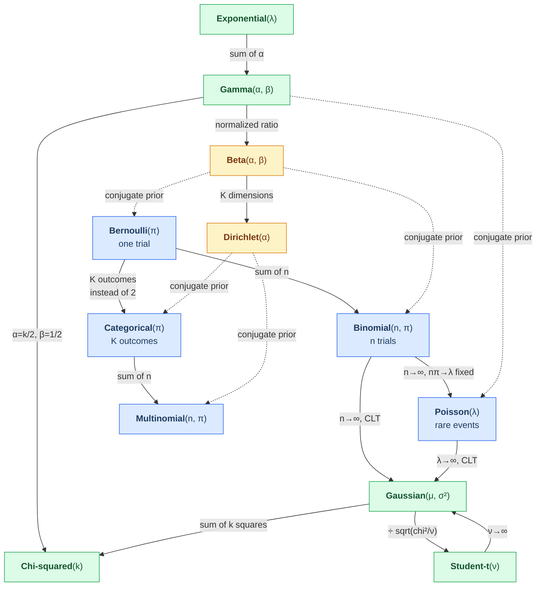

# 00.03 — Probability

> **Prerequisites**: [00.01 Linear Algebra](../01-linear-algebra/) for the multivariate Gaussian
> (§9) and [00.02 Calculus](../02-calculus-and-optimization/) for expectations as integrals.
> **You will be able to**: explain why a 95%-accurate cancer test is nearly useless, derive the
> multivariate Gaussian's conditional distribution, know which loss function your noise model
> implies, and say what a confidence interval actually means.

---

## Table of contents

1. [Why probability](#1-why-probability)
2. [The axioms, and what they force](#2-the-axioms-and-what-they-force)
3. [Random variables](#3-random-variables)
4. [Expectation, variance, covariance](#4-expectation-variance-covariance)
5. [Joint, marginal, conditional](#5-joint-marginal-conditional)
6. [Independence and conditional independence](#6-independence-and-conditional-independence)
7. [Bayes' theorem](#7-bayes-theorem)
8. [The distribution zoo](#8-the-distribution-zoo)
9. [The Gaussian, in depth](#9-the-gaussian-in-depth)
10. [The exponential family](#10-the-exponential-family)
11. [Transformations of random variables](#11-transformations-of-random-variables)
12. [Limit theorems: LLN and CLT](#12-limit-theorems-lln-and-clt)
13. [Concentration inequalities](#13-concentration-inequalities)
14. [Jensen's inequality](#14-jensens-inequality)
15. [Sampling](#15-sampling)
16. [Where probability shows up in ML](#16-where-probability-shows-up-in-ml)
17. [Common misconceptions](#17-common-misconceptions)

---

## 1. Why probability

Machine learning is inference from incomplete information. Three distinct sources of uncertainty
force probability on us, and it is worth separating them because they behave differently:

| Source | Name | Example | Reducible? |
|---|---|---|---|
| The world is genuinely random | **aleatoric** | two identical patients, different outcomes | **No** — more data won't help |
| We haven't seen enough data | **epistemic** | 10 training examples, 100 features | **Yes** — collect more |
| The model is wrong | **structural** | fitting a line to a curve | Yes — change the model |

Confusing aleatoric with epistemic uncertainty is one of the most consequential mistakes in
applied ML. If your model's errors are aleatoric, no amount of extra data, tuning, or capacity
will help — and continuing to try is wasted effort. Bayesian deep learning and conformal
prediction exist largely to tell these apart.

Beyond honesty about uncertainty, probability gives ML three concrete things:

1. **A principled way to pick loss functions.** Every loss is a negative log-likelihood under some
   noise model. Squared error ⇔ Gaussian noise. Cross-entropy ⇔ Bernoulli/categorical. MAE ⇔
   Laplace noise. **Choosing a loss *is* choosing a probabilistic assumption**, whether or not you
   realize it (§9.4).
2. **A way to combine evidence with prior belief.** That's Bayes (§7), and it is the entire
   content of regularization (§7.4).
3. **Guarantees.** Concentration inequalities (§13) are what make statements like "with 95%
   probability, the test error is within ε of the true error" possible at all.

---

## 2. The axioms, and what they force

A probability is a function $P$ from events to $[0,1]$ satisfying **Kolmogorov's axioms**:

$$
\begin{aligned}
&\textbf{1. Non-negativity:} && P(A) \ge 0\\
&\textbf{2. Normalization:} && P(\Omega) = 1\\
&\textbf{3. Countable additivity:} && P\!\left(\bigcup_i A_i\right) = \sum_i P(A_i)
\quad\text{for disjoint } A_i
\end{aligned}
$$

Everything else is a theorem. Three worth deriving once so you never memorize them:

$$P(A^{c}) = 1 - P(A) \qquad\text{(from 2 and 3, since } A \cup A^{c} = \Omega)$$

$$P(A \cup B) = P(A) + P(B) - P(A\cap B)
\qquad\text{(inclusion-exclusion: don't double-count the overlap)}$$

$$P(A) = \sum_i P(A \mid B_i)P(B_i)
\qquad\text{(\textbf{law of total probability}, for a partition } \{B_i\})$$

The last one is the workhorse. It is the "condition on something you know, then average it out"
move, and it appears in every derivation in this chapter.

### 2.1 Conditional probability

$$P(A \mid B) = \frac{P(A \cap B)}{P(B)}, \qquad P(B) > 0$$

Read it geometrically: **conditioning shrinks the sample space.** You are no longer asking "how
much of $\Omega$ is $A$?" but "how much of $B$ is $A$?" — so you renormalize by $P(B)$.

Rearranged, this gives the **chain rule**, which factorizes any joint distribution:

$$P(A_1, A_2, \dots, A_n) = P(A_1)\,P(A_2\mid A_1)\,P(A_3\mid A_1,A_2)\cdots P(A_n \mid A_1,\dots,A_{n-1})$$

> **This is exactly what an autoregressive language model computes.** With $A_i$ = the $i$-th
> token, the chain rule says the probability of a sentence is the product of each token's
> probability given all previous ones. A GPT is a parameterized estimate of
> $P(A_n \mid A_1,\dots,A_{n-1})$ and nothing more. The chain rule is not an approximation here —
> it is exact, which is why the factorization is the natural one to model.

---

## 3. Random variables

A **random variable** is a function from outcomes to numbers, $X: \Omega \to \mathbb{R}$. Not a
variable, and not random — a deterministic function whose input is random. (The name is a
historical accident that has confused students for a century.)

### 3.1 Discrete: the PMF

$$p(x) = P(X = x), \qquad p(x)\ge 0, \qquad \sum_x p(x) = 1$$

### 3.2 Continuous: the PDF

For continuous $X$, $P(X = x) = 0$ for every single $x$ — there are uncountably many values, so
each must have zero mass. Probability lives in *intervals*:

$$P(a \le X \le b) = \int_a^b p(x)\,dx, \qquad p(x) \ge 0, \qquad \int_{-\infty}^{\infty}p(x)\,dx = 1$$

> ⚠️ **A density is not a probability.** $p(x)$ can exceed 1 — a uniform distribution on
> $[0, 0.1]$ has density 10 everywhere on that interval. What must integrate to 1 is $p(x)dx$, not
> $p(x)$. This trips people up constantly when reading VAE and normalizing-flow papers, where
> densities of $10^{3}$ are routine.

### 3.3 The CDF

$$F(x) = P(X \le x)$$

Non-decreasing, right-continuous, $F(-\infty) = 0$, $F(\infty) = 1$, and $p(x) = F'(x)$ where the
derivative exists. The CDF is the more fundamental object — it exists for every random variable,
including mixed discrete-continuous ones where no PDF exists. It is also what makes inverse-CDF
sampling work (§15.1).

---

## 4. Expectation, variance, covariance

### 4.1 Expectation

$$\mathbb{E}[X] = \sum_x x\,p(x) \quad\text{(discrete)}, \qquad
\mathbb{E}[X] = \int x\,p(x)\,dx \quad\text{(continuous)}$$

**Linearity** is the single most useful property in probability:

$$\mathbb{E}[aX + bY + c] = a\,\mathbb{E}[X] + b\,\mathbb{E}[Y] + c$$

It holds **whether or not $X$ and $Y$ are independent.** That is unusual and enormously useful —
most identities need independence, this one does not.

**Law of the unconscious statistician** (LOTUS): to compute $\mathbb{E}[g(X)]$ you do *not* need
the distribution of $g(X)$:

$$\mathbb{E}[g(X)] = \int g(x)\,p(x)\,dx$$

**Law of total expectation** (tower rule):

$$\mathbb{E}[X] = \mathbb{E}_Y\big[\,\mathbb{E}[X \mid Y]\,\big]$$

Used constantly — the bias-variance decomposition ([05.01](../../05-model-evaluation/01-bias-variance-and-theory/))
is one application, the ELBO derivation ([12.02](../../12-generative-models/02-vae/)) is another.

### 4.2 Variance

$$\mathrm{Var}(X) = \mathbb{E}\big[(X - \mathbb{E}[X])^{2}\big] = \mathbb{E}[X^{2}] - (\mathbb{E}[X])^{2}$$

*Proof of the second form.* Let $\mu = \mathbb{E}[X]$. Expand and use linearity:

$$\mathbb{E}[(X-\mu)^{2}] = \mathbb{E}[X^{2} - 2\mu X + \mu^{2}]
= \mathbb{E}[X^{2}] - 2\mu\,\mathbb{E}[X] + \mu^{2} = \mathbb{E}[X^{2}] - \mu^{2} \;\blacksquare$$

The computational form is faster but **numerically dangerous**: for large $\mu$ and small
variance you subtract two nearly equal large numbers, and catastrophic cancellation can produce a
negative "variance". Welford's online algorithm exists for exactly this reason — see
[00.06](../06-numerical-methods/).

$$\mathrm{Var}(aX + b) = a^{2}\mathrm{Var}(X)$$

Note the $a^2$ and the vanishing $b$: **shifting doesn't change spread; scaling changes it
quadratically.** This is why standardizing features divides by $\sigma$, not $\sigma^2$.

### 4.3 Covariance and correlation

$$\mathrm{Cov}(X,Y) = \mathbb{E}[(X-\mu_X)(Y-\mu_Y)] = \mathbb{E}[XY] - \mathbb{E}[X]\mathbb{E}[Y]$$

$$\rho_{XY} = \frac{\mathrm{Cov}(X,Y)}{\sigma_X\sigma_Y} \in [-1, 1]$$

$$\mathrm{Var}(X+Y) = \mathrm{Var}(X) + \mathrm{Var}(Y) + 2\,\mathrm{Cov}(X,Y)$$

That last identity is the whole theory of ensembles in one line. Averaging $n$ models with
individual variance $\sigma^{2}$ and pairwise correlation $\rho$ gives

$$\mathrm{Var}\!\left(\frac{1}{n}\sum_i f_i\right) = \frac{\sigma^{2}}{n} + \frac{n-1}{n}\rho\sigma^{2}
\;\xrightarrow[n\to\infty]{}\; \rho\sigma^{2}$$

Read what this says: **averaging drives the first term to zero but leaves $\rho\sigma^2$
untouched.** Adding more trees to a random forest has diminishing returns bounded by how
*correlated* the trees are — which is precisely why random forests randomly subsample features at
each split. It is not a heuristic; it is an attack on the $\rho$ in this formula. Full treatment
in [06.02](../../06-ensembles/02-random-forests/).

> ⚠️ **Zero correlation does not imply independence.** Correlation measures *linear* dependence
> only. Let $X \sim \mathcal{N}(0,1)$ and $Y = X^{2}$. Then
> $\mathrm{Cov}(X,Y) = \mathbb{E}[X^{3}] - \mathbb{E}[X]\mathbb{E}[X^2] = 0 - 0 = 0$, yet $Y$ is a
> deterministic function of $X$ — maximally dependent. Independence implies zero correlation; the
> converse fails. (For jointly Gaussian variables, and only then, they coincide.)

---

## 5. Joint, marginal, conditional

| Object | Discrete | Continuous |
|---|---|---|
| **Joint** | $p(x,y) = P(X=x, Y=y)$ | $p(x,y)$ |
| **Marginal** | $p(x) = \sum_y p(x,y)$ | $p(x) = \int p(x,y)\,dy$ |
| **Conditional** | $p(y\mid x) = p(x,y)/p(x)$ | same |

**Marginalization** — summing/integrating out a variable — is the fundamental operation of
probabilistic inference, and also the fundamental *difficulty*. In a model with latent variables
$\mathbf{z}$,

$$p(\mathbf{x}) = \int p(\mathbf{x},\mathbf{z})\,d\mathbf{z}$$

is usually intractable, because it is a high-dimensional integral with no closed form. Essentially
all of approximate inference — variational methods, MCMC, the ELBO — exists to work around this
one integral. See [12.02](../../12-generative-models/02-vae/).

---

## 6. Independence and conditional independence

$$X \perp Y \iff p(x,y) = p(x)p(y) \iff p(x\mid y) = p(x)$$

$$X \perp Y \mid Z \iff p(x,y\mid z) = p(x\mid z)\,p(y\mid z)$$

**Conditional independence is the more important of the two**, because it is what makes
probabilistic models tractable. It is also *not* implied by, and does not imply, marginal
independence — both directions fail:

- **Independent but not conditionally independent.** Two independent coin flips $X, Y$; let
  $Z = X \oplus Y$. Marginally $X \perp Y$. But given $Z=1$, knowing $X$ determines $Y$ exactly.
  Conditioning **created** dependence. (This is "explaining away", and it is why controlling for
  a collider in a causal graph introduces spurious associations.)
- **Conditionally independent but not independent.** Two thermometers in the same room. Their
  readings are correlated — but *given* the true temperature, they are independent. The
  dependence was entirely mediated by the hidden variable.

> **The naive Bayes assumption is exactly the second pattern**: features are assumed conditionally
> independent given the class,
> $p(x_1,\dots,x_d \mid y) = \prod_j p(x_j \mid y)$. This is almost always false — in text, "New"
> and "York" are wildly dependent given any class. It reduces the parameter count from
> exponential in $d$ to linear in $d$, and the classifier works well anyway because *ranking* the
> classes correctly is easier than *estimating* their probabilities correctly. See
> [03.05](../../03-supervised-learning/05-generative-classifiers/).

---

## 7. Bayes' theorem

$$\boxed{\;p(\theta \mid \mathcal{D}) = \frac{p(\mathcal{D}\mid\theta)\,p(\theta)}{p(\mathcal{D})}\;}$$

$$\underbrace{p(\theta\mid\mathcal{D})}_{\text{posterior}} \propto
\underbrace{p(\mathcal{D}\mid\theta)}_{\text{likelihood}}\;\underbrace{p(\theta)}_{\text{prior}}$$

The derivation is one line from the definition of conditional probability: both
$p(\theta\mid\mathcal{D})p(\mathcal{D})$ and $p(\mathcal{D}\mid\theta)p(\theta)$ equal the joint
$p(\theta,\mathcal{D})$, so they equal each other. Divide by $p(\mathcal{D})$.

The denominator $p(\mathcal{D}) = \int p(\mathcal{D}\mid\theta)p(\theta)\,d\theta$ is a
normalizing constant — the *evidence*. It does not depend on $\theta$, which is why the
proportional form is usually all you need, and why the hard part of Bayesian inference is
computing this integral.

### 7.1 The base rate fallacy, worked

This example matters more than the formula. A disease affects **1 in 1,000** people. A test is
99% accurate in both directions: $P(+\mid D) = 0.99$ and $P(-\mid \neg D) = 0.99$.

**You test positive. What is the probability you have the disease?**

Most people — including, in published studies, most physicians — say about 99%. The answer:

$$
\begin{aligned}
P(D\mid +) &= \frac{P(+\mid D)P(D)}{P(+\mid D)P(D) + P(+\mid\neg D)P(\neg D)}\\[4pt]
&= \frac{0.99 \times 0.001}{0.99\times 0.001 + 0.01\times 0.999}\\[4pt]
&= \frac{0.00099}{0.00099 + 0.00999} = \frac{0.00099}{0.01098} \approx \boxed{9.0\%}
\end{aligned}
$$

**Why the intuition fails.** Think in counts, out of 100,000 people:

| | Has disease (100) | No disease (99,900) | Total |
|---|---|---|---|
| **Test +** | 99 | 999 | 1,098 |
| **Test −** | 1 | 98,901 | 98,902 |

There are **ten times more false positives than true positives**, purely because the healthy group
is 999× larger. A 1% error rate applied to a huge group swamps a 99% hit rate applied to a tiny
one.

> **This is the single most important idea in this chapter for practical ML.** It is why accuracy
> is a useless metric on imbalanced data ([02.05](../../02-data/05-class-imbalance/)), why fraud
> and rare-disease detectors drown in false positives, and why precision must always be reported
> alongside recall ([05.03](../../05-model-evaluation/03-classification-metrics/)). A model can be
> "99% accurate" and wrong 91% of the time when it fires.

### 7.2 Odds form

$$\underbrace{\frac{P(D\mid+)}{P(\neg D\mid +)}}_{\text{posterior odds}} =
\underbrace{\frac{P(+\mid D)}{P(+\mid\neg D)}}_{\text{likelihood ratio}} \times
\underbrace{\frac{P(D)}{P(\neg D)}}_{\text{prior odds}}$$

The evidence cancels. For the example: prior odds $1{:}999$, likelihood ratio $99{:}1$, so
posterior odds $99{:}999 \approx 1{:}10$ — about 9%, matching, in one line of mental arithmetic.
Learn this form; it is far more usable than the fraction.

### 7.3 Sequential updating

Today's posterior is tomorrow's prior:

$$p(\theta\mid\mathcal{D}_1,\mathcal{D}_2) \propto p(\mathcal{D}_2\mid\theta)\,p(\theta\mid\mathcal{D}_1)$$

Belief accumulates coherently, and the order of the data doesn't matter. This is the basis of
online learning, Kalman filters, and Thompson sampling
([13.05](../../13-reinforcement-learning/05-bandits/)).

### 7.4 MLE, MAP, and why regularization is a prior

Take logs of Bayes and drop the constant evidence:

$$\log p(\theta\mid\mathcal{D}) = \underbrace{\log p(\mathcal{D}\mid\theta)}_{\text{log-likelihood}}
+ \underbrace{\log p(\theta)}_{\text{log-prior}} + \text{const}$$

| Estimator | Objective | Interpretation |
|---|---|---|
| **MLE** | $\arg\max_\theta \log p(\mathcal{D}\mid\theta)$ | best fit to data, no prior |
| **MAP** | $\arg\max_\theta [\log p(\mathcal{D}\mid\theta) + \log p(\theta)]$ | best fit, penalized by prior |
| **Full Bayes** | the whole distribution $p(\theta\mid\mathcal{D})$ | keeps all the uncertainty |

Now put a Gaussian prior $\theta \sim \mathcal{N}(0, \tau^{2}\mathbf{I})$ on the weights:

$$\log p(\theta) = -\frac{\Vert \theta\Vert _2^{2}}{2\tau^{2}} + \text{const}$$

Maximizing the MAP objective is minimizing

$$-\log p(\mathcal{D}\mid\theta) + \frac{1}{2\tau^{2}}\Vert \theta\Vert _2^{2}$$

which is **exactly ridge regression**, with $\lambda = 1/(2\tau^{2})$.

$$\boxed{\;\text{Gaussian prior} \iff L_2 \text{ regularization} \qquad
\text{Laplace prior} \iff L_1 \text{ regularization}\;}$$

So a strong prior (small $\tau$) is a large $\lambda$: "I believe the weights are near zero, and
it takes a lot of evidence to move me." Regularization is not a hack bolted onto the loss — it is
what a prior looks like after you take a logarithm.

---

## 8. The distribution zoo

Distributions are not arbitrary; they are answers to questions. Learn the *question* each one
answers and you will never need to look up which to use.

| Distribution | Answers the question | Support | Mean | Variance |
|---|---|---|---|---|
| **Bernoulli**$(\pi)$ | one yes/no trial | $\{0,1\}$ | $\pi$ | $\pi(1-\pi)$ |
| **Binomial**$(n,\pi)$ | successes in $n$ trials | $\{0..n\}$ | $n\pi$ | $n\pi(1-\pi)$ |
| **Categorical**$(\boldsymbol{\pi})$ | one draw from $K$ classes | $\{1..K\}$ | — | — |
| **Multinomial**$(n,\boldsymbol{\pi})$ | counts over $K$ classes | $\mathbb{Z}_{\ge0}^{K}$ | $n\pi_k$ | $n\pi_k(1-\pi_k)$ |
| **Poisson**$(\lambda)$ | count of rare events in a window | $\mathbb{Z}_{\ge0}$ | $\lambda$ | $\lambda$ |
| **Geometric**$(\pi)$ | trials until first success | $\{1,2,..\}$ | $1/\pi$ | $(1-\pi)/\pi^{2}$ |
| **Uniform**$(a,b)$ | total ignorance on an interval | $[a,b]$ | $(a+b)/2$ | $(b-a)^{2}/12$ |
| **Gaussian**$(\mu,\sigma^{2})$ | sum of many small effects | $\mathbb{R}$ | $\mu$ | $\sigma^{2}$ |
| **Laplace**$(\mu,b)$ | like Gaussian but heavy-tailed | $\mathbb{R}$ | $\mu$ | $2b^{2}$ |
| **Exponential**$(\lambda)$ | waiting time, memoryless | $[0,\infty)$ | $1/\lambda$ | $1/\lambda^{2}$ |
| **Gamma**$(\alpha,\beta)$ | sum of $\alpha$ exponentials | $[0,\infty)$ | $\alpha/\beta$ | $\alpha/\beta^{2}$ |
| **Beta**$(\alpha,\beta)$ | belief about a probability | $[0,1]$ | $\frac{\alpha}{\alpha+\beta}$ | — |
| **Dirichlet**$(\boldsymbol{\alpha})$ | belief about a probability *vector* | simplex | — | — |
| **Student-$t$**$(\nu)$ | Gaussian with unknown variance | $\mathbb{R}$ | $0$ ($\nu>1$) | $\frac{\nu}{\nu-2}$ ($\nu>2$) |

### 8.1 How they relate

Solid arrows are limits or constructions; dashed arrows mean "is the conjugate prior of".

**Conjugacy** means the posterior stays in the same family as the prior, so Bayesian updating is
just arithmetic on parameters. Beta-Bernoulli is the canonical example:

$$\text{prior } \mathrm{Beta}(\alpha,\beta) \;+\; s \text{ successes},\ f \text{ failures}
\;\Longrightarrow\; \text{posterior } \mathrm{Beta}(\alpha+s,\ \beta+f)$$

You literally add your counts to the prior's parameters. This is why $\alpha$ and $\beta$ are
called *pseudo-counts*, and it is the machinery behind Thompson sampling and Laplace smoothing in
naive Bayes.

---

## 9. The Gaussian, in depth

### 9.1 Univariate

$$p(x) = \frac{1}{\sqrt{2\pi\sigma^{2}}}\exp\!\left(-\frac{(x-\mu)^{2}}{2\sigma^{2}}\right)$$

### 9.2 Multivariate

$$p(\mathbf{x}) = \frac{1}{(2\pi)^{d/2}|\boldsymbol{\Sigma}|^{1/2}}
\exp\!\left(-\tfrac12(\mathbf{x}-\boldsymbol{\mu})^{\top}\boldsymbol{\Sigma}^{-1}(\mathbf{x}-\boldsymbol{\mu})\right)$$

Every piece has a geometric meaning, and this is where 00.01 pays off:

- $(\mathbf{x}-\boldsymbol{\mu})^{\top}\boldsymbol{\Sigma}^{-1}(\mathbf{x}-\boldsymbol{\mu})$ is
  the squared **Mahalanobis distance** — a quadratic form (00.01 §11.2). Level sets are
  ellipsoids.
- Since $\boldsymbol{\Sigma}$ is symmetric PSD, the spectral theorem gives
  $\boldsymbol{\Sigma} = \mathbf{Q}\boldsymbol{\Lambda}\mathbf{Q}^{\top}$. The columns of
  $\mathbf{Q}$ are the **axes of the ellipsoid**, and $\sqrt{\lambda_i}$ are its **radii**.
  Those axes are exactly the principal components — **PCA is finding the axes of the Gaussian
  that best fits your data.**
- $|\boldsymbol{\Sigma}|^{1/2}$ is the volume of that ellipsoid (00.01 §9), so it is precisely the
  normalizer needed to make the density integrate to 1.

### 9.3 The properties that make it dominate

The Gaussian is not popular because nature loves it. It is popular because it is closed under
every operation we care about:

| Property | Statement |
|---|---|
| **Closed under marginalization** | drop rows/cols of $\boldsymbol{\mu},\boldsymbol{\Sigma}$ — still Gaussian |
| **Closed under conditioning** | $p(\mathbf{x}_1\mid\mathbf{x}_2)$ is Gaussian (formula below) |
| **Closed under linear maps** | $\mathbf{A}\mathbf{x}+\mathbf{b} \sim \mathcal{N}(\mathbf{A}\boldsymbol{\mu}+\mathbf{b}, \mathbf{A}\boldsymbol{\Sigma}\mathbf{A}^{\top})$ |
| **Closed under sums** | independent Gaussians add to a Gaussian |
| **Closed under products** | the product of two Gaussian densities is an unnormalized Gaussian |
| **Maximum entropy** | it is the *least assuming* distribution with a given mean and variance ([00.05](../05-information-theory/)) |
| **CLT** | sums of many independent things become Gaussian regardless of their own shape (§12) |

**Conditioning formula.** Partition $\mathbf{x} = [\mathbf{x}_1; \mathbf{x}_2]$ with matching
blocks of $\boldsymbol{\mu}$ and $\boldsymbol{\Sigma}$. Then

$$\mathbf{x}_1 \mid \mathbf{x}_2 \sim \mathcal{N}\big(
\boldsymbol{\mu}_1 + \boldsymbol{\Sigma}_{12}\boldsymbol{\Sigma}_{22}^{-1}(\mathbf{x}_2-\boldsymbol{\mu}_2),\;
\boldsymbol{\Sigma}_{11} - \boldsymbol{\Sigma}_{12}\boldsymbol{\Sigma}_{22}^{-1}\boldsymbol{\Sigma}_{21}\big)$$

Two things to notice. The conditional mean is **linear** in $\mathbf{x}_2$ — that is the reason
linear regression is the optimal predictor under joint Gaussianity, not merely a convenient one.
And the conditional covariance **does not depend on $\mathbf{x}_2$ at all**: observing
$\mathbf{x}_2$ reduces your uncertainty by a fixed amount no matter what value you see. The
subtracted term $\boldsymbol{\Sigma}_{12}\boldsymbol{\Sigma}_{22}^{-1}\boldsymbol{\Sigma}_{21}$
is the **Schur complement**, and this formula is the engine of Gaussian processes and Kalman
filters.

### 9.4 Every loss function is a likelihood

Assume $y = f(\mathbf{x}) + \varepsilon$ and take the negative log-likelihood:

| Noise model $\varepsilon\sim$ | $-\log p(y\mid \mathbf{x})$ | The loss you know it as |
|---|---|---|
| $\mathcal{N}(0,\sigma^{2})$ | $\frac{(y-f)^{2}}{2\sigma^{2}} + \text{const}$ | **squared error (MSE)** |
| $\mathrm{Laplace}(0,b)$ | $\frac{\lvert y-f\rvert}{b} + \text{const}$ | **absolute error (MAE)** |
| $\mathrm{Bernoulli}(\sigma(f))$ | $-[y\log \hat p + (1-y)\log(1-\hat p)]$ | **binary cross-entropy** |
| $\mathrm{Categorical}(\mathrm{softmax}(f))$ | $-\sum_k y_k \log \hat p_k$ | **cross-entropy** |
| $\mathrm{Poisson}(e^{f})$ | $e^{f} - yf + \text{const}$ | **Poisson loss** (count data) |
| Student-$t$ | $\frac{\nu+1}{2}\log(1 + \frac{(y-f)^2}{\nu\sigma^2})$ | robust regression |

**You are always making a distributional assumption.** Using MSE asserts your errors are Gaussian
— symmetric, thin-tailed, constant-variance. If your targets are skewed or have outliers, that
assumption is wrong, and the *right* fix is to change the noise model (→ MAE, Huber, or Student-$t$),
not to keep MSE and delete the inconvenient data points.

This also explains **why MSE is so sensitive to outliers**: the Gaussian's tails decay as
$e^{-x^{2}}$, so a point 5σ away is astronomically unlikely under the model, and the optimizer
will contort the fit to explain it. The Laplace's tails decay only as $e^{-|x|}$, so it shrugs.

---

## 10. The exponential family

A large fraction of the distributions above share one form:

$$p(x\mid\boldsymbol{\eta}) = h(x)\exp\!\big(\boldsymbol{\eta}^{\top}\mathbf{T}(x) - A(\boldsymbol{\eta})\big)$$

- $\boldsymbol{\eta}$ — **natural parameters**
- $\mathbf{T}(x)$ — **sufficient statistics** (all the data tells you about $\boldsymbol{\eta}$)
- $A(\boldsymbol{\eta})$ — **log-partition function** (the normalizer)

Gaussian, Bernoulli, Categorical, Poisson, Exponential, Gamma, Beta, Dirichlet are all members.

Why it is worth knowing:

1. **$A$ generates the moments.** $\nabla_{\boldsymbol{\eta}} A = \mathbb{E}[\mathbf{T}(x)]$ and
   $\nabla^{2}_{\boldsymbol{\eta}} A = \mathrm{Cov}[\mathbf{T}(x)]$ — differentiate the normalizer
   and moments fall out.
2. **$A$ is convex**, because it is a log-sum-exp. Hence **MLE for any exponential family is a
   convex problem** (00.02 §6). That single fact is why logistic regression, Poisson regression,
   and all GLMs have unique global optima.
3. **Sufficient statistics mean you can throw the data away.** For a Gaussian, $\sum x_i$ and
   $\sum x_i^{2}$ are all you ever need — the raw data carries no further information about
   $\mu,\sigma$.
4. **Conjugate priors always exist** for exponential families, which is where the dashed arrows in
   §8.1 come from.
5. **GLMs are exactly "exponential family + link function"** — logistic regression is the
   Bernoulli member with a logit link.

---

## 11. Transformations of random variables

If $Y = g(X)$ for a monotonic, differentiable $g$:

$$p_Y(y) = p_X(g^{-1}(y))\left|\frac{d}{dy}g^{-1}(y)\right|$$

In $d$ dimensions the derivative becomes the **Jacobian determinant**:

$$p_Y(\mathbf{y}) = p_X(g^{-1}(\mathbf{y}))\,\big|\det \mathbf{J}_{g^{-1}}(\mathbf{y})\big|$$

The Jacobian factor accounts for how $g$ stretches or compresses volume (00.01 §9) — squeeze a
region and the density there must rise to keep total mass at 1.

> **This formula is the entire basis of normalizing flows.** Build an invertible network
> $g$, push a simple Gaussian through it, and read off the exact density of the result. The
> design constraint that follows is severe: you need $\det\mathbf{J}$ to be *cheap*, which is why
> flow architectures (RealNVP, Glow) are built so their Jacobians are **triangular** — a
> triangular determinant is just the product of the diagonal, $O(d)$ instead of $O(d^{3})$.
> See [12.05](../../12-generative-models/05-flows-and-autoregressive/).

**The reparameterization trick** is the same idea used backwards. To sample
$z \sim \mathcal{N}(\mu,\sigma^{2})$ differentiably, write

$$z = \mu + \sigma\varepsilon, \qquad \varepsilon\sim\mathcal{N}(0,1)$$

Now the randomness sits in $\varepsilon$, which carries no parameters, and gradients flow through
$\mu$ and $\sigma$ as ordinary deterministic operations. This is what makes VAEs trainable by
backpropagation ([12.02](../../12-generative-models/02-vae/)).

---

## 12. Limit theorems: LLN and CLT

**Law of Large Numbers.** The sample mean converges to the true mean:

$$\bar{X}_n = \frac1n\sum_{i=1}^{n}X_i \;\xrightarrow{\;n\to\infty\;}\; \mu$$

This is the licence for everything empirical in ML: it is why test-set accuracy estimates true
accuracy, why Monte Carlo integration works, and why mini-batch gradients are usable.

**Central Limit Theorem.** The *distribution* of the sample mean approaches a Gaussian:

$$\sqrt{n}\,(\bar{X}_n - \mu) \;\xrightarrow{d}\; \mathcal{N}(0,\sigma^{2})
\qquad\text{equivalently}\qquad \bar{X}_n \approx \mathcal{N}\!\left(\mu, \frac{\sigma^{2}}{n}\right)$$

**regardless of the distribution of $X$** (provided finite variance). This is the deepest result in
elementary probability: uniform, exponential, Bernoulli — all their sample means become Gaussian.

Consequences that matter:

- **The $\sqrt{n}$ rate.** Standard error $\sigma/\sqrt{n}$: to halve your error bar you need
  **4× the data**. This governs how much validation data you need, and why the difference between
  a 1,000- and 1,200-example test set is negligible.
- **It justifies Gaussian noise models** whenever the error is a sum of many small independent
  causes.
- **It is why the Gaussian is everywhere** — not because nature prefers it, but because *averaging*
  produces it.

⚠️ **The CLT needs finite variance.** For heavy-tailed distributions (Cauchy, some power laws) it
fails outright — the sample mean of Cauchy variables is Cauchy, no matter how large $n$ gets. In
finance, network traffic, and word frequencies this is not an academic caveat.

### 12.1 "n = 30 is enough" is folklore, and it depends on skewness

The CLT says convergence *happens*; it says nothing about *how fast*. The rate is governed by the
**Berry-Esseen theorem**, which bounds the distance between the true CDF of the standardized mean
and the Gaussian by

$$\sup_x\big|F_n(x) - \Phi(x)\big| \le \frac{C\,\rho}{\sigma^{3}\sqrt{n}},
\qquad \rho = \mathbb{E}\big[|X-\mu|^{3}\big]$$

The practical consequence: **the residual non-normality of the sample mean decays as
$\mathrm{skew}(X)/\sqrt{n}$.** So how large $n$ must be depends entirely on how skewed your source
is. Experiment 1 in [`from_scratch.py`](from_scratch.py) measures this directly:

| Source | Skewness | Skew of the mean at $n=30$ | Gaussian enough? |
|---|---|---|---|
| Uniform(0,1) | 0.00 | ~0.00 | yes, by $n=5$ |
| Bernoulli(0.2) | 1.50 | 0.26 | marginal |
| Exponential(1) | 2.00 | 0.35 | no |
| **Bernoulli(0.001)** | **31.6** | **5.8** | **nowhere close** |

That last row is the one that bites in practice. Click-through rates, fraud rates, conversion
rates and rare-disease incidence are all Bernoulli with tiny $p$, where
$\mathrm{skew} = (1-2p)/\sqrt{p(1-p)}$ is enormous. A Gaussian confidence interval on a 0.1% event
rate needs $n$ in the tens of thousands before it is trustworthy — which is exactly why A/B tests
on rare conversions use exact binomial or bootstrap intervals rather than $\hat{p} \pm 1.96\,\mathrm{SE}$.

---

## 13. Concentration inequalities

The CLT is asymptotic. Concentration inequalities give **finite-sample, non-asymptotic** bounds —
which is what learning theory actually needs.

**Markov** (needs only $X \ge 0$):

$$P(X \ge a) \le \frac{\mathbb{E}[X]}{a}$$

**Chebyshev** (apply Markov to $(X-\mu)^{2}$):

$$P(|X - \mu| \ge k\sigma) \le \frac{1}{k^{2}}$$

**Hoeffding** (for bounded independent $X_i \in [a_i,b_i]$) — exponentially tighter:

$$P\big(|\bar{X}_n - \mu| \ge t\big) \le 2\exp\!\left(\frac{-2n^{2}t^{2}}{\sum_i (b_i-a_i)^{2}}\right)$$

For $X_i \in [0,1]$ this simplifies to $2e^{-2nt^{2}}$.

Compare the three on "how far can the mean be from the truth":

| Bound | Decay in $n$ | Needs |
|---|---|---|
| Markov | none | $X \ge 0$ |
| Chebyshev | $1/n$ | finite variance |
| **Hoeffding** | $e^{-n}$ | bounded support |

> **Why this is the foundation of learning theory.** Set $X_i = \mathbb{1}[\text{model errs on
> example } i]$. Then $\bar{X}_n$ is test error and $\mu$ is true error, and Hoeffding says
>
> $$P(|\text{test error} - \text{true error}| \ge t) \le 2e^{-2nt^{2}}$$
>
> Invert it: with probability $1-\delta$, true error is within
> $\sqrt{\log(2/\delta)/(2n)}$ of test error. For $n = 10{,}000$ and $\delta = 0.05$, that is
> ±1.4%. **This is where generalization bounds come from**, and the starting point for
> [05.01](../../05-model-evaluation/01-bias-variance-and-theory/).

---

## 14. Jensen's inequality

For a **convex** $f$ (00.02 §6):

$$f(\mathbb{E}[X]) \le \mathbb{E}[f(X)]$$

and the inequality reverses for concave $f$. Mnemonic: *the average of a bowl is above the bowl of
the average.*

Three places it is load-bearing in ML:

1. **Deriving the ELBO.** $\log$ is concave, so
   $\log \mathbb{E}[\cdot] \ge \mathbb{E}[\log \cdot]$. Applying this to the intractable
   $\log p(\mathbf{x}) = \log\int p(\mathbf{x},\mathbf{z})d\mathbf{z}$ produces a tractable lower
   bound — the **evidence lower bound**, which is the objective every VAE and variational method
   optimizes ([12.02](../../12-generative-models/02-vae/)).
2. **Proving $D_{\mathrm{KL}}(p\Vert q)\ge 0$** ([00.05](../05-information-theory/)) — the fact
   that makes KL a usable notion of divergence at all.
3. **Proving EM never decreases the likelihood**
   ([04.04](../../04-unsupervised-learning/04-gaussian-mixtures/)).

---

## 15. Sampling

### 15.1 Inverse CDF

If $U \sim \mathrm{Uniform}(0,1)$ then $X = F^{-1}(U)$ has CDF $F$.

*Proof.* $P(X \le x) = P(F^{-1}(U)\le x) = P(U \le F(x)) = F(x)$, using that $F$ is
non-decreasing and $U$ is uniform. $\blacksquare$

Exact and cheap — when you can invert $F$. Exponential: $X = -\log(1-U)/\lambda$.

### 15.2 Rejection sampling

To sample from $p$, find a proposal $q$ and constant $M$ with $p(x) \le Mq(x)$ everywhere. Draw
$x\sim q$, accept with probability $p(x)/(Mq(x))$.

Correct for any $p$ you can evaluate, but the acceptance rate is $1/M$, and in high dimensions
$M$ grows exponentially — which is why rejection sampling is essentially unusable above a handful
of dimensions, and why MCMC exists.

### 15.3 The Box-Muller transform

Two uniforms give two independent standard Gaussians:

$$z_1 = \sqrt{-2\ln u_1}\cos(2\pi u_2), \qquad z_2 = \sqrt{-2\ln u_1}\sin(2\pi u_2)$$

A direct application of the change-of-variables formula (§11) in polar coordinates.

### 15.4 Sampling a multivariate Gaussian

Take the Cholesky factorization $\boldsymbol{\Sigma} = \mathbf{L}\mathbf{L}^{\top}$ (possible
because $\boldsymbol{\Sigma}$ is PSD, 00.01 §11). Then for
$\mathbf{z}\sim\mathcal{N}(\mathbf{0},\mathbf{I})$:

$$\mathbf{x} = \boldsymbol{\mu} + \mathbf{L}\mathbf{z} \sim \mathcal{N}(\boldsymbol{\mu},\boldsymbol{\Sigma})$$

since $\mathrm{Cov}(\mathbf{L}\mathbf{z}) = \mathbf{L}\mathbf{I}\mathbf{L}^{\top} = \boldsymbol{\Sigma}$
by the linear-map property of §9.3.

---

## 16. Where probability shows up in ML

| Concept | Appears in |
|---|---|
| Bayes' theorem | naive Bayes, Bayesian inference, posterior sampling, Thompson sampling |
| Base rates | why accuracy misleads on imbalanced data; precision/recall |
| Conditional independence | naive Bayes, graphical models, causal inference |
| Chain rule | autoregressive models, every language model |
| Likelihood | **every loss function you have ever used** |
| MAP | **every regularizer you have ever used** |
| Gaussian | linear regression noise, GPs, VAEs, diffusion, weight init |
| Multivariate Gaussian | PCA, LDA/QDA, Kalman filters, GPs |
| Exponential family | GLMs, why so many ML objectives are convex |
| Change of variables | normalizing flows, reparameterization trick |
| CLT | confidence intervals, bootstrap, why $\sqrt{n}$ governs data needs |
| Concentration | generalization bounds, PAC learning, bandit regret |
| Jensen | ELBO, EM, KL ≥ 0 |
| Sampling | MCMC, VAEs, diffusion, dropout, data augmentation |

---

## 17. Common misconceptions

**"$p(x) $ is a probability."**
For continuous variables it is a **density** and can exceed 1. Only $\int p(x)dx$ over a region is
a probability.

**"Uncorrelated means independent."**
Only for jointly Gaussian variables. $X\sim\mathcal{N}(0,1)$, $Y=X^{2}$ has zero correlation and
total dependence (§4.3).

**"A 99% accurate test means a positive result is 99% likely to be right."**
The base rate fallacy (§7.1). It can easily be 9%.

**"The CLT means everything is Gaussian."**
It means *sample means* of finite-variance variables are approximately Gaussian. Your raw data is
under no obligation, and heavy-tailed data breaks the theorem entirely.

**"$P(A\mid B) = P(B\mid A)$."**
The prosecutor's fallacy. $P(\text{positive}\mid\text{disease}) \neq
P(\text{disease}\mid\text{positive})$ — §7.1 is exactly the gap between them.

**"Independent events can't happen together."**
That is *mutually exclusive*, which is the opposite: mutually exclusive events with nonzero
probability are maximally **dependent** (if one happens, the other definitely didn't).

**"MLE is unbiased."**
Not in general. The MLE of a Gaussian's variance divides by $n$, not $n-1$, and is biased low.
See [00.04](../04-statistics-and-inference/).

**"The prior is subjective, so Bayesian methods are unscientific."**
Every regularizer is a prior (§7.4). If you have ever used weight decay, you have used a prior;
the only difference is whether you admitted it.

---

## Files in this chapter

| File | Contents |
|---|---|
| [`from_scratch.py`](from_scratch.py) | PMFs/PDFs/CDFs implemented from their formulas, Box-Muller, inverse-CDF and rejection sampling, multivariate Gaussian via Cholesky with conditioning and marginalization, Bayes updating, and experiments measuring the CLT rate, the tightness of Markov/Chebyshev/Hoeffding, and the loss ⇔ likelihood correspondence |
| [`exercises.md`](exercises.md) | Derivation, implementation, and interview questions |
| [`references.md`](references.md) | Exact sections used |

**Previous**: [00.02 — Calculus & Optimization](../02-calculus-and-optimization/) ·
**Next**: [00.04 — Statistics & Inference](../04-statistics-and-inference/)
