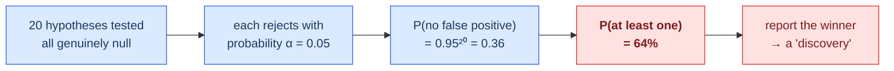
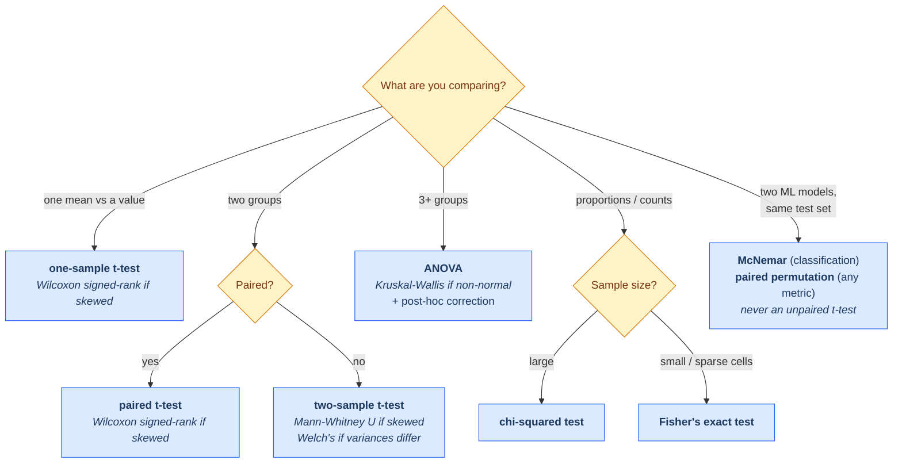

# 00.04 — Statistics and Inference

> **Prerequisites**: [00.03 Probability](../03-probability/) throughout; [00.02](../02-calculus-and-optimization/)
> for MLE as optimization.
> **You will be able to**: say what a confidence interval actually means (and what it doesn't),
> explain why your MLE variance estimate is biased, bootstrap anything, and know why "we tried 20
> models and one was significant" is not a result.

---

## Table of contents

1. [Probability runs forward; statistics runs backward](#1-probability-runs-forward-statistics-runs-backward)
2. [Populations, samples, and the sampling distribution](#2-populations-samples-and-the-sampling-distribution)
3. [Estimators and how to judge them](#3-estimators-and-how-to-judge-them)
4. [Maximum likelihood estimation](#4-maximum-likelihood-estimation)
5. [Why the MLE of variance is biased](#5-why-the-mle-of-variance-is-biased)
6. [Fisher information and the Cramér-Rao bound](#6-fisher-information-and-the-cramér-rao-bound)
7. [Bayesian estimation](#7-bayesian-estimation)
8. [Confidence intervals](#8-confidence-intervals)
9. [Hypothesis testing](#9-hypothesis-testing)
10. [What a p-value is not](#10-what-a-p-value-is-not)
11. [Multiple comparisons](#11-multiple-comparisons)
12. [The bootstrap](#12-the-bootstrap)
13. [Permutation tests](#13-permutation-tests)
14. [Which test to use](#14-which-test-to-use)
15. [Statistics for machine learning](#15-statistics-for-machine-learning)
16. [Common misconceptions](#16-common-misconceptions)

---

## 1. Probability runs forward; statistics runs backward

$$
\begin{aligned}
\textbf{Probability:}&\quad \text{known } \theta \;\longrightarrow\; \text{what data will I see?}\\
\textbf{Statistics:}&\quad \text{observed data} \;\longrightarrow\; \text{what was } \theta?
\end{aligned}
$$

Statistics is the **inverse problem**, and like most inverse problems it is harder and does not
have a unique answer. Many parameter values could plausibly have produced your data; the whole
subject is about quantifying "plausibly".

**This is exactly what machine learning does**, which is why this chapter is not optional
background. Training a model is estimating parameters from a sample. Reporting test accuracy is
estimating a population quantity from a finite sample. Comparing two models is a hypothesis test.
The vocabulary differs, the mathematics does not:

| Statistics | Machine learning |
|---|---|
| parameter estimation | training |
| estimator | learning algorithm |
| sampling distribution | variance across retrains/resamples |
| bias-variance of an estimator | bias-variance of a model |
| overfitting the sample | overfitting the training set |
| confidence interval | error bar on test accuracy |
| multiple comparisons | trying 50 architectures and reporting the best |

That last row is where most published ML results quietly go wrong (§11).

---

## 2. Populations, samples, and the sampling distribution

- **Population** — everything you care about. Usually unobservable. The "true distribution"
  $\mathcal{P}$ your data is drawn from.
- **Sample** — the $n$ things you actually observed.
- **Parameter** — a number describing the population: $\mu$, $\sigma^{2}$, true error rate.
  Fixed, unknown.
- **Statistic** — a number computed from the sample: $\bar{x}$, $s^{2}$, test accuracy.
  Random, known.

### 2.1 The sampling distribution — the central idea

A statistic is a function of random data, so **a statistic is itself a random variable**. Draw a
different sample, get a different value. The distribution of those values, over hypothetical
repeated samples, is the **sampling distribution**.

Almost everything in this chapter is a statement about a sampling distribution:

- Its center → **bias** (§3)
- Its spread → **standard error** (§3)
- Its shape → what test or interval is valid (§8, §9)

> **The single most useful reframing in this chapter**: your test-set accuracy of 0.87 is one draw
> from a distribution. Retrain on a different split and you get 0.85, or 0.89. Reporting 0.87
> without a spread is reporting one sample from a distribution you never characterized. This is
> why model A "beating" model B by 0.3% is usually noise, and §12-§13 are how you find out.

---

## 3. Estimators and how to judge them

An **estimator** $\hat{\theta}$ is a rule for computing a guess at $\theta$ from data. Four
properties matter.

**Bias** — is it centered on the truth?

$$\mathrm{Bias}(\hat\theta) = \mathbb{E}[\hat\theta] - \theta$$

**Variance** — how much does it bounce around?

$$\mathrm{Var}(\hat\theta) = \mathbb{E}\big[(\hat\theta - \mathbb{E}[\hat\theta])^{2}\big]$$

**Mean squared error** — the two combined:

$$\mathrm{MSE}(\hat\theta) = \mathbb{E}[(\hat\theta-\theta)^{2}] = \mathrm{Bias}(\hat\theta)^{2} + \mathrm{Var}(\hat\theta)$$

*Proof.* Add and subtract $\mathbb{E}[\hat\theta]$ inside the square:

$$
\begin{aligned}
\mathbb{E}[(\hat\theta-\theta)^{2}] &= \mathbb{E}\big[\big((\hat\theta - \mathbb{E}[\hat\theta]) + (\mathbb{E}[\hat\theta]-\theta)\big)^{2}\big]\\
&= \underbrace{\mathbb{E}[(\hat\theta-\mathbb{E}[\hat\theta])^{2}]}_{\text{variance}} + \underbrace{(\mathbb{E}[\hat\theta]-\theta)^{2}}_{\text{bias}^{2}} + 2\underbrace{(\mathbb{E}[\hat\theta]-\theta)\,\mathbb{E}[\hat\theta - \mathbb{E}[\hat\theta]]}_{=\ 0}
\end{aligned}
$$

The cross term vanishes because $\mathbb{E}[\hat\theta - \mathbb{E}[\hat\theta]] = 0$. $\blacksquare$

> **This is the bias-variance decomposition**, and it is the same identity you will meet in
> [05.01](../../05-model-evaluation/01-bias-variance-and-theory/) applied to predictions rather
> than parameters. It says something practically important: **an unbiased estimator is not
> automatically better.** If accepting a little bias cuts variance a lot, MSE improves. That is
> the entire justification for ridge regression, for shrinkage estimators, and for regularization
> in general.

**Consistency** — does it converge as data grows? $\hat\theta_n \to \theta$ in probability.
A consistent estimator can be biased at any finite $n$ (the MLE of variance is, §5) as long as the
bias vanishes.

**Efficiency** — among unbiased estimators, does it have the smallest possible variance? The floor
is set by the Cramér-Rao bound (§6).

---

## 4. Maximum likelihood estimation

The **likelihood** is the probability of the data, viewed as a function of the parameter:

$$\mathcal{L}(\theta) = p(\mathcal{D}\mid\theta) = \prod_{i=1}^{n}p(x_i\mid\theta)
\quad\text{(for i.i.d. data)}$$

$$\hat\theta_{\mathrm{MLE}} = \arg\max_\theta \mathcal{L}(\theta) = \arg\max_\theta \underbrace{\sum_{i=1}^{n}\log p(x_i\mid\theta)}_{\ell(\theta),\ \text{log-likelihood}}$$

We always maximize the **log**-likelihood — three reasons, all practical:

1. Products of $n$ small probabilities underflow to zero. $10^{-400}$ is `0.0` in float64. Sums of
   logs do not. (See [00.06](../06-numerical-methods/).)
2. Sums differentiate more easily than products.
3. $\log$ is monotonic, so the $\arg\max$ is unchanged.

> ⚠️ **The likelihood is not a probability distribution over $\theta$.** $\mathcal{L}(\theta)$ does
> not integrate to 1 over $\theta$, and $\mathcal{L}(\theta) = 0.8$ does not mean "$\theta$ is 80%
> likely." It is $p(\text{data}\mid\theta)$ read sideways. Confusing it with
> $p(\theta\mid\text{data})$ is the same error as the prosecutor's fallacy
> ([00.03 §17](../03-probability/)).

### 4.1 Worked example — Bernoulli

Observe $s$ successes in $n$ trials.

$$\ell(\pi) = s\log\pi + (n-s)\log(1-\pi)$$

$$\frac{d\ell}{d\pi} = \frac{s}{\pi} - \frac{n-s}{1-\pi} = 0
\;\Longrightarrow\; s(1-\pi) = (n-s)\pi
\;\Longrightarrow\; \boxed{\hat\pi = \frac{s}{n}}$$

The sample proportion. Reassuring — but notice it gives $\hat\pi = 0$ after 5 failures, asserting
the event is *impossible*. That is MLE overfitting a small sample, and it is why naive Bayes needs
Laplace smoothing (which, by [00.03 §8.1](../03-probability/), is exactly a $\mathrm{Beta}$ prior).

### 4.2 Worked example — Gaussian

$$\ell(\mu,\sigma^{2}) = -\frac{n}{2}\log(2\pi\sigma^{2}) - \frac{1}{2\sigma^{2}}\sum_i (x_i-\mu)^{2}$$

$$\frac{\partial\ell}{\partial\mu} = \frac{1}{\sigma^{2}}\sum_i(x_i-\mu) = 0
\;\Longrightarrow\; \hat\mu = \bar{x}$$

$$\frac{\partial\ell}{\partial\sigma^{2}} = -\frac{n}{2\sigma^{2}} + \frac{1}{2\sigma^{4}}\sum_i(x_i-\hat\mu)^{2} = 0
\;\Longrightarrow\; \hat\sigma^{2}_{\mathrm{MLE}} = \frac{1}{n}\sum_i (x_i-\bar{x})^{2}$$

Note the $1/n$. Not $1/(n-1)$. §5 explains why that matters.

### 4.3 Properties of the MLE

Under regularity conditions, as $n\to\infty$:

| Property | Statement |
|---|---|
| **Consistent** | $\hat\theta_{\mathrm{MLE}} \to \theta$ |
| **Asymptotically normal** | $\sqrt{n}(\hat\theta - \theta) \to \mathcal{N}(0, I(\theta)^{-1})$ |
| **Asymptotically efficient** | achieves the Cramér-Rao bound in the limit |
| **Invariant** | $\widehat{g(\theta)} = g(\hat\theta)$ for any function $g$ |

The invariance property is quietly useful: the MLE of $\sigma$ is the square root of the MLE of
$\sigma^{2}$, no extra work. (This fails for unbiased estimators — unbiasedness is *not*
invariant, which is one reason to stop treating it as the primary virtue.)

The asymptotic normality result is where standard errors come from in practice: the MLE's
covariance is approximately the inverse Fisher information, which is approximately the inverse
Hessian of the negative log-likelihood at the optimum — a quantity your optimizer may already have.

---

## 5. Why the MLE of variance is biased

This is the cleanest example in statistics of an estimator being systematically wrong, and the
derivation is worth doing once.

**Claim.** $\mathbb{E}[\hat\sigma^{2}_{\mathrm{MLE}}] = \frac{n-1}{n}\sigma^{2} < \sigma^{2}$.

*Proof.* Write $\sum_i (x_i - \bar{x})^{2}$ in terms of deviations from the true mean $\mu$.
Since $\sum_i(x_i - \bar x) = 0$,

$$\sum_i (x_i-\bar x)^{2} = \sum_i (x_i - \mu)^{2} - n(\bar x - \mu)^{2}$$

Take expectations. Each $\mathbb{E}[(x_i-\mu)^{2}] = \sigma^{2}$, and
$\mathbb{E}[(\bar x - \mu)^{2}] = \mathrm{Var}(\bar x) = \sigma^{2}/n$ (the CLT result of
[00.03 §12](../03-probability/)):

$$\mathbb{E}\Big[\sum_i (x_i-\bar x)^{2}\Big] = n\sigma^{2} - n\cdot\frac{\sigma^{2}}{n} = (n-1)\sigma^{2}$$

Divide by $n$:

$$\mathbb{E}[\hat\sigma^{2}_{\mathrm{MLE}}] = \frac{n-1}{n}\sigma^{2} \;\blacksquare$$

**The intuition, which is better than the algebra.** $\bar{x}$ is fitted *to the same data* you
are measuring spread around. It sits at the point that minimizes $\sum(x_i-c)^{2}$ over all $c$ —
so deviations from $\bar x$ are, by construction, smaller than deviations from the true $\mu$.
You have used one degree of freedom to estimate the mean, leaving $n-1$.

**Bessel's correction** divides by $n-1$ instead:

$$s^{2} = \frac{1}{n-1}\sum_i (x_i-\bar x)^{2}, \qquad \mathbb{E}[s^{2}] = \sigma^{2}$$

> **Where this bites in ML.** This is the same phenomenon as **training error underestimating test
> error** — and for the same reason. Your model's parameters were chosen to minimize error on the
> training set, so error measured on that set is optimistically biased. "Degrees of freedom
> consumed by fitting" is the general principle; $n-1$ is its simplest instance. AIC, BIC, and the
> effective-degrees-of-freedom trace of the hat matrix ([00.01 §7](../01-linear-algebra/)) are all
> corrections of the same type.

⚠️ **Note**: $s^{2}$ is unbiased for $\sigma^{2}$, but $s$ is **not** unbiased for $\sigma$ —
$\mathbb{E}[\sqrt{X}] \ne \sqrt{\mathbb{E}[X]}$ by Jensen ([00.03 §14](../03-probability/)).
Unbiasedness does not survive nonlinear transformation.

---

## 6. Fisher information and the Cramér-Rao bound

**Fisher information** measures how sharply the likelihood identifies $\theta$:

$$I(\theta) = \mathbb{E}\left[\left(\frac{\partial}{\partial\theta}\log p(X\mid\theta)\right)^{2}\right]
= -\mathbb{E}\left[\frac{\partial^{2}}{\partial\theta^{2}}\log p(X\mid\theta)\right]$$

The second form says: **information is the expected curvature of the log-likelihood.** A sharply
peaked log-likelihood (high curvature) pins down $\theta$ precisely; a flat one leaves it uncertain.

**Cramér-Rao lower bound.** For any unbiased $\hat\theta$:

$$\mathrm{Var}(\hat\theta) \ge \frac{1}{n\,I(\theta)}$$

There is a floor on how good any unbiased estimator can be. An estimator achieving it is
**efficient**, and the MLE achieves it asymptotically.

The multivariate version, $\mathrm{Cov}(\hat{\boldsymbol\theta}) \succeq [n\mathbf{I}(\boldsymbol\theta)]^{-1}$,
is where standard errors on regression coefficients come from — and note that $\mathbf{I}$ is the
expected Hessian, connecting directly to [00.02 §12](../02-calculus-and-optimization/): the same
matrix that governs optimization speed governs estimation precision. Flat directions of the loss
are directions you cannot estimate well. That is not a coincidence; it is the same statement.

---

## 7. Bayesian estimation

Frequentist: $\theta$ is fixed, data is random. Bayesian: data is fixed (you observed it), $\theta$
is uncertain and gets a distribution.

$$p(\theta\mid\mathcal{D}) \propto p(\mathcal{D}\mid\theta)\,p(\theta)$$

| Estimator | Definition | Loss it minimizes |
|---|---|---|
| **Posterior mean** | $\mathbb{E}[\theta\mid\mathcal{D}]$ | squared error |
| **Posterior median** | median of $p(\theta\mid\mathcal{D})$ | absolute error |
| **MAP** | $\arg\max_\theta p(\theta\mid\mathcal{D})$ | 0-1 loss |

Each point estimate is optimal under a *different* loss — the same "loss implies assumption"
lesson as [00.03 §9.4](../03-probability/), one level up.

### 7.1 Where the two views actually differ

| | Frequentist | Bayesian |
|---|---|---|
| $\theta$ is | fixed, unknown | random, described by a distribution |
| Uses prior | no | yes, explicitly |
| Interval means | 95% of such intervals cover $\theta$ | 95% probability $\theta$ is in **this** interval |
| Small $n$ | struggles | prior regularizes |
| Large $n$ | prior irrelevant anyway | prior irrelevant anyway |

The intervals row is the one people get wrong, and §8 is devoted to it.

In practice the divide matters less than the rhetoric suggests. As $n$ grows the posterior
concentrates and the prior washes out — the **Bernstein-von Mises theorem** says the posterior
becomes Gaussian centered at the MLE with the Cramér-Rao covariance. And as
[00.03 §7.4](../03-probability/) showed, every regularized model is already doing MAP estimation,
whatever its author calls it.

---

## 8. Confidence intervals

A 95% confidence interval is constructed so that

$$P\big(\theta \in [L(\mathcal{D}),\, U(\mathcal{D})]\big) = 0.95$$

where **the randomness is in $L$ and $U$, not in $\theta$**.

### 8.1 What it means, precisely

> **If you repeated the entire experiment many times, 95% of the intervals you construct would
> contain the true $\theta$.**

That is a statement about the *procedure*, not about your particular interval. Once you have
computed $[0.83, 0.91]$, the true value either is or is not in there — there is no probability
left, because nothing is random any more.

**What it does NOT mean:**

- ❌ "There is a 95% probability $\theta$ is in $[0.83, 0.91]$." That is a **credible** interval,
  and requires a prior.
- ❌ "95% of the data lies in this range." That is a prediction interval, and is much wider.
- ❌ "If I rerun the experiment, 95% of the time I'll get a result in this range." Also false —
  that probability is closer to 83% for a 95% CI.

This distinction is not pedantry. It is why two well-trained people can look at the same interval
and disagree about what it licenses.

### 8.2 The standard construction

For a mean, when the CLT applies:

$$\bar{x} \pm z_{\alpha/2}\cdot\frac{s}{\sqrt{n}}, \qquad z_{0.025} = 1.96$$

With small $n$ and unknown $\sigma$, replace $z$ with the Student-$t$ quantile $t_{n-1,\alpha/2}$ —
the $t$ distribution has heavier tails precisely to account for the extra uncertainty from
estimating $\sigma$.

### 8.3 When it silently fails

The construction leans on the CLT, so it inherits the CLT's limits
([00.03 §12.1](../03-probability/)):

| Situation | Problem | Fix |
|---|---|---|
| Small $n$, skewed data | CLT hasn't kicked in | bootstrap (§12) |
| Rare events ($p$ near 0 or 1) | huge skewness; interval can include impossible values | Wilson or Clopper-Pearson interval |
| Correlated observations | $\mathrm{SE}$ is wrong; interval far too narrow | block bootstrap, cluster-robust SE |
| Parameter on a boundary | asymptotic theory invalid | bootstrap or exact methods |

The rare-event case is worth internalizing: with $n = 100$ and 2 successes, the naive interval is
$0.02 \pm 1.96\sqrt{0.02\cdot 0.98/100} = [-0.007, 0.047]$ — **it contains negative
probabilities.** Any interval that can do that is telling you its assumptions are broken.

---

## 9. Hypothesis testing

The machinery:

1. **$H_0$ (null)** — the boring explanation. "No difference between the models."
2. **$H_1$ (alternative)** — what you suspect.
3. **Test statistic** $T$ — a number summarizing the evidence.
4. **$p$-value** — $P(T \ge t_{\text{obs}} \mid H_0)$: how surprising your data would be *if the
   null were true*.
5. **Decision** — reject $H_0$ if $p < \alpha$ (conventionally 0.05).

### 9.1 Two ways to be wrong

| | $H_0$ true | $H_0$ false |
|---|---|---|
| **Reject $H_0$** | **Type I error** (false positive), rate $\alpha$ | ✓ correct |
| **Fail to reject** | ✓ correct | **Type II error** (false negative), rate $\beta$ |

**Power** $= 1-\beta$ — the probability of detecting a real effect. It rises with sample size,
effect size, and $\alpha$, and falls with noise.

> **Underpowered studies are worse than useless**, and this is not obvious. A study with 20% power
> that finds significance has a high probability that the finding is a false positive — because
> the few significant results it can produce are dominated by noise flukes. In ML, this is
> "we evaluated on 200 test examples and model A beat model B." With $n=200$, the standard error
> on accuracy is about 3.5%, so a 1% difference is invisible.

---

## 10. What a p-value is not

A $p$-value is $P(\text{data at least this extreme}\mid H_0)$. It is **not**:

| Wrong reading | Why it's wrong |
|---|---|
| ❌ $P(H_0 \text{ true}\mid\text{data})$ | That is a posterior and needs a prior. $P(A\mid B)\ne P(B\mid A)$ |
| ❌ "$p=0.03$ means 3% chance the result is a fluke" | Same error, restated |
| ❌ "$p > 0.05$ means no effect" | Absence of evidence ≠ evidence of absence. It may just be low power |
| ❌ "$p = 0.001$ means a big effect" | $p$ conflates effect size and sample size. With $n=10^{6}$, a meaningless 0.01% difference gives $p<0.001$ |
| ❌ "$p$ is the probability of replicating" | Not that either |

**The most important practical consequence**: with enough data, *everything* is statistically
significant, because $p$ measures how confidently you can rule out exactly zero, and exactly zero
is essentially never true. **Always report effect size and a confidence interval alongside $p$.**
"Model A beats model B by 0.4% (95% CI: 0.1%-0.7%)" is informative; "$p<0.05$" is not.

The American Statistical Association issued a formal statement on this in 2016 (Wasserstein &
Lazar) after decades of misuse — it is short, and worth reading once.

---

## 11. Multiple comparisons

Test one hypothesis at $\alpha = 0.05$: 5% false positive rate. Test 20 independent hypotheses,
all null:

$$P(\text{at least one "significant"}) = 1 - 0.95^{20} = 0.64$$

**64%.** Test 100 and it is 99.4%. You will find "significance" reliably, and it will mean nothing.

**Corrections:**

| Method | Rule | Controls | Character |
|---|---|---|---|
| **Bonferroni** | use $\alpha/m$ | family-wise error rate | simple, very conservative |
| **Holm-Bonferroni** | step-down on sorted $p$ | FWER | uniformly better than Bonferroni |
| **Benjamini-Hochberg** | reject $p_{(i)} \le \frac{i}{m}\alpha$ | **false discovery rate** | far more powerful; the right default when $m$ is large |

FWER asks "what is the chance of *any* false positive?" FDR asks "what fraction of my rejections
are false?" When screening thousands of hypotheses — genomics, feature selection, or a
hyperparameter sweep — FDR is the sane target; Bonferroni would reject nothing.

> **This is the statistical name for a very common ML failure.** Training 50 model variants and
> reporting the best test score is 50 comparisons, uncorrected. The winner's test score is
> upward-biased by selection, exactly as a maximum of 50 noisy draws exceeds their common mean.
> The fix is structural, not statistical: **select on validation, report on a test set touched
> once.** See [05.04](../../05-model-evaluation/04-cross-validation/).

---

## 12. The bootstrap

*"The sample is the best available estimate of the population, so resample from it."*

**The algorithm** (Efron, 1979) — three lines, and it works on almost anything:

1. Draw $n$ points from your sample **with replacement** → a bootstrap sample
2. Compute your statistic on it → $\hat\theta^{*}_{b}$
3. Repeat $B$ times (typically 1,000-10,000). The spread of $\{\hat\theta^{*}_{b}\}$ estimates the
   sampling distribution.

**Percentile interval**: take the 2.5th and 97.5th percentiles of the bootstrap replicates.

### 12.1 Why anyone should care

The bootstrap gives you a sampling distribution **without any analytic derivation**. For a mean,
the formula $s/\sqrt{n}$ already exists. But for the median, a correlation, an AUC, an F1 score, a
ratio of two metrics, or the 95th percentile of latency — deriving standard errors ranges from
painful to impossible. The bootstrap handles all of them identically.

> **In ML this is the practical tool for error bars on any metric.** Bootstrap your test set 1,000
> times, recompute F1 each time, take percentiles. That is a defensible confidence interval on F1,
> and there is no other easy way to get one.

### 12.2 When it fails

The bootstrap is not magic. It fails when:

- **The statistic depends on extreme order statistics** (the maximum, the minimum) — resampling
  cannot produce values beyond the observed range.
- **$n$ is very small** (< ~30) — the empirical distribution is too poor a stand-in.
- **Data is dependent** (time series, grouped data) — naive resampling destroys the dependence
  structure. Use the block bootstrap, or resample groups rather than rows.
- **Heavy tails with infinite variance** — same failure as the CLT.

---

## 13. Permutation tests

For comparing two groups, the permutation test is the most assumption-free option available:

1. Compute the observed difference $d_{\text{obs}}$ between groups.
2. Pool all observations, randomly reassign them to two groups of the original sizes, recompute
   the difference.
3. Repeat many times → the null distribution, built directly from your data.
4. $p$ = fraction of permuted differences at least as extreme as $d_{\text{obs}}$.

The logic is exact: **if the null is true, the group labels are meaningless, so any reassignment
is as likely as the one you saw.** No distributional assumption at all.

> **This is the right test for comparing two models on the same test set.** Pool the per-example
> results, shuffle which model each came from, and see how often you get a gap as large as the one
> you observed. For paired predictions specifically, use **McNemar's test**, which conditions on
> the examples where the two models disagree — the only ones carrying information.

---

## 14. Which test to use

**When in doubt, bootstrap or permute.** They make far fewer assumptions than any named test, they
work for statistics that have no named test, and modern computers make the cost irrelevant.

---

## 15. Statistics for machine learning

### 15.1 Error bars on a metric

For accuracy on $n$ test examples, each example is a Bernoulli trial:

$$\mathrm{SE} = \sqrt{\frac{\hat{p}(1-\hat{p})}{n}}$$

| $n$ | SE at $\hat p = 0.9$ | 95% CI half-width |
|---|---|---|
| 100 | 3.0% | ±5.9% |
| 1,000 | 0.95% | ±1.9% |
| 10,000 | 0.30% | ±0.6% |
| 100,000 | 0.095% | ±0.19% |

**Read this table before claiming a model improvement.** On a 1,000-example test set, a 1%
difference is well inside the noise. Most reported "improvements" on small benchmarks are not
distinguishable from resampling variation.

### 15.2 Comparing two models properly

1. Use a **paired** test — same test examples for both models. Pairing removes example difficulty
   as a source of variance, which is usually the dominant one.
2. For classification, **McNemar's test** on the disagreement counts.
3. For any other metric, a **paired bootstrap** or **paired permutation test**.
4. Repeat over **multiple random seeds**. Training is stochastic; a single-seed comparison confounds
   the model with the seed.
5. Report **effect size and CI**, not just $p$.

### 15.3 Cross-validation is not free of this

CV folds are **not independent** — they share training data — so the standard error of a CV mean is
underestimated by the naive $s/\sqrt{k}$ formula, sometimes badly (Bengio & Grandvalet, 2004,
showed there is no unbiased estimator of it). Treat CV standard errors as optimistic. Repeated CV
with different splits gives a better picture than one 10-fold run.

### 15.4 A/B testing

Everything above, applied to product decisions: fix the sample size in advance via a power
calculation; do not peek repeatedly (that inflates Type I error dramatically — sequential testing
methods exist for a reason); correct for multiple metrics; and watch for Simpson's paradox when
aggregating across segments.

---

## 16. Common misconceptions

**"A 95% CI has a 95% chance of containing the parameter."**
Not in the frequentist framework. The interval is random, the parameter is not (§8.1). The
95%-probability reading requires a Bayesian credible interval.

**"$p < 0.05$ means the result is important."**
It means it is distinguishable from exactly zero. With large $n$, trivial effects clear that bar
(§10). Report effect size.

**"$p > 0.05$ means there is no effect."**
It means you did not detect one. It could be low power (§9.1).

**"The MLE is unbiased."**
Not in general. The Gaussian variance MLE is biased low by $(n-1)/n$ (§5).

**"Unbiased is always better."**
No — MSE is bias² + variance (§3), and ridge deliberately accepts bias to cut variance. This is
the justification for regularization.

**"More data always fixes it."**
More data reduces *variance*, not *bias*. A biased sampling process ("we only surveyed our own
users") gets more precisely wrong, not more right.

**"I'll just try a few tests and report the best."**
That is $m$ comparisons (§11), and it manufactures significance.

**"The bootstrap works on anything."**
It fails for extreme order statistics, dependent data, and tiny samples (§12.2).

**"Statistical significance implies practical significance."**
They are unrelated quantities. This is the single most consequential confusion in applied
statistics.

---

## Files in this chapter

| File | Contents |
|---|---|
| [`from_scratch.py`](from_scratch.py) | Estimators with measured bias/variance, MLE for Bernoulli and Gaussian, Fisher information, t/z/bootstrap/Wilson intervals, permutation and McNemar tests, Bonferroni/Holm/BH corrections — plus experiments measuring CI coverage, the uniformity of $p$ under the null, the multiple-comparisons explosion, and the $(n-1)/n$ bias |
| [`exercises.md`](exercises.md) | Derivation, implementation, and interview questions |
| [`references.md`](references.md) | Exact sections used |

**Previous**: [00.03 — Probability](../03-probability/) ·
**Next**: [00.05 — Information Theory](../05-information-theory/)
