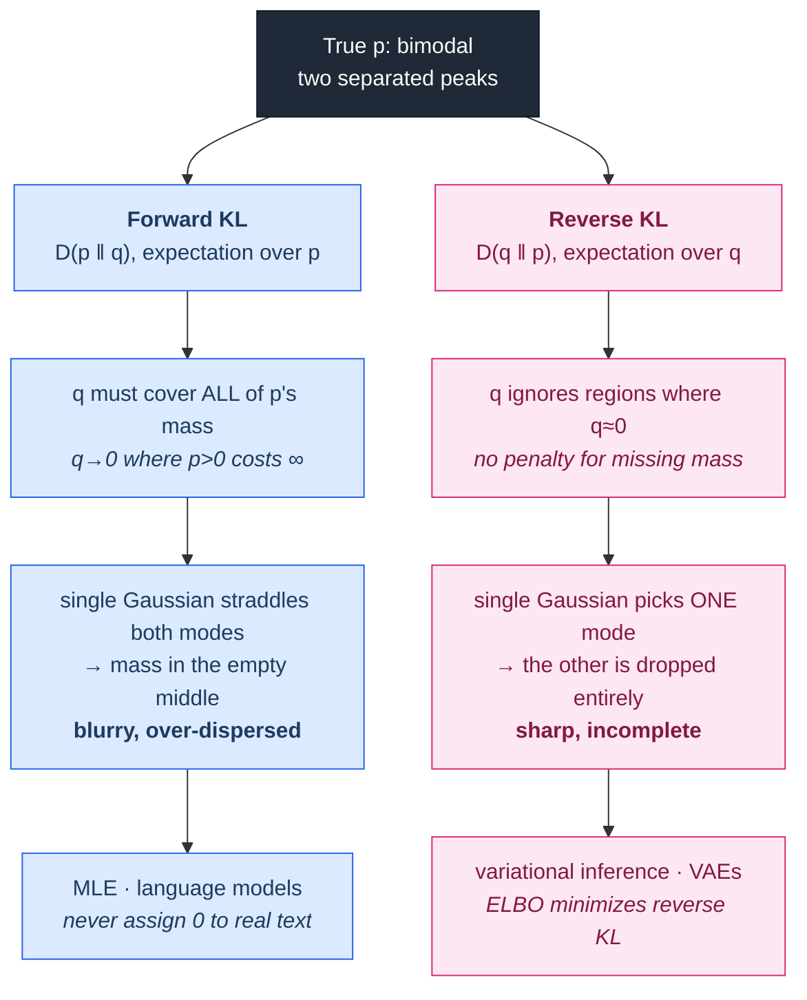

# 00.05 — Information Theory

> **Prerequisites**: [00.03 Probability](../03-probability/) — especially expectation (§4),
> distributions (§8), and Jensen's inequality (§14).
> **You will be able to**: explain why cross-entropy is *the* classification loss rather than one
> option among many, say precisely what a KL divergence measures and why its asymmetry decides
> whether your generative model blurs or drops modes, and read "perplexity 12.3" as a concrete
> statement about a model.

---

## Table of contents

1. [Why information theory](#1-why-information-theory)
2. [Surprise, and the only sensible way to measure it](#2-surprise-and-the-only-sensible-way-to-measure-it)
3. [Entropy](#3-entropy)
4. [Entropy is a code length](#4-entropy-is-a-code-length)
5. [Joint and conditional entropy](#5-joint-and-conditional-entropy)
6. [Cross-entropy](#6-cross-entropy)
7. [KL divergence](#7-kl-divergence)
8. [Forward vs reverse KL](#8-forward-vs-reverse-kl)
9. [Mutual information](#9-mutual-information)
10. [Jensen-Shannon divergence](#10-jensen-shannon-divergence)
11. [Maximum entropy](#11-maximum-entropy)
12. [Minimum description length](#12-minimum-description-length)
13. [Perplexity](#13-perplexity)
14. [Where information theory shows up in ML](#14-where-information-theory-shows-up-in-ml)
15. [Common misconceptions](#15-common-misconceptions)

---

## 1. Why information theory

Shannon invented this subject in 1948 to answer an engineering question — how few bits can you
send a message in? — and it turned out to be the natural language for machine learning, for a
reason worth stating plainly:

> **Learning is compression.** A model that predicts your data well is a short description of it.
> A model that has memorized the data is a long one. Every loss function in supervised learning
> is measuring a description length.

That is not a metaphor. §4 shows entropy *is* the optimal code length, §6 shows cross-entropy loss
*is* the code length you actually pay when you use the wrong model, and §12 shows model selection
*is* a description-length comparison.

Three concrete payoffs:

1. **Cross-entropy stops being arbitrary.** You will see it is not "a loss that works well for
   classification" but the unique answer to "how many bits does my model cost me?"
2. **KL divergence stops being a formula.** Its asymmetry has consequences you can see in
   generated images (§8).
3. **You get a principled notion of dependence.** Correlation only sees linear relationships
   ([00.03 §4.3](../03-probability/)); mutual information sees all of them (§9).

---

## 2. Surprise, and the only sensible way to measure it

Start from what we want, not from a formula. A measure of "how surprising is an event of
probability $p$" — call it $S(p)$ — should satisfy:

1. **$S(1) = 0$.** A certain event is no surprise.
2. **$S$ is decreasing in $p$.** Rarer events are more surprising.
3. **$S(p_1 p_2) = S(p_1) + S(p_2)$.** Surprise from independent events adds. Learning two
   unrelated facts should surprise you by the sum of their individual surprises.

Requirement 3 is the strong one: a function turning products into sums must be a logarithm. Add
requirement 2 to fix the sign:

$$\boxed{\;S(p) = -\log p = \log\frac{1}{p}\;}$$

This is **self-information**, and it is essentially forced — the axioms admit no other choice up
to the base of the log.

| Base | Unit | Used for |
|---|---|---|
| 2 | **bits** | coding, decision trees, intuition |
| $e$ | **nats** | ML losses, calculus (derivatives are cleaner) |
| 10 | bans | rarely |

This chapter uses bits when talking about codes and nats when talking about losses, and says which.

**Sanity check.** A fair coin flip: $-\log_2(1/2) = 1$ bit. A fair die: $-\log_2(1/6) = 2.58$ bits.
An event of probability $10^{-6}$: 20 bits. And $-\log(0) = \infty$ — an event you assigned zero
probability to, that then happens, is infinitely surprising. **That is exactly why a model that
predicts probability 0 for the true class gets infinite loss**, and why every implementation clips
probabilities away from 0 ([00.06](../06-numerical-methods/)).

---

## 3. Entropy

Entropy is *expected* surprise:

$$H(X) = \mathbb{E}[-\log p(X)] = -\sum_x p(x)\log p(x)$$

with the convention $0\log 0 = 0$ (justified by $\lim_{p\to 0}p\log p = 0$).

Read it as: **how uncertain am I, on average, about the outcome?** Or equivalently: how many bits
do I need, on average, to describe an outcome?

### 3.1 Properties

| Property | Statement | Meaning |
|---|---|---|
| Non-negative | $H(X)\ge 0$ | you cannot have negative uncertainty |
| Zero iff deterministic | $H(X)=0 \iff$ some $p(x)=1$ | no uncertainty, nothing to encode |
| Maximized by uniform | $H(X)\le \log K$ | maximal uncertainty over $K$ outcomes |
| Concave | in $p$ | mixing distributions increases entropy |

**The binary case**, worth knowing by heart:

$$H(p) = -p\log_2 p - (1-p)\log_2(1-p)$$

| $p$ | 0.5 | 0.1 / 0.9 | 0.01 / 0.99 | 0 / 1 |
|---|---|---|---|---|
| $H$ (bits) | **1.00** | 0.47 | 0.08 | 0.00 |

Maximum at $p = 0.5$ — a fair coin is the most unpredictable. And note the shape: entropy drops
quickly as $p$ moves away from a half. A 90/10 split is already *less than half* as uncertain as
50/50, which is why decision trees find such splits worth making (§9).

⚠️ **Differential entropy.** For continuous variables, $h(X) = -\int p(x)\log p(x)\,dx$ — but this
is **not** a limit of the discrete case and behaves differently. It can be **negative** (a uniform
on $[0, 0.5]$ has $h = -1$ bit), and it is not invariant under a change of variables. Most results
that *look* like they should transfer, don't. KL divergence and mutual information, however, are
well-behaved in both cases — which is a good reason to prefer them when working with continuous
data.

---

## 4. Entropy is a code length

This is where the subject earns its name, and it is worth spending five minutes on because it
makes everything afterwards concrete.

**The problem.** You must transmit symbols from a distribution $p$ using binary strings. You want
the average message to be short. Frequent symbols should get short codes; rare symbols can have
long ones.

**Shannon's source coding theorem.** The average code length $L$ of *any* uniquely decodable code
satisfies

$$L \ge H(X)$$

and there exist codes achieving $H(X) + 1$. Huffman coding achieves the optimum for symbol-by-symbol
encoding.

**So entropy is not merely *like* a code length — it is the exact lower bound on one.**

**Worked example.** Four symbols with $p = (0.5, 0.25, 0.125, 0.125)$:

$$H = -0.5\log_2 0.5 - 0.25\log_2 0.25 - 2\times 0.125\log_2 0.125 = 0.5 + 0.5 + 0.75 = 1.75 \text{ bits}$$

The Huffman code `A=0, B=10, C=110, D=111` has average length
$0.5(1)+0.25(2)+0.125(3)+0.125(3) = 1.75$ bits — exactly the entropy. A naive fixed-length code
would need 2 bits. The saving comes entirely from matching code length to $-\log p$.

Experiment 1 in [`from_scratch.py`](from_scratch.py) builds Huffman codes and verifies the bound
empirically, including the case where it is not tight.

---

## 5. Joint and conditional entropy

$$H(X,Y) = -\sum_{x,y}p(x,y)\log p(x,y), \qquad
H(Y\mid X) = -\sum_{x,y}p(x,y)\log p(y\mid x)$$

$H(Y\mid X)$ is the uncertainty remaining in $Y$ *after* you learn $X$.

**Chain rule:** $H(X,Y) = H(X) + H(Y\mid X)$.

**Conditioning never hurts:** $H(Y\mid X)\le H(Y)$, with equality iff $X\perp Y$.

> On average, information never increases uncertainty. Note "on average" — a *particular*
> observation can absolutely make you more uncertain (learning a test came back ambiguous), but
> the expectation over all possible observations cannot.

---

## 6. Cross-entropy

Suppose the data really comes from $p$, but you encode it using a code optimized for $q$ — your
model. Your average message length is:

$$H(p,q) = -\sum_x p(x)\log q(x) = \mathbb{E}_{x\sim p}[-\log q(x)]$$

**This is the cross-entropy: the cost of believing $q$ when reality is $p$.**

### 6.1 Why this is the classification loss

For a single training example with true class $c$, the true distribution $p$ is one-hot:
$p(c) = 1$, everything else 0. Then

$$H(p,q) = -\sum_k p(k)\log q(k) = -\log q(c)$$

Every term with $p(k) = 0$ vanishes, and one term survives. So cross-entropy loss reduces to
**"the negative log of the probability you assigned to the correct answer"** — and averaging over
a dataset,

$$\mathcal{L} = -\frac1n\sum_{i=1}^{n}\log q(y_i\mid \mathbf{x}_i)$$

which is exactly the **negative log-likelihood**. Cross-entropy minimization and maximum
likelihood are the same procedure written in two vocabularies
([00.03 §9.4](../03-probability/), [00.04 §4](../04-statistics-and-inference/)).

### 6.2 What it costs you to be wrong

| True class prob. your model assigns | Loss (nats) |
|---|---|
| 0.99 | 0.01 |
| 0.90 | 0.11 |
| 0.50 | 0.69 |
| 0.10 | 2.30 |
| 0.01 | 4.61 |
| 0.001 | 6.91 |
| **0.00** | **∞** |

The asymmetry is the point: being *confidently wrong* is punished far more harshly than being
*uncertain*. A model that hedges at 0.5 pays 0.69; a model that says 0.01 and is wrong pays 4.61.
**Cross-entropy is a proper scoring rule** — it is minimized, in expectation, only by reporting
your true beliefs. That is why it produces calibrated probabilities in a way that accuracy or
hinge loss do not ([05.06](../../05-model-evaluation/06-calibration/)).

---

## 7. KL divergence

$$D_{\mathrm{KL}}(p \Vert q) = \sum_x p(x)\log\frac{p(x)}{q(x)} = \mathbb{E}_{x\sim p}\!\left[\log\frac{p(x)}{q(x)}\right]$$

### 7.1 The decomposition that explains everything

$$\boxed{\;\underbrace{H(p,q)}_{\text{cross-entropy}} = \underbrace{H(p)}_{\text{entropy of the data}} + \underbrace{D_{\mathrm{KL}}(p\Vert q)}_{\text{your model's excess cost}}\;}$$

*Proof.*

$$H(p,q) = -\sum_x p\log q
= -\sum_x p\log p + \sum_x p\log\frac{p}{q} = H(p) + D_{\mathrm{KL}}(p\Vert q)\;\blacksquare$$

Read what this says. Your cross-entropy loss splits into two pieces:

- $H(p)$ — the **irreducible** part. The data's own randomness. No model can beat it. This is
  aleatoric uncertainty ([00.03 §1](../03-probability/)) with a number attached.
- $D_{\mathrm{KL}}(p\Vert q)$ — the **avoidable** part. How wrong your model is.

Since $H(p)$ doesn't depend on your parameters, **minimizing cross-entropy is exactly minimizing
KL divergence.** And it tells you something practically useful: *your loss will not go to zero,
and it should not.* If your training loss on real, noisy data approaches 0, you are memorizing.
The floor is $H(p)$.

### 7.2 Properties

| Property | Statement |
|---|---|
| Non-negative | $D_{\mathrm{KL}}(p\Vert q)\ge 0$ |
| Zero iff identical | $=0 \iff p=q$ almost everywhere |
| **Not symmetric** | $D_{\mathrm{KL}}(p\Vert q)\ne D_{\mathrm{KL}}(q\Vert p)$ |
| **Not a metric** | fails symmetry and the triangle inequality |
| Infinite when support fails | $q(x)=0$ where $p(x)>0 \Rightarrow \infty$ |

**Proof that $D_{\mathrm{KL}}\ge 0$** (Gibbs' inequality), by Jensen
([00.03 §14](../03-probability/)) — $-\log$ is convex:

$$D_{\mathrm{KL}}(p\Vert q) = \mathbb{E}_p\!\left[-\log\frac{q}{p}\right]
\ \ge\ -\log \mathbb{E}_p\!\left[\frac{q}{p}\right]
= -\log\sum_x p\cdot\frac{q}{p} = -\log\sum_x q = -\log 1 = 0 \;\blacksquare$$

That last property matters in practice: if your model assigns zero probability to something that
actually occurs, the KL is infinite. This is why language models never output exactly zero, why
naive Bayes needs smoothing, and why importance sampling explodes when the proposal has thinner
tails than the target.

---

## 8. Forward vs reverse KL

The asymmetry is not a technicality. It determines the qualitative failure mode of your generative
model, and you can see the difference in outputs.

Let $p$ be the true distribution and $q_\theta$ your model.

$$\textbf{Forward } D_{\mathrm{KL}}(p\Vert q) = \mathbb{E}_{p}\!\left[\log\frac{p}{q}\right]
\qquad
\textbf{Reverse } D_{\mathrm{KL}}(q\Vert p) = \mathbb{E}_{q}\!\left[\log\frac{q}{p}\right]$$

**Forward KL — "mode-covering" / zero-avoiding.** The expectation is over $p$. Wherever $p$ has
mass, if $q$ is near zero there, $\log(p/q)\to\infty$ and you are punished enormously. So $q$ is
forced to put mass *everywhere $p$ does*. If $q$ is too simple to fit $p$'s shape, it spreads
itself thin to cover everything — including the empty space between modes.

**Reverse KL — "mode-seeking" / zero-forcing.** The expectation is over $q$. Regions where $q$ is
near zero contribute nothing at all, no matter what $p$ does there. So $q$ can safely ignore parts
of $p$ — it just needs to be right wherever it *does* put mass. It collapses onto one mode.

**Which one you are using, whether you realize it or not:**

| Method | Divergence | Consequence |
|---|---|---|
| Maximum likelihood / cross-entropy | **forward** $D(p\Vert q)$ | covers all modes; over-dispersed if underfit |
| Variational inference / VAE ELBO | **reverse** $D(q\Vert p)$ | mode-seeking; posterior collapse risk |
| Expectation propagation | forward, locally | — |
| GAN (original) | Jensen-Shannon (§10) | mode collapse in practice |

> **This is why VAE samples look blurry and GAN samples look sharp but lack diversity.** It is not
> primarily an architecture difference; it is which direction of KL the objective minimizes. The
> VAE's decoder is trained by maximum likelihood (forward KL, mode-covering → averages over
> plausible outputs → blur), while its *posterior approximation* uses reverse KL (mode-seeking →
> collapse). Experiment 3 in [`from_scratch.py`](from_scratch.py) fits a single Gaussian to a
> bimodal target under both objectives and shows the two solutions side by side.

---

## 9. Mutual information

How much does knowing $X$ tell you about $Y$?

$$I(X;Y) = \sum_{x,y}p(x,y)\log\frac{p(x,y)}{p(x)p(y)} = D_{\mathrm{KL}}\big(p(x,y)\,\Vert\,p(x)p(y)\big)$$

That second form is the definition worth remembering: **mutual information is the KL divergence
between the joint distribution and what the joint *would* be if they were independent.** It
measures how far from independent they are.

**Equivalent forms:**

$$I(X;Y) = H(X) - H(X\mid Y) = H(Y) - H(Y\mid X) = H(X)+H(Y)-H(X,Y)$$

"The reduction in uncertainty about $X$ from learning $Y$."

**Properties:** $I(X;Y)\ge 0$; $I(X;Y) = 0 \iff X\perp Y$; symmetric; $I(X;X) = H(X)$.

> **Mutual information catches what correlation misses.** For $X\sim\mathcal{N}(0,1)$ and
> $Y = X^{2}$, correlation is exactly 0 ([00.03 §4.3](../03-probability/)) while mutual
> information is large — $Y$ is a deterministic function of $X$. Any nonlinear dependence is
> invisible to correlation and visible to MI. This is why `sklearn.feature_selection.mutual_info_classif`
> exists alongside correlation-based filters. Experiment 4 measures exactly this gap.

**Information gain in decision trees** is mutual information, renamed:

$$\mathrm{IG}(Y, X_j) = H(Y) - H(Y\mid X_j) = I(Y; X_j)$$

A tree greedily splits on the feature with the highest mutual information with the label. When you
read "the tree splits on information gain", read "the tree splits on mutual information".
See [03.08](../../03-supervised-learning/08-decision-trees/).

---

## 10. Jensen-Shannon divergence

A symmetrized, bounded alternative:

$$D_{\mathrm{JS}}(p\Vert q) = \tfrac12 D_{\mathrm{KL}}(p\Vert m) + \tfrac12 D_{\mathrm{KL}}(q\Vert m),
\qquad m = \tfrac12(p+q)$$

Symmetric, always finite (because $m$ has the union of both supports, so no division by zero), and
bounded by $\log 2$ nats (1 bit). Its square root is a genuine metric.

**Why it matters:** Goodfellow's original GAN paper showed that with an optimal discriminator, the
generator minimizes $2D_{\mathrm{JS}}(p_{\text{data}}\Vert p_{\text{model}}) - \log 4$. This was
the theoretical justification for GANs — and also the diagnosis of their problem: when the two
distributions have disjoint support (very likely early in training, when generated images look
nothing like real ones), $D_{\mathrm{JS}}$ is constant at $\log 2$, so its gradient is **zero**
and the generator gets no learning signal. Wasserstein GAN replaced JS with the Earth-Mover
distance precisely to fix this. See [12.03](../../12-generative-models/03-gan/).

---

## 11. Maximum entropy

**The principle:** among all distributions consistent with what you know, choose the one with the
highest entropy. It is the distribution that assumes the *least* beyond your constraints — any
lower-entropy choice smuggles in information you do not have.

The results are striking:

| Constraint | Max-entropy distribution |
|---|---|
| support on $\{1..K\}$, nothing else | **Uniform** |
| support $[a,b]$ | **Uniform**$(a,b)$ |
| mean $\mu$, support $[0,\infty)$ | **Exponential**$(1/\mu)$ |
| mean $\mu$ and variance $\sigma^{2}$ | **Gaussian**$(\mu,\sigma^{2})$ |
| mean, on non-negative integers | **Geometric** |
| specified feature expectations | **exponential family** ([00.03 §10](../03-probability/)) |

> **This is the deepest reason the Gaussian is everywhere.** Not the CLT (though that is also
> true), but this: if all you are willing to commit to is a mean and a variance, the Gaussian is
> the *only* honest choice. Any other distribution with that mean and variance asserts extra
> structure you have no evidence for.

The exponential-family row is why **maximum-entropy models are logistic/softmax regression**: fix
the expected value of each feature to match the data, maximize entropy, and softmax regression
falls out. "MaxEnt classifier" and "logistic regression" are the same model; NLP happened to adopt
the first name and statistics the second.

---

## 12. Minimum description length

Occam's razor, made quantitative:

$$\text{total cost} = \underbrace{L(\text{model})}_{\text{bits to describe the model}} + \underbrace{L(\text{data}\mid\text{model})}_{\text{bits to describe the residual}}$$

Choose the model minimizing the total. A complex model reduces the second term but inflates the
first; a trivial model does the reverse.

This connects three things that look unrelated:

- **MDL ≈ MAP estimation.** $-\log p(\theta\mid \mathcal{D}) = -\log p(\mathcal{D}\mid\theta) - \log p(\theta)$
  is a description length: the log-likelihood is $L(\text{data}\mid\text{model})$ and the log-prior
  is $L(\text{model})$. **Regularization is a model-description cost.**
- **BIC** $= -2\ell + k\log n$ is an MDL approximation, with $\frac{k}{2}\log n$ the bits to encode
  $k$ parameters at precision $1/\sqrt{n}$.
- **AIC** $= -2\ell + 2k$ comes from a different (KL-based) argument but has the same shape.

The MDL view is genuinely useful for intuition: **a model that generalizes is one that found real
structure, and real structure is exactly what lets you compress.** Memorization does not compress.

---

## 13. Perplexity

For language models, cross-entropy is usually reported as its exponential:

$$\mathrm{PPL} = \exp\!\left(-\frac1N\sum_{i=1}^{N}\log q(w_i\mid w_{<i})\right) = \exp(H(p,q))$$

**Interpretation: the effective number of equally-likely choices the model is deciding between at
each step.** Perplexity 1 = perfect prediction. Perplexity = vocabulary size = the model learned
nothing. A perplexity of 12 means the model is about as uncertain as if it were choosing uniformly
among 12 options.

Perplexity is preferred over raw cross-entropy purely because it is interpretable on a human scale
— but it is a monotone transform of the loss, so nothing is added mathematically.

⚠️ **Perplexities are only comparable under identical tokenization.** A model with a larger
vocabulary predicts fewer, larger tokens, so its per-token perplexity is not comparable to a
character-level model's. Comparing perplexity across tokenizers is a category error, and it is
committed regularly. Bits-per-byte is the tokenizer-independent alternative.

---

## 14. Where information theory shows up in ML

| Concept | Appears in |
|---|---|
| Self-information | why $\log(0)$ handling matters; label smoothing |
| Entropy | decision tree splitting, exploration bonuses in RL, entropy regularization |
| **Cross-entropy** | **the loss function of essentially every classifier and language model** |
| **KL divergence** | VAE ELBO, variational inference, PPO's trust region, knowledge distillation, RLHF penalty |
| Forward vs reverse KL | why VAEs blur and variational posteriors collapse |
| Mutual information | feature selection, InfoNCE / contrastive learning, information bottleneck, disentanglement metrics |
| Jensen-Shannon | original GAN objective, and the reason for WGAN |
| Maximum entropy | why the Gaussian is the default; MaxEnt = softmax regression; MaxEnt RL (SAC) |
| MDL | BIC/AIC, regularization-as-prior, the compression view of generalization |
| Perplexity | language model evaluation |

Two worth expanding:

**Knowledge distillation** trains a small student to match a large teacher by minimizing
$D_{\mathrm{KL}}(p_{\text{teacher}}\Vert p_{\text{student}})$ over the *full* output distribution,
not just the argmax. The teacher's "dark knowledge" — that this image is 0.7 cat, 0.2 lynx, 0.001
truck — carries far more information per example than a one-hot label, which is why distillation
works with less data than training from scratch. See [19.04](../../19-mlops/04-efficiency/).

**RLHF** adds $-\beta D_{\mathrm{KL}}(\pi_\theta \Vert \pi_{\text{ref}})$ to the reward, keeping
the tuned policy near the base model. Without it the policy drifts into degenerate text that
scores well on the reward model and is useless. See
[11.06](../../11-transformers-and-llms/06-alignment/).

---

## 15. Common misconceptions

**"KL divergence is a distance."**
It is not symmetric and violates the triangle inequality. It is a *divergence*. If you need a
metric, use Jensen-Shannon's square root or a Wasserstein distance.

**"Forward and reverse KL are basically the same."**
They produce qualitatively different solutions — mode-covering vs mode-seeking (§8) — and the
difference is visible in generated samples.

**"Entropy is disorder."**
That is a thermodynamics analogy that misleads here. Entropy is *uncertainty about an outcome*, or
equivalently *expected code length*.

**"Cross-entropy is just a convenient loss for classification."**
It is the negative log-likelihood (§6.1), the KL divergence up to a constant (§7.1), and the
optimal code length (§4). Three independent derivations converge on it.

**"A perfect model has zero cross-entropy."**
The floor is $H(p)$, the data's own noise (§7.1). Reaching zero on noisy data means memorization.

**"Differential entropy is just entropy for continuous variables."**
It can be negative and is not invariant under reparameterization. KL and MI are the well-behaved
continuous analogues.

**"Zero mutual information means no relationship."**
$I = 0$ genuinely does mean independence — unlike zero correlation, which does not. MI is the
stronger statement, and this is the one place where the intuitive reading is correct.

**"Lower perplexity always means a better model."**
Only under identical tokenization and evaluation data (§13).

---

## Files in this chapter

| File | Contents |
|---|---|
| [`from_scratch.py`](from_scratch.py) | Entropy, cross-entropy, KL, JS, mutual information, information gain, Huffman coding, and a maximum-entropy solver — plus experiments verifying Shannon's source-coding bound, the $H(p,q)=H(p)+D_{\mathrm{KL}}$ decomposition, the mode-covering/mode-seeking split, and MI catching dependence that correlation misses |
| [`exercises.md`](exercises.md) | Derivation, implementation, and interview questions |
| [`references.md`](references.md) | Exact sections used |

**Previous**: [00.04 — Statistics & Inference](../04-statistics-and-inference/) ·
**Next**: [00.06 — Numerical Methods](../06-numerical-methods/)
