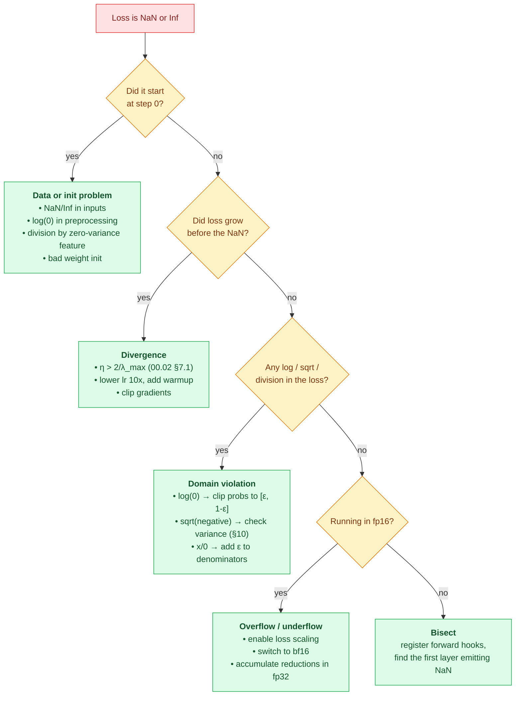

# 00.06 — Numerical Methods

> **Prerequisites**: [00.01 §15](../01-linear-algebra/) (conditioning), and enough of
> [00.03](../03-probability/) and [00.05](../05-information-theory/) to recognize a softmax and a
> cross-entropy.
> **You will be able to**: explain why your loss became `NaN`, write a softmax that doesn't
> overflow, know when `float16` will silently destroy your gradients, and stop trusting `==` on
> floats.

---

## Table of contents

1. [Correct mathematics, wrong answers](#1-correct-mathematics-wrong-answers)
2. [How a float actually works](#2-how-a-float-actually-works)
3. [Machine epsilon and what "precision" means](#3-machine-epsilon-and-what-precision-means)
4. [Catastrophic cancellation](#4-catastrophic-cancellation)
5. [Overflow and underflow](#5-overflow-and-underflow)
6. [Working in log space](#6-working-in-log-space)
7. [Log-sum-exp](#7-log-sum-exp)
8. [Stable softmax](#8-stable-softmax)
9. [Stable sigmoid and binary cross-entropy](#9-stable-sigmoid-and-binary-cross-entropy)
10. [Computing variance without destroying it](#10-computing-variance-without-destroying-it)
11. [Summation error](#11-summation-error)
12. [Conditioning, revisited](#12-conditioning-revisited)
13. [Gradient checking](#13-gradient-checking)
14. [Low precision: float16, bfloat16, and below](#14-low-precision-float16-bfloat16-and-below)
15. [Determinism and reproducibility](#15-determinism-and-reproducibility)
16. [A debugging playbook for NaN](#16-a-debugging-playbook-for-nan)
17. [Common misconceptions](#17-common-misconceptions)

---

## 1. Correct mathematics, wrong answers

Everything in Parts 00.01–00.05 assumed real numbers. Your computer does not have real numbers. It
has about 16 significant decimal digits, a finite range, and a rounding rule — and the gap between
those two worlds is where a startling amount of ML debugging time goes.

Three examples, all of which are *mathematically* trivial and *numerically* dangerous:

| Expression | Mathematically | In float64 |
|---|---|---|
| `0.1 + 0.2 == 0.3` | true | **`False`** |
| `softmax([1000, 1001])` | `[0.269, 0.731]` | **`[nan, nan]`** |
| `mean((x - mean(x))**2)` for `x` near $10^{9}$ | the variance | **often negative** |

None of these is an exotic edge case. The second is what happens when a logit grows during
training; the third is what happens when you compute variance on timestamps. This chapter is about
recognizing and defusing them.

The recurring theme: **the library functions you should be using — `logsumexp`, `log1p`, `expm1`,
`np.logaddexp`, fused `CrossEntropyLoss` — exist precisely because the naive formula fails.** Once
you know why, you stop reimplementing them by accident.

---

## 2. How a float actually works

IEEE 754 stores a number as

$$(-1)^{s} \times 1.m \times 2^{e - \text{bias}}$$

| Type | Sig bits | Exp bits | Decimal digits | Max | Smallest normal |
|---|---|---|---|---|---|
| `float64` | 52 | 11 | ~15.9 | $1.8\times10^{308}$ | $2.2\times10^{-308}$ |
| `float32` | 23 | 8 | ~7.2 | $3.4\times10^{38}$ | $1.2\times10^{-38}$ |
| `float16` | 10 | 5 | ~3.3 | **65504** | $6.1\times10^{-5}$ |
| `bfloat16` | 7 | 8 | ~2.4 | $3.4\times10^{38}$ | $1.2\times10^{-38}$ |

The critical observation: **floats are logarithmically spaced.** The gap between representable
numbers near 1.0 is about $2.2\times10^{-16}$ in float64; near $10^{9}$ it is about $2\times10^{-7}$;
near $10^{16}$ it exceeds 1.0, so adding 1 to $10^{16}$ changes nothing.

### 2.1 Why `0.1 + 0.2 != 0.3`

0.1 in binary is $0.0\overline{0011}$ — infinitely repeating, exactly as $1/3$ repeats in decimal.
It must be truncated at 52 bits, so the stored value is

$$0.1 \to 0.1000000000000000055511151231257827\ldots$$

Add two such approximations and the errors accumulate to a value that differs from the stored
approximation of 0.3 by one unit in the last place.

> **Never compare floats with `==`.** Use `abs(a - b) < tol`, and make `tol` *relative* to the
> magnitudes involved — this is the same lesson as the tolerance bug fixed in
> [00.01's `from_scratch.py`](../01-linear-algebra/from_scratch.py), where an absolute `1e-12`
> silently skipped a Householder reflection whose true scale was `1e-7`. Use
> `np.isclose` / `np.allclose`, which do relative comparison by default.

---

## 3. Machine epsilon and what "precision" means

**Machine epsilon** $\varepsilon$ is the gap between 1.0 and the next representable number:

$$\varepsilon_{64} = 2^{-52} \approx 2.22\times10^{-16}, \qquad
\varepsilon_{32} = 2^{-23} \approx 1.19\times10^{-7}$$

$$\varepsilon_{16} = 2^{-10} \approx 9.77\times10^{-4}, \qquad
\varepsilon_{\text{bf16}} = 2^{-7} \approx 7.81\times10^{-3}$$

Every arithmetic operation may introduce a **relative** error up to $\varepsilon/2$. Errors compound
over $n$ operations, in the worst case linearly ($n\varepsilon$) and typically as a random walk
($\sqrt{n}\varepsilon$).

**Consequence worth internalizing.** In `float16`, $1 + 0.0005 = 1$ exactly. Since a typical SGD
update is $\theta \leftarrow \theta - \eta g$ with $\eta g$ many orders of magnitude below
$\theta$, **pure-float16 training silently stops updating weights.** The gradient is computed, the
subtraction is performed, and the result rounds back to the original value. This is precisely why
mixed-precision training keeps a `float32` master copy of the weights (§14).

---

## 4. Catastrophic cancellation

Subtracting two nearly equal numbers destroys precision — not because subtraction is inaccurate,
but because it *exposes* error that was already there.

Suppose $a$ and $b$ agree to 10 significant digits and each carries a relative error of
$10^{-16}$. Their absolute errors are ~$10^{-16}|a|$. After subtracting, the *result* is
~$10^{-10}|a|$ but the error is still ~$10^{-16}|a|$ — so the **relative** error has grown by a
factor of $10^{6}$.

**Classic example — the quadratic formula.** For $x^{2} + 10^{8}x + 1 = 0$, the root

$$x = \frac{-b + \sqrt{b^{2}-4ac}}{2a}$$

subtracts two nearly identical numbers and returns garbage. The fix is algebraic, not numerical:
multiply by the conjugate to turn the subtraction into an addition,

$$x = \frac{2c}{-b - \sqrt{b^{2}-4ac}}$$

**Where this bites in ML:**

| Naive expression | Problem | Fix |
|---|---|---|
| $\mathbb{E}[X^{2}] - (\mathbb{E}[X])^{2}$ | cancellation when $\mu \gg \sigma$ | two-pass or Welford (§10) |
| $\log(1+x)$ for tiny $x$ | $1+x$ rounds to 1 | `np.log1p(x)` |
| $e^{x}-1$ for tiny $x$ | same, in reverse | `np.expm1(x)` |
| $\log(1-\sigma(z))$ | $\sigma(z)\to 1$ | use $-\text{softplus}(z)$ (§9) |
| $\sqrt{x^{2}+y^{2}}$ | intermediate overflow | `np.hypot(x, y)` |
| $\mathbf{X}^{\top}\mathbf{X}$ in regression | squares $\kappa$ | QR/SVD ([00.01 §15](../01-linear-algebra/)) |

`log1p` and `expm1` are not conveniences. `log(1 + 1e-20)` returns exactly `0.0`; `log1p(1e-20)`
returns `1e-20`.

---

## 5. Overflow and underflow

**Overflow** — the result exceeds the maximum → `inf`. $e^{800}$ overflows float64;
$e^{89}$ overflows float32; $e^{12}$ overflows float16.

**Underflow** — the result is too small → `0.0`. $e^{-800}$ underflows to zero, and then
$\log(0) = -\infty$, and then $-\infty \times 0 = $ `NaN`, and your loss is gone.

**The canonical ML disaster** is a product of probabilities:

$$p(\mathcal{D}\mid\theta) = \prod_{i=1}^{n} p(x_i\mid\theta)$$

With $n = 1000$ and each $p_i \approx 0.1$, the product is $10^{-1000}$ — zero in float64, whose
smallest positive normal is $10^{-308}$. **A likelihood of 1000 independent observations is not
representable.** This is not a corner case; it is the default situation in any probabilistic model.

Hence §6.

---

## 6. Working in log space

$$\log \prod_i p_i = \sum_i \log p_i$$

Products of $10^{-1000}$ become sums around $-2303$ — comfortably representable. **This is the
whole reason maximum *log*-likelihood is universal** ([00.04 §4](../04-statistics-and-inference/)):
not just because sums differentiate more easily, but because the product does not exist in
floating point.

The translation table:

| Real space | Log space |
|---|---|
| $a\times b$ | $\log a + \log b$ |
| $a / b$ | $\log a - \log b$ |
| $a^{n}$ | $n\log a$ |
| $a + b$ | **hard** → log-sum-exp (§7) |

Addition is the one operation that does not simplify — which is exactly why `logsumexp` is the
single most important numerical routine in machine learning.

---

## 7. Log-sum-exp

Compute $\log\sum_i e^{x_i}$ without ever forming $e^{x_i}$.

**The identity:**

$$\log\sum_i e^{x_i} = c + \log\sum_i e^{x_i - c}
\qquad\text{for any } c$$

*Proof.* $\sum_i e^{x_i} = \sum_i e^{c}e^{x_i-c} = e^{c}\sum_i e^{x_i-c}$; take logs. $\blacksquare$

**Choose $c = \max_i x_i$.** Then:

- the largest exponent becomes $e^{0} = 1$ — **no overflow, ever**;
- every other term is $e^{\text{negative}} \in (0,1]$ — underflow to zero is possible, but harmless,
  since those terms were negligible anyway;
- at least one term is exactly 1, so $\log(\cdot)$ never sees zero.

$$\boxed{\;\mathrm{LSE}(\mathbf{x}) = \max_i x_i + \log\sum_i e^{x_i - \max_j x_j}\;}$$

With $\mathbf{x} = [1000, 1001, 1002]$, the naive version gives `inf`; this gives `1002.4076`.

Log-sum-exp is the backbone of: softmax and cross-entropy (§8), the forward-backward algorithm in
HMMs, message passing in graphical models, mixture-model likelihoods, and every `logaddexp` in
your framework. Learn it once.

---

## 8. Stable softmax

$$\mathrm{softmax}(\mathbf{x})_i = \frac{e^{x_i}}{\sum_j e^{x_j}}$$

Naively, logits above ~89 overflow in float32. The same shift trick applies, and here it is
**exactly invariant** rather than merely accurate:

$$\mathrm{softmax}(\mathbf{x})_i = \frac{e^{x_i - c}}{\sum_j e^{x_j - c}}$$

*Why it is exact:* multiplying numerator and denominator by $e^{-c}$ changes nothing
algebraically. So softmax is **shift-invariant** — a genuine mathematical property, not an
approximation. Taking $c = \max_i x_i$ makes the largest exponent $e^{0}=1$.

### 8.1 Never compute `log(softmax(x))`

$$\log\mathrm{softmax}(\mathbf{x})_i = x_i - \mathrm{LSE}(\mathbf{x})$$

Compute it directly. If you compute softmax first and then take the log, any probability that
underflowed to 0 becomes $-\infty$, and the loss is destroyed — even though $x_i - \mathrm{LSE}$
would have given a perfectly good finite number like $-800$.

> **This is why every framework fuses the two.** PyTorch's `nn.CrossEntropyLoss` takes **raw
> logits**, not probabilities, and internally computes `log_softmax` + `nll_loss`. Passing it
> softmax output is a common bug: it applies softmax twice, which is numerically fine but
> mathematically wrong — it flattens your distribution and cripples training.
> Likewise `BCEWithLogitsLoss` over `Sigmoid` + `BCELoss`.

---

## 9. Stable sigmoid and binary cross-entropy

$$\sigma(z) = \frac{1}{1+e^{-z}}$$

For $z = -800$, $e^{-z} = e^{800}$ overflows. Branch on the sign to keep the exponent negative:

$$\sigma(z) = \begin{cases}
\dfrac{1}{1+e^{-z}} & z \ge 0\\[8pt]
\dfrac{e^{z}}{1+e^{z}} & z < 0
\end{cases}$$

Both branches only ever evaluate $e^{\text{negative}}$, which underflows gracefully to 0 rather
than overflowing to `inf`.

**Binary cross-entropy is worse.** The naive form

$$L = -[y\log\sigma(z) + (1-y)\log(1-\sigma(z))]$$

fails whenever $\sigma(z)$ saturates to exactly 0 or 1 — which happens for $|z| \gtrsim 37$ in
float32, an entirely ordinary logit magnitude for a confident model. Then $\log(0) = -\infty$.

**Fold the sigmoid into the loss algebraically:**

$$L = \max(z, 0) - z\cdot y + \log\!\left(1 + e^{-|z|}\right)$$

*Derivation sketch.* Substitute $\sigma$ and simplify:
$-y\log\sigma(z) - (1-y)\log(1-\sigma(z)) = z - zy + \log(1+e^{-z})$, then apply the
$\max(z,0)$ shift to $\log(1+e^{-z})$ so the exponent is always negative.

Every term is now bounded: no `log(0)`, no overflow, at any $z$. This is exactly what
`BCEWithLogitsLoss` computes, and why it exists as a separate class.

The general helper is **softplus**, $\zeta(z) = \log(1+e^{z})$, computed stably as
$\max(z,0) + \log(1+e^{-|z|})$.

---

## 10. Computing variance without destroying it

The textbook shortcut ([00.03 §4.2](../03-probability/)):

$$\mathrm{Var}(X) = \mathbb{E}[X^{2}] - (\mathbb{E}[X])^{2}$$

is a **catastrophic cancellation waiting to happen.** When $\mu \gg \sigma$ — timestamps, ID
numbers, prices in cents, sensor readings with a large offset — both terms are huge and nearly
equal, and their difference can come out **negative**. A negative variance then produces `NaN` at
the next square root.

Three algorithms, in increasing order of quality:

| Method | Formula | Passes | Stability |
|---|---|---|---|
| Naive one-pass | $\frac{1}{n}\sum x^{2} - \bar{x}^{2}$ | 1 | **bad** |
| Two-pass | $\frac{1}{n}\sum(x-\bar{x})^{2}$ | 2 | good |
| **Welford** | incremental (below) | 1 | **good** |

**Welford's algorithm** — one pass, numerically stable:

$$
\begin{aligned}
\delta &= x_n - \mu_{n-1}\\
\mu_n &= \mu_{n-1} + \delta/n\\
M_{2,n} &= M_{2,n-1} + \delta\cdot(x_n - \mu_n)
\end{aligned}
$$

with $\mathrm{Var} = M_2/n$ (or $M_2/(n-1)$ for the unbiased estimate,
[00.04 §5](../04-statistics-and-inference/)). It never forms $\sum x^{2}$, so there is nothing
large to cancel.

> This is not academic. It is why `BatchNorm` implementations use Welford or a shifted two-pass
> algorithm, why pandas' `.var()` is more careful than the one-liner, and why computing variance
> on unscaled timestamp features can hand you a `NaN` before training even starts.
> **Centering your data first is a numerical fix as well as a statistical one.**

---

## 11. Summation error

Summing $n$ floats naively accumulates error, because after the running total grows large, small
addends fall below its precision and vanish entirely.

**Kahan (compensated) summation** keeps a running correction term:

```
sum = 0.0; c = 0.0
for x in values:
    y = x - c            # apply the correction carried from last time
    t = sum + y          # this addition loses the low-order bits of y ...
    c = (t - sum) - y    # ... and this recovers exactly what was lost
    sum = t
```

Error drops from $O(n\varepsilon)$ to $O(\varepsilon)$ — independent of $n$.

You rarely need to write this yourself: **NumPy's `sum` already uses pairwise summation**, which
achieves $O(\varepsilon\log n)$ at no cost. But `math.fsum` (exact), `np.sum` (pairwise), and a
Python `for` loop (naive) give measurably different answers on large arrays, and knowing which is
which matters when a loss aggregated over millions of examples has to be reproducible.

---

## 12. Conditioning, revisited

From [00.01 §15](../01-linear-algebra/): $\kappa(\mathbf{A}) = \sigma_{\max}/\sigma_{\min}$ bounds
how much a relative input error is amplified. **Rule of thumb: with $\kappa \approx 10^{k}$, expect
to lose about $k$ significant digits.**

The three practical consequences, restated here because they are numerical rather than algebraic:

1. **Never invert a matrix.** `np.linalg.solve` (LU) or `lstsq` (SVD), never `inv`.
2. **Never form $\mathbf{X}^{\top}\mathbf{X}$.** It squares $\kappa$ — an uncomfortable $10^{8}$
   becomes a fatal $10^{16}$.
3. **Standardize features.** A feature in dollars and one in years produce a design matrix with a
   huge $\kappa$ before you have done anything at all.

Experiment 2 in [00.01's `from_scratch.py`](../01-linear-algebra/from_scratch.py) measures all
three.

---

## 13. Gradient checking

The one debugging technique everyone should have and few do. Compare your analytic gradient to a
finite-difference approximation:

$$\frac{\partial f}{\partial x_i} \approx \frac{f(\mathbf{x}+h\mathbf{e}_i) - f(\mathbf{x}-h\mathbf{e}_i)}{2h}$$

**Use the central difference**, error $O(h^{2})$, not the forward difference, error $O(h)$. One
extra evaluation per coordinate buys a whole order of accuracy.

**Compare relatively**, never absolutely:

$$\text{rel} = \frac{\Vert \mathbf{g}_{\text{analytic}} - \mathbf{g}_{\text{numeric}}\Vert}
{\Vert \mathbf{g}_{\text{analytic}}\Vert + \Vert \mathbf{g}_{\text{numeric}}\Vert}$$

| Relative error | Verdict |
|---|---|
| $< 10^{-7}$ | correct |
| $10^{-7}$ to $10^{-4}$ | suspicious — check for kinks (ReLU, abs, max) |
| $> 10^{-4}$ | **bug** |

**Choosing $h$ is a genuine tradeoff**, and it is the clearest illustration in this chapter of the
two competing error sources: truncation error falls as $h$ shrinks, while cancellation error grows
(you are subtracting two nearly equal numbers, §4). The optimum for central differences is around
$h \approx \varepsilon^{1/3} \approx 6\times10^{-6}$ in float64. Experiment 5 measures the U-shaped
curve.

⚠️ **Do gradient checks in float64.** In float32, $\varepsilon = 10^{-7}$ and the check is
dominated by noise. And check at points *away from kinks* — ReLU at exactly 0 will fail a gradient
check correctly, because the derivative genuinely does not exist there.

---

## 14. Low precision: float16, bfloat16, and below

Modern training runs in 16 bits. The two formats make **opposite** trades from the same 16 bits:

| | `float16` | `bfloat16` |
|---|---|---|
| Exponent bits | 5 | **8** (same as float32) |
| Significand bits | **10** | 7 |
| Max value | **65504** | $3.4\times10^{38}$ |
| Smallest normal | $6\times10^{-5}$ | $1.2\times10^{-38}$ |
| Precision | ~3.3 digits | ~2.4 digits |
| Overflow risk | **high** | negligible |

**bfloat16 has the same range as float32 and less precision.** That trade is the right one for
deep learning, and the reason is specific: gradients span an enormous dynamic range but do not
need many significant digits. A gradient of $3\times10^{-8}$ **underflows to zero in float16** —
losing the update entirely — while bfloat16 represents it fine, if coarsely.

This is why float16 training requires **loss scaling** (multiply the loss by ~$2^{15}$ before
backward, divide the gradients afterwards, and skip any step that produced `inf`) while bfloat16
generally does not. It is also why bfloat16 has become the default on hardware that supports it.

**Mixed precision** in practice:

1. Weights are kept in a **float32 master copy** (§3: float16 cannot represent
   $\theta - \eta g$ when $\eta g \ll \theta$).
2. Forward and backward run in 16-bit.
3. Reductions — sums, norms, softmax denominators, BatchNorm statistics — accumulate in float32,
   because $O(n\varepsilon)$ error at $\varepsilon = 10^{-3}$ over thousands of terms is not
   acceptable.
4. Optimizer state (Adam's $m$ and $v$) stays float32.

Below 16 bits — int8, fp8, 4-bit — the game changes from arithmetic to *quantization*: you store a
scale factor per tensor or per group and represent values as small integers.
See [19.04](../../19-mlops/04-efficiency/).

---

## 15. Determinism and reproducibility

Floating-point addition is **not associative**: $(a+b)+c \ne a+(b+c)$ in general. So any
computation whose summation order varies — GPU atomics, multi-threaded reductions, different
batch sizes — gives bitwise different answers.

For reproducibility you need all of:

```python
import os, random, numpy as np, torch

os.environ["PYTHONHASHSEED"] = "0"
os.environ["CUBLAS_WORKSPACE_CONFIG"] = ":4096:8"   # required for deterministic cuBLAS

random.seed(0); np.random.seed(0); torch.manual_seed(0)
torch.cuda.manual_seed_all(0)
torch.use_deterministic_algorithms(True)
torch.backends.cudnn.benchmark = False              # benchmark picks kernels nondeterministically
```

plus fixed `num_workers` and a seeded `DataLoader` generator.

**Determinism costs speed** — sometimes 10-30% — because the fastest kernels are the
nondeterministic ones. The honest position: enable it while debugging and for published results;
accept nondeterminism in production, and report variance across seeds rather than a single number
([00.04 §15.2](../04-statistics-and-inference/)).

---

## 16. A debugging playbook for NaN

When the loss becomes `NaN`, work through this in order:



**Tools, in order of usefulness:**

```python
torch.autograd.set_detect_anomaly(True)     # points at the op that produced the NaN
np.seterr(all="raise")                      # turn silent NaN/overflow into exceptions
assert torch.isfinite(loss), "non-finite loss"
```

Add the assertion permanently. Failing loudly at step 400 is enormously cheaper than discovering at
step 40,000 that the last 39,600 steps trained on `NaN`.

---

## 17. Common misconceptions

**"Floating point errors are tiny and don't matter."**
Relative errors are tiny; catastrophic cancellation (§4) can make *relative* error $O(1)$, and
overflow makes it infinite.

**"Use float64 everywhere and you're safe."**
float64 postpones overflow, it does not prevent it. $e^{800}$ overflows regardless, and
cancellation is a relative-error problem that more bits do not fix.

**"`a == b` is fine if I computed them the same way."**
Only if *bitwise* identical, which fails across summation orders, compiler flags, and devices (§15).

**"Softmax is numerically fine because outputs are in [0,1]."**
The *intermediate* $e^{x_i}$ overflows long before the output would (§8).

**"I'll compute softmax then take the log."**
Underflowed probabilities become $-\infty$. Compute `log_softmax` directly (§8.1).

**"bfloat16 is just a worse float16."**
It has *more* range and *less* precision — the better trade for gradients (§14).

**"My gradient check fails, so my gradient is wrong."**
It may be your $h$ (§13), float32 instead of float64, or a genuine kink (ReLU at 0).

**"NaN means my model is broken."**
Most often it means your learning rate is too large ([00.02 §7.1](../02-calculus-and-optimization/))
or a probability hit exactly 0.

---

## Files in this chapter

| File | Contents |
|---|---|
| [`from_scratch.py`](from_scratch.py) | Naive and stable implementations side by side — softmax, log-sum-exp, sigmoid, BCE-with-logits, softplus, three variance algorithms including Welford, Kahan summation, and a gradient checker — plus experiments measuring exactly where each naive version fails |
| [`exercises.md`](exercises.md) | Derivation, implementation, and interview questions |
| [`references.md`](references.md) | Exact sections used |

**Previous**: [00.05 — Information Theory](../05-information-theory/) ·
**Next**: [Part 1 — The Python Toolkit](../../01-python-for-ml/)

---

*This completes Part 0. Every derivation in Parts 1-21 rests on these six chapters.*
