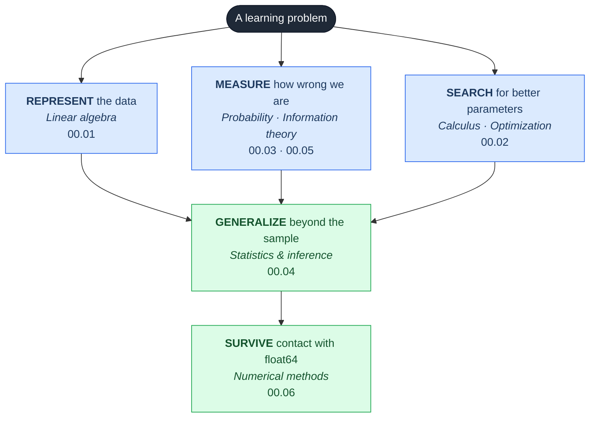

# Part 0 — Mathematical Foundations

> **You cannot debug what you cannot derive.**

Every later part of this repository cites this one. If a derivation in Part 7 says
"by the spectral theorem", it means [00.01 §11](01-linear-algebra/#11-symmetric-matrices-quadratic-forms-and-positive-definiteness).
If Part 5 says "by Jensen's inequality", it means [00.03](03-probability/).

## Why not skip it

It is tempting to skip the math and go straight to `model.fit()`. That works right up until
something breaks — and then the difference between someone who can fix it and someone who
cannot is exactly this part. Concretely, you need Part 0 the day you have to answer:

| Symptom | What you need to know | Chapter |
|---|---|---|
| Coefficients of $\pm 10^{6}$ on correlated features | null spaces, conditioning | [00.01](01-linear-algebra/) |
| Loss is `NaN` after 200 steps | floating point, log-sum-exp | [00.06](06-numerical-methods/) |
| Training loss oscillates and diverges | Hessian eigenvalues vs learning rate | [00.02](02-calculus-and-optimization/) |
| Model is 95% accurate and useless | base rates, conditional probability | [00.03](03-probability/) |
| "Is this improvement real?" | estimators, variance, hypothesis testing | [00.04](04-statistics-and-inference/) |
| Why is the loss cross-entropy and not something else? | KL divergence, maximum likelihood | [00.05](05-information-theory/) |

Each of those is a real failure mode, and none of them is diagnosable from the library docs.

---

## Chapters

| # | Chapter | Core question | Status |
|---|---|---|:--:|
| 00.01 | [Linear Algebra](01-linear-algebra/) | How do we represent and transform data? | 🟢 |
| 00.02 | [Calculus & Optimization](02-calculus-and-optimization/) | How do we find the best parameters? | 🟢 |
| 00.03 | [Probability](03-probability/) | How do we reason under uncertainty? | 🟢 |
| 00.04 | [Statistics & Inference](04-statistics-and-inference/) | How do we learn from a finite sample? | 🟢 |
| 00.05 | [Information Theory](05-information-theory/) | How do we measure information and surprise? | ⚪ |
| 00.06 | [Numerical Methods](06-numerical-methods/) | Why does correct math give wrong answers? | ⚪ |

---

## How the pieces fit together

Machine learning is these six subjects, wired together:

Read concretely, training a logistic regression uses all six at once:

1. $\mathbf{X}\mathbf{w}$ — a **matrix-vector product** (00.01)
2. $\sigma(z)$ mapping scores to probabilities — a **probability model** (00.03)
3. Cross-entropy loss — a **KL divergence** to the empirical distribution, equivalently
   **maximum likelihood** (00.05, 00.04)
4. Gradient descent on that loss — **convex optimization** (00.02)
5. `logsumexp` inside the loss so it doesn't overflow — **numerical methods** (00.06)
6. A confidence interval on the test accuracy — **statistical inference** (00.04)

Six subjects, one `LogisticRegression().fit(X, y)`.

---

## How to work through this part

**If you have seen this material before**: read each chapter's §1 and the "Common
misconceptions" section at the end, then do the Tier 3 interview questions in `exercises.md`.
Anything you can't answer cleanly, read that section properly.

**If this is new**: budget 2-3 weeks per chapter. Read the theory, then implement
`from_scratch.py` yourself *before* reading the provided version, then check yours against it.
Reading a derivation and implementing it are different skills, and only the second one sticks.

**Companion text**: [*Mathematics for Machine Learning*](https://mml-book.github.io/)
(Deisenroth, Faisal & Ong) — free, and covers Part 0's material in the same order with the same
motivation. Use it when you want a second explanation of the same idea.

**Prerequisite**: high-school algebra. Genuinely. Everything else is built here.
