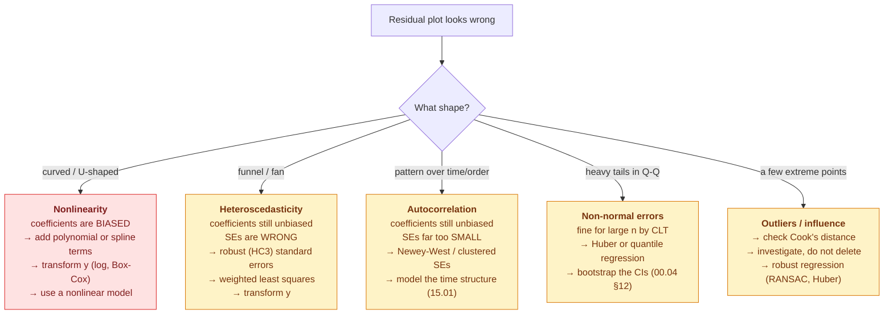

# 03.01 — Linear Regression

> **Prerequisites**: [00.01 §6-7](../../00-mathematical-foundations/01-linear-algebra/) (projection,
> least squares), [00.03 §9.4](../../00-mathematical-foundations/03-probability/) (Gaussian noise ⇔
> squared error), [00.04](../../00-mathematical-foundations/04-statistics-and-inference/) (estimators,
> confidence intervals).
> **You will be able to**: derive OLS three ways, state exactly what each assumption buys you and
> what breaks without it, compute standard errors and confidence intervals on coefficients by
> hand, and diagnose a bad regression from its residuals.

---

## Table of contents

1. [Why start here](#1-why-start-here)
2. [The model](#2-the-model)
3. [Three derivations of the same estimator](#3-three-derivations-of-the-same-estimator)
4. [How it is actually solved](#4-how-it-is-actually-solved)
5. [The five assumptions, and what each one buys](#5-the-five-assumptions-and-what-each-one-buys)
6. [Gauss-Markov: OLS is BLUE](#6-gauss-markov-ols-is-blue)
7. [Sampling distribution of the coefficients](#7-sampling-distribution-of-the-coefficients)
8. [Inference: standard errors, t-tests, confidence intervals](#8-inference-standard-errors-t-tests-confidence-intervals)
9. [R² and what it does not tell you](#9-r-and-what-it-does-not-tell-you)
10. [Diagnostics](#10-diagnostics)
11. [When assumptions break](#11-when-assumptions-break)
12. [Multicollinearity](#12-multicollinearity)
13. [Complexity and scaling](#13-complexity-and-scaling)
14. [When to use linear regression](#14-when-to-use-linear-regression)
15. [Common misconceptions](#15-common-misconceptions)

---

## 1. Why start here

Linear regression is not a warm-up. It is the model that everything else is a modification of:

| Model | What it changes |
|---|---|
| **Ridge / Lasso** | adds a penalty term ([03.02](../02-regularized-linear-models/)) |
| **Polynomial / splines / GAM** | replaces $\mathbf{x}$ with $\phi(\mathbf{x})$ ([03.03](../03-basis-expansion/)) |
| **Logistic regression** | wraps the output in a sigmoid ([03.04](../04-logistic-regression/)) |
| **GLMs** | swaps the Gaussian for another exponential-family member |
| **Kernel ridge / SVR** | works in the dual with an implicit $\phi$ ([03.07](../07-svm/)) |
| **A neural network's last layer** | *is* a linear regression on learned features |
| **Gradient boosting** | fits an additive model, each stage a least-squares step ([06.04](../../06-ensembles/04-gradient-boosting/)) |

It is also the only model in this repository with a **closed-form solution, a complete
statistical theory, and exact inference**. Everything you can prove here — unbiasedness,
efficiency, exact confidence intervals — becomes approximate or unavailable later. Learning what
those guarantees look like when you *can* have them is what lets you notice their absence.

---

## 2. The model

$$y = \mathbf{w}^{\top}\mathbf{x} + b + \varepsilon, \qquad \varepsilon\sim\mathcal{N}(0,\sigma^{2})$$

In matrix form, absorbing the intercept into $\mathbf{X}$ as a column of ones:

$$\mathbf{y} = \mathbf{X}\mathbf{w} + \boldsymbol{\varepsilon},
\qquad \mathbf{X}\in\mathbb{R}^{n\times d},\ \boldsymbol{\varepsilon}\sim\mathcal{N}(\mathbf{0},\sigma^{2}\mathbf{I})$$

**"Linear" means linear in the *parameters*, not in the features.** This is the most commonly
misunderstood word in the subject. All of these are linear models:

$$y = w_0 + w_1 x + w_2 x^{2} + w_3\log x + w_4 x_1x_2$$

because $y$ is a linear combination of *known functions* of the inputs. What would make it
nonlinear is a parameter inside a nonlinearity — $y = w_0 e^{w_1 x}$ is not a linear model.

This is why polynomial regression is still linear regression ([03.03](../03-basis-expansion/)):
you build $\phi(\mathbf{x}) = [1, x, x^{2}, \dots]$ and run OLS on it.

---

## 3. Three derivations of the same estimator

The same $\hat{\mathbf{w}}$ falls out of three completely different starting points. That
convergence is the reason to trust it.

### 3.1 Geometric — projection

Developed in full at [00.01 §7](../../00-mathematical-foundations/01-linear-algebra/). In brief:
$\mathbf{X}\mathbf{w}$ ranges over the column space of $\mathbf{X}$, a $d$-dimensional subspace of
$\mathbb{R}^{n}$. Since $n > d$, $\mathbf{y}$ generically does not lie in it, so we take the
closest point — the orthogonal projection. The defining property is that the residual is
orthogonal to every column:

$$\mathbf{X}^{\top}(\mathbf{y}-\mathbf{X}\hat{\mathbf{w}}) = \mathbf{0}
\;\Longrightarrow\; \boxed{\hat{\mathbf{w}} = (\mathbf{X}^{\top}\mathbf{X})^{-1}\mathbf{X}^{\top}\mathbf{y}}$$

### 3.2 Calculus — minimize squared error

$$J(\mathbf{w}) = \Vert \mathbf{y}-\mathbf{X}\mathbf{w}\Vert _2^{2}
= \mathbf{y}^{\top}\mathbf{y} - 2\mathbf{w}^{\top}\mathbf{X}^{\top}\mathbf{y} + \mathbf{w}^{\top}\mathbf{X}^{\top}\mathbf{X}\mathbf{w}$$

$$\nabla_{\mathbf{w}}J = -2\mathbf{X}^{\top}\mathbf{y} + 2\mathbf{X}^{\top}\mathbf{X}\mathbf{w} = \mathbf{0}$$

Same answer. And the Hessian is $\nabla^{2}J = 2\mathbf{X}^{\top}\mathbf{X}\succeq 0$, so the
objective is convex ([00.02 §6.4](../../00-mathematical-foundations/02-calculus-and-optimization/))
and this stationary point is the global minimum.

### 3.3 Probabilistic — maximum likelihood

Assume $\varepsilon_i\sim\mathcal{N}(0,\sigma^{2})$ i.i.d. Then
$y_i\sim\mathcal{N}(\mathbf{w}^{\top}\mathbf{x}_i, \sigma^{2})$ and

$$\ell(\mathbf{w}) = \sum_{i=1}^{n}\log\frac{1}{\sqrt{2\pi\sigma^{2}}}
\exp\!\left(-\frac{(y_i-\mathbf{w}^{\top}\mathbf{x}_i)^{2}}{2\sigma^{2}}\right)
= -\frac{n}{2}\log(2\pi\sigma^{2}) - \frac{1}{2\sigma^{2}}\Vert \mathbf{y}-\mathbf{X}\mathbf{w}\Vert ^{2}$$

Maximizing over $\mathbf{w}$ means minimizing $\Vert \mathbf{y}-\mathbf{X}\mathbf{w}\Vert ^{2}$ —
the same objective as §3.2.

> **This is the answer to "why squared error?"** It is not because squares are convenient. Squared
> error *is* the negative log-likelihood under Gaussian noise
> ([00.03 §9.4](../../00-mathematical-foundations/03-probability/)). If you believe your errors
> are Gaussian, least squares is forced. If you don't, it is the wrong loss — and the fix is to
> change the noise model (Laplace → MAE, Student-$t$ → robust regression), not to delete outliers.

**Also from the MLE:** $\hat{\sigma}^{2}_{\mathrm{MLE}} = \mathrm{RSS}/n$, which is biased low
(the same $(n-1)/n$ phenomenon as
[00.04 §5](../../00-mathematical-foundations/04-statistics-and-inference/), generalized). The
unbiased estimator divides by $n-d$:

$$\hat{\sigma}^{2} = \frac{\mathrm{RSS}}{n-d} = \frac{\Vert \mathbf{y}-\mathbf{X}\hat{\mathbf{w}}\Vert ^{2}}{n-d}$$

$d$ degrees of freedom were consumed fitting $d$ coefficients.

---

## 4. How it is actually solved

**Never the closed form.** From [00.01 §15.2](../../00-mathematical-foundations/01-linear-algebra/):
forming $\mathbf{X}^{\top}\mathbf{X}$ squares the condition number, so an uncomfortable
$\kappa(\mathbf{X}) = 10^{8}$ becomes a fatal $10^{16}$.

| Method | Cost | Stability | Use when |
|---|---|---|---|
| Normal equations + Cholesky | $O(nd^{2}+d^{3})$ | poor ($\kappa^{2}$) | never, except for intuition |
| **QR** | $O(nd^{2})$ | good ($\kappa$) | the standard choice |
| **SVD** | $O(nd^{2})$ | best; handles rank deficiency | $\mathbf{X}$ may be singular |
| Gradient descent | $O(nd)$/iter | fine | $n$ or $d$ too large to factor |
| Stochastic GD | $O(bd)$/iter | fine | streaming or enormous $n$ |

`sklearn.linear_model.LinearRegression` uses `scipy.linalg.lstsq` → SVD (`gelsd`). The QR route
solves $\mathbf{R}\hat{\mathbf{w}} = \mathbf{Q}^{\top}\mathbf{y}$ by back-substitution, never
forming $\mathbf{X}^{\top}\mathbf{X}$
([00.01 §8](../../00-mathematical-foundations/01-linear-algebra/)).

**When $\mathbf{X}$ is rank-deficient** ($d > n$, or duplicate features), $\mathbf{X}^{\top}\mathbf{X}$
is singular and there is no unique $\hat{\mathbf{w}}$ — an entire flat of solutions fits equally
well ([00.01 §4.2](../../00-mathematical-foundations/01-linear-algebra/)). The SVD-based
pseudoinverse silently returns the **minimum-norm** one. That is a defensible choice, but it is a
choice, and you should know it is being made for you.

---

## 5. The five assumptions, and what each one buys

Textbooks list these; few say what each is *for*. Here is the accounting:

| # | Assumption | Buys you | Cost if violated |
|---|---|---|---|
| **1** | **Linearity**: $\mathbb{E}[y\mid\mathbf{x}] = \mathbf{w}^{\top}\mathbf{x}$ | the model is correct at all | **biased** coefficients — fatal |
| **2** | **Independence**: $\varepsilon_i \perp \varepsilon_j$ | valid standard errors | SEs too small → false significance |
| **3** | **Homoscedasticity**: $\mathrm{Var}(\varepsilon_i)=\sigma^{2}$ | valid SEs; OLS is efficient | SEs wrong; OLS no longer BLUE |
| **4** | **Normality** of $\varepsilon$ | *exact* t and F inference | only matters at small $n$ (CLT) |
| **5** | **No perfect multicollinearity** | a unique solution exists | $\hat{\mathbf{w}}$ undefined |

Read the "cost" column carefully, because the assumptions are **not equally important**:

- **Violating linearity is fatal.** Your coefficients estimate the wrong thing. No amount of extra
  data helps.
- **Violating homoscedasticity or independence leaves $\hat{\mathbf{w}}$ unbiased** — the point
  estimates are still right on average. What breaks is the *standard errors*, so your p-values and
  confidence intervals lie. Fixable with robust (HC) or clustered standard errors.
- **Violating normality barely matters for large $n$.** By the CLT
  ([00.03 §12](../../00-mathematical-foundations/03-probability/)), $\hat{\mathbf{w}}$ is
  approximately Gaussian regardless. It matters at small $n$, and it matters more if the errors
  are *heavy-tailed* than if they are merely skewed.

Note what is **not** on the list: nothing requires $\mathbf{x}$ to be normally distributed, or $y$
to be normally distributed. The assumption is about the **errors**. This is a very common
misreading.

---

## 6. Gauss-Markov: OLS is BLUE

> **Theorem.** Under assumptions 1, 2, 3, and 5 (normality **not** required), OLS is the **Best
> Linear Unbiased Estimator**: among all estimators that are linear in $\mathbf{y}$ and unbiased,
> it has the smallest variance.

**Unpack each word, because all four are load-bearing:**

- **Linear** — of the form $\mathbf{A}\mathbf{y}$ for some matrix $\mathbf{A}$ not depending on
  $\mathbf{y}$. Nonlinear estimators are not covered.
- **Unbiased** — $\mathbb{E}[\hat{\mathbf{w}}] = \mathbf{w}$. **Biased estimators are not
  covered, and this is the loophole ridge regression walks through.**
- **Best** — minimum variance. In the multivariate sense:
  $\mathrm{Cov}(\tilde{\mathbf{w}}) - \mathrm{Cov}(\hat{\mathbf{w}}) \succeq 0$.
- **Estimator** — of $\mathbf{w}$, not a claim about prediction accuracy.

**Proof sketch.** Let $\tilde{\mathbf{w}} = \mathbf{A}\mathbf{y}$ be any linear unbiased
estimator, and write $\mathbf{A} = (\mathbf{X}^{\top}\mathbf{X})^{-1}\mathbf{X}^{\top} + \mathbf{D}$.
Unbiasedness for every $\mathbf{w}$ forces $\mathbf{D}\mathbf{X} = \mathbf{0}$. Then

$$\mathrm{Cov}(\tilde{\mathbf{w}}) = \sigma^{2}\mathbf{A}\mathbf{A}^{\top}
= \underbrace{\sigma^{2}(\mathbf{X}^{\top}\mathbf{X})^{-1}}_{\mathrm{Cov}(\hat{\mathbf{w}})}
+ \sigma^{2}\mathbf{D}\mathbf{D}^{\top}$$

the cross terms vanishing because $\mathbf{D}\mathbf{X} = \mathbf{0}$. Since
$\mathbf{D}\mathbf{D}^{\top}\succeq 0$, no linear unbiased estimator has smaller variance.
$\blacksquare$

> **The most important thing about Gauss-Markov is its loophole.** It says OLS is optimal *among
> unbiased* estimators. But we care about MSE, and
> MSE = bias² + variance ([00.04 §3](../../00-mathematical-foundations/04-statistics-and-inference/)).
> A **biased** estimator that cuts variance enough can beat OLS on MSE — and ridge regression is
> exactly that estimator. There is always a $\lambda > 0$ whose ridge solution has lower MSE than
> OLS. Gauss-Markov does not contradict this; it simply does not apply.
> See [03.02](../02-regularized-linear-models/).

---

## 7. Sampling distribution of the coefficients

$\hat{\mathbf{w}}$ is a random variable — a different sample gives a different estimate
([00.04 §2.1](../../00-mathematical-foundations/04-statistics-and-inference/)). Its distribution
is what all inference rests on.

**Unbiasedness:**

$$\mathbb{E}[\hat{\mathbf{w}}]
= \mathbb{E}[(\mathbf{X}^{\top}\mathbf{X})^{-1}\mathbf{X}^{\top}(\mathbf{X}\mathbf{w}+\boldsymbol{\varepsilon})]
= \mathbf{w} + (\mathbf{X}^{\top}\mathbf{X})^{-1}\mathbf{X}^{\top}\underbrace{\mathbb{E}[\boldsymbol{\varepsilon}]}_{\mathbf{0}}
= \mathbf{w}$$

**Covariance:** using $\mathrm{Cov}(\mathbf{A}\mathbf{z}) = \mathbf{A}\,\mathrm{Cov}(\mathbf{z})\,\mathbf{A}^{\top}$
with $\mathbf{A} = (\mathbf{X}^{\top}\mathbf{X})^{-1}\mathbf{X}^{\top}$ and
$\mathrm{Cov}(\boldsymbol{\varepsilon}) = \sigma^{2}\mathbf{I}$:

$$\boxed{\;\mathrm{Cov}(\hat{\mathbf{w}}) = \sigma^{2}(\mathbf{X}^{\top}\mathbf{X})^{-1}\;}$$

This one formula explains a great deal:

- **More data → smaller variance.** $\mathbf{X}^{\top}\mathbf{X}$ grows with $n$, so its inverse
  shrinks — roughly as $1/n$, giving the familiar $1/\sqrt{n}$ standard errors.
- **More feature variation → smaller variance.** A feature that barely varies contributes little
  to $\mathbf{X}^{\top}\mathbf{X}$, so its coefficient is poorly determined.
- **Correlated features → huge variance.** Near-collinearity makes
  $\mathbf{X}^{\top}\mathbf{X}$ nearly singular, so its inverse has enormous entries. **This is
  multicollinearity, and this is the formula that explains it** (§12).
- **Under normality**, $\hat{\mathbf{w}}\sim\mathcal{N}(\mathbf{w},\sigma^{2}(\mathbf{X}^{\top}\mathbf{X})^{-1})$
  exactly; without it, approximately, by the CLT.

---

## 8. Inference: standard errors, t-tests, confidence intervals

**Standard error** of coefficient $j$:

$$\mathrm{SE}(\hat{w}_j) = \hat{\sigma}\sqrt{\big[(\mathbf{X}^{\top}\mathbf{X})^{-1}\big]_{jj}},
\qquad \hat{\sigma}^{2} = \frac{\mathrm{RSS}}{n-d}$$

**t-statistic** for $H_0: w_j = 0$:

$$t_j = \frac{\hat{w}_j}{\mathrm{SE}(\hat{w}_j)} \sim t_{n-d} \quad\text{under } H_0$$

**Confidence interval:**

$$\hat{w}_j \pm t_{n-d,\,\alpha/2}\cdot\mathrm{SE}(\hat{w}_j)$$

The $t$ distribution rather than the normal because $\sigma$ was estimated, not known — exactly
the correction of
[00.04 §8.2](../../00-mathematical-foundations/04-statistics-and-inference/). It matters below
$n-d \approx 30$ and is negligible above.

> ⚠️ **Everything in this section assumes the model was specified *before* seeing the data.** If
> you selected features by looking at p-values, ran stepwise selection, or tried several
> specifications and reported the best, these p-values are invalid — that is the multiple
> comparisons problem of
> [00.04 §11](../../00-mathematical-foundations/04-statistics-and-inference/), and it is
> pervasive in applied regression. Post-selection inference is a research area precisely because
> the naive fix does not work.

**F-test** for the whole model, $H_0: w_1=\dots=w_{d-1}=0$:

$$F = \frac{(\mathrm{TSS}-\mathrm{RSS})/(d-1)}{\mathrm{RSS}/(n-d)} \sim F_{d-1,\,n-d}$$

---

## 9. R² and what it does not tell you

$$R^{2} = 1 - \frac{\mathrm{RSS}}{\mathrm{TSS}}
= 1 - \frac{\sum_i (y_i-\hat{y}_i)^{2}}{\sum_i (y_i-\bar{y})^{2}}$$

"The fraction of variance in $y$ explained by the model." Four things it does not tell you:

**1. $R^{2}$ never decreases when you add a feature — even a random one.** Adding a column can
only expand the column space, so the projection can only get closer
([00.01 §6](../../00-mathematical-foundations/01-linear-algebra/)). With $d = n$ you get
$R^{2} = 1$ exactly, fitting pure noise perfectly. Experiment 3 measures this.

**Adjusted $R^{2}$** penalizes the parameter count:

$$R^{2}_{\text{adj}} = 1 - \frac{\mathrm{RSS}/(n-d)}{\mathrm{TSS}/(n-1)}
= 1 - (1-R^{2})\frac{n-1}{n-d}$$

which *can* decrease, and does when a feature earns less than its degree of freedom.

**2. A high $R^{2}$ does not mean the model is correct.** Anscombe's quartet is four datasets with
identical $R^2$, identical coefficients, identical standard errors — and wildly different shapes,
only one of which a line describes. Always plot the residuals (§10).

**3. A low $R^{2}$ does not mean the model is useless.** If the phenomenon is genuinely noisy
(individual stock returns, human behaviour), $R^{2} = 0.05$ may be all there is to get — and may
be extremely valuable. $R^{2}$ is bounded above by $1 - \sigma^{2}/\mathrm{Var}(y)$, which is a
property of the world, not of your model.

**4. $R^{2}$ is a *training* metric.** On the training set it measures fit, not generalization.
Report it on held-out data or it tells you nothing about prediction
([05.02](../../05-model-evaluation/02-regression-metrics/)).

---

## 10. Diagnostics

Fitting is the easy part. These five plots are the job:

| Plot | Looking for | Bad sign |
|---|---|---|
| Residuals vs fitted | linearity, homoscedasticity | curvature (nonlinearity); a funnel shape (heteroscedasticity) |
| Q-Q plot of residuals | normality | S-curve (skew); heavy tails at the ends |
| Scale-location ($\sqrt{\lvert\text{std resid}\rvert}$ vs fitted) | homoscedasticity | any upward trend |
| Residuals vs leverage | influential points | points beyond Cook's distance contours |
| Residuals vs order/time | independence | any visible pattern or autocorrelation |

### 10.1 Leverage

The hat matrix $\mathbf{H} = \mathbf{X}(\mathbf{X}^{\top}\mathbf{X})^{-1}\mathbf{X}^{\top}$ maps
$\mathbf{y}\mapsto\hat{\mathbf{y}}$
([00.01 §7](../../00-mathematical-foundations/01-linear-algebra/)). Its diagonal
$h_{ii} = \partial\hat{y}_i/\partial y_i$ is the **leverage** of point $i$: how much that point
pulls its own fitted value.

$$0 \le h_{ii}\le 1, \qquad \sum_i h_{ii} = \mathrm{tr}(\mathbf{H}) = d$$

So average leverage is $d/n$; a common flag is $h_{ii} > 2d/n$. **High leverage means unusual in
$\mathbf{X}$** — far from the centroid of the predictors — and says nothing about $y$.

### 10.2 Cook's distance

Leverage alone is not influence: a high-leverage point that happens to sit on the line changes
nothing. Cook's distance combines leverage with residual size — how much would the *whole fit*
move if point $i$ were deleted?

$$D_i = \frac{r_i^{2}}{d\,\hat{\sigma}^{2}}\cdot\frac{h_{ii}}{(1-h_{ii})^{2}}$$

$D_i > 1$, or $D_i > 4/n$, is worth investigating. **Never delete a point because $D_i$ is
large** — investigate it. It is often a data-entry error, a different population, or the most
informative observation you have.

---

## 11. When assumptions break

The colour coding is the point: **only nonlinearity biases the coefficients.** The others corrupt
your *uncertainty estimates* while leaving the point estimates valid — serious, but a different
kind of serious, and fixable without changing the model.

### 11.1 Omitted-variable bias is conditional, and usually stated wrongly

"If the true relationship is nonlinear, your coefficients are biased" is the standard claim. It is
not quite right, and the correction is useful.

Suppose the truth is $y = w_0 + w_1 x + w_2 x^{2} + \varepsilon$ and you fit only $y \sim x$. The
bias in $\hat{w}_1$ is

$$\mathrm{Bias}(\hat{w}_1) = w_2 \cdot \frac{\mathrm{Cov}(x, x^{2})}{\mathrm{Var}(x)}$$

— the effect of the omitted term, times its regression on the included one. So:

| $x$ distribution | $\mathrm{Cov}(x, x^{2}) = \mathbb{E}[x^{3}]$ | Bias in $\hat{w}_1$ |
|---|---|---|
| symmetric about 0 (e.g. $\mathcal{N}(0,1)$) | **0** | **none** — the slope is unbiased |
| asymmetric (e.g. $\mathrm{Uniform}(0,3)$) | $\ne 0$ | **large** |

Experiment 4 in [`from_scratch.py`](from_scratch.py) measures both: with symmetric $x$ the slope
comes out unbiased to 0.003 despite the model being badly misspecified; with asymmetric $x$ the
bias is **4.50** and confidence-interval coverage is **0%**.

The general statement is: **an omitted variable biases your coefficients only insofar as it
correlates with the variables you kept.** This is why controlling for a confounder matters and
controlling for an unrelated variable does not, and it is the mechanism behind every
causal-inference argument about which covariates must be included.

Note also that in the symmetric case the coefficient is fine but the *standard errors* are still
wrong (coverage 66%), because the omitted signal inflates the residual variance. Misspecification
that does not bias you can still mislead you.

---

## 12. Multicollinearity

When features are highly correlated, $\mathbf{X}^{\top}\mathbf{X}$ is nearly singular and
$\mathrm{Cov}(\hat{\mathbf{w}}) = \sigma^{2}(\mathbf{X}^{\top}\mathbf{X})^{-1}$ explodes (§7).

**Variance inflation factor** for feature $j$:

$$\mathrm{VIF}_j = \frac{1}{1-R_j^{2}}$$

where $R_j^{2}$ is from regressing $x_j$ on all the *other* features. It measures how much
$\mathrm{Var}(\hat{w}_j)$ is inflated relative to an orthogonal design.

| VIF | $R_j^{2}$ | Interpretation |
|---|---|---|
| 1 | 0 | uncorrelated with the others |
| 5 | 0.80 | SE is $\sqrt5 = 2.2\times$ larger |
| 10 | 0.90 | commonly used threshold |
| 100 | 0.99 | severe |

**Symptoms:** huge coefficients with opposite signs on correlated features; a significant F-test
with no significant individual t-tests; coefficients that swing wildly when you add or drop a row.

**What it does and does not break:**

- ✅ **Predictions are fine.** The fitted values $\hat{\mathbf{y}}$ are the projection of
  $\mathbf{y}$ onto the column space, and near-collinearity does not move that subspace much.
- ❌ **Coefficients are meaningless individually.** They are unstable and un-interpretable.

> **So the fix depends entirely on your goal.** If you are predicting, multicollinearity is
> mostly harmless — leave it. If you are interpreting, it is fatal, and you need ridge (which
> stabilizes by shrinking, [03.02](../02-regularized-linear-models/)), PCA regression, dropping
> features, or collecting data that breaks the correlation.

---

## 13. Complexity and scaling

| Operation | Time | Memory |
|---|---|---|
| Fit (QR or SVD) | $O(nd^{2})$ | $O(nd)$ |
| Fit (normal equations) | $O(nd^{2}+d^{3})$ | $O(d^{2})$ |
| Fit (SGD, $k$ epochs) | $O(knd)$ | $O(d)$ |
| Predict | $O(d)$ per example | $O(d)$ |

For $d$ in the thousands, direct factorization is fine. For $d$ in the millions (text features),
use SGD or a sparse solver. Note prediction is $O(d)$ regardless — **linear models are extremely
cheap at inference time**, which is why they persist in latency-critical systems long after more
accurate models exist.

---

## 14. When to use linear regression

**Use it when:**
- You need to **explain**, not just predict. Coefficients are directly interpretable: "one unit of
  $x_j$ is associated with $w_j$ units of $y$, holding the others fixed."
- You need **inference** — confidence intervals, hypothesis tests, uncertainty on effects.
- Data is small relative to features; complex models will overfit.
- Latency or interpretability is a hard requirement (credit scoring, clinical models, anything
  regulated).
- **As a baseline.** Always. A gradient-boosted model that cannot beat OLS is telling you
  something.

**Don't use it when:**
- The relationship is genuinely nonlinear and you don't know the right basis.
- Interactions matter and there are too many to specify by hand.
- You have many more features than examples (use ridge/lasso).
- Pure predictive accuracy is the only goal and you have plenty of data — gradient boosting or a
  network will usually win.

---

## 15. Common misconceptions

**"Linear regression assumes the data is linear."**
It assumes $\mathbb{E}[y\mid\mathbf{x}]$ is linear **in the parameters**. $y = w_0+w_1x+w_2x^{2}$
is a linear model (§2).

**"It assumes $x$ and $y$ are normally distributed."**
Neither. The assumption is on the **errors**, and only for exact small-sample inference (§5).

**"A high $R^{2}$ means a good model."**
Anscombe's quartet. Plot the residuals (§9).

**"Adding features can't hurt — $R^{2}$ went up."**
$R^{2}$ *always* goes up. That is what makes it useless for model selection (§9).

**"Multicollinearity ruins the model."**
It ruins coefficient interpretation. Predictions are essentially unaffected (§12).

**"OLS is the best estimator, by Gauss-Markov."**
Best **linear unbiased** estimator. Ridge is biased and often has lower MSE (§6).

**"The p-values tell me which features matter."**
Only if the model was specified before seeing the data. After any selection, they are invalid
(§8).

**"Outliers should be removed."**
Investigate them. A high-influence point is often the most informative observation you have
(§10.2).

**"I should use the normal equations — there's a closed form."**
There is, and you should not compute it that way (§4).

---

## Files in this chapter

| File | Contents |
|---|---|
| [`from_scratch.py`](from_scratch.py) | `LinearRegression` with four solvers (normal equations, QR, SVD, gradient descent), full inference — standard errors, t-statistics, p-values, confidence intervals, F-test, $R^{2}$/adjusted $R^{2}$ — plus leverage, Cook's distance, and VIF. Verified against sklearn and statsmodels |
| [`exercises.md`](exercises.md) | Derivation, implementation, and interview questions |
| [`references.md`](references.md) | Exact sections used |

**Next**: [03.02 — Regularized Linear Models](../02-regularized-linear-models/) walks through the
Gauss-Markov loophole.
