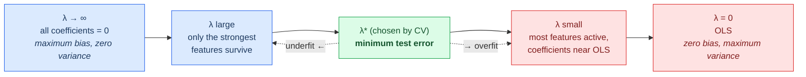
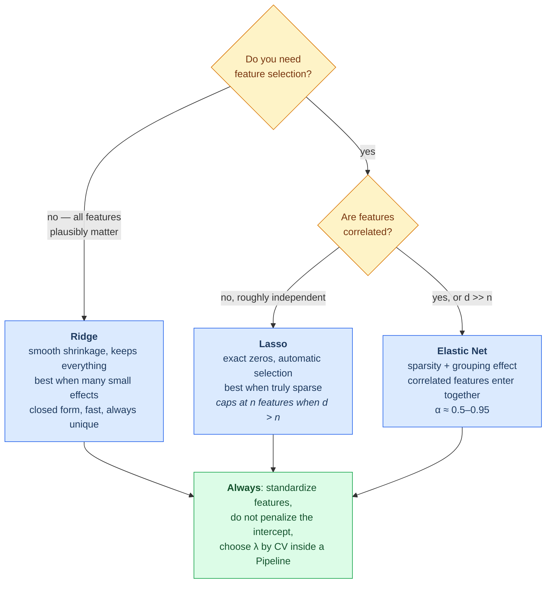

# 03.02 — Regularized Linear Models: Ridge, Lasso, Elastic Net

> **Prerequisites**: [03.01](../01-linear-regression/) throughout;
> [00.01 §5.2, §12-13](../../00-mathematical-foundations/01-linear-algebra/) (norms, SVD),
> [00.02 §15](../../00-mathematical-foundations/02-calculus-and-optimization/) (subgradients,
> proximal operators), [00.03 §7.4](../../00-mathematical-foundations/03-probability/)
> (regularization as a prior).
> **You will be able to**: explain why a biased estimator can beat OLS, derive why $\ell_1$
> produces exact zeros three separate ways, implement coordinate descent for Lasso, and pick
> $\lambda$ defensibly.

---

## Table of contents

1. [The problem regularization solves](#1-the-problem-regularization-solves)
2. [Ridge regression](#2-ridge-regression)
3. [Ridge through the SVD](#3-ridge-through-the-svd)
4. [Effective degrees of freedom](#4-effective-degrees-of-freedom)
5. [Lasso](#5-lasso)
6. [Why $\ell_1$ gives exact zeros — three arguments](#6-why-ell_1-gives-exact-zeros--three-arguments)
7. [Solving Lasso: coordinate descent](#7-solving-lasso-coordinate-descent)
8. [Elastic Net](#8-elastic-net)
9. [The Bayesian view](#9-the-bayesian-view)
10. [Standardization is not optional](#10-standardization-is-not-optional)
11. [Choosing λ](#11-choosing-λ)
12. [The regularization path](#12-the-regularization-path)
13. [Which one to use](#13-which-one-to-use)
14. [Common misconceptions](#14-common-misconceptions)

---

## 1. The problem regularization solves

[03.01 §6](../01-linear-regression/) ended on a loophole. Gauss-Markov says OLS is the best
**unbiased** linear estimator. But we do not care about unbiasedness — we care about being close,
and

$$\mathrm{MSE} = \mathrm{Bias}^{2} + \mathrm{Variance}$$

([00.04 §3](../../00-mathematical-foundations/04-statistics-and-inference/)). If accepting a
little bias buys a large reduction in variance, MSE improves and the estimator is simply better.

**When is OLS variance a problem?** From
$\mathrm{Cov}(\hat{\mathbf{w}}) = \sigma^{2}(\mathbf{X}^{\top}\mathbf{X})^{-1}$
([03.01 §7](../01-linear-regression/)):

| Situation | What happens |
|---|---|
| $d$ close to $n$ | few degrees of freedom left; variance explodes |
| $d > n$ | $\mathbf{X}^{\top}\mathbf{X}$ singular; **no unique solution at all** |
| correlated features | near-singular; coefficient variance enormous |
| noisy targets | $\sigma^{2}$ large, and variance scales with it |

All four are the normal situation in modern data. Regularization is the fix, and it is one idea
applied three ways:

$$\hat{\mathbf{w}} = \arg\min_{\mathbf{w}} \underbrace{\Vert \mathbf{y}-\mathbf{X}\mathbf{w}\Vert _2^{2}}_{\text{fit}}
+ \underbrace{\lambda\,\Omega(\mathbf{w})}_{\text{penalty}}$$

| Method | $\Omega(\mathbf{w})$ | Effect |
|---|---|---|
| **Ridge** | $\Vert \mathbf{w}\Vert _2^{2}$ | shrinks all coefficients smoothly toward 0 |
| **Lasso** | $\Vert \mathbf{w}\Vert _1$ | shrinks *and* sets some **exactly** to 0 |
| **Elastic Net** | $\alpha\Vert \mathbf{w}\Vert _1 + \frac{1-\alpha}{2}\Vert \mathbf{w}\Vert _2^{2}$ | both |

---

## 2. Ridge regression

$$J(\mathbf{w}) = \Vert \mathbf{y}-\mathbf{X}\mathbf{w}\Vert _2^{2} + \lambda\Vert \mathbf{w}\Vert _2^{2}$$

**Closed form.** Differentiate and set to zero:

$$\nabla J = -2\mathbf{X}^{\top}(\mathbf{y}-\mathbf{X}\mathbf{w}) + 2\lambda\mathbf{w} = \mathbf{0}$$

$$\boxed{\;\hat{\mathbf{w}}_{\text{ridge}} = (\mathbf{X}^{\top}\mathbf{X}+\lambda\mathbf{I})^{-1}\mathbf{X}^{\top}\mathbf{y}\;}$$

### 2.1 Three things this buys immediately

**1. It always has a unique solution.** $\mathbf{X}^{\top}\mathbf{X}$ is PSD with eigenvalues
$\lambda_i \ge 0$; adding $\lambda\mathbf{I}$ makes them $\lambda_i + \lambda > 0$
([00.01 §11.2](../../00-mathematical-foundations/01-linear-algebra/)). The matrix is strictly
positive definite, hence invertible — **even when $d > n$, even with duplicate columns**. OLS has
no unique answer there; ridge always does.

**2. It improves conditioning.**

$$\kappa(\mathbf{X}^{\top}\mathbf{X}+\lambda\mathbf{I}) = \frac{\sigma_1^{2}+\lambda}{\sigma_r^{2}+\lambda}
\;<\; \frac{\sigma_1^{2}}{\sigma_r^{2}} = \kappa(\mathbf{X}^{\top}\mathbf{X})$$

strictly, for any $\lambda>0$. The numerical problem gets easier, not just the statistical one.

**3. It is strongly convex.** $\nabla^{2}J = 2(\mathbf{X}^{\top}\mathbf{X}+\lambda\mathbf{I})\succeq 2\lambda\mathbf{I}$,
so the objective is $2\lambda$-strongly convex
([00.02 §6.5](../../00-mathematical-foundations/02-calculus-and-optimization/)) and gradient
methods converge linearly.

**One formula, three unrelated benefits** — statistical (lower MSE), numerical (better
conditioning), and optimization (faster convergence). That is unusual and worth noticing.

> ⚠️ **Do not penalize the intercept.** $\lambda\Vert \mathbf{w}\Vert ^{2}$ must exclude $w_0$.
> Shrinking the intercept toward zero makes the fit depend on where you happened to put the origin
> of $y$ — add 1000 to every target and a model with a penalized intercept gives different
> predictions. In practice: center $y$ and the features, fit without an intercept, then recover
> $\hat{b} = \bar{y} - \hat{\mathbf{w}}^{\top}\bar{\mathbf{x}}$.

---

## 3. Ridge through the SVD

This is where ridge stops being "add a penalty" and starts being comprehensible.

Take $\mathbf{X} = \mathbf{U}\boldsymbol{\Sigma}\mathbf{V}^{\top}$
([00.01 §12](../../00-mathematical-foundations/01-linear-algebra/)). Substituting and simplifying:

$$\hat{\mathbf{w}}_{\text{OLS}} = \sum_{i=1}^{r}\frac{1}{\sigma_i}(\mathbf{u}_i^{\top}\mathbf{y})\,\mathbf{v}_i
\qquad
\hat{\mathbf{w}}_{\text{ridge}} = \sum_{i=1}^{r}\frac{\sigma_i}{\sigma_i^{2}+\lambda}(\mathbf{u}_i^{\top}\mathbf{y})\,\mathbf{v}_i$$

Compare the fitted values:

$$\hat{\mathbf{y}}_{\text{ridge}} = \sum_{i=1}^{r}\underbrace{\frac{\sigma_i^{2}}{\sigma_i^{2}+\lambda}}_{\text{shrinkage factor}}(\mathbf{u}_i^{\top}\mathbf{y})\,\mathbf{u}_i$$

**Ridge shrinks each principal direction by $\sigma_i^{2}/(\sigma_i^{2}+\lambda)$**, and the
factor depends on $\sigma_i$:

| Direction | $\sigma_i$ | Shrinkage factor | Effect |
|---|---|---|---|
| high variance in the data | $\sigma_i^{2}\gg\lambda$ | ≈ 1 | barely touched |
| low variance | $\sigma_i^{2}\approx\lambda$ | ≈ 0.5 | halved |
| near-null direction | $\sigma_i^{2}\ll\lambda$ | ≈ 0 | almost erased |

> **This is the statistical content of ridge, and it is a genuinely good idea.** Directions in
> which the data barely varies are directions in which the coefficient is poorly determined —
> $\mathrm{Var}(\hat{w}_i) \propto 1/\sigma_i^{2}$ is huge there. Ridge shrinks *exactly those*
> directions hardest, and leaves the well-determined ones alone. It is not indiscriminate
> shrinkage; it is shrinkage proportional to how little you know.

It also explains why ridge is the natural fix for multicollinearity: collinearity *means* small
$\sigma_i$, and those are precisely the directions ridge damps.

---

## 4. Effective degrees of freedom

For OLS, degrees of freedom = $d$ = $\mathrm{tr}(\mathbf{H})$
([03.01 §10.1](../01-linear-regression/)). For ridge the hat matrix is
$\mathbf{H}_\lambda = \mathbf{X}(\mathbf{X}^{\top}\mathbf{X}+\lambda\mathbf{I})^{-1}\mathbf{X}^{\top}$, giving

$$\mathrm{df}(\lambda) = \mathrm{tr}(\mathbf{H}_\lambda) = \sum_{i=1}^{r}\frac{\sigma_i^{2}}{\sigma_i^{2}+\lambda}$$

— the sum of the shrinkage factors. It decreases smoothly from $d$ (at $\lambda=0$) to $0$ (as
$\lambda\to\infty$).

**This is what "regularization reduces model complexity" means quantitatively.** A ridge model
with $d = 100$ features and $\lambda$ tuned might have $\mathrm{df} = 12$ — it *behaves* like a
12-parameter model. That number is what goes into AIC/BIC, and it is why regularized models with
enormous nominal feature counts do not overfit the way the raw count suggests.

---

## 5. Lasso

$$J(\mathbf{w}) = \Vert \mathbf{y}-\mathbf{X}\mathbf{w}\Vert _2^{2} + \lambda\Vert \mathbf{w}\Vert _1$$

**There is no closed form.** $\Vert \mathbf{w}\Vert _1$ is not differentiable at zero — exactly
where the interesting solutions live. The objective is still convex (a sum of convex functions,
[00.02 §6.5](../../00-mathematical-foundations/02-calculus-and-optimization/)), so it has a global
minimum; it just cannot be written down.

What we get in exchange is **sparsity**: many coefficients become *exactly* zero, so Lasso does
feature selection and fitting in one step.

---

## 6. Why $\ell_1$ gives exact zeros — three arguments

This is the central fact of the chapter and deserves more than one explanation.

### 6.1 Geometric — the ball has corners

Write the problem in constrained form (equivalent by Lagrange duality,
[00.02 §13](../../00-mathematical-foundations/02-calculus-and-optimization/)):

$$\min_{\mathbf{w}}\Vert \mathbf{y}-\mathbf{X}\mathbf{w}\Vert ^{2}
\quad\text{s.t.}\quad \Vert \mathbf{w}\Vert _1 \le t$$

The solution is where the elliptical loss contours first touch the constraint ball. The $\ell_1$
ball is a **diamond, with corners on the axes** — and a corner on axis $j$ is a point where every
*other* coordinate is exactly zero. A randomly oriented ellipse is far more likely to first touch
a pointy corner than a flat face. The $\ell_2$ ball is round: no corners, so the touch point
generically has all coordinates nonzero but small.

### 6.2 Analytic — the subdifferential has width

At $w_j = 0$, the subdifferential of $\lambda|w_j|$ is the whole **interval** $[-\lambda,\lambda]$
([00.02 §15](../../00-mathematical-foundations/02-calculus-and-optimization/)). The optimality
condition $0\in\partial J$ can therefore be satisfied *for a whole range of data configurations* —
whenever the correlation between feature $j$ and the residual is smaller than $\lambda$, zero is
optimal and stays optimal.

For $\ell_2$, the derivative at zero is a single point $\{0\}$, so this cannot happen: the
condition pins down one exact value, which is generically nonzero.

### 6.3 Algorithmic — the proximal operator clamps

The proximal operator of $\lambda\Vert \cdot\Vert _1$ is **soft thresholding**:

$$S_{\lambda}(v) = \mathrm{sign}(v)\max(|v|-\lambda,\ 0)$$

Shrink toward zero by $\lambda$, and **clamp to exactly zero if that would cross**. For $\ell_2$
the prox is $v/(1+\lambda)$ — a pure rescaling, which is zero only if $v$ already was.

These are three views of one fact, and each is the useful one in a different context: the geometry
for intuition, the subdifferential for proofs, the prox for code. All three are demonstrated
numerically in [`from_scratch.py`](from_scratch.py).

---

## 7. Solving Lasso: coordinate descent

The trick: **the one-dimensional problem has a closed form even though the $d$-dimensional one
does not.** So cycle through coordinates, solving each exactly with the others held fixed.

Fix all coefficients but $w_j$. Let $\mathbf{r}^{(-j)} = \mathbf{y} - \sum_{k\ne j}\mathbf{x}_k w_k$
be the partial residual. The objective in $w_j$ alone is

$$\Vert \mathbf{r}^{(-j)} - \mathbf{x}_j w_j\Vert ^{2} + \lambda|w_j|$$

whose minimizer is soft thresholding applied to the OLS solution of that 1-D problem:

$$\boxed{\;w_j \leftarrow \frac{S_{\lambda/2}\big(\mathbf{x}_j^{\top}\mathbf{r}^{(-j)}\big)}{\mathbf{x}_j^{\top}\mathbf{x}_j}\;}$$

Cycle until convergence. Because the objective is convex and separable in its non-smooth part,
coordinate descent provably converges to the global optimum — which is *not* true for
coordinate descent in general.

**Why this is the algorithm everyone uses:**

- Each update is $O(n)$; a full sweep is $O(nd)$.
- Once a coefficient is zero it usually stays zero, so **active-set** tracking skips most
  coordinates.
- Warm starts along a $\lambda$ path make computing the whole path barely more expensive than one
  fit.

`sklearn.linear_model.Lasso` uses exactly this (in Cython). The alternatives are **LARS**, which
computes the exact piecewise-linear path, and **ISTA/FISTA**, proximal gradient methods
([00.02 §15](../../00-mathematical-foundations/02-calculus-and-optimization/)).

---

## 8. Elastic Net

$$J(\mathbf{w}) = \Vert \mathbf{y}-\mathbf{X}\mathbf{w}\Vert ^{2}
+ \lambda\left(\alpha\Vert \mathbf{w}\Vert _1 + \frac{1-\alpha}{2}\Vert \mathbf{w}\Vert _2^{2}\right)$$

It exists because Lasso has two specific failures:

1. **With $d > n$, Lasso selects at most $n$ features.** A hard structural cap, from the geometry
   of the solution path. If 500 features genuinely matter and you have 100 samples, Lasso cannot
   say so.
2. **With correlated features, Lasso picks one arbitrarily and zeroes the rest.** Which one is
   essentially decided by noise — rerun on a resampled dataset and you get a different feature.
   That is unstable and, if you are interpreting the model, actively misleading.

Elastic Net's $\ell_2$ term fixes both: it removes the $n$-feature cap, and it induces a
**grouping effect** — correlated features get similar coefficients and enter or leave together,
which is usually what you actually want.

$\alpha = 1$ is Lasso, $\alpha = 0$ is ridge. In practice $\alpha \in [0.5, 0.95]$ is a good
default when you want sparsity but have correlated features (genomics, text, sensor arrays).

### 8.1 How correlated is "correlated"? Higher than you think

Failure 2 is stated so often that it has become a reflex — "my features are correlated, so I
can't use Lasso." Experiment 5 in [`from_scratch.py`](from_scratch.py) measures where it actually
starts to bite, by sweeping the correlation between three equally-predictive features:

| Pairwise $r$ | Lasso keeps | Elastic Net keeps |
|---|---|---|
| 0.80 | **3.00 / 3** | 3.00 / 3 |
| 0.96 | **3.00 / 3** | 3.00 / 3 |
| 0.99 | 2.90 / 3 | 3.00 / 3 |
| 0.9975 | 2.60 / 3 | 3.00 / 3 |
| **0.9996** | **1.70 / 3** | 3.00 / 3 |

At $r = 0.96$ Lasso keeps every member of the group, every time. The arbitrary-selection problem
only appears once features are **near-duplicates** ($r > 0.999$).

So the accurate statement is: **Lasso selects arbitrarily among features that are nearly
indistinguishable, not among features that are merely correlated.** That is still a genuine
problem — linked genetic markers, redundant sensor channels, near-synonymous n-grams all live in
that regime — but correlation of 0.7 is not a reason to abandon Lasso, and treating it as one is
a common overcorrection.

---

## 9. The Bayesian view

From [00.03 §7.4](../../00-mathematical-foundations/03-probability/): MAP estimation is
$\arg\max[\log p(\mathcal{D}\mid\mathbf{w}) + \log p(\mathbf{w})]$, and with Gaussian likelihood
the first term is $-\Vert \mathbf{y}-\mathbf{X}\mathbf{w}\Vert ^{2}/(2\sigma^{2})$.

| Prior on $\mathbf{w}$ | $-\log p(\mathbf{w})$ | Penalty | Method |
|---|---|---|---|
| $\mathcal{N}(0,\tau^{2}\mathbf{I})$ | $\Vert \mathbf{w}\Vert _2^{2}/(2\tau^{2})$ | $\ell_2$ | **Ridge**, $\lambda = \sigma^{2}/\tau^{2}$ |
| $\mathrm{Laplace}(0,b)$ | $\Vert \mathbf{w}\Vert _1/b$ | $\ell_1$ | **Lasso**, $\lambda = 2\sigma^{2}/b$ |
| Gaussian × Laplace | both | both | **Elastic Net** |

This is not an analogy — it is the same optimization problem. And it explains the sparsity
difference from a fourth angle: the Laplace density has a **spike at zero** (its peak is a kink,
not a smooth maximum), so it puts substantial prior mass exactly at zero. The Gaussian is smooth
at zero and puts zero mass on any single point.

It also tells you what $\lambda$ *means*: $\lambda = \sigma^{2}/\tau^{2}$ is the ratio of noise
variance to prior variance. Large $\lambda$ = "the data is noisy relative to how much I expect
the coefficients to vary."

> ⚠️ **MAP is not the full posterior.** The Lasso MAP estimate is sparse; the posterior *mean*
> under a Laplace prior is **not** sparse. Bayesian sparsity needs spike-and-slab or horseshoe
> priors. "Lasso is Bayesian" is true only at the level of the point estimate.

---

## 10. Standardization is not optional

The penalty $\lambda\sum_j w_j^{2}$ treats every coefficient identically. But if $x_1$ is in
metres and $x_2$ in kilometres, the coefficient on $x_2$ must be 1000× larger to express the same
relationship — so it is penalized $10^{6}$ times as hard.

**The penalty is therefore not scale-invariant, and unstandardized features make $\lambda$
meaningless.** Always:

$$x_j \leftarrow \frac{x_j - \bar{x}_j}{s_j}$$

before fitting, and fit the intercept unpenalized on centred data.

This is *not* required for OLS — plain least squares is equivariant under feature scaling, and
rescaling a feature just rescales its coefficient. It becomes mandatory the moment you add a
penalty. Experiment 4 in [`from_scratch.py`](from_scratch.py) measures how badly it goes wrong.

⚠️ **Standardize inside the cross-validation fold**, using the training fold's mean and standard
deviation only. Computing them on the full dataset leaks test information — the classic subtle
leak of [02.06](../../02-data/06-data-leakage/). Use `Pipeline(StandardScaler(), Ridge())`.

---

## 11. Choosing λ

**Cross-validation** ([05.04](../../05-model-evaluation/04-cross-validation/)) over a
logarithmically spaced grid — $\lambda$ acts multiplicatively, so a linear grid wastes most of its
points.

**The one-standard-error rule.** Rather than the $\lambda$ with the lowest CV error, take the
**largest** $\lambda$ whose CV error is within one standard error of the minimum. The CV curve is
typically flat near its optimum, so the difference in error is negligible while the model is
meaningfully simpler and more stable. This is the default in `glmnet` and is generally the better
choice for interpretation.

**Efficient shortcuts:**

- **`RidgeCV` with generalized cross-validation** computes leave-one-out CV in closed form from the
  SVD, at the cost of *one* fit rather than $n$.
- **`LassoCV` with warm starts** along the path: each $\lambda$ starts from the previous solution,
  making the whole path roughly the cost of a few fits.

---

## 12. The regularization path

The path traces $\hat{\mathbf{w}}(\lambda)$ as $\lambda$ varies from $\infty$ (all zero) down to 0
(OLS).

The **Lasso path is piecewise linear** in $\lambda$ — a fact exploited by the LARS algorithm to
compute the entire path exactly, in the time of a single OLS fit. The **ridge path is smooth**,
with every coefficient shrinking continuously and none ever reaching zero.

Reading a path plot is the fastest way to understand a dataset: features whose coefficients
survive to large $\lambda$ are the robust ones; features that flip sign along the path are
entangled with others.

---

## 13. Which one to use

| | Ridge | Lasso | Elastic Net |
|---|---|---|---|
| Closed form | ✅ | ❌ | ❌ |
| Exact zeros | ❌ | ✅ | ✅ |
| Handles $d>n$ | ✅ | ✅ (≤ $n$ features) | ✅ |
| Correlated features | shares weight | picks one arbitrarily | groups them |
| Solution unique | always | not if features are duplicated | always ($\alpha<1$) |
| Best when | many small effects | few large effects | sparse + correlated |

**A useful prior belief**: ridge tends to win when the truth is "everything matters a little"
(most social-science and biological data); lasso wins when the truth is "a few things matter a
lot" (well-designed experiments, some genomics). If you do not know, elastic net with $\alpha$
cross-validated is a defensible default.

---

## 14. Common misconceptions

**"Regularization always improves the model."**
It improves MSE when variance dominates. On plentiful, clean, low-dimensional data, $\lambda = 0$
can genuinely be optimal.

**"Ridge does feature selection."**
It shrinks coefficients toward zero but never *to* zero. Every feature stays in the model (§6).

**"Lasso selects the *right* features."**
It selects *a* sufficient set. With correlated features it picks one arbitrarily, and which one is
noise-dependent (§8). Do not read a Lasso zero as "this feature is irrelevant."

**"A larger $\lambda$ is safer."**
It is a bias-variance trade in both directions. Too large and you underfit badly (§12).

**"You can compare $\lambda$ values across datasets."**
$\lambda$ is scale-dependent — on the features *and* on $n$ and $\sigma^{2}$. Different libraries
also parameterize it differently (sklearn's `alpha` vs `glmnet`'s $\lambda$ vs whether the loss is
divided by $n$). Always re-tune.

**"Standardization is a nice-to-have."**
Without it, the penalty is applied in arbitrary units and $\lambda$ means nothing (§10).

**"Ridge and Lasso are just two options among many."**
They are the MAP estimates under Gaussian and Laplace priors respectively (§9). The choice is a
statement about what you believe the coefficients look like.

**"Regularized coefficients can be interpreted like OLS coefficients."**
They are deliberately biased toward zero. Their magnitudes are not unbiased effect estimates, and
the standard errors from [03.01 §8](../01-linear-regression/) do not apply. Post-selection
inference is genuinely hard.

---

## Files in this chapter

| File | Contents |
|---|---|
| [`from_scratch.py`](from_scratch.py) | Ridge (closed-form and SVD), Lasso (coordinate descent and ISTA), Elastic Net, soft thresholding, regularization paths, and cross-validated $\lambda$ selection with the one-standard-error rule. Verified against sklearn |
| [`exercises.md`](exercises.md) | Derivation, implementation, and interview questions |
| [`references.md`](references.md) | Exact sections used |

**Previous**: [03.01 — Linear Regression](../01-linear-regression/) ·
**Next**: [03.03 — Basis Expansion](../03-basis-expansion/)
