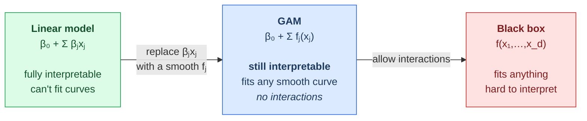

# 03.03 — Basis Expansion: Polynomials, Splines, and GAMs

> **Prerequisites**: [03.01](../01-linear-regression/) and [03.02](../02-regularized-linear-models/).
> **You will be able to**: explain why high-degree polynomials are almost always the wrong answer,
> build a natural cubic spline basis by hand, say what a smoothing spline's $\lambda$ actually
> controls, and fit an interpretable nonlinear model with a GAM.

---

## Table of contents

1. [Nonlinearity without leaving linear models](#1-nonlinearity-without-leaving-linear-models)
2. [Polynomial regression, and why it fails](#2-polynomial-regression-and-why-it-fails)
3. [The Runge phenomenon](#3-the-runge-phenomenon)
4. [Piecewise polynomials and continuity](#4-piecewise-polynomials-and-continuity)
5. [Regression splines](#5-regression-splines)
6. [B-splines](#6-b-splines)
7. [Natural cubic splines](#7-natural-cubic-splines)
8. [Smoothing splines](#8-smoothing-splines)
9. [Choosing knots and smoothness](#9-choosing-knots-and-smoothness)
10. [Generalized additive models](#10-generalized-additive-models)
11. [Other bases](#11-other-bases)
12. [The connection to kernels and neural networks](#12-the-connection-to-kernels-and-neural-networks)
13. [When to use what](#13-when-to-use-what)
14. [Common misconceptions](#14-common-misconceptions)

---

## 1. Nonlinearity without leaving linear models

From [03.01 §2](../01-linear-regression/): "linear" means linear in the **parameters**. So

$$f(x) = \sum_{m=1}^{M} w_m\,\phi_m(x)$$

is a linear model for *any* fixed functions $\phi_m$ — and everything from
[03.01](../01-linear-regression/) and [03.02](../02-regularized-linear-models/) carries over
unchanged: the closed form, the standard errors, ridge, Lasso, all of it. You transform
$\mathbf{X}\mapsto\boldsymbol{\Phi}$ and run the same machinery.

**The entire design question is: which $\phi_m$?**

| Basis | $\phi_m(x)$ | Character |
|---|---|---|
| Polynomial | $x^{m}$ | **global** — every coefficient affects every point |
| Piecewise constant | $\mathbb{1}[c_{m}\le x < c_{m+1}]$ | local, discontinuous |
| Regression spline | truncated powers / B-splines | **local**, smooth |
| Radial basis | $\exp(-\gamma\Vert x-c_m\Vert ^{2})$ | local, smooth, needs centres |
| Fourier | $\sin(mx), \cos(mx)$ | global, ideal for periodic data |
| Wavelet | scaled/shifted mother wavelet | multi-resolution, good for spikes |

The word doing the work is **local vs global**, and §2-§3 are about why that distinction decides
everything.

---

## 2. Polynomial regression, and why it fails

$$f(x) = w_0 + w_1x + w_2x^{2} + \dots + w_px^{p}$$

It is the first thing everyone reaches for, and it has four serious problems.

**1. It is global.** Every basis function $x^{m}$ is nonzero almost everywhere, so **moving one
data point changes the fit everywhere**, including far away. A spline moves only locally.

**2. It oscillates wildly at the boundaries.** This is the Runge phenomenon, and it is severe
enough to deserve §3.

**3. It extrapolates catastrophically.** Outside the data range, $x^{p}$ dominates and the fit
shoots to $\pm\infty$. A degree-10 polynomial fitted on $[0,1]$ can predict $10^{6}$ at $x=2$.

**4. The design matrix is horribly conditioned.** The columns $[1, x, x^{2}, \dots, x^{p}]$ become
nearly collinear as $p$ grows — the Vandermonde matrix is a standard example of an ill-conditioned
matrix, with $\kappa$ growing exponentially in $p$. By $p = 15$ you have lost all precision in
float64 ([00.01 §15](../../00-mathematical-foundations/01-linear-algebra/)).

> **Problem 4 has a partial fix worth knowing**: use an **orthogonal polynomial basis** (Legendre,
> Chebyshev, or `numpy.polynomial.legendre`) instead of raw powers. Orthogonal columns give
> $\kappa = 1$, and the fitted function is identical — only the parameterization changes. R's
> `poly()` does this by default, which is why polynomial regression is better behaved in R than in
> a naive NumPy implementation. It fixes the *numerics* but not problems 1-3, which are about the
> function class, not the arithmetic.

**Practical rule: degree ≤ 3, or use splines.** Degrees above 3-4 are essentially never the right
answer.

---

## 3. The Runge phenomenon

Interpolate $f(x) = \frac{1}{1+25x^{2}}$ on $[-1,1]$ at equally spaced points with a degree-$n$
polynomial. As $n$ increases, the error at the **centre** shrinks — and the error near the
**edges** grows without bound.

$$\lim_{n\to\infty}\ \max_{x\in[-1,1]}\big|f(x) - p_n(x)\big| = \infty$$

More data makes it worse. This is not a numerical artifact; it is a property of high-degree
polynomial interpolation on equally spaced points, and it is why polynomial interpolation is
essentially abandoned in numerical analysis.

**Two things fix it**, and knowing which is which matters:

- **Chebyshev nodes** — sample more densely near the boundaries, at
  $x_k = \cos\!\left(\frac{2k+1}{2n+2}\pi\right)$. This fixes interpolation *if you control where
  the data is sampled*. In machine learning you usually do not.
- **Splines** — keep the degree low (3) and add more *pieces* instead. This is the fix available
  when the data is given to you, and it is why splines won.

Experiment 1 in [`from_scratch.py`](from_scratch.py) measures both: the divergence of the
polynomial at the edges, and the fact that a cubic spline's error keeps falling as you add knots.

---

## 4. Piecewise polynomials and continuity

Split the range at **knots** $\xi_1 < \dots < \xi_K$ and fit a separate low-degree polynomial on
each interval. Low degree keeps the numerics sane; separate pieces give locality.

Raw piecewise polynomials are discontinuous at the knots, which is rarely what you want. Impose
continuity conditions:

| Constraint | Result | Free parameters (cubic, $K$ knots) |
|---|---|---|
| none | discontinuous jumps | $4(K+1)$ |
| $f$ continuous | connected but kinked | $3K+4$ |
| $f, f'$ continuous | smooth-looking, curvature jumps | $2K+4$ |
| **$f, f', f''$ continuous** | **cubic spline** | $K+4$ |

**A cubic spline is the sweet spot**, and the reason is perceptual as much as mathematical:
continuity of $f''$ is the point at which the human eye stops detecting the knot. Going further
(matching $f'''$) would force all the pieces to be the *same* cubic, collapsing back to global
polynomial regression.

Each constraint removes one parameter per knot: $4(K+1) - 3K = K+4$.

---

## 5. Regression splines

### 5.1 The truncated power basis

The simplest basis for a cubic spline with knots $\xi_1,\dots,\xi_K$:

$$\{1,\ x,\ x^{2},\ x^{3},\ (x-\xi_1)_+^{3},\ \dots,\ (x-\xi_K)_+^{3}\}$$

where $(z)_+ = \max(z,0)$. That is $K+4$ functions, matching the parameter count above.

**Why it works.** $(x-\xi)_+^{3}$ is identically zero to the left of $\xi$, and its first and
second derivatives are also zero at $\xi$. So adding it changes nothing before the knot, and
introduces exactly one new degree of freedom in the third derivative after it — precisely the
$C^{2}$-continuous cubic spline condition.

**Why nobody uses it.** The columns are appallingly conditioned — $(x-\xi)_+^{3}$ for nearby knots
are nearly identical. It is the right basis for *understanding* and the wrong one for *computing*,
the same relationship the normal equations have to least squares
([03.01 §4](../01-linear-regression/)).

---

## 6. B-splines

B-splines span the identical function space with a numerically excellent basis. The defining
property: **each B-spline is nonzero on only $d+2$ adjacent knot intervals.**

Built by the **Cox-de Boor recursion**:

$$B_{i,0}(x) = \mathbb{1}[t_i \le x < t_{i+1}]$$

$$B_{i,d}(x) = \frac{x-t_i}{t_{i+d}-t_i}B_{i,d-1}(x) + \frac{t_{i+d+1}-x}{t_{i+d+1}-t_{i+1}}B_{i+1,d-1}(x)$$

Consequences of compact support:

- The design matrix is **banded**, so fitting is $O(n)$ rather than $O(nK^{2})$.
- Excellent conditioning — no near-duplicate columns.
- Numerically **local**: changing one coefficient moves the curve only in its own neighbourhood.

Every serious implementation (`scipy.interpolate.BSpline`, R's `splines::bs`, `patsy.bs`) uses
these.

---

## 7. Natural cubic splines

Cubic splines still misbehave **outside** the boundary knots, where they extrapolate as cubics and
have wildly inflated variance at the edges — the same disease as polynomials, in milder form.

A **natural** cubic spline adds two constraints: $f''(x) = 0$ beyond each boundary knot, forcing
the function to be **linear** outside the data range.

$$\text{df} = K + 4 - 4 = K$$

Four parameters spent (two constraints at each boundary), leaving $K$ — one per knot.

> **This is almost always the right choice.** You buy dramatically lower variance at the edges,
> where you have least data and most need it, at the cost of an assumption — linearity outside the
> range — that is far more defensible than the cubic explosion it replaces. Experiment 3 measures
> the difference: at 20% beyond the data range, an unconstrained cubic spline's prediction is off
> by orders of magnitude while the natural spline degrades gracefully.

---

## 8. Smoothing splines

A different formulation entirely. Instead of choosing knots, put a knot at **every** unique $x_i$
and control complexity with a penalty:

$$\min_{f}\ \sum_{i=1}^{n}\big(y_i - f(x_i)\big)^{2} + \lambda\int f''(t)^{2}\,dt$$

The penalty measures total curvature: $\lambda=0$ gives an interpolating function,
$\lambda\to\infty$ forces $f''=0$ everywhere, i.e. a straight line — **ordinary least squares**.

**The remarkable theorem**: although the minimization is over *all* twice-differentiable
functions — an infinite-dimensional space — the unique solution is a **natural cubic spline with
knots at the unique $x_i$**. An infinite-dimensional problem with a finite-dimensional answer.

Given that, the solution is linear in $\mathbf{y}$:

$$\hat{\mathbf{f}} = (\mathbf{I}+\lambda\boldsymbol{\Omega})^{-1}\mathbf{y} = \mathbf{S}_\lambda\mathbf{y}$$

with $\boldsymbol{\Omega}$ the roughness-penalty matrix. Note the shape: this is **exactly ridge
regression in a spline basis** ([03.02 §2](../02-regularized-linear-models/)), and the effective
degrees of freedom follow the same rule:

$$\mathrm{df}(\lambda) = \mathrm{tr}(\mathbf{S}_\lambda)$$

**In practice you specify `df`, not `λ`.** "Fit a smoothing spline with 5 effective degrees of
freedom" is interpretable; "λ = 0.0037" is not, and does not transfer between datasets. Libraries
solve for the $\lambda$ that yields the requested df.

---

## 9. Choosing knots and smoothness

**How many knots?** Fewer than you think. Place them at quantiles of $x$ so each region has
comparable data, and let the *number* be the tuning parameter.

| df | Behaviour |
|---|---|
| 2 | a straight line |
| 3-5 | gentle curvature — usually enough |
| 6-10 | flexible |
| > 15 | almost certainly overfitting |

**Where to place them?** At quantiles, not uniformly. Uniform spacing puts knots in empty regions,
where the fit is unconstrained and the variance explodes.

**How to choose df?** Cross-validation ([05.04](../../05-model-evaluation/04-cross-validation/)),
or for smoothing splines, **generalized cross-validation**, which exploits the linearity of
$\mathbf{S}_\lambda$ to compute leave-one-out error in closed form:

$$\mathrm{GCV}(\lambda) = \frac{1}{n}\sum_{i=1}^{n}\left(\frac{y_i-\hat{f}(x_i)}{1-\mathrm{tr}(\mathbf{S}_\lambda)/n}\right)^{2}$$

One fit instead of $n$ — the same trick that makes `RidgeCV` cheap
([03.02 §11](../02-regularized-linear-models/)).

---

## 10. Generalized additive models

For $d$ features, a full nonlinear model would need interactions in every combination — the curse
of dimensionality. GAMs make a structural assumption instead:

$$g\big(\mathbb{E}[y\mid\mathbf{x}]\big) = \beta_0 + f_1(x_1) + f_2(x_2) + \dots + f_d(x_d)$$

Each feature gets its own smooth function; the functions **add**. With $g$ the identity this is
additive regression; with $g$ the logit it is additive logistic regression, and so on for any GLM
link.

**Fitted by backfitting** — the natural coordinate-descent analogue
([03.02 §7](../02-regularized-linear-models/)):

1. Initialize $\hat{f}_j = 0$, $\hat{\beta}_0 = \bar{y}$.
2. Cycle over $j$: fit a smoother to the **partial residual**
   $r^{(-j)} = y - \hat{\beta}_0 - \sum_{k\ne j}\hat{f}_k(x_k)$ against $x_j$.
3. Centre each $\hat{f}_j$ (they are only identified up to a constant, which the intercept
   absorbs).
4. Repeat until convergence.

### Why GAMs matter

**A GAM keeps the thing that makes linear models valuable — you can plot each $f_j$ and read off
exactly what the model believes about that feature — while dropping the linearity assumption.**
It sits at a genuinely useful point on the interpretability/flexibility curve, and it is why GAMs
persist in credit scoring, clinical risk models, and epidemiology, where "why did the model say
that?" is a regulatory requirement.

The limitation is right there in the formula: **no interactions**. If the effect of $x_1$ depends
on $x_2$, a GAM cannot express it. You can add specific interaction terms $f_{jk}(x_j,x_k)$, but
choosing which is back to manual feature engineering — and that is exactly the gap gradient
boosting and neural networks fill by finding interactions automatically.

**Explainable Boosting Machines** (`interpret`) are the modern version: a GAM fitted by boosting,
with optional pairwise interactions, competitive with gradient boosting on tabular data while
remaining plottable. See [17.01](../../17-explainable-ai/01-intrinsic/).

---

## 11. Other bases

**Radial basis functions.** $\phi_m(x) = \exp(-\gamma\Vert x-c_m\Vert ^{2})$ — local bumps at
centres $c_m$. Natural in multiple dimensions where splines get awkward. Choosing centres is the
hard part (often k-means, [04.01](../../04-unsupervised-learning/01-kmeans/)).

**Fourier basis.** $\{1, \sin(mx), \cos(mx)\}$ — the right choice for genuinely **periodic** data
(seasonality, audio, angles). Global, like polynomials, but the globality is appropriate when the
phenomenon is.

**Wavelets.** Localized in both position and frequency, so they handle functions with sharp local
features (edges, spikes) far better than Fourier. Multi-resolution by construction.

**Rule of thumb**: match the basis to the structure you believe is there. Periodic → Fourier.
Smooth and arbitrary → splines. Spiky → wavelets. Unknown, high-dimensional → let a tree or a
network find it.

---

## 12. The connection to kernels and neural networks

Basis expansion has an obvious limit: you must choose $\phi$ in advance, and the number of basis
functions explodes in high dimensions (all degree-2 interactions of 1,000 features is 500,000
terms). Two escapes:

**Kernels** — never form $\phi$ at all. If your algorithm depends on the data only through inner
products $\phi(\mathbf{x}_i)^{\top}\phi(\mathbf{x}_j)$, replace them with a kernel
$k(\mathbf{x}_i,\mathbf{x}_j)$ and work in an implicitly infinite-dimensional basis at finite
cost. This is only visible in the dual
([00.02 §14](../../00-mathematical-foundations/02-calculus-and-optimization/)), and it is the
subject of [03.07](../07-svm/). Notably, **a smoothing spline is exactly kernel ridge regression**
with a particular kernel.

**Neural networks** — **learn** $\phi$ instead of choosing it. A network is
$f(\mathbf{x}) = \mathbf{w}^{\top}\phi_{\boldsymbol\theta}(\mathbf{x})$ where the basis itself is
parameterized and fitted. The final layer is a linear model; everything before it is a learned
basis expansion.

> **This is the cleanest way to understand what deep learning added.** Basis expansion, kernels,
> and neural networks are three answers to one question — where does $\phi$ come from? You pick
> it, you avoid it, or you learn it. See [07.01](../../07-deep-learning/01-neural-network-basics/).

---

## 13. When to use what

| Situation | Use |
|---|---|
| One feature, smooth relationship | **natural cubic spline**, df 4-6 |
| One feature, want automatic smoothness | **smoothing spline** with GCV |
| Several features, need interpretability | **GAM** |
| Known periodicity | **Fourier** basis |
| Mild curvature, want simplicity | **degree-2 or 3 polynomial** (orthogonal basis) |
| Many features, interactions matter | **gradient boosting** ([06.04](../../06-ensembles/04-gradient-boosting/)) or a network |
| High dimensions, few samples | **kernel methods** ([03.07](../07-svm/)) |

**Do not** use a degree-10 polynomial. There is no situation in which it is the right answer.

---

## 14. Common misconceptions

**"Polynomial regression is nonlinear regression."**
It is a *linear model* in a polynomial basis. All of [03.01](../01-linear-regression/) applies
unchanged (§1).

**"Higher-degree polynomials fit better."**
They fit the *training* data better and behave catastrophically at the edges and outside the range
(§2-§3). More data makes Runge worse, not better.

**"Splines are complicated."**
A cubic spline is piecewise cubic with matching first and second derivatives. That is the whole
definition (§4).

**"More knots = more overfitting."**
For *regression* splines, yes. For *smoothing* splines the knot count is fixed at $n$ and
complexity is controlled entirely by $\lambda$ — adding data does not add flexibility (§8).

**"Natural splines are less flexible, so they're worse."**
They are less flexible *only outside the boundary knots*, where flexibility is pure variance.
Inside the data range they are equally flexible (§7).

**"GAMs are just linear models."**
They are additive in *arbitrary smooth functions* of each feature. That is a much larger model
class — it just excludes interactions (§10).

**"I'll use a spline per feature, so I'll capture everything."**
Additive models cannot represent interactions, no matter how flexible each $f_j$ is (§10).

**"Effective degrees of freedom is a heuristic."**
It is $\mathrm{tr}(\mathbf{S}_\lambda)$ — exactly the same quantity as
$\mathrm{tr}(\mathbf{H})$ for OLS ([03.01 §10.1](../01-linear-regression/)), and it goes into
AIC/BIC as such (§8).

---

## Files in this chapter

| File | Contents |
|---|---|
| [`from_scratch.py`](from_scratch.py) | Polynomial and orthogonal-polynomial bases, truncated power basis, B-splines by Cox-de Boor recursion, natural cubic splines, smoothing splines with GCV, and a GAM fitted by backfitting — plus experiments on Runge, extrapolation, and effective degrees of freedom |
| [`exercises.md`](exercises.md) | Derivation, implementation, and interview questions |
| [`references.md`](references.md) | Exact sections used |

**Previous**: [03.02 — Regularized Linear Models](../02-regularized-linear-models/) ·
**Next**: [03.04 — Logistic Regression](../04-logistic-regression/)
