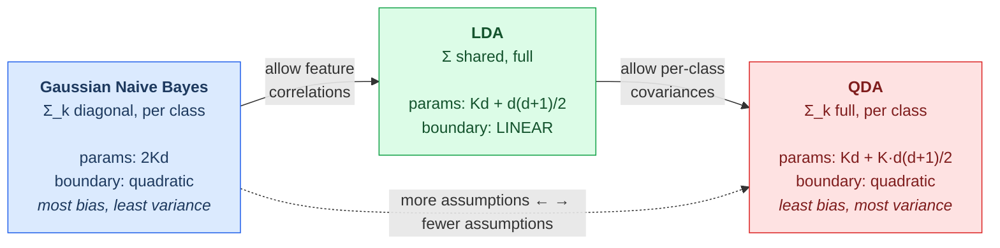

# 03.05 — Generative Classifiers: Naive Bayes, LDA, QDA

> **Prerequisites**: [00.03 §5-§9](../../00-mathematical-foundations/03-probability/) (Bayes,
> conditional independence, the multivariate Gaussian); [03.04](../04-logistic-regression/) for
> the discriminative comparison.
> **You will be able to**: explain why naive Bayes works despite an assumption that is almost
> always false, derive LDA's linear boundary from a Gaussian assumption, place NB/LDA/QDA on a
> single covariance spectrum, and say when a generative model beats a discriminative one.

---

## Table of contents

1. [Two ways to build a classifier](#1-two-ways-to-build-a-classifier)
2. [The Bayes optimal classifier](#2-the-bayes-optimal-classifier)
3. [Naive Bayes](#3-naive-bayes)
4. [Smoothing](#4-smoothing)
5. [Why naive Bayes works anyway](#5-why-naive-bayes-works-anyway)
6. [Why its probabilities are terrible](#6-why-its-probabilities-are-terrible)
7. [Linear discriminant analysis](#7-linear-discriminant-analysis)
8. [Quadratic discriminant analysis](#8-quadratic-discriminant-analysis)
9. [One spectrum: NB, LDA, QDA](#9-one-spectrum-nb-lda-qda)
10. [LDA and logistic regression give the same form — and different answers](#10-lda-and-logistic-regression-give-the-same-form--and-different-answers)
11. [LDA for dimensionality reduction](#11-lda-for-dimensionality-reduction)
12. [Generative vs discriminative: the sample-complexity tradeoff](#12-generative-vs-discriminative-the-sample-complexity-tradeoff)
13. [When to use what](#13-when-to-use-what)
14. [Common misconceptions](#14-common-misconceptions)

---

## 1. Two ways to build a classifier

$$
\begin{aligned}
\textbf{Discriminative:}&\quad \text{model } p(y\mid\mathbf{x}) \text{ directly}\\
\textbf{Generative:}&\quad \text{model } p(\mathbf{x}\mid y) \text{ and } p(y),\ \text{then apply Bayes}
\end{aligned}
$$

| | Discriminative | Generative |
|---|---|---|
| Learns | the boundary | how each class *generates* data |
| Examples | logistic regression, SVM, trees, networks | naive Bayes, LDA, QDA, GMMs, HMMs |
| Can generate new data | ❌ | ✅ |
| Handles missing features | poorly | naturally (marginalize) |
| Assumptions | few | many, and often wrong |
| Asymptotic accuracy | usually better | limited by the assumptions |
| Small-sample behaviour | worse | **often better** (§12) |
| Detects outliers | no | yes — $p(\mathbf{x})$ is low |

**The tradeoff in one sentence**: a generative model solves a harder problem than it needs to —
modelling all of $p(\mathbf{x}\mid y)$ when only the boundary matters — and gets, in exchange,
lower variance, a natural treatment of missing data, and the ability to say "this input is
unlike anything I trained on."

---

## 2. The Bayes optimal classifier

If you knew the true $p(y\mid\mathbf{x})$, the rule minimizing error rate is

$$\hat{y} = \arg\max_k\ p(y=k\mid\mathbf{x})
= \arg\max_k\ \underbrace{p(\mathbf{x}\mid y=k)}_{\text{likelihood}}\ \underbrace{p(y=k)}_{\text{prior}}$$

(the evidence $p(\mathbf{x})$ is common to all classes and drops out). Its error rate — the
**Bayes error** — is the floor no classifier can beat. It is nonzero whenever the class
distributions overlap, and it is the classification counterpart of the irreducible $H(p)$ in
[00.05 §7.1](../../00-mathematical-foundations/05-information-theory/).

Every generative classifier is an attempt to estimate the two factors:

| Model | Assumption about $p(\mathbf{x}\mid y=k)$ |
|---|---|
| **Naive Bayes** | features independent given the class |
| **LDA** | Gaussian, with the **same** covariance for every class |
| **QDA** | Gaussian, with a **different** covariance per class |
| **GMM per class** | a mixture of Gaussians per class |

They differ only in how much structure they are willing to assume — which is exactly a
bias-variance choice (§9).

---

## 3. Naive Bayes

The parameter problem: modelling $p(\mathbf{x}\mid y)$ over $d$ binary features needs $2^{d}-1$
parameters per class. At $d=30$ that is a billion. Hopeless.

**The naive assumption**: features are conditionally independent given the class
([00.03 §6](../../00-mathematical-foundations/03-probability/)):

$$p(\mathbf{x}\mid y=k) = \prod_{j=1}^{d} p(x_j\mid y=k)$$

Parameters drop from exponential to **linear** in $d$. The classifier becomes

$$\hat{y} = \arg\max_k\ \left[\log p(y=k) + \sum_{j=1}^{d}\log p(x_j\mid y=k)\right]$$

⚠️ Note the **logs**. Multiplying hundreds of probabilities underflows to zero
([00.06 §5](../../00-mathematical-foundations/06-numerical-methods/)); every real implementation
sums logs.

### 3.1 Variants

| Variant | $p(x_j\mid y)$ | For |
|---|---|---|
| **Gaussian NB** | $\mathcal{N}(\mu_{jk},\sigma_{jk}^{2})$ | continuous features |
| **Multinomial NB** | categorical over counts | word counts, TF-IDF |
| **Bernoulli NB** | $\mathrm{Bern}(\theta_{jk})$ | binary presence/absence |
| **Categorical NB** | categorical | unordered categorical features |

Multinomial NB on bag-of-words was the standard text classifier for two decades, and it remains a
serious baseline — fast to train, trivial to update, and surprisingly hard to beat on small
datasets.

---

## 4. Smoothing

If a word never appears in class $k$ in training, $\hat{p}(x_j\mid y=k) = 0$, and one zero
annihilates the entire product — the class is ruled out no matter what the other 999 features say.
This is the MLE overfitting a small sample, exactly as in
[00.04 §4.1](../../00-mathematical-foundations/04-statistics-and-inference/).

**Laplace (add-$\alpha$) smoothing:**

$$\hat{p}(x_j = v\mid y=k) = \frac{N_{jvk}+\alpha}{N_k + \alpha V}$$

$\alpha=1$ is Laplace smoothing; $\alpha<1$ is Lidstone.

> **This is not a hack — it is a Beta/Dirichlet prior.** From
> [00.03 §8.1](../../00-mathematical-foundations/03-probability/), the posterior mean under a
> $\mathrm{Beta}(\alpha,\alpha)$ prior is exactly this expression. $\alpha$ is a **pseudo-count**:
> "before seeing data, act as though you had observed $\alpha$ of each outcome." Smoothing is MAP
> estimation, and sklearn's `alpha=1.0` default is a prior you are using whether or not you chose
> it.

---

## 5. Why naive Bayes works anyway

The independence assumption is essentially always false. In text, "New" and "York" are wildly
dependent given any class. Yet naive Bayes classifies well. Why?

**Because classification needs the argmax to be right, not the probabilities.**

Suppose the true posterior is $p(y=1\mid\mathbf{x}) = 0.6$ and NB, having double-counted
correlated evidence, estimates $0.95$. The probability is badly wrong. The **decision is
identical** — both exceed 0.5.

Formally (Domingos & Pazzani, 1997): naive Bayes is optimal whenever the *sign* of its
discriminant matches the true one, which is a far weaker condition than estimating the posterior
correctly. It holds over a large region of the space of dependencies — including many where the
independence assumption is violently violated.

The failure mode is specific: **NB degrades when dependence between features differs across
classes** in a way that flips the argmax. Mere correlation is not enough. Experiment 1 measures
where the boundary is.

---

## 6. Why its probabilities are terrible

The same double-counting that leaves the argmax intact destroys the probabilities.

If features $x_1$ and $x_2$ are duplicates, NB multiplies the same evidence twice. With $m$
correlated features it multiplies it $m$ times, and the log-odds are inflated by roughly a factor
of $m$. Push that through a sigmoid and you get probabilities pinned at 0 and 1.

> **So naive Bayes is a decent classifier and a terrible probability estimator.** Never use its
> `predict_proba` for expected-value decisions, thresholds tuned to costs, or as a feature in a
> downstream model — without calibrating it first
> ([05.06](../../05-model-evaluation/06-calibration/)). Experiment 2 shows the probabilities
> collapsing to the extremes as correlated features are added, while accuracy holds.

---

## 7. Linear discriminant analysis

Assume each class is Gaussian with a **shared** covariance:

$$p(\mathbf{x}\mid y=k) = \mathcal{N}(\boldsymbol{\mu}_k,\boldsymbol{\Sigma})$$

Take logs of the Bayes rule:

$$\log p(y=k\mid\mathbf{x}) = -\tfrac12(\mathbf{x}-\boldsymbol{\mu}_k)^{\top}\boldsymbol{\Sigma}^{-1}(\mathbf{x}-\boldsymbol{\mu}_k) + \log\pi_k + \text{const}$$

Expand the quadratic form. The term $\mathbf{x}^{\top}\boldsymbol{\Sigma}^{-1}\mathbf{x}$ is
**the same for every class** — because $\boldsymbol{\Sigma}$ is shared — so it cancels in the
comparison. What survives is linear in $\mathbf{x}$:

$$\boxed{\;\delta_k(\mathbf{x}) = \mathbf{x}^{\top}\boldsymbol{\Sigma}^{-1}\boldsymbol{\mu}_k
- \tfrac12\boldsymbol{\mu}_k^{\top}\boldsymbol{\Sigma}^{-1}\boldsymbol{\mu}_k + \log\pi_k\;}$$

$$\hat{y} = \arg\max_k \delta_k(\mathbf{x})$$

**The shared covariance is exactly what makes the boundary linear.** That is the whole content of
the "L" in LDA, and it is worth being able to reproduce this cancellation on demand.

Parameter estimates are the obvious ones — class means, class priors, and a **pooled** covariance:

$$\hat{\boldsymbol{\Sigma}} = \frac{1}{n-K}\sum_{k}\sum_{i:y_i=k}(\mathbf{x}_i-\hat{\boldsymbol{\mu}}_k)(\mathbf{x}_i-\hat{\boldsymbol{\mu}}_k)^{\top}$$

---

## 8. Quadratic discriminant analysis

Drop the shared-covariance assumption: $p(\mathbf{x}\mid y=k) = \mathcal{N}(\boldsymbol{\mu}_k,\boldsymbol{\Sigma}_k)$.

Now $\mathbf{x}^{\top}\boldsymbol{\Sigma}_k^{-1}\mathbf{x}$ **does** depend on $k$ and does not
cancel:

$$\delta_k(\mathbf{x}) = -\tfrac12\log|\boldsymbol{\Sigma}_k|
-\tfrac12(\mathbf{x}-\boldsymbol{\mu}_k)^{\top}\boldsymbol{\Sigma}_k^{-1}(\mathbf{x}-\boldsymbol{\mu}_k)
+ \log\pi_k$$

The boundary is **quadratic** — ellipses, parabolas, hyperbolas.

**The cost is parameters.** LDA estimates one $d\times d$ covariance; QDA estimates $K$ of them:

| | Covariance parameters |
|---|---|
| LDA | $d(d+1)/2$ |
| QDA | $K\cdot d(d+1)/2$ |

At $d=50$, $K=3$: 1,275 vs 3,825. With few samples per class, QDA's covariance estimates are
noisy or outright singular, and it loses to LDA despite being the more correct model. This is a
bias-variance trade in its purest form.

**Regularized discriminant analysis** interpolates:
$\hat{\boldsymbol{\Sigma}}_k(\gamma) = \gamma\hat{\boldsymbol{\Sigma}}_k + (1-\gamma)\hat{\boldsymbol{\Sigma}}_{\text{pooled}}$,
with $\gamma$ chosen by cross-validation. `sklearn`'s `shrinkage` parameter does something similar
(Ledoit-Wolf shrinkage toward a diagonal).

---

## 9. One spectrum: NB, LDA, QDA

All three are Gaussian generative classifiers. They differ **only** in what they assume about the
covariance:

| | Covariance | Shared? | Boundary | Parameters |
|---|---|---|---|---|
| **Gaussian NB** | diagonal | no | quadratic | $2Kd$ |
| **Diagonal LDA** | diagonal | yes | linear | $Kd+d$ |
| **LDA** | full | yes | linear | $Kd + d(d+1)/2$ |
| **QDA** | full | no | quadratic | $Kd + K\,d(d+1)/2$ |

> **Reading the table is the point of the chapter.** Gaussian naive Bayes is *not* a different
> family from LDA — it is LDA with the covariance forced diagonal and unshared. Choosing among
> them is choosing where to sit on a bias-variance curve, and the right choice depends entirely
> on $n$ relative to $d^{2}$.

Rule of thumb: **QDA needs roughly $n_k \gg d^{2}/2$ per class** to estimate its covariances
reliably. Below that, prefer LDA; well below that, prefer naive Bayes.

---

## 10. LDA and logistic regression give the same form — and different answers

From §7, LDA's log-odds for two classes is

$$\log\frac{p(y=1\mid\mathbf{x})}{p(y=0\mid\mathbf{x})}
= \mathbf{x}^{\top}\boldsymbol{\Sigma}^{-1}(\boldsymbol{\mu}_1-\boldsymbol{\mu}_0) + \text{const}$$

**This is exactly logistic regression's functional form** — linear in the log-odds
([03.04 §2.1](../04-logistic-regression/)). Same model class, same hypothesis space.

**But they are fitted completely differently:**

| | LDA | Logistic regression |
|---|---|---|
| Maximizes | the **joint** likelihood $p(\mathbf{x},y)$ | the **conditional** likelihood $p(y\mid\mathbf{x})$ |
| Uses | class means and pooled covariance | iterative optimization on the boundary |
| Assumes | Gaussian classes, equal covariance | nothing about $p(\mathbf{x})$ |
| If Gaussian holds | **more efficient** (~30% less data for the same error) | slightly worse |
| If Gaussian fails | biased | still consistent |
| Outliers | pull the class means | largely ignored (§03.04 Exp. 1) |
| Perfect separation | fine | **diverges** ([03.04 §9](../04-logistic-regression/)) |

That last row is a genuine practical advantage of LDA that gets forgotten: it has a closed form
and never fails to produce an answer.

> **The general principle** (Efron 1975): when the generative assumptions hold, the generative
> method is *statistically more efficient*, because it extracts information from $p(\mathbf{x})$
> that the discriminative method throws away. When they fail, the discriminative method is more
> *robust*, because it never made the claim. §12 measures this.

---

## 11. LDA for dimensionality reduction

LDA has a second life as a **supervised** projection. Fisher's criterion: find the direction
$\mathbf{w}$ maximizing between-class separation relative to within-class spread:

$$J(\mathbf{w}) = \frac{\mathbf{w}^{\top}\mathbf{S}_B\mathbf{w}}{\mathbf{w}^{\top}\mathbf{S}_W\mathbf{w}}$$

with $\mathbf{S}_B$ the between-class scatter and $\mathbf{S}_W$ the within-class scatter. The
solution is the top eigenvector of $\mathbf{S}_W^{-1}\mathbf{S}_B$, and the general solution gives
at most $K-1$ useful directions ($\mathbf{S}_B$ has rank $\le K-1$).

**LDA vs PCA** ([04.06](../../04-unsupervised-learning/06-linear-dim-reduction/)):

| | PCA | LDA |
|---|---|---|
| Uses labels | ❌ unsupervised | ✅ supervised |
| Maximizes | total variance | class separation |
| Components | up to $d$ | at most $K-1$ |

PCA finds the directions the data varies in; LDA finds the directions the *classes* differ in.
They can be orthogonal — the highest-variance direction may carry no class information at all,
which is why PCA-then-classify sometimes discards exactly the signal you needed.

---

## 12. Generative vs discriminative: the sample-complexity tradeoff

The classic result (Ng & Jordan, 2001):

> **Naive Bayes converges to its (higher) asymptotic error at rate $O(\log d/n)$, while logistic
> regression converges to its (lower) asymptotic error at rate $O(d/n)$.**

Read the consequence carefully — it is one of the few genuinely actionable asymptotic results in
ML:

- **Small $n$**: naive Bayes is *better*, despite its false assumption, because it has far fewer
  effective parameters and therefore much lower variance.
- **Large $n$**: logistic regression overtakes it and wins, because NB's bias is a floor it cannot
  get below.
- **There is a crossover point**, and it scales roughly with $d$.

### 12.1 The popular version is too strong

"Naive Bayes wins at small $n$" is the folklore. Experiment 4 sweeps **both** axes — sample size
and how badly the independence assumption is violated — and the picture is narrower. Each cell is
(NB accuracy − logistic accuracy), $d = 20$:

| within-class $\rho$ | $n=20$ | $n=50$ | $n=100$ | $n=300$ | $n=1000$ | $n=5000$ |
|---|---|---|---|---|---|---|
| **0.0** | +0.009 | **+0.051** | +0.024 | +0.007 | +0.001 | +0.000 |
| **0.2** | −0.020 | **+0.012** | +0.012 | +0.000 | −0.001 | −0.001 |
| **0.5** | −0.083 | −0.085 | −0.051 | −0.021 | −0.012 | −0.004 |
| **0.8** | −0.217 | −0.221 | −0.169 | −0.080 | −0.026 | −0.007 |

**Reading down** shows the real dependency: NB's advantage is destroyed by violating its
assumption, not restored by shrinking $n$. At $\rho = 0.8$ it loses at *every* sample size, and by
a wide margin.

**Reading across** shows the Ng & Jordan effect: from $n=50$ rightward, every row decays toward
zero as logistic regression pays down its $O(d/n)$ variance. Only the $\rho = 0.2$ row shows a
genuine crossover — ahead in the middle of the range, behind at both ends.

> **So the rule is not "use naive Bayes when $n$ is small."** It is: **use it when $n$ is small
> *and* the features are close to conditionally independent given the class.** That combination
> describes bag-of-words text with a small labelled set — which is precisely where naive Bayes
> survived for two decades, and largely nowhere else.

*(The $n=20$ column is anomalous because with $d=20$ unregularized logistic regression sits at its
interpolation threshold. A small demonstration of why sklearn regularizes by default,
[03.04 §10](../04-logistic-regression/).)*

---

## 13. When to use what

| Situation | Use |
|---|---|
| Text classification, bag-of-words | **Multinomial NB** — fast, strong baseline |
| Very little data, many features | **Naive Bayes** (§12) |
| Continuous features, roughly Gaussian, $n \gg d$ | **LDA** |
| As above, plenty of data per class, curved boundary | **QDA** |
| Need supervised dimensionality reduction | **LDA projection** (§11) |
| Need well-calibrated probabilities | **not naive Bayes** (§6) — logistic regression |
| Assumptions clearly violated, plenty of data | **logistic regression / boosting** |
| Need to detect out-of-distribution inputs | any generative model — $p(\mathbf{x})$ is low |
| Features missing at prediction time | **generative** — marginalize them out |

**Naive Bayes remains the best baseline in ML by effort-to-value ratio.** It trains in one pass,
has essentially no hyperparameters, handles thousands of features, and tells you immediately
whether your problem is easy.

---

## 14. Common misconceptions

**"Naive Bayes assumes features are independent."**
Conditionally independent **given the class**. Features can be marginally correlated as long as
the correlation is explained by the class (§3).

**"The assumption is false, so it can't work."**
Classification needs the argmax, not the posterior (§5).

**"Naive Bayes gives probabilities."**
It gives numbers in $[0,1]$ that are wildly over-confident (§6). Calibrate before using them.

**"LDA is for dimensionality reduction."**
It is both a classifier and a projection (§7, §11). "LDA" also collides with Latent Dirichlet
Allocation in the NLP literature — always disambiguate.

**"QDA is strictly better than LDA — it's more flexible."**
More flexible and much higher variance. Below $n_k \approx d^{2}/2$ it usually loses (§8).

**"LDA and logistic regression are the same."**
Same hypothesis class, different fitting criteria, different answers, different failure modes
(§10).

**"Discriminative models are always better."**
Asymptotically, usually. At small $n$, often not (§12).

**"Laplace smoothing is a hack to avoid zeros."**
It is the posterior mean under a Dirichlet prior (§4).

**"Gaussian NB assumes the data is Gaussian."**
It assumes each feature is Gaussian *within each class*, which is a much weaker claim than joint
normality — and the class structure can make the marginal distribution strongly non-Gaussian.

---

## Files in this chapter

| File | Contents |
|---|---|
| [`from_scratch.py`](from_scratch.py) | Gaussian/Multinomial/Bernoulli naive Bayes with smoothing, LDA (classifier and Fisher projection), QDA, and regularized discriminant analysis — all in log space, all verified against sklearn |
| [`exercises.md`](exercises.md) | Derivation, implementation, and interview questions |
| [`references.md`](references.md) | Exact sections used |

**Previous**: [03.04 — Logistic Regression](../04-logistic-regression/) ·
**Next**: [03.06 — k-Nearest Neighbours](../06-knn/)
