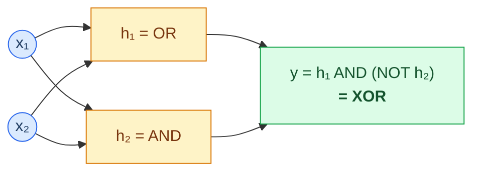
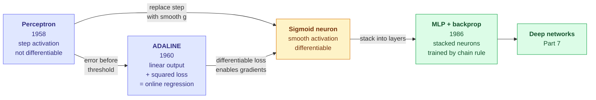

# 03.09 — The Perceptron

> **Prerequisites**: [00.01 §6](../../00-mathematical-foundations/01-linear-algebra/) (hyperplanes,
> projections), [03.04](../04-logistic-regression/) for the linear-classifier comparison.
> **You will be able to**: prove the perceptron convergence theorem, explain exactly what the XOR
> problem killed and what revived it, and place the perceptron as the single neuron every deep
> network is built from — which is where [Part 7](../../07-deep-learning/) begins.

---

## Table of contents

1. [Why the perceptron matters](#1-why-the-perceptron-matters)
2. [The model](#2-the-model)
3. [The learning rule](#3-the-learning-rule)
4. [Why the update works](#4-why-the-update-works)
5. [The convergence theorem](#5-the-convergence-theorem)
6. [What convergence does not promise](#6-what-convergence-does-not-promise)
7. [The XOR catastrophe](#7-the-xor-catastrophe)
8. [Perceptron vs logistic regression vs SVM](#8-perceptron-vs-logistic-regression-vs-svm)
9. [Variants that fix the flaws](#9-variants-that-fix-the-flaws)
10. [ADALINE and the gradient-descent lineage](#10-adaline-and-the-gradient-descent-lineage)
11. [The perceptron as one neuron](#11-the-perceptron-as-one-neuron)
12. [Common misconceptions](#12-common-misconceptions)

---

## 1. Why the perceptron matters

The perceptron (Rosenblatt, 1958) is the oldest trainable classifier, and by pure predictive
performance it is obsolete — logistic regression and SVMs dominate it on every axis. So why a
whole chapter?

Because it is the **conceptual origin of deep learning**, and its history *is* the history of the
field's two winters and two springs:

- It came with the first **convergence guarantee** for a learning algorithm (§5) — a real theorem,
  provable in a page, that a machine will learn.
- Its **inability to solve XOR** (Minsky & Papert, 1969) triggered the first AI winter and nearly
  ended neural network research for a decade (§7).
- The fix — **stack perceptrons into layers and train with backpropagation** — is exactly what
  [Part 7](../../07-deep-learning/) is about. Every unit in every neural network is a perceptron
  with a smooth activation.

You are not learning the perceptron to deploy it. You are learning the object that the entire
second half of this repository generalizes, and the failure that taught the field why depth is
necessary.

---

## 2. The model

$$\hat{y} = \mathrm{sign}(\mathbf{w}^{\top}\mathbf{x}+b) = \begin{cases}+1 & \mathbf{w}^{\top}\mathbf{x}+b \ge 0\\ -1 & \text{otherwise}\end{cases}$$

A hyperplane $\mathbf{w}^{\top}\mathbf{x}+b=0$ splits the space; you are classified by which side
you land on. Identical geometry to the SVM ([03.07 §2](../07-svm/)) and to logistic regression
([03.04 §2.1](../04-logistic-regression/)) — the difference is entirely in the *loss* and how
$\mathbf{w}$ is learned.

**The defining feature is the hard threshold.** The output is $\pm1$, with nothing in between —
no probability, no confidence. That step function is simultaneously the perceptron's simplicity
and its downfall: it is not differentiable, so gradient-based learning is impossible, which is why
the update rule (§3) is a special-purpose trick and not gradient descent.

As usual, fold the bias into the weights by appending a constant 1 to every input, so
$\mathbf{x}\to[\mathbf{x}; 1]$ and $b$ becomes the last component of $\mathbf{w}$. Everything below
assumes this.

---

## 3. The learning rule

Cycle through the training examples. For each $(\mathbf{x}_i, y_i)$ with $y_i\in\{-1,+1\}$:

1. Predict $\hat{y}_i = \mathrm{sign}(\mathbf{w}^{\top}\mathbf{x}_i)$.
2. **If correct, do nothing.**
3. **If wrong, nudge the weights toward the right answer:**

$$\boxed{\;\mathbf{w} \leftarrow \mathbf{w} + \eta\,y_i\,\mathbf{x}_i\;}$$

That is the entire algorithm. Two properties are worth noticing immediately:

- **It is mistake-driven.** Correctly classified points are ignored — the model learns only from
  its errors. (Compare the SVM, whose support vectors are exactly the points near the boundary,
  [03.07 §5](../07-svm/), and logistic regression, whose $p(1-p)$ weighting downweights confident
  points, [03.04 §5](../04-logistic-regression/). All three, differently, learn from the hard
  cases.)
- **The learning rate $\eta$ does not matter for the separable case.** Scaling $\eta$ just scales
  $\mathbf{w}$, which does not change $\mathrm{sign}(\mathbf{w}^{\top}\mathbf{x})$. So $\eta=1$ is
  the standard choice, and convergence (§5) is independent of it — a rare luxury.

---

## 4. Why the update works

The update is not arbitrary; it provably reduces the error on the point that triggered it.

Suppose $\mathbf{x}_i$ is misclassified with $y_i=+1$, so $\mathbf{w}^{\top}\mathbf{x}_i < 0$
(wrong side). After the update $\mathbf{w}' = \mathbf{w}+\eta\mathbf{x}_i$:

$$\mathbf{w}'^{\top}\mathbf{x}_i = (\mathbf{w}+\eta\mathbf{x}_i)^{\top}\mathbf{x}_i
= \mathbf{w}^{\top}\mathbf{x}_i + \eta\Vert\mathbf{x}_i\Vert^{2}$$

The score increased by $\eta\Vert\mathbf{x}_i\Vert^{2} > 0$ — it moved **toward** the correct side.
The symmetric argument holds for $y_i=-1$. So each update makes the offending point *more likely*
to be classified correctly next time.

It does **not** guarantee the point is now correct (one nudge may not be enough), nor that other
points didn't get worse. That is why we need the convergence theorem rather than a one-line
argument.

---

## 5. The convergence theorem

> **Theorem (Novikoff, 1962).** If the training data is linearly separable with margin $\gamma > 0$,
> the perceptron makes at most
>
> $$\left(\frac{R}{\gamma}\right)^{2}$$
>
> mistakes before converging to a separating hyperplane, where $R = \max_i\Vert\mathbf{x}_i\Vert$
> is the radius of the data. The bound is independent of the number of examples and of the
> dimension.

This was a landmark: a **provable guarantee that a machine will learn**, in finite time, with a
bound you can compute. Here is the full proof — it is short and genuinely elegant.

**Setup.** Assume separability: there exists a unit vector $\mathbf{w}^{\star}$ ($\Vert\mathbf{w}^{\star}\Vert=1$)
and margin $\gamma>0$ such that $y_i(\mathbf{w}^{\star\top}\mathbf{x}_i)\ge\gamma$ for all $i$. Start
from $\mathbf{w}_0=\mathbf{0}$ and use $\eta=1$. Let $\mathbf{w}_k$ be the weights after the $k$-th
mistake.

**Part 1 — the numerator grows at least linearly.** On the $k$-th mistake (on point $i$),
$\mathbf{w}_k = \mathbf{w}_{k-1}+y_i\mathbf{x}_i$, so

$$\mathbf{w}_k^{\top}\mathbf{w}^{\star} = \mathbf{w}_{k-1}^{\top}\mathbf{w}^{\star} + y_i\mathbf{x}_i^{\top}\mathbf{w}^{\star}
\ge \mathbf{w}_{k-1}^{\top}\mathbf{w}^{\star} + \gamma$$

By induction, $\mathbf{w}_k^{\top}\mathbf{w}^{\star}\ge k\gamma$.

**Part 2 — the norm grows at most as $\sqrt{k}$.** Because the update happened, the point was
misclassified: $y_i\mathbf{x}_i^{\top}\mathbf{w}_{k-1}\le 0$. So

$$\Vert\mathbf{w}_k\Vert^{2} = \Vert\mathbf{w}_{k-1}\Vert^{2} + 2y_i\mathbf{x}_i^{\top}\mathbf{w}_{k-1} + \Vert\mathbf{x}_i\Vert^{2}
\le \Vert\mathbf{w}_{k-1}\Vert^{2} + R^{2}$$

the middle term being $\le 0$. By induction, $\Vert\mathbf{w}_k\Vert^{2}\le kR^{2}$.

**Part 3 — combine.** Since $\mathbf{w}^{\star}$ is a unit vector, Cauchy-Schwarz gives
$\mathbf{w}_k^{\top}\mathbf{w}^{\star}\le\Vert\mathbf{w}_k\Vert$. Chaining the two bounds:

$$k\gamma \le \mathbf{w}_k^{\top}\mathbf{w}^{\star} \le \Vert\mathbf{w}_k\Vert \le \sqrt{k}\,R$$

So $k\gamma\le\sqrt{k}R$, hence $\sqrt{k}\le R/\gamma$, hence

$$\boxed{\;k\le\left(\frac{R}{\gamma}\right)^{2}\;}\qquad\blacksquare$$

The geometry: Part 1 says $\mathbf{w}$ keeps aligning with the true direction $\mathbf{w}^{\star}$;
Part 2 says it cannot grow too fast; alignment cannot exceed length, so the mistake count is
capped. Experiment 1 measures $k$ against the $(R/\gamma)^{2}$ bound directly.

---

## 6. What convergence does not promise

The theorem is strong but narrow, and every gap is a lesson that motivated later methods.

**1. It only holds if the data is separable.** On non-separable data the perceptron **never
converges** — it cycles forever, weights oscillating, with no notion of "close enough." This is
the single biggest practical problem, and §9's pocket algorithm exists to fix it.

**2. It finds *a* separator, not *the* separator.** Any hyperplane with zero training error stops
the algorithm — including one that skims a training point and generalizes terribly. It has **no
margin objective**. This is precisely the gap the SVM fills ([03.07 §1](../07-svm/)): same
hypothesis class, but a principled choice of *which* separator.

**3. The bound blows up as the margin shrinks.** $(R/\gamma)^{2}$ can be enormous for a small
margin, and a nearly-non-separable problem can take astronomically long. Experiment 2 shows the
convergence time exploding as the margin closes.

**4. The final hyperplane depends on example order.** Present the data in a different sequence and
you converge to a different separator. It is order-dependent, unlike the convex-optimization
solutions of logistic regression and the SVM.

Every one of these four is a reason logistic regression and the SVM superseded it — and together
they are a compact argument for why *convexity and a margin* (the properties those methods add)
matter.

---

## 7. The XOR catastrophe

This is the most consequential failure in the history of machine learning.

XOR: $y = x_1 \oplus x_2$. Four points:

| $x_1$ | $x_2$ | $y$ |
|---|---|---|
| 0 | 0 | −1 |
| 0 | 1 | +1 |
| 1 | 0 | +1 |
| 1 | 1 | −1 |

**No line separates the $+1$s from the $-1$s.** The positives sit on one diagonal, the negatives
on the other; any straight cut misclassifies at least one point. Since the perceptron can only
draw a line, it **cannot learn XOR** — and the convergence theorem does not apply, because the data
is not linearly separable.

Minsky and Papert proved this in *Perceptrons* (1969), and the effect on the field was seismic.
Their broader point — that single-layer perceptrons cannot represent any function that is not
linearly separable, a large and important class — was read (somewhat unfairly) as a verdict on
neural networks in general. Funding collapsed. The **first AI winter** followed, and neural network
research was largely dormant for over a decade.

**The resolution, and why it matters for everything after.** XOR *is* solvable — by a **two-layer**
network. A hidden layer of two perceptrons can carve the space into regions a single line cannot,
and an output unit combines them:

$\text{XOR} = \text{OR} \land \lnot\text{AND}$: fire if *at least one* input is on (OR) *and not
both* (NAND). Each of OR and AND is linearly separable — a single perceptron each — and their
combination is XOR. **Depth converts a problem one layer cannot represent into a composition of
problems it can.**

The missing piece in 1969 was not the architecture — Minsky and Papert knew multilayer networks
existed — but a way to *train* it: the hard threshold is not differentiable, so there was no
gradient to follow through the hidden layer. **Backpropagation** (Rumelhart, Hinton & Williams,
1986) supplied it, by replacing the step with a smooth activation, and the field's second spring
began. That is the subject of [07.02](../../07-deep-learning/02-backpropagation/). Experiment 3
trains both a single perceptron (fails) and a two-layer network (succeeds) on XOR.

---

## 8. Perceptron vs logistic regression vs SVM

All three are linear classifiers with the *same* hypothesis class — a hyperplane. They differ
entirely in the loss they minimize, and that difference is the whole story of why the perceptron
was superseded.

| | Perceptron | Logistic regression | SVM |
|---|---|---|---|
| Output | hard $\pm1$ | probability | signed distance |
| Loss | perceptron loss $\max(0,-y f)$ | log loss | hinge $\max(0,1-yf)$ |
| Differentiable | no | yes | subgradient |
| Convex objective | (degenerate) | yes | yes |
| Non-separable data | never converges | fine | fine (soft margin) |
| Margin | none | implicit | maximized |
| Unique solution | no (order-dependent) | yes | yes |
| Probabilities | no | yes | no |

Read the loss row as a spectrum. The **perceptron loss** $\max(0, -yf)$ penalizes only
misclassified points, and by *exactly* how far they are on the wrong side — zero penalty the
instant a point is correct. The **hinge loss** $\max(0, 1-yf)$ is the same idea shifted right by a
margin: it keeps penalizing until the point is correct *and confident*, which is what produces the
SVM's margin ([03.07 §7](../07-svm/)). **Logistic loss** never reaches zero, so every point always
contributes. Three losses, one geometry, and the differences among them are the entire content of
[03.04](../04-logistic-regression/) and [03.07](../07-svm/).

The perceptron loss is what you get by running SGD on the perceptron; that connection is §10.

---

## 9. Variants that fix the flaws

Each variant targets a specific failure from §6:

**Pocket algorithm** (Gallant, 1990) — fixes non-convergence. Keep the best-so-far weights "in your
pocket"; update them only when the current weights achieve lower training error. Now the algorithm
returns something sensible even on non-separable data, instead of whatever it happened to be
holding when you stopped.

**Averaged / voted perceptron** (Freund & Schapire, 1999) — fixes order-dependence and improves
generalization. Return the *average* of all weight vectors seen during training, weighted by how
long each survived. This averaging reduces variance (the same principle as ensembling,
[00.03 §4.3](../../00-mathematical-foundations/03-probability/)) and generalizes markedly better —
competitive with SVMs on some problems, at a fraction of the cost. Experiment 4 measures the gap.

**Kernel perceptron** — fixes linearity. Since every update adds $y_i\mathbf{x}_i$ to
$\mathbf{w}$, the weights are always a linear combination of training points, so predictions depend
only on inner products $\mathbf{x}_i^{\top}\mathbf{x}$ — exactly the structure that admits the
kernel trick ([03.07 §8](../07-svm/)). Replace the inner product with a kernel and the perceptron
learns nonlinear boundaries. Historically important as an early demonstration that the kernel trick
is general, not specific to SVMs.

**Margin perceptron** — adds a margin requirement, updating whenever $y_if < \gamma$ rather than
only when $y_if < 0$. This nudges the perceptron toward the SVM's max-margin solution, closing the
§6.2 gap.

---

## 10. ADALINE and the gradient-descent lineage

Running in parallel to Rosenblatt's perceptron, **ADALINE** (Widrow & Hoff, 1960) made one change
that turned out to be the more important idea long-term: **train on the pre-threshold output.**

The perceptron thresholds first, then computes error on the $\pm1$ decision. ADALINE computes error
on the raw linear output $z = \mathbf{w}^{\top}\mathbf{x}$ *before* thresholding, using squared
loss:

$$L = \tfrac12(y - \mathbf{w}^{\top}\mathbf{x})^{2}
\qquad\Longrightarrow\qquad
\mathbf{w}\leftarrow\mathbf{w}+\eta(y - \mathbf{w}^{\top}\mathbf{x})\mathbf{x}$$

This is the **Widrow-Hoff / delta rule**, and it is **exactly stochastic gradient descent on
squared loss** ([00.02 §9](../../00-mathematical-foundations/02-calculus-and-optimization/)) — it
is linear regression trained online. The difference from the perceptron rule is the error term:
$(y-\mathbf{w}^{\top}\mathbf{x})$, a *continuous* residual, versus the perceptron's discrete "wrong
by how the sign came out."

That continuous error is the whole point. Because the loss is differentiable, the delta rule
*generalizes* — swap squared loss for any differentiable loss, stack layers, and apply the chain
rule, and you have backpropagation. **MADALINE** (multiple ADALINEs, 1962) was the first multilayer
network trained this way. The gradient-descent lineage that runs through every model in
[Part 7](../../07-deep-learning/) starts here, not with the perceptron rule.

| | Perceptron | ADALINE |
|---|---|---|
| Error computed on | thresholded output ($\pm1$) | raw linear output |
| Loss | perceptron loss | squared error |
| Update is | special-purpose rule | **gradient descent** |
| Generalizes to deep nets via | — | **backpropagation** |

---

## 11. The perceptron as one neuron

Here is the payoff, and the bridge to the second half of this repository. A single artificial
neuron is:

$$\text{output} = g\big(\mathbf{w}^{\top}\mathbf{x}+b\big)$$

— a weighted sum, then an activation $g$. **That is a perceptron with the step function replaced by
a smooth $g$** (sigmoid, tanh, ReLU, …). The replacement is not cosmetic: it is exactly what makes
the neuron differentiable, and therefore trainable by gradient descent through many layers.

The lineage is direct: perceptron → smooth neuron → multilayer network → deep learning. Everything
in [Part 7](../../07-deep-learning/) is this diagram elaborated. When you meet a "fully connected
layer" in [07.01](../../07-deep-learning/01-neural-network-basics/), it is a rack of perceptrons
sharing an input; when you meet backpropagation in
[07.02](../../07-deep-learning/02-backpropagation/), it is the delta rule generalized through the
chain rule. The perceptron is the atom.

---

## 12. Common misconceptions

**"The perceptron is just an old version of logistic regression."**
Same hypothesis class, but a non-differentiable hard threshold, no probabilities, no convex loss,
and no convergence on non-separable data (§8). The differences are the reason logistic regression
replaced it.

**"The perceptron always converges."**
Only on *linearly separable* data. On non-separable data it cycles forever (§6.1).

**"The perceptron finds the best separating line."**
It finds *a* separator — any one with zero training error — with no margin objective. Which one
depends on example order (§6.2, §6.4).

**"XOR proved neural networks don't work."**
XOR proved a *single-layer* perceptron cannot represent non-linearly-separable functions. A
two-layer network solves it easily (§7). The 1969 obstacle was training multilayer nets, not their
existence.

**"The learning rate matters for the perceptron."**
For the separable case it does not — scaling $\eta$ just scales $\mathbf{w}$ without changing any
sign (§3).

**"ADALINE and the perceptron are the same thing."**
ADALINE computes error before thresholding and its update *is* gradient descent — which is why it,
not the perceptron, is the true ancestor of deep learning (§10).

**"The perceptron is obsolete, so it doesn't matter."**
Every neuron in every deep network is a perceptron with a smooth activation (§11). It is the unit
the whole field is built from.

---

## Files in this chapter

| File | Contents |
|---|---|
| [`from_scratch.py`](from_scratch.py) | The perceptron with the convergence bound checked empirically, the pocket and averaged variants, a two-layer network solving XOR, and ADALINE showing the update *is* gradient descent — verified against sklearn |
| [`exercises.md`](exercises.md) | Derivation (including the full convergence proof), implementation, and interview questions |
| [`references.md`](references.md) | Exact sources used |

**Previous**: [03.08 — Decision Trees](../08-decision-trees/) ·
**Next**: [Part 4 — Unsupervised Learning](../../04-unsupervised-learning/), or jump to
[Part 6 — Ensembles](../../06-ensembles/) to see what decision trees become.

---

*This completes Part 3. You now have every classical supervised algorithm derived, implemented, and
verified. [Part 6](../../06-ensembles/) combines them; [Part 7](../../07-deep-learning/)
generalizes the perceptron into deep networks.*
