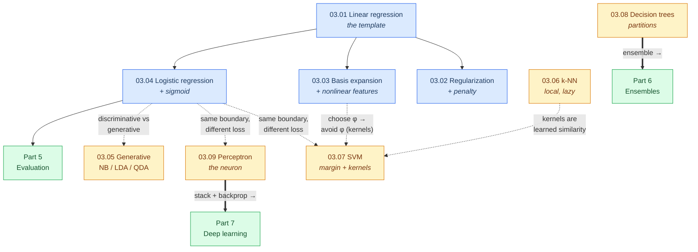

# Part 3 — Classical Supervised Learning

> **Every model here is a choice of three things: a hypothesis class, a loss, and an optimizer.**
> Change one and you get a different algorithm. This part makes that grid explicit.

Supervised learning is the core of applied machine learning: learn a function from labelled
examples $(\mathbf{x}_i, y_i)$ that predicts well on unseen inputs. This part builds every classical
algorithm from first principles — derived, implemented in NumPy, and verified against
scikit-learn to machine precision.

## The unifying view

Once you have read a few chapters, the apparent zoo collapses into a small grid. Almost every model
in this part is a point in it:

| Model | Hypothesis class | Loss | How it's fit |
|---|---|---|---|
| [Linear regression](01-linear-regression/) | linear | squared error | closed form (QR/SVD) |
| [Ridge / Lasso / Elastic Net](02-regularized-linear-models/) | linear | squared + penalty | closed form / coordinate descent |
| [Splines / GAMs](03-basis-expansion/) | linear in a basis | squared error | least squares / backfitting |
| [Logistic regression](04-logistic-regression/) | linear (log-odds) | log loss | IRLS / L-BFGS |
| [Naive Bayes / LDA / QDA](05-generative-classifiers/) | generative Gaussian | negative log-likelihood | closed form |
| [k-NN](06-knn/) | local / non-parametric | — (lazy) | store the data |
| [SVM](07-svm/) | linear (+ kernels) | hinge | SMO (dual QP) |
| [Decision trees](08-decision-trees/) | axis-aligned partition | impurity | greedy recursion |
| [Perceptron](09-perceptron/) | linear | perceptron loss | mistake-driven / SGD |

**Three things recur so often they are worth stating up front:**

1. **Loss = negative log-likelihood.** Squared error is Gaussian noise, log loss is Bernoulli,
   hinge is a margin. Choosing a loss is choosing a probabilistic assumption
   ([00.03 §9.4](../00-mathematical-foundations/03-probability/)).
2. **Regularization = a prior = the bias-variance trade.** Ridge is a Gaussian prior, Lasso a
   Laplace one, tree pruning a complexity penalty. All accept bias to cut variance
   ([00.04 §3](../00-mathematical-foundations/04-statistics-and-inference/)).
3. **The same linear boundary, three ways.** Logistic regression, the linear SVM, and the
   perceptron share a hypothesis class and differ only in loss — in sklearn they are literally one
   optimizer with three loss functions.

## Chapters

| # | Chapter | The one idea | Status |
|---|---|---|:--:|
| 03.01 | [Linear Regression](01-linear-regression/) | OLS three ways; Gauss-Markov and its loophole | 🟢 |
| 03.02 | [Regularized Linear Models](02-regularized-linear-models/) | the loophole cashed in — bias for variance | 🟢 |
| 03.03 | [Basis Expansion](03-basis-expansion/) | nonlinearity without leaving linear models | 🟢 |
| 03.04 | [Logistic Regression](04-logistic-regression/) | a linear model for the log-odds; calibrated by construction | 🟢 |
| 03.05 | [Generative Classifiers](05-generative-classifiers/) | NB, LDA, QDA — one covariance spectrum | 🟢 |
| 03.06 | [k-Nearest Neighbours](06-knn/) | the curse of dimensionality, and why embeddings escape it | 🟢 |
| 03.07 | [Support Vector Machines](07-svm/) | the dual, and support vectors as a KKT theorem | 🟢 |
| 03.08 | [Decision Trees](08-decision-trees/) | greedy, unstable — the unit ensembles are built from | 🟢 |
| 03.09 | [Perceptron](09-perceptron/) | the atom of deep learning, and the XOR catastrophe | 🟢 |

## How the chapters connect

The dashed edges are the connections worth internalizing: logistic regression, SVM, and perceptron
are the same boundary under different losses; kernels are the "avoid choosing $\phi$" answer to
basis expansion's "choose $\phi$"; and the two thick edges are where this part feeds forward —
**trees become [ensembles](../06-ensembles/)**, and the **perceptron becomes
[deep learning](../07-deep-learning/)**.

## What to read next

- To see trees become state-of-the-art: **[Part 6 — Ensembles](../06-ensembles/)** (bagging →
  random forests → gradient boosting → XGBoost/LightGBM/CatBoost).
- To measure any of these models honestly: **[Part 5 — Evaluation](../05-model-evaluation/)**
  (metrics, cross-validation, calibration).
- To generalize the perceptron into deep networks: **[Part 7 — Deep Learning](../07-deep-learning/)**.

## Prerequisites

All of Part 3 rests on **[Part 0 — Mathematical Foundations](../00-mathematical-foundations/)**:
linear algebra (the normal equations, the SVD, kernels), optimization (convexity, IRLS, the SVM
dual), probability (the loss/likelihood correspondence), statistics (bias-variance, inference), and
numerical methods (stable losses). Every chapter cites the exact section it depends on.

---

*Every `from_scratch.py` in this part runs standalone and verifies itself against scikit-learn.
Every mathematical claim is derived, cited, or measured.*
