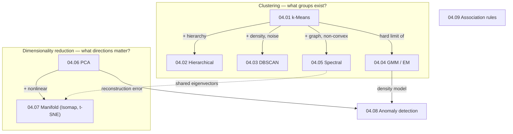

# Part 4 — Unsupervised Learning

> **No labels — find the structure the data has on its own.**
> Clustering asks *what groups exist?*; dimensionality reduction asks *what are the few directions
> that matter?*; anomaly detection asks *what doesn't belong?*; association mining asks *what goes
> with what?* Four questions, one theme: discover structure no one told you to look for.

Supervised learning ([Part 3](../03-supervised-learning/)) learns a function from labelled examples.
Unsupervised learning has only $\mathbf{x}$, no $y$ — and so its central difficulty is that **there is
no single right answer**. "Similar," "important," "anomalous," and "associated" are modelling choices,
and every method imposes its own. This part builds each from first principles — derived, implemented
in NumPy, and verified against scikit-learn (and scipy) — and, throughout, *measures* its claims and
corrects the prose where the data disagrees.

## The four tasks

| Task | Question | Methods | Chapters |
|---|---|---|---|
| **Clustering** | what groups exist? | k-means, hierarchical, DBSCAN, GMM, spectral | [04.01](01-kmeans/)–[04.05](05-spectral-clustering/) |
| **Dimensionality reduction** | what few directions matter? | PCA, Isomap, t-SNE, UMAP | [04.06](06-linear-dimensionality-reduction/)–[04.07](07-manifold-learning/) |
| **Anomaly detection** | what doesn't belong? | Isolation Forest, LOF, reconstruction | [04.08](08-anomaly-detection/) |
| **Association mining** | what goes with what? | Apriori, FP-Growth | [04.09](09-association-rules/) |

**Three ideas recur across the part:**

1. **Every method encodes a definition of "structure," and the definition is the model.** k-means says
   a cluster is a ball around a center; DBSCAN says it is a dense connected region; a GMM says it is a
   Gaussian; spectral says it is a well-connected subgraph. Choosing a method *is* choosing what a
   cluster is — and each fails where its definition does not fit the data.
2. **Eigenvectors are everywhere.** PCA uses the top eigenvectors of the covariance; spectral
   clustering and Laplacian eigenmaps use the smallest eigenvectors of the graph Laplacian; classical
   MDS eigendecomposes a distance matrix. Linear algebra is the engine of unsupervised learning.
3. **Evaluation is hard without labels.** With no ground truth, you lean on internal criteria
   (silhouette, BIC, reconstruction error, the eigengap), on stability, and ultimately on whether the
   structure is *useful*. Be honest that the "best" clustering or $k$ is a judgment, not a theorem.

## Chapters

| # | Chapter | The one idea | Status |
|---|---|---|:--:|
| 04.01 | [k-Means](01-kmeans/) | Lloyd's = coordinate descent; k-means++; spherical assumption | 🟢 |
| 04.02 | [Hierarchical Clustering](02-hierarchical-clustering/) | a dendrogram at all scales; linkage is the choice | 🟢 |
| 04.03 | [Density Clustering (DBSCAN)](03-density-clustering/) | clusters as dense regions; native noise; the one-`eps` limit | 🟢 |
| 04.04 | [Gaussian Mixtures & EM](04-gaussian-mixtures/) | soft, full-covariance clustering; EM as ELBO ascent | 🟢 |
| 04.05 | [Spectral Clustering](05-spectral-clustering/) | eigenvectors of the graph Laplacian; non-convex clusters | 🟢 |
| 04.06 | [Linear Dim. Reduction (PCA)](06-linear-dimensionality-reduction/) | max variance = min reconstruction; the SVD | 🟢 |
| 04.07 | [Manifold Learning](07-manifold-learning/) | unfold nonlinear structure; how to (not) read t-SNE | 🟢 |
| 04.08 | [Anomaly Detection](08-anomaly-detection/) | isolation, local density, reconstruction | 🟢 |
| 04.09 | [Association Rules](09-association-rules/) | Apriori pruning; the confidence trap and lift | 🟢 |

## How the chapters connect

k-means is the hub: each clustering chapter relaxes one of its assumptions (hierarchy, density,
Gaussianity, connectivity). PCA and manifold learning share eigenvector machinery with spectral
clustering. And the density and reconstruction models feed anomaly detection.

## What every chapter contains

- **`README.md`** — full theory: intuition, the objective, a complete derivation, assumptions,
  failure modes, and practical guidance, with claims checked against measurements.
- **`from_scratch.py`** — NumPy implementations verified against `scikit-learn`/`scipy`, plus
  experiments that *measure* each claim (and expose each method's failure modes).
- **`exercises.md`** — derivation, implementation, and interview tiers, with checkpoints.
- **`references.md`** — the exact papers and book sections behind every section.

## Where this connects

- **The supervised counterpart** → [Part 3](../03-supervised-learning/)
- **Evaluating without labels (metrics, validation)** → [Part 5](../05-model-evaluation/)
- **The curse of dimensionality these methods fight** → [03.06](../03-supervised-learning/06-knn/)
- **Autoencoders — nonlinear PCA / manifold learning with neural nets** → [Part 7](../07-deep-learning/)
- **Recommenders — association mining applied** → [Part 16](../)
