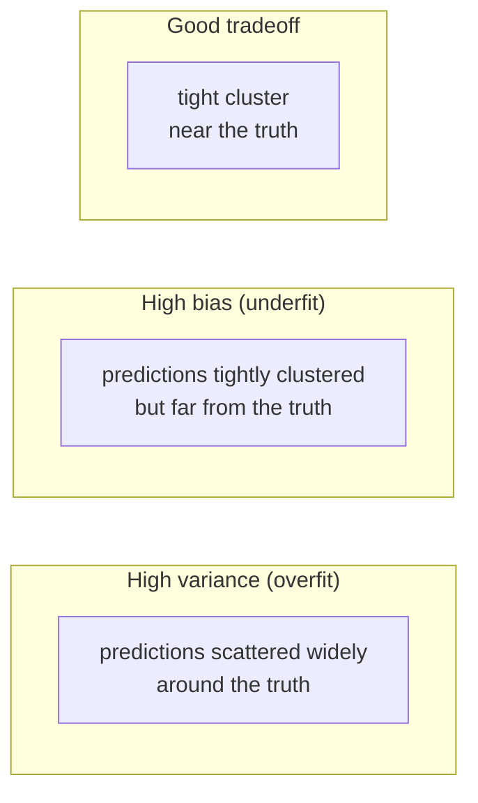
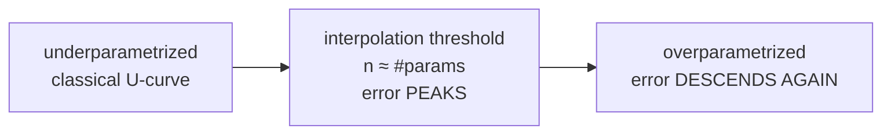

# 05.01 — Bias-Variance & Learning Theory

> **Prerequisites**: [00.03](../../00-mathematical-foundations/03-probability/) (expectation,
> variance), [00.04](../../00-mathematical-foundations/04-statistics-and-inference/) (estimators,
> sampling), [03.02](../../03-supervised-learning/02-regularized-linear-models/) (regularization as
> the bias-variance trade in action).
> **You will be able to**: derive the bias-variance decomposition, measure it empirically, diagnose a
> model from its learning curves, state the generalization bounds (Hoeffding, VC) that explain *why*
> learning works, and explain double descent — the modern correction to the classical U-curve.

---

## Table of contents

1. [The question underneath every model](#1-the-question-underneath-every-model)
2. [The bias-variance decomposition](#2-the-bias-variance-decomposition)
3. [What bias and variance actually are](#3-what-bias-and-variance-actually-are)
4. [The tradeoff and the U-curve](#4-the-tradeoff-and-the-u-curve)
5. [Classification: the decomposition changes](#5-classification-the-decomposition-changes)
6. [Learning curves — diagnosing a model](#6-learning-curves--diagnosing-a-model)
7. [Why learning works at all: generalization](#7-why-learning-works-at-all-generalization)
8. [Hoeffding and finite hypothesis classes](#8-hoeffding-and-finite-hypothesis-classes)
9. [VC dimension and infinite classes](#9-vc-dimension-and-infinite-classes)
10. [Double descent — the U-curve was not the whole story](#10-double-descent--the-u-curve-was-not-the-whole-story)
11. [The unifying view of this whole repository](#11-the-unifying-view-of-this-whole-repository)
12. [Common misconceptions](#12-common-misconceptions)

---

## 1. The question underneath every model

Every supervised model is fit on one finite training set and judged on data it has never seen. The
central question of machine learning is therefore not "how well does it fit the training data?" but
**"how well will it do on the next point?"** — its *generalization* error. This chapter answers two
things about that error:

- **What is it made of?** The bias-variance decomposition (§2) splits test error into three parts and
  tells you which one your model suffers from — and therefore what to do about it.
- **Why is it even bounded?** Learning theory (§7–§9) explains why fitting a finite sample tells you
  anything at all about the infinite population, and what controls the gap.

These are the tools that turn model-building from guesswork into diagnosis. Almost every other choice
in this repository — regularization ([03.02](../../03-supervised-learning/02-regularized-linear-models/)),
ensembling ([Part 6](../../06-ensembles/)), early stopping ([06.04](../../06-ensembles/04-gradient-boosting/)) —
is a move in the bias-variance game defined here.

---

## 2. The bias-variance decomposition

Suppose the data is generated as $y = f(\mathbf{x}) + \varepsilon$ with $\mathbb{E}[\varepsilon]=0$
and $\mathrm{Var}[\varepsilon]=\sigma^2$. We draw a training set $D$, fit a model $\hat f_D$, and ask
for the expected squared error at a fixed test point $\mathbf{x}_0$, averaged over both the noise and
the randomness of which training set we happened to draw:

$$
\mathrm{Err}(\mathbf{x}_0) = \mathbb{E}_{D,\varepsilon}\big[(y_0 - \hat f_D(\mathbf{x}_0))^2\big].
$$

Write $\bar f(\mathbf{x}_0) = \mathbb{E}_D[\hat f_D(\mathbf{x}_0)]$ for the *average prediction* over
all training sets. Add and subtract $\bar f(\mathbf{x}_0)$ and $f(\mathbf{x}_0)$ inside the square;
the cross terms vanish because $\varepsilon$ is independent of $\hat f_D$ and because
$\mathbb{E}_D[\hat f_D - \bar f] = 0$ by definition. What survives is three terms:

$$
\boxed{\mathrm{Err}(\mathbf{x}_0) = \underbrace{\sigma^2}_{\text{irreducible}} + \underbrace{\big(\bar f(\mathbf{x}_0) - f(\mathbf{x}_0)\big)^2}_{\mathrm{Bias}^2} + \underbrace{\mathbb{E}_D\big[(\hat f_D(\mathbf{x}_0) - \bar f(\mathbf{x}_0))^2\big]}_{\mathrm{Variance}}}
$$

- **Irreducible error $\sigma^2$** — the noise floor. No model can beat it; it is the label's own
  randomness. If someone reports test error below $\sigma$, they have a leak.
- **Bias$^2$** — how far the *average* model is from the truth. High bias means the hypothesis class
  is too rigid to represent $f$ (underfitting).
- **Variance** — how much the model *wobbles* from one training set to the next. High variance means
  the model is chasing the particular sample it saw (overfitting).

The full derivation is in `from_scratch.py`'s docstring and is worth doing once by hand — the
vanishing of the cross terms is the whole trick. The code then **measures** all three terms by Monte
Carlo (fit on many simulated training sets) and confirms they sum to the total error.

---

## 3. What bias and variance actually are

The decomposition is often misread. The averaging is over **training sets**, not over test points.
Picture drawing 200 different training sets of the same size, fitting your model on each, and looking
at the 200 predictions at one fixed input $\mathbf{x}_0$:

- **Bias** is the gap between the *center* of that cloud of 200 predictions and the true value
  $f(\mathbf{x}_0)$. It is a property of the hypothesis class and the fitting procedure, not of any
  one dataset.
- **Variance** is the *spread* of that cloud. A high-variance model gives wildly different answers
  depending on which training set it happened to see.

This is why a deep unpruned tree is *high variance* (each training set yields a very different tree)
and a linear model on nonlinear data is *high bias* (every training set yields nearly the same wrong
line). It is also why **averaging** high-variance, low-bias models cancels the wobble without adding
bias — the entire logic of bagging ([06.01](../../06-ensembles/01-bagging/)) — and why **boosting**
adds weak, high-bias learners to grind bias down ([06.03](../../06-ensembles/03-boosting-theory/)).

---

## 4. The tradeoff and the U-curve

Bias and variance pull in opposite directions as you vary model complexity:

- A **too-simple** model (low-degree polynomial, shallow tree, heavy regularization) has **high bias,
  low variance**.
- A **too-complex** model (high-degree polynomial, deep tree, no regularization) has **low bias, high
  variance**.

Total error $=\sigma^2 + \mathrm{Bias}^2 + \mathrm{Variance}$ is therefore **U-shaped** in complexity:
it falls as bias drops, bottoms out at the sweet spot, and rises again as variance takes over. The
minimum of that U is the best achievable model in that family; finding it is what validation
([05.04](../04-cross-validation/)) is *for*. Experiment 2 sweeps polynomial degree and plots the two
terms crossing, with total error tracing the classic U.

Regularization ([03.02](../../03-supervised-learning/02-regularized-linear-models/)) is the knob that
moves you *along* this curve without changing the hypothesis class: ridge/lasso trade a little bias
for a large cut in variance. That is the entire point of the penalty, and Experiment 2 shows it
shifting the U's minimum.

---

## 5. Classification: the decomposition changes

The clean three-way split above is a fact about **squared-error** loss. Under **0/1 loss** the story
is different and often surprising: bias and variance interact *multiplicatively*, not additively, and
variance can actually *reduce* error where the model is on the right side of the decision boundary.

The key consequence: for classification, variance hurts only when it pushes a prediction across the
boundary. A high-variance classifier that is confidently, consistently on the correct side is fine;
the same variance near the boundary is fatal. Domingos (2000) gives a unified decomposition that
makes this precise, and it explains an otherwise paradoxical fact — that variance-increasing tricks
can lower classification error, and that a biased classifier (e.g. naive Bayes) can beat a
lower-bias one (logistic regression) on small samples ([03.05](../../03-supervised-learning/05-generative-classifiers/)'s
Ng-Jordan crossover). Experiment 3 reproduces a case where added variance *helps* 0/1 error.

The practical takeaway: **the additive bias²+variance intuition is a squared-error picture.** Keep it
for regression; for classification, think in terms of "does the wobble cross the boundary?"

---

## 6. Learning curves — diagnosing a model

A **learning curve** plots training and validation error against training-set size $n$. Its shape
diagnoses which term dominates — the single most useful practical skill in this chapter:

| Symptom | Diagnosis | Fix |
|---|---|---|
| Train and val error both **high**, close together, flat | **High bias** (underfit) | more capacity, richer features, less regularization; more data will *not* help |
| Train error **low**, val error **high**, large gap that **narrows** as $n$ grows | **High variance** (overfit) | more data, more regularization, simpler model, ensembling |
| Both converge to a low value near $\sigma$ | Well-fit | ship it |

The asymmetry is the useful part: **more data cures variance but never bias.** If the two curves have
already met at a high error, collecting more data is wasted effort — you need a different model. If
they are still far apart and closing, more data is exactly the lever. Experiment 4 draws all three
shapes and reads them.

---

## 7. Why learning works at all: generalization

Step back from decomposition to a deeper question: *why should fitting a finite sample tell you
anything about the infinite population?* You minimize **empirical risk** (average loss on the
training set) but care about **true risk** (expected loss on the population):

$$
\hat R(h) = \frac1n\sum_{i=1}^n L(h(\mathbf{x}_i), y_i), \qquad R(h) = \mathbb{E}_{(\mathbf{x},y)}\big[L(h(\mathbf{x}), y)\big].
$$

Empirical risk minimization (ERM) picks the $h$ that minimizes $\hat R$. The **generalization gap**
$R(h) - \hat R(h)$ is what we must control. Learning theory bounds this gap with high probability,
and the bounds reveal exactly what makes learning possible: *enough data relative to the richness of
the hypothesis class.* Too rich a class relative to $n$ and the gap is unbounded — the model can fit
the sample perfectly and generalize not at all.

---

## 8. Hoeffding and finite hypothesis classes

For a **single, fixed** hypothesis $h$, the empirical risk is an average of $n$ bounded i.i.d. terms,
so **Hoeffding's inequality** bounds how far it can stray from the true risk:

$$
\mathbb{P}\big(|R(h) - \hat R(h)| > \epsilon\big) \le 2e^{-2n\epsilon^2}.
$$

The gap shrinks like $1/\sqrt{n}$ — fit more data and the empirical average locks onto the truth.
But ERM does not use one fixed $h$; it *chooses* the best of many, and the chosen one is precisely the
one that got lucky on this sample. To bound the worst case over a finite class $\mathcal H$ of size
$|\mathcal H|$, apply the **union bound**:

$$
\mathbb{P}\big(\exists h\in\mathcal H : |R(h)-\hat R(h)| > \epsilon\big) \le 2|\mathcal H|\,e^{-2n\epsilon^2}.
$$

Setting the right side to $\delta$ and solving gives, with probability $\ge 1-\delta$, for *every*
$h\in\mathcal H$:

$$
R(h) \le \hat R(h) + \sqrt{\frac{\ln|\mathcal H| + \ln(2/\delta)}{2n}}.
$$

Read this bound: generalization needs $n \gtrsim \ln|\mathcal H|$. A richer class ($\log|\mathcal H|$
larger) needs proportionally more data. This is the **first quantitative statement of the
bias-variance trade**: $\ln|\mathcal H|$ is a complexity/variance term, $\hat R(h)$ a bias term, and
you trade them through the size of $\mathcal H$. Experiment 5 watches the gap shrink as $1/\sqrt n$
and widen with $\ln|\mathcal H|$.

---

## 9. VC dimension and infinite classes

Most useful hypothesis classes are infinite ($|\mathcal H|=\infty$: all linear separators, all
trees), so the union bound is useless as stated. The fix is to measure complexity not by *counting*
hypotheses but by their **expressive power on a finite sample** — the **Vapnik-Chervonenkis (VC)
dimension**.

$\mathcal H$ **shatters** a set of points if it can realize *every* possible labelling of them. The
VC dimension $d_{VC}$ is the size of the largest set $\mathcal H$ can shatter. For example, linear
classifiers in the plane shatter any 3 points in general position but no set of 4 (the XOR
arrangement defeats them), so $d_{VC}=3$; in $\mathbb R^d$, linear classifiers have $d_{VC}=d+1$.
Vapnik's theorem replaces $\ln|\mathcal H|$ with $d_{VC}$:

$$
R(h) \le \hat R(h) + O\!\left(\sqrt{\frac{d_{VC}\big(\ln(n/d_{VC})+1\big) + \ln(1/\delta)}{n}}\right).
$$

The message is identical in spirit to §8: generalization needs $n \gg d_{VC}$. The **fundamental
theorem of statistical learning** closes the loop — a hypothesis class is PAC-learnable *if and only
if* its VC dimension is finite. Finite VC dimension is exactly the boundary between "can generalize"
and "cannot."

> **Why the classical theory feared big models.** These bounds say error is controlled only while
> $n \gg d_{VC}$; a model with capacity to *interpolate* the training data ($d_{VC}\gtrsim n$) has a
> vacuous bound. For decades that was read as "never let the model interpolate." Deep learning broke
> that reading — which is §10.

---

## 10. Double descent — the U-curve was not the whole story

The classical U-curve (§4) says test error rises once the model can interpolate the training data.
Modern over-parametrized models — deep nets, wide random-feature models — violate this flagrantly:
past the **interpolation threshold** (enough parameters to fit the training set exactly, zero
training error), test error *falls again*. Plotting test error against capacity across the whole range
gives **double descent** (Belkin et al., 2019):

- **Classical regime** ($n_{\text{params}} < n$): the familiar U — bias down, variance up, minimum in
  the middle.
- **Interpolation threshold** ($n_{\text{params}} \approx n$): the model can *just barely* fit the data,
  forced through every point including noise. Variance explodes; test error **peaks**.
- **Modern regime** ($n_{\text{params}} \gg n$): among the infinitely many interpolating solutions,
  gradient descent and explicit/implicit regularization prefer the *smoothest* one — a low-norm
  minimum-interpolation. Effective complexity *falls* as raw capacity rises, and test error descends
  a second time, often below the classical minimum.

Double descent does not refute the bias-variance trade; it refutes the naive identification of
*complexity* with *parameter count*. The right complexity measure (norm, margin, effective degrees of
freedom) still traces a U — it is just not the parameter count. Experiment 6 reproduces double
descent with random-feature regression: test error peaks exactly at the interpolation threshold and
then descends. This is why "make the network bigger" so often *helps* — the opposite of what the
1990s bounds seemed to warn.

---

## 11. The unifying view of this whole repository

Almost every technique in machine learning is a move in the bias-variance game:

| Technique | Move | Chapter |
|---|---|---|
| Regularization (ridge/lasso) | trade bias up for variance down | [03.02](../../03-supervised-learning/02-regularized-linear-models/) |
| Bagging / random forests | cut variance by averaging decorrelated models | [06.01](../../06-ensembles/01-bagging/)–[06.02](../../06-ensembles/02-random-forests/) |
| Boosting | cut bias by accumulating weak learners | [06.03](../../06-ensembles/03-boosting-theory/)–[06.05](../../06-ensembles/05-modern-gbdts/) |
| Early stopping | stop before variance takes over | [06.04 §10](../../06-ensembles/04-gradient-boosting/) |
| Cross-validation | *locate* the U's minimum | [05.04](../04-cross-validation/) |
| More training data | cut variance (never bias) | §6 |
| Feature selection / PCA | cut variance by reducing dimension | [04.xx](../../04-unsupervised-learning/) |
| Dropout / weight decay (deep nets) | cut variance in over-parametrized models | [07.xx](../../07-deep-learning/) |

Read this table and the whole field organizes itself: you are always either too rigid (add capacity,
reduce regularization, boost) or too sensitive (add data, add regularization, average, bag). Knowing
*which* — from learning curves (§6) and the decomposition (§2) — is the diagnostic skill this chapter
exists to build.

---

## 12. Common misconceptions

**"Bias and variance are computed by averaging over test points."**
No — over **training sets** (§3). Bias is where the center of the prediction cloud sits across
datasets; variance is its spread. This is why the decomposition is about the *procedure*, not one fit.

**"More data always helps."**
More data cuts **variance**, never **bias** (§6). If your learning curves have already converged at a
high error, more data is wasted — you need a more capable model. Diagnose before you collect.

**"The bias-variance decomposition applies to any loss."**
The clean additive $\sigma^2+\mathrm{Bias}^2+\mathrm{Var}$ is a **squared-error** result (§2). Under
0/1 loss bias and variance interact and variance can even help (§5). Do not port the additive
intuition to classification uncritically.

**"A model that interpolates the training data always overfits."**
The classical bound says so, but double descent (§10) shows heavily over-parametrized interpolators
generalizing *well* — because implicit regularization picks the smoothest interpolant. Parameter
count is not the right complexity measure.

**"Low training error means a good model."**
Training error is the *biased* estimate — the model was chosen to minimize it. Only the
generalization gap (§7–§9), estimated by held-out data ([05.04](../04-cross-validation/)), tells you
about the next point. Zero training error is as consistent with perfect memorization as with perfect
learning.

**"VC dimension is just the number of parameters."**
Usually similar, but not always: a single-parameter classifier $\mathrm{sign}(\sin(\theta x))$ has
*infinite* VC dimension. Capacity is about what a class can *shatter* (§9), not how many knobs it has.

---

## What's in this chapter

- **[from_scratch.py](from_scratch.py)** — the decomposition and the theory, **measured** in NumPy:
  a Monte-Carlo bias-variance decomposer that fits a model on hundreds of simulated training sets and
  confirms $\sigma^2+\mathrm{Bias}^2+\mathrm{Var}$ equals the total error; and six experiments — the
  U-curve vs polynomial degree, a classification case where variance *helps*, the three learning-curve
  shapes, the Hoeffding/union-bound gap shrinking as $1/\sqrt n$, VC shattering (why linear
  classifiers shatter 3 points but not 4), and **double descent** with random features.
- **[exercises.md](exercises.md)** — derive the decomposition and the generalization bounds, compute
  VC dimensions, reproduce every experiment.
- **[references.md](references.md)** — ESL Ch. 7, Understanding Machine Learning (Shalev-Shwartz &
  Ben-David), the double-descent papers.

**Next**: [05.02 — Regression Metrics](../02-regression-metrics/) — how to *measure* the error this
chapter decomposed, and why the choice of metric is itself a modelling decision.
