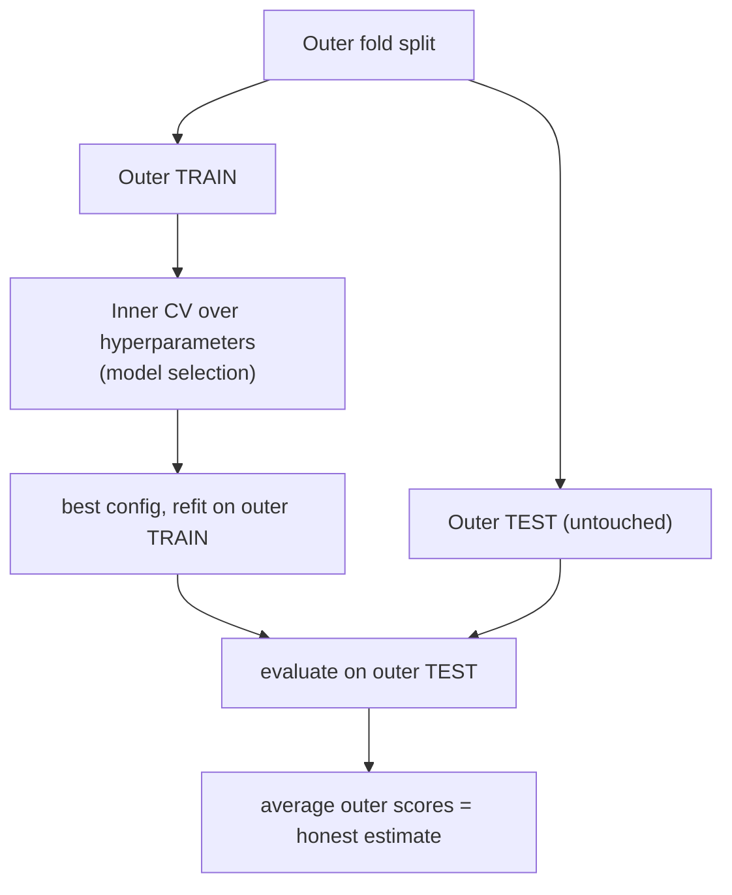

# 05.04 — Cross-Validation & Model Selection

> **Prerequisites**: [05.01](../01-bias-variance-and-theory/) (why held-out estimates matter),
> [05.02](../02-regression-metrics/)–[05.03](../03-classification-metrics/) (the metrics we are
> estimating), [06.06](../../06-ensembles/06-stacking/) (out-of-fold prediction, the same idea).
> **You will be able to**: estimate generalization honestly with $K$-fold CV, choose $K$ from the
> bias-variance of the *estimate*, avoid the leakage that inflates CV scores, and use nested CV so
> that tuning and evaluation do not contaminate each other.

---

## Table of contents

1. [Why one split is not enough](#1-why-one-split-is-not-enough)
2. [K-fold cross-validation](#2-k-fold-cross-validation)
3. [Choosing K — the bias-variance of the estimate](#3-choosing-k--the-bias-variance-of-the-estimate)
4. [Leave-one-out and its shortcut](#4-leave-one-out-and-its-shortcut)
5. [Stratification](#5-stratification)
6. [The one-standard-error rule](#6-the-one-standard-error-rule)
7. [The cardinal sin: leakage inside CV](#7-the-cardinal-sin-leakage-inside-cv)
8. [Nested cross-validation](#8-nested-cross-validation)
9. [When the folds must respect structure: time and groups](#9-when-the-folds-must-respect-structure-time-and-groups)
10. [The train / validation / test discipline](#10-the-train--validation--test-discipline)
11. [Common misconceptions](#11-common-misconceptions)

---

## 1. Why one split is not enough

To estimate how a model generalizes, you hold out data it did not train on. The simplest version — a
single train/test split — has two problems:

- **High variance.** The estimate depends on *which* points happened to land in the test set. On a
  small or unlucky split, the number can be off by a lot; run it with a different seed and you get a
  different answer. A single split gives you one noisy sample of the generalization error, with no
  sense of its uncertainty.
- **Wasted data.** Every point is used *either* for training *or* for testing, never both. On limited
  data, holding out 20% for a one-time estimate is a luxury you often cannot afford — the model would
  be better if it had seen those points, and the estimate would be tighter if more points were tested.

**Cross-validation** solves both by rotating the held-out set: every point is tested exactly once and
trained on the other times, and averaging over the rotations gives a lower-variance estimate that
uses all the data. Experiment 1 shows the CV estimate's standard deviation being a fraction of a
single split's.

---

## 2. K-fold cross-validation

Split the data into $K$ equal **folds**. For each fold $k$: train on the other $K-1$ folds, evaluate
on fold $k$. Average the $K$ scores:

$$
\mathrm{CV}(K) = \frac1K\sum_{k=1}^{K} \mathrm{score}\big(\text{model trained on all but fold } k,\ \text{fold } k\big).
$$

Every point is in the test fold exactly once, so all $n$ points contribute to the estimate, and each
model trains on a fraction $(K-1)/K$ of the data. The $K$ per-fold scores also give a **standard
deviation** — a free estimate of the estimate's own uncertainty, which a single split cannot provide.
The by-fold spread is as important as the mean: a high mean with a huge spread is not a reliable
model.

The from-scratch `KFold` and `cross_val_score` reproduce scikit-learn's exactly (Experiment's
verification block), because the protocol is simple — the subtleties are all in *what you put inside
the loop* (§7).

---

## 3. Choosing K — the bias-variance of the estimate

$K$ trades three things — and the object with the bias-variance tradeoff here is the **CV estimate
itself**, not the model:

- **Bias of the estimate.** Each fold's model trains on only $(K-1)/K$ of the data, so it is slightly
  *worse* than the model you will finally train on all $n$ points — CV is **pessimistically biased**.
  Small $K$ (say 2) trains on half the data and is noticeably pessimistic; large $K$ trains on nearly
  all of it and is nearly unbiased.
- **Variance of the estimate.** As $K\to n$ (leave-one-out), the $K$ training sets are nearly
  identical (they differ by one point), so the fold models are highly correlated and their errors do
  not average out — variance is high. Small $K$ has more independent folds, lower variance.
- **Compute.** $K$ model fits. LOO costs $n$ fits.

The standard compromise is **$K = 5$ or $K = 10$**: low enough bias (train on 80–90% of the data),
tolerable variance, affordable compute. This is not folklore — Experiment 2 measures bias falling and
variance rising as $K$ grows, with $K=5$–$10$ sitting in the sweet spot. Use 10 when you can afford
it, 5 when models are expensive.

---

## 4. Leave-one-out and its shortcut

**Leave-one-out CV (LOOCV)** is $K = n$: train on all but one point, test on that point, repeat $n$
times. It is *nearly unbiased* (each model trains on $n-1$ points) but has the **highest variance**
(§3) and costs $n$ fits — usually not worth it.

The exception is **linear models**, where LOOCV has a closed form and costs *nothing extra*. For a
linear smoother with hat matrix $H$ (so $\hat{\mathbf{y}} = H\mathbf{y}$), the LOOCV error is

$$
\mathrm{LOOCV} = \frac1n\sum_{i=1}^n \left(\frac{y_i - \hat y_i}{1 - H_{ii}}\right)^2,
$$

computed from a *single* fit — no refitting at all. The leverage $H_{ii}$ inflates the residual of
high-influence points exactly as removing them would. This identity (and its ridge/GCV cousin) is why
LOOCV is free for ridge regression and is used to tune its penalty. Experiment 4 verifies the shortcut
matches brute-force LOOCV to machine precision.

---

## 5. Stratification

On classification data — especially imbalanced — plain $K$-fold can deal a fold that contains *few or
none* of the minority class purely by chance, making that fold's score meaningless and the whole
estimate high-variance. **Stratified $K$-fold** fixes this by splitting *within each class*, so every
fold has (approximately) the same class proportions as the full dataset.

Stratification is the default for classification and essentially free. Its benefit grows as classes
get rarer: on a 5%-positive problem with $K=10$, a random fold might contain zero positives, giving an
undefined recall; stratification guarantees each fold carries its share. Experiment 5 shows plain
$K$-fold's per-fold scores swinging wildly on imbalanced data while stratified folds are stable.

---

## 6. The one-standard-error rule

When you use CV to *select* among models (a regularization strength, a tree depth), the model with the
best mean CV score is often barely better than simpler models, within the noise. The
**one-standard-error rule** (Breiman) says: compute the standard error of the CV estimate, and among
all models whose CV score is within **one SE of the best**, pick the **simplest** one.

The rationale is bias-variance: the CV curve is itself noisy, so the exact minimizer is partly luck;
choosing the simplest model within a SE of it buys robustness and guards against overfitting the
*model-selection* process to CV noise. It systematically prefers more regularization, shallower trees,
fewer features — a principled thumb on the scale toward simplicity. This is the standard way to read a
validation curve, and it pairs with §8's warning that selection itself must be validated.

---

## 7. The cardinal sin: leakage inside CV

Here is the mistake that silently inflates more reported results than any other. **Every step that
learns from the data — scaling, imputation, feature selection, target/mean encoding, dimensionality
reduction, resampling — must be fit *inside* each CV fold, on the training portion only.** Fit it on
the whole dataset before splitting and information from the held-out fold leaks into training, and
your CV score becomes optimistic — sometimes wildly so.

The most dramatic case is **feature selection on the full data**: pick the features most correlated
with the target using *all* rows, then cross-validate a model on those features. Even if the features
are **pure noise**, the ones that happened to correlate with $y$ across the whole set will keep
correlating within each fold — because they were chosen using the fold's own labels. Experiment 3
reproduces the classic result (Ambroise & McLachlan): a completely random feature matrix,
"validated" with selection-outside-CV, reports 90%+ accuracy on data with no signal at all. Move the
selection *inside* the fold and the accuracy collapses to chance, where it belongs.

> **The rule**: the CV loop must wrap the *entire* pipeline, from raw data to prediction. Anything
> fit before the split is a leak. In scikit-learn, put every step in a `Pipeline` and cross-validate
> the pipeline — never `fit_transform` the data and then cross-validate. This is the same
> use-only-the-held-out-part principle behind stacking's out-of-fold features
> ([06.06](../../06-ensembles/06-stacking/)) and CatBoost's ordered statistics
> ([06.05 §8](../../06-ensembles/05-modern-gbdts/)).

---

## 8. Nested cross-validation

There is a subtler leak, and it is everywhere. Suppose you use CV to **tune** hyperparameters (try
many, keep the best CV score) *and* report that best CV score as your estimate of performance. That
number is **optimistically biased**: you selected the configuration that looked best *on those very
folds*, so its CV score is partly a measure of how well you fit the CV noise. The more configurations
you try, the larger the optimism — tuning is itself a form of fitting, and it needs its own held-out
data.

**Nested cross-validation** separates the two jobs with two loops:

- **Inner loop** — on each outer training set, run CV over hyperparameters and pick the best. This is
  *model selection*.
- **Outer loop** — evaluate that selected model on the outer test fold, which the inner loop never
  touched. This is *performance estimation*.

The outer scores, averaged, are an honest estimate of "the performance of my whole tuning procedure."
Experiment 4 measures the gap: naive CV (tune and report on the same folds) reports a materially
better score than nested CV on the same data — the optimism is real and quantifiable. Report **nested
CV** (or a held-out test set the tuning never saw, §10) whenever you tuned anything.

---

## 9. When the folds must respect structure: time and groups

Random $K$-fold assumes the rows are **exchangeable** — i.i.d., no structure linking them. When that
fails, random folds leak and the CV score is a fantasy:

- **Time series.** Random folds let the model train on the *future* and test on the *past*, which it
  can never do at deployment. Use **forward-chaining** (`TimeSeriesSplit`): always train on a prefix
  and test on the next block, so training strictly precedes testing. Experiment 6 shows random
  $K$-fold reporting a great score on autocorrelated data that forward-chaining reveals as much worse.
- **Grouped data.** When rows cluster (multiple records per patient, per user, per image), a random
  split can put the same group in both train and test — the model memorizes the group, not the
  pattern. Use **`GroupKFold`**, which keeps each group entirely in one fold.
- **Spatial / blocked data.** Nearby points are correlated; use blocked or buffered CV so test blocks
  are separated from training.

The principle is one sentence: **the CV split must mimic the train/deploy gap.** If deployment means
predicting the future from the past, or a new patient from old patients, the folds must reproduce that
same gap — otherwise you are measuring interpolation and calling it generalization.

---

## 10. The train / validation / test discipline

Cross-validation fits inside a larger hygiene:

- **Training set** — fit model parameters.
- **Validation** (a held-out set or the CV folds) — tune hyperparameters and select models (§6, §8).
- **Test set** — touched **once**, at the very end, to report final performance. Every time you look
  at the test set and change something, it becomes part of your training signal and stops being an
  honest estimate.

CV replaces the fixed validation set with rotating folds (more data-efficient), and nested CV or a
locked-away test set provides the final honest number after tuning. The discipline is social as much
as statistical: the test set's value is destroyed the moment you optimize against it, so the only way
to keep an honest estimate is to not look. A leaderboard that you submit to repeatedly is a test set
you are slowly overfitting — which is why competitions keep a *private* test split.

---

## 11. Common misconceptions

**"A single 80/20 split is a fine estimate."**
It is one noisy sample with no uncertainty estimate and wastes 20% of the data. CV averages over
rotations, uses all the data, and reports a spread (§1–§2).

**"Bigger K is always better."**
$K\to n$ (LOO) minimizes bias but maximizes variance of the *estimate* and costs $n$ fits. $K=5$–$10$
is the standard bias-variance-compute compromise (§3).

**"I scaled / selected features / imputed before cross-validating — that's fine."**
That is leakage (§7). Any step that learns from the data must be fit inside each fold. Feature
selection on the full data can make pure noise look 90% accurate (Experiment 3).

**"My CV score after tuning is my expected performance."**
No — tuning on the same folds you report is optimistically biased. Use nested CV or a locked test set
(§8, §10). The more you tuned, the larger the optimism.

**"K-fold works for any data."**
Only for exchangeable rows. Time series need forward-chaining, grouped data need GroupKFold, or the
model trains on information it will not have at deployment (§9).

**"Stratification is optional."**
For classification, especially imbalanced, it prevents folds that miss the minority class and
stabilizes the estimate (§5). Use it by default.

---

## What's in this chapter

- **[from_scratch.py](from_scratch.py)** — `KFold`, `StratifiedKFold`, `LeaveOneOut`,
  `cross_val_score`, and nested CV in NumPy, verified against scikit-learn. Six experiments: (1) the
  CV estimate's low variance vs a single split; (2) the bias-variance of $K$ (LOO unbiased but
  high-variance, $K$=5–10 the sweet spot); (3) **the feature-selection leak** — pure noise "validated"
  to 90%+ when selection is outside the fold, chance when inside; (4) **nested vs naive CV** and the
  optimism gap; (5) stratification stabilizing imbalanced folds; (6) time-series leakage — random
  $K$-fold vs forward chaining. Plus the LOOCV closed-form shortcut verified to machine precision.
- **[exercises.md](exercises.md)** — derive the LOOCV shortcut, implement nested CV and GroupKFold,
  reproduce every experiment.
- **[references.md](references.md)** — ESL Ch. 7, the Ambroise-McLachlan and Cawley-Talbot leakage
  papers, the nested-CV literature.

**Next**: [05.05 — Hyperparameter Optimization](../05-hyperparameter-optimization/) — grid, random, and
Bayesian search over the very hyperparameters the inner CV loop is selecting.
