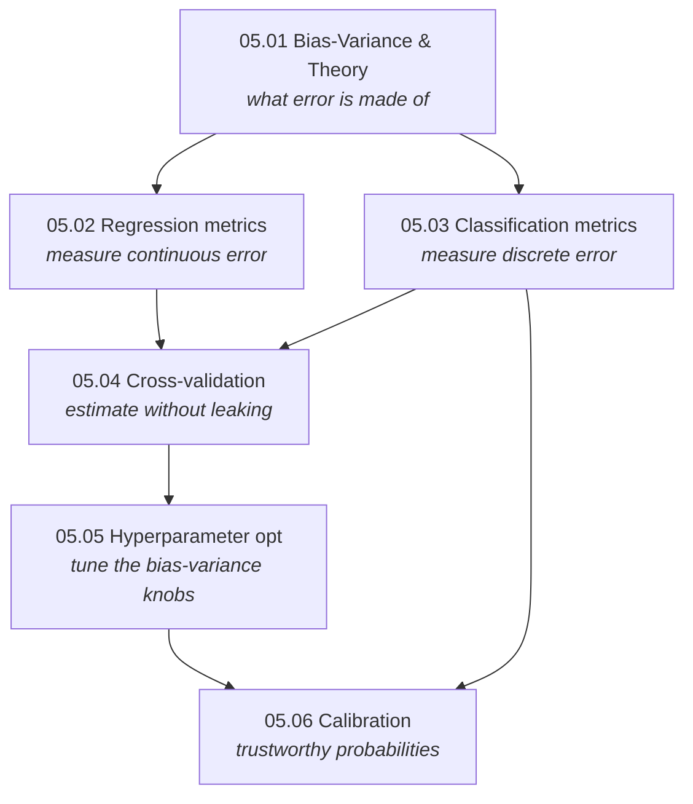

# Part 5 — Evaluation & Model Selection

> **A model you cannot evaluate honestly is a model you cannot trust.**
> This part is the discipline that separates a number that looks good from a number that *is* good:
> decompose the error, measure it with the right metric, estimate it without leaking, tune it without
> over-tuning, and make its probabilities mean what they say.

Every other part of this repository builds models; this part decides whether they *work*. It is the
most transferable material in machine learning — the algorithms change every few years, but the way
you validate them does not. Everything here is **measured, not asserted**: each chapter's
`from_scratch.py` reproduces its claims empirically and corrects the prose where the data disagrees.

## The one thread: honest estimation of generalization

A supervised model is fit on one finite sample and judged on data it has never seen. Everything in
this part is about estimating that unseen performance *without fooling yourself* — and every chapter
is a different way the estimate can lie, and the fix:

| Chapter | The question | The trap it removes |
|---|---|---|
| [05.01](01-bias-variance-and-theory/) | What is test error *made of*? | thinking complexity always helps (double descent) |
| [05.02](02-regression-metrics/) | How to *measure* a regression error? | RMSE vs MAE ranking the same models differently |
| [05.03](03-classification-metrics/) | How to *measure* a classifier? | 99% accuracy on 1%-positive data |
| [05.04](04-cross-validation/) | How to *estimate* the metric honestly? | leakage and tuning-on-the-test-set |
| [05.05](05-hyperparameter-optimization/) | How to *tune* efficiently? | over-tuning to CV noise |
| [05.06](06-calibration/) | Are the *probabilities* truthful? | high AUC with meaningless probabilities |

**Three ideas recur so often they are worth stating up front:**

1. **The metric is a modelling decision.** Each metric implies what "the right answer" is — MSE asks
   for the mean, MAE the median, a proper scoring rule the true probability. Choosing a metric
   silently chooses what you are optimizing for; get it wrong and no modelling can fix it.
2. **Any step that learns from data must live inside the validation fold.** Feature selection,
   scaling, encoding, calibration, hyperparameter tuning — fit any of them on data the estimate will
   be reported on and the estimate is a fantasy. This is one principle (use only held-out data)
   behind cross-validation, nested CV, stacking's out-of-fold features, and leakage-free calibration.
3. **Selection is itself fitting.** Picking the best of many models, hyperparameters, or thresholds
   overfits the selection to noise. The reported score of the *winner* is optimistic; only a further
   held-out estimate (nested CV, a locked test set) is honest.

## Chapters

| # | Chapter | The one idea | Status |
|---|---|---|:--:|
| 05.01 | [Bias-Variance & Learning Theory](01-bias-variance-and-theory/) | test error = noise + bias² + variance; VC bounds; double descent | 🟢 |
| 05.02 | [Regression Metrics](02-regression-metrics/) | each metric's optimal constant reveals what it asks for | 🟢 |
| 05.03 | [Classification Metrics](03-classification-metrics/) | accuracy lies under imbalance; AUC is a ranking probability | 🟢 |
| 05.04 | [Cross-Validation](04-cross-validation/) | estimate honestly; leakage and nested CV | 🟢 |
| 05.05 | [Hyperparameter Optimization](05-hyperparameter-optimization/) | random > grid; Bayesian opt; don't over-tune | 🟢 |
| 05.06 | [Calibration](06-calibration/) | make the probabilities mean what they say | 🟢 |

## How the chapters connect

Bias-variance ([05.01](01-bias-variance-and-theory/)) defines the error; the metrics chapters
([05.02](02-regression-metrics/)–[05.03](03-classification-metrics/)) measure it; cross-validation
([05.04](04-cross-validation/)) estimates it honestly; hyperparameter optimization
([05.05](05-hyperparameter-optimization/)) tunes the knobs that trade bias for variance; and
calibration ([05.06](06-calibration/)) makes the classifier's probabilities usable.

## What every chapter contains

- **`README.md`** — the full theory, with claims checked against measurements and the prose corrected
  where the code disagrees (e.g. double descent's second descent, the RMSE/MAE ranking reversal, the
  cost-optimal threshold matching the Bayes formula only when calibrated).
- **`from_scratch.py`** — NumPy implementations verified against `scikit-learn` (and `xgboost` where
  relevant), plus experiments that *measure* each claim.
- **`exercises.md`** — derivation, implementation, and interview tiers, with checkpoints.
- **`references.md`** — the exact papers and book sections behind every section.

## Where this connects

- **The models being evaluated** → [Part 3](../03-supervised-learning/), [Part 6](../06-ensembles/),
  [Part 7](../07-deep-learning/)
- **Regularization — the bias-variance knob in action** → [03.02](../03-supervised-learning/02-regularized-linear-models/)
- **Ensembles — bagging attacks variance, boosting attacks bias** → [Part 6](../06-ensembles/)
- **Data leakage in the wider pipeline** → [02.06](../02-data/06-data-leakage/)
- **Deep-learning generalization, where double descent lives** → [Part 7](../07-deep-learning/)
