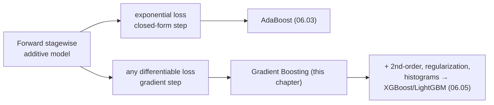

# 06.04 — Gradient Boosting

> **Prerequisites**: [06.03](../03-boosting-theory/) (forward stagewise additive modelling and the
> exponential-loss view — this chapter generalizes it),
> [03.08](../../03-supervised-learning/08-decision-trees/) (the regression tree, now used as the base
> learner), [00.02](../../00-mathematical-foundations/02-calculus-and-optimization/) (gradient
> descent, which we are about to run in function space).
> **You will be able to**: derive gradient boosting as gradient descent in function space, implement
> it for squared / absolute / Huber / log loss from scratch, explain why shrinkage and subsampling
> regularize, and say precisely why the number of trees overfits here but not in a random forest.

---

## Table of contents

1. [One idea: free the loss](#1-one-idea-free-the-loss)
2. [Boosting as gradient descent in function space](#2-boosting-as-gradient-descent-in-function-space)
3. [The algorithm (Friedman 2001)](#3-the-algorithm-friedman-2001)
4. [Squared loss: boosting is just fitting residuals](#4-squared-loss-boosting-is-just-fitting-residuals)
5. [Absolute and Huber loss: robust regression](#5-absolute-and-huber-loss-robust-regression)
6. [Log loss: gradient boosting for classification](#6-log-loss-gradient-boosting-for-classification)
7. [Shrinkage — the learning rate](#7-shrinkage--the-learning-rate)
8. [Stochastic gradient boosting](#8-stochastic-gradient-boosting)
9. [Tree depth and interaction order](#9-tree-depth-and-interaction-order)
10. [Why the number of trees overfits here but not in a forest](#10-why-the-number-of-trees-overfits-here-but-not-in-a-forest)
11. [Regularization, all together](#11-regularization-all-together)
12. [Gradient boosting vs AdaBoost vs random forest](#12-gradient-boosting-vs-adaboost-vs-random-forest)
13. [Common misconceptions](#13-common-misconceptions)

---

## 1. One idea: free the loss

AdaBoost ([06.03](../03-boosting-theory/)) turned out to be forward stagewise additive modelling
under one specific loss — the exponential loss $e^{-yF}$. That loss was never chosen for a good
statistical reason; it just happened to make the per-round subproblem solvable in closed form (the
vote $\alpha_m = \tfrac12\ln\frac{1-\mathrm{err}_m}{\mathrm{err}_m}$). Its steep left tail is what
makes AdaBoost aggressive on clean data and fragile on noisy data ([06.03 §8, §10](../03-boosting-theory/)).

Gradient boosting (Friedman, 2001) asks: **what if we keep the forward stagewise scaffold but allow
any differentiable loss?** We still build

$$
F_M(\mathbf{x}) = \sum_{m=1}^{M} \nu\, h_m(\mathbf{x}),
$$

one base learner at a time, each correcting the current model. But now the per-round subproblem
$\min_{h}\sum_i L\big(y_i,\, F_{m-1}(\mathbf{x}_i) + h(\mathbf{x}_i)\big)$ has no closed form for a
general $L$. Friedman's insight is to **not solve it exactly** — instead take a single gradient
step. That one move buys us squared loss, absolute loss, Huber, log loss, Poisson, quantile — any
loss with a derivative. It is the whole chapter.

---

## 2. Boosting as gradient descent in function space

Here is the shift in viewpoint that makes everything fall out.

Ordinary gradient descent minimizes $J(\boldsymbol\theta)$ over a **parameter vector** by stepping
along $-\nabla_{\boldsymbol\theta}J$. Gradient boosting minimizes the training loss over a
**function** $F$ by stepping along the negative gradient of the loss *with respect to the function's
values at the training points.*

Treat the model as the vector of its predictions on the training set,
$\mathbf{F} = (F(\mathbf{x}_1),\dots,F(\mathbf{x}_n))$. The total training loss is

$$
J(\mathbf{F}) = \sum_{i=1}^{n} L\big(y_i, F(\mathbf{x}_i)\big).
$$

Its gradient has one component per training point:

$$
g_i = \frac{\partial L\big(y_i, F(\mathbf{x}_i)\big)}{\partial F(\mathbf{x}_i)}.
$$

Steepest descent says: move $\mathbf{F}$ in the direction $-\mathbf{g}$. The negative gradient
component

$$
r_i = -g_i = -\left[\frac{\partial L(y_i, F(\mathbf{x}_i))}{\partial F(\mathbf{x}_i)}\right]_{F=F_{m-1}}
$$

is called the **pseudo-residual**: it is the direction, at point $\mathbf{x}_i$, in which nudging
the prediction most reduces that point's loss.

But $-\mathbf{g}$ is defined only at the $n$ training points. To get a step we can apply *everywhere*
— to new $\mathbf{x}$ — we fit a base learner (a regression tree) $h_m$ to the pseudo-residuals:

$$
h_m = \arg\min_{h}\sum_{i=1}^{n}\big(r_i - h(\mathbf{x}_i)\big)^2.
$$

The tree is the **generalizable approximation to the negative gradient**. We then take a step of
size $\nu$ (the learning rate) in that direction:

$$
F_m = F_{m-1} + \nu\, h_m.
$$

> **This is the entire idea.** Gradient boosting is gradient descent where each "step" is a whole
> regression tree fit to the negative gradient of the loss. Change the loss and only one line
> changes — the formula for $r_i$. Everything else (fit a tree to $r_i$, add it) is identical.

---

## 3. The algorithm (Friedman 2001)

Friedman's *Gradient Boosting Machine* refines §2 with one improvement: instead of scaling the whole
tree by a single line-searched step, it fits the tree's **structure** (its terminal regions
$R_{jm}$) to the pseudo-residuals, then re-optimizes the **value** in each leaf against the actual
loss.

**Input**: data $\lbrace(\mathbf{x}_i, y_i)\rbrace_{i=1}^n$, loss $L$, rounds $M$, learning rate
$\nu$, tree size $J$.

1. **Initialize** with the best constant:
   $$
   F_0(\mathbf{x}) = \arg\min_{\gamma}\sum_{i=1}^n L(y_i, \gamma).
   $$
2. **For** $m = 1$ to $M$:
   1. **Pseudo-residuals** — the negative gradient at the current model:
      $$
      r_{im} = -\left[\frac{\partial L(y_i, F(\mathbf{x}_i))}{\partial F(\mathbf{x}_i)}\right]_{F=F_{m-1}}, \quad i = 1,\dots,n.
      $$
   2. **Fit a regression tree** to the targets $r_{im}$, giving terminal regions $R_{jm}$,
      $j = 1,\dots,J_m$.
   3. **Per-leaf line search** — for each region choose the value that minimizes the *real* loss,
      not the squared error to the residual:
      $$
      \gamma_{jm} = \arg\min_{\gamma}\sum_{\mathbf{x}_i \in R_{jm}} L\big(y_i,\, F_{m-1}(\mathbf{x}_i) + \gamma\big).
      $$
   4. **Update**:
      $$
      F_m(\mathbf{x}) = F_{m-1}(\mathbf{x}) + \nu \sum_{j=1}^{J_m}\gamma_{jm}\,\mathbb{1}[\mathbf{x}\in R_{jm}].
      $$
3. **Output** $F_M$.

Two subtleties earn their keep:

- **Why re-optimize the leaf value (step 2.3)?** The tree was grown to match the *gradient*, which
  points in the right direction but has the wrong magnitude for a general loss. For squared loss the
  gradient and the optimal leaf value coincide, so this step is a no-op. For absolute or log loss
  they differ, and skipping it hurts. For log loss the minimization has no closed form and we take a
  single Newton step (§6).
- **Why fit the tree to the gradient rather than minimize the loss directly?** Because fitting a
  tree by *squared error* is cheap and solved (it is just [03.08](../../03-supervised-learning/08-decision-trees/)'s
  regression tree). We offload the hard, loss-specific part to a scalar optimization inside each
  leaf, where it is one-dimensional.

---

## 4. Squared loss: boosting is just fitting residuals

Take $L(y, F) = \tfrac12 (y - F)^2$. Then

$$
r_i = -\frac{\partial}{\partial F}\tfrac12(y_i - F)^2\Big|_{F_{m-1}} = y_i - F_{m-1}(\mathbf{x}_i).
$$

The pseudo-residual is **literally the residual**. And the per-leaf line search minimizes
$\sum_{R_{jm}}\tfrac12(y_i - F_{m-1} - \gamma)^2$, whose solution is the mean residual in the leaf —
exactly what the regression tree already predicts. So for squared loss:

> Gradient boosting = fit a tree to the residuals, add a shrunk version, repeat.

This is the picture everyone learns first, and it is correct — but it is *one loss*. The residual is
the negative gradient of the squared loss and nothing more fundamental. The moment you change the
loss, "fit the residuals" becomes "fit the negative gradient," and the two part ways. Keeping this
distinction straight is the difference between using gradient boosting and understanding it.

The initial constant is $F_0 = \bar y$ (the mean minimizes squared error), matching
[00.04](../../00-mathematical-foundations/04-statistics-and-inference/).

---

## 5. Absolute and Huber loss: robust regression

Squared loss weights an error quadratically, so a single gross outlier can dominate the whole
objective — the same fragility that sinks AdaBoost's exponential loss. Change the loss and gradient
boosting becomes robust *for free.*

**Absolute loss** $L(y, F) = |y - F|$:

$$
r_i = -\frac{\partial}{\partial F}|y_i - F|\Big|_{F_{m-1}} = \mathrm{sign}\big(y_i - F_{m-1}(\mathbf{x}_i)\big).
$$

The pseudo-residual is just $\pm 1$: every point, no matter how far off, pulls the model the same
amount. An outlier 1000 units away gets no more say than one 1 unit away. The per-leaf value becomes
the **median** residual (the minimizer of absolute loss), not the mean — a robust update.

**Huber loss** blends the two: quadratic within a band $|y - F| \le \delta$, linear outside it:

$$
L_\delta(y, F) =
\begin{cases}
\tfrac12 (y - F)^2 & |y - F| \le \delta, \\
\delta\big(|y - F| - \tfrac12\delta\big) & |y - F| > \delta.
\end{cases}
$$

Its gradient is $-(y - F)$ for small residuals and $-\delta\,\mathrm{sign}(y - F)$ for large ones:
quadratic sensitivity near the fit, capped influence in the tail. Friedman recommends setting
$\delta$ to a quantile (e.g. the $\alpha=0.9$ quantile) of the current residuals each round, so the
transition adapts to the data's scale.

Experiment 3 injects outliers and shows squared-loss boosting chasing them while Huber holds the
line — the concrete payoff of freeing the loss.

---

## 6. Log loss: gradient boosting for classification

For binary $y \in \lbrace 0, 1\rbrace$ the model $F$ is a **log-odds** score, and the probability is
$p = \sigma(F) = 1/(1 + e^{-F})$. The loss is the binomial deviance (negative log-likelihood):

$$
L(y, F) = -\big[y\log p + (1-y)\log(1-p)\big] = \log\big(1 + e^{F}\big) - yF.
$$

Its gradient is the cleanest formula in all of boosting:

$$
r_i = -\frac{\partial L}{\partial F}\Big|_{F_{m-1}} = y_i - \sigma\big(F_{m-1}(\mathbf{x}_i)\big) = y_i - p_i.
$$

The pseudo-residual is the **probability error** $y_i - p_i$. A point the model already calls
confidently and correctly ($p \approx y$) generates almost no gradient; a confident *mistake*
generates a large one. This is exactly LogitBoost, and it is why gradient boosting with log loss is
gentler on noise than AdaBoost: the residual saturates at $\pm 1$ instead of blowing up
exponentially ([06.03 §10](../03-boosting-theory/)).

The per-leaf line search $\min_\gamma \sum_{R_{jm}} L(y_i, F_{m-1} + \gamma)$ has **no closed form**.
Friedman uses one Newton step, which gives the standard leaf value

$$
\gamma_{jm} = \frac{\sum_{\mathbf{x}_i \in R_{jm}} (y_i - p_i)}{\sum_{\mathbf{x}_i \in R_{jm}} p_i(1 - p_i)} = \frac{\sum r_i}{\sum p_i(1 - p_i)}.
$$

Numerator: sum of residuals (the gradient). Denominator: sum of $p(1-p)$ (the Hessian). This
**ratio of gradient to Hessian** is precisely the second-order update that XGBoost later makes the
centerpiece of its objective ([06.05](../05-modern-gbdts/)) — you are already looking at it. The
initial constant is the log-odds of the base rate, $F_0 = \log\frac{\bar y}{1 - \bar y}$.

Multiclass uses the softmax / multinomial deviance with one additive model $F_k$ per class and
pseudo-residual $r_{ik} = \mathbb{1}[y_i = k] - p_{ik}$ — a direct generalization we implement in
`from_scratch.py`.

---

## 7. Shrinkage — the learning rate

The update multiplies each tree by $\nu \in (0, 1]$:

$$
F_m = F_{m-1} + \nu\sum_j \gamma_{jm}\mathbb{1}[\mathbf{x}\in R_{jm}].
$$

With $\nu = 1$ each tree takes a full greedy step. Friedman found — and Experiment 2 reproduces —
that **shrinking the step and adding more trees generalizes markedly better.** Small $\nu$ (0.01–0.1)
with large $M$ beats $\nu = 1$ with small $M$, often by a lot.

Why does slowing down help? Two ways to see it:

- **Fewer greedy commitments.** A full step lets one tree overreact to the current residuals,
  baking its idiosyncrasies into $F$. Small steps mean no single tree dominates; the ensemble
  averages over many gentle corrections, like a lower learning rate smoothing SGD.
- **Regularization path.** Shrinkage traces a smoother path through function space. Empirically it
  behaves like an $L_1$ penalty on the tree coefficients — it prefers using many small trees over a
  few large ones, which is the boosting analogue of the lasso's sparsity ([03.04](../../03-supervised-learning/04-regularization/)).

The cost is compute: $\nu$ and $M$ trade off almost reciprocally, so halving $\nu$ roughly doubles
the trees you need. The standard recipe is **fix a small $\nu$, then choose $M$ by early stopping on
a validation set** (§10). $\nu$ and $M$ are not independent knobs; they are one knob (total step
budget) split into resolution and length.

---

## 8. Stochastic gradient boosting

Friedman's 2002 follow-up adds one line: at each round, fit the tree on a **random subsample** (no
replacement) of a fraction $\eta$ of the training rows, typically $\eta = 0.5$–$0.8$.

This helps three ways at once:

- **Variance reduction by decorrelation.** Different rows each round make consecutive trees less
  correlated, the same mechanism as bagging ([06.01](../01-bagging/)) — a dose of variance reduction
  inside a bias-reduction method.
- **Regularization.** The subsample injects noise into the gradient, which (as in SGD) keeps the
  model from fitting the training set too precisely. Experiment 5 shows a modest but real test-error
  improvement.
- **Speed.** Each tree sees a fraction of the data, so training is proportionally faster.

Column subsampling (a random subset of *features* per tree or per split, borrowed from random
forests) is the other stochastic knob, and the modern libraries ([06.05](../05-modern-gbdts/)) expose
both. The lesson is that boosting and bagging are not opposites to choose between — a pinch of
bagging's randomness makes boosting better.

---

## 9. Tree depth and interaction order

The base learner's **depth** controls the highest-order feature interaction the ensemble can
represent. A tree of depth $J$ (with $J$ splits along a root-to-leaf path) can model interactions
among up to $J$ features; a stump ($J = 1$) is purely additive — a sum of one-variable functions,
i.e. a GAM ([03.05](../../03-supervised-learning/05-splines-and-gams/)).

- **Depth 1 (stumps)**: the boosted model is additive, no interactions. Interpretable, but blind to
  any effect that requires two features acting jointly.
- **Depth 4–8**: captures three- to seven-way interactions. This is the usual sweet spot; Friedman
  suggests $4 \le J \le 8$ and notes $J = 6$ is a good default.
- **Very deep**: each tree becomes a low-bias, high-variance learner — the wrong base learner for
  boosting, which wants *weak* learners it can add slowly. Deep trees overfit in few rounds.

This mirrors AdaBoost's "weak on purpose" principle ([06.03 §11](../03-boosting-theory/)): boosting
reduces bias by *accumulation*, so each learner should be biased and cheap, not a fully grown tree.
Contrast random forests, which want *deep, low-bias* trees and reduce their variance by averaging —
opposite base-learner design for opposite goals.

---

## 10. Why the number of trees overfits here but not in a forest

This is the single most important practical difference between boosting and bagging, and it follows
directly from §2.

A **random forest** averages $B$ i.i.d. trees: $\frac1B\sum_b T_b$. Adding trees only refines a
Monte-Carlo average toward its expectation; the target the average converges to does not move. So
$B$ cannot overfit — it is a variance knob that monotonically helps and then flatlines
([06.02 §5](../02-random-forests/)).

**Gradient boosting** is not an average — it is a **sum that keeps descending the training loss.**
Each tree drives $\sum_i L(y_i, F(\mathbf{x}_i))$ lower, and nothing stops it from driving the
*training* loss toward zero and the *test* loss back up. More trees means a lower point on the
training-loss surface, which past a point means memorizing noise. $M$ is therefore a genuine
capacity/complexity knob, not a variance knob:

| | random forest | gradient boosting |
|---|---|---|
| trees combined by | averaging (i.i.d.) | additive descent (sequential) |
| more trees → | lower variance, then flat | lower **training** loss, eventually overfits |
| is $n_{\text{estimators}}$ a regularizer? | no — more is safe | **yes — fewer trees regularizes** |
| how to set it | "enough" (a few hundred) | **early stopping on validation** |

So the correct way to choose $M$ is to watch validation loss and **stop when it starts rising**
(early stopping), keeping the $M^\star$ that minimized it. Experiment 4 shows the two curves
side by side: the forest's test error flattening, the booster's turning back up. Getting this one
distinction right prevents the most common gradient-boosting mistake — setting `n_estimators` high
"to be safe," which is exactly backwards.

---

## 11. Regularization, all together

Gradient boosting has an unusually rich set of regularizers, and good models use several at once:

| Knob | Effect | Typical |
|---|---|---|
| **Learning rate $\nu$** | shrinks each step; smaller = smoother, needs more trees | 0.01–0.1 |
| **Number of trees $M$** | capacity; set by early stopping | 100–10000 (with small $\nu$) |
| **Tree depth $J$** | max interaction order; capacity per tree | 3–8 |
| **Subsample $\eta$** (rows) | decorrelates trees, injects noise | 0.5–0.9 |
| **Column subsample** | decorrelates trees, à la random forest | 0.5–1.0 |
| **Min samples per leaf** | keeps leaf estimates stable | ≥ a few |
| **$L_2$ penalty on leaf values** | shrinks the $\gamma_{jm}$ toward 0 (XGBoost's $\lambda$) | tuned |

Two mental groupings help. $\nu$ and $M$ set the **total step budget** (resolution × length). Depth,
min-leaf, and the leaf penalty set **per-tree capacity**. Row/column subsampling add **bagging-style
variance reduction**. Nearly all of the gap between a mediocre and a state-of-the-art gradient
boosting model is tuning these against a validation set — the algorithm is the easy part.

---

## 12. Gradient boosting vs AdaBoost vs random forest

| | Random forest | AdaBoost | Gradient boosting |
|---|---|---|---|
| **Reduces** | variance | bias | bias (variance via subsampling) |
| **Base learners** | deep, low-bias trees | weak (stumps) | shallow trees (depth 3–8) |
| **Combined by** | averaging (parallel) | weighted vote (sequential) | additive descent (sequential) |
| **Loss** | none (splitting criterion only) | exponential (fixed) | **any differentiable** |
| **Reweighting mechanism** | none | sample weights | pseudo-residuals (= neg. gradient) |
| **Noise robustness** | high | low (exp. tail) | **tunable via the loss** (Huber, log) |
| **`n_estimators`** | safe to increase | can overfit | **overfits — early stop** |
| **Parallel across trees** | yes | no | no |
| **Typical accuracy on tabular** | strong | dated | **usually best (via 06.05)** |

AdaBoost is the special case of gradient boosting with exponential loss and a closed-form step;
gradient boosting frees the loss, which is what makes it the workhorse. The next chapter
([06.05](../05-modern-gbdts/)) frees the *speed and regularization*: second-order (Newton) leaf
updates — you already met the gradient/Hessian ratio in §6 — plus an explicit regularized objective,
histogram-based split finding, and the systems engineering behind XGBoost, LightGBM, and CatBoost.

---

## 13. Common misconceptions

**"Gradient boosting fits the residuals."**
Only under squared loss. In general it fits the *negative gradient* of the loss (§2). For log loss
that is $y - p$; for absolute loss it is $\mathrm{sign}(y - F)$. Saying "residuals" hides the one
idea that makes the method general.

**"More trees is always better, like in a random forest."**
Backwards. In a forest, trees are averaged and more is safe. In boosting, trees are summed to descend
the training loss, so past $M^\star$ they overfit. Use early stopping (§10).

**"The learning rate and the number of trees are separate hyperparameters to tune independently."**
They trade off almost reciprocally: they are one budget (total step size) split into resolution
($\nu$) and length ($M$). Fix a small $\nu$ and choose $M$ by early stopping (§7).

**"AdaBoost and gradient boosting are different algorithms."**
Gradient boosting *is* forward stagewise additive modelling — AdaBoost's own framework — with the
loss generalized and the exact step replaced by a gradient step. AdaBoost is the exponential-loss
special case (§1, [06.03 §7](../03-boosting-theory/)).

**"Deeper trees make a stronger booster."**
Only up to a point. Boosting wants *weak* learners it can add slowly; deep trees are low-bias,
high-variance and overfit in a few rounds (§9). Depth controls interaction order, not raw strength.

**"Gradient boosting is inherently noise-fragile like AdaBoost."**
That fragility is a property of the *exponential loss*, not of boosting. Switch to Huber or log loss
and the gradient saturates instead of exploding (§5, §6). The whole point of freeing the loss is to
choose a robust one.

---

## What's in this chapter

- **[from_scratch.py](from_scratch.py)** — gradient boosting in NumPy: a compact regression-tree base
  learner, `GradientBoostingRegressor` (squared / absolute / Huber loss), and
  `GradientBoostingClassifier` (binary + multiclass log loss), each verified against scikit-learn.
  Five experiments: (1) squared-loss pseudo-residuals *are* the residuals; (2) shrinkage — small
  $\nu$ + many trees wins; (3) robust loss beats squared under outliers; (4) $M$ overfits (boosting)
  while $B$ does not (forest), with early stopping; (5) stochastic subsampling helps.
- **[exercises.md](exercises.md)** — derive the leaf-value Newton step, implement quantile-loss
  boosting, reproduce every experiment.
- **[references.md](references.md)** — Friedman's two papers, ESL Ch. 10, and the reference
  implementations.

**Next**: [06.05 — XGBoost / LightGBM / CatBoost](../05-modern-gbdts/) makes the gradient/Hessian
step of §6 the whole objective, adds regularization and histogram splits, and turns gradient boosting
into the tabular-data workhorse.
