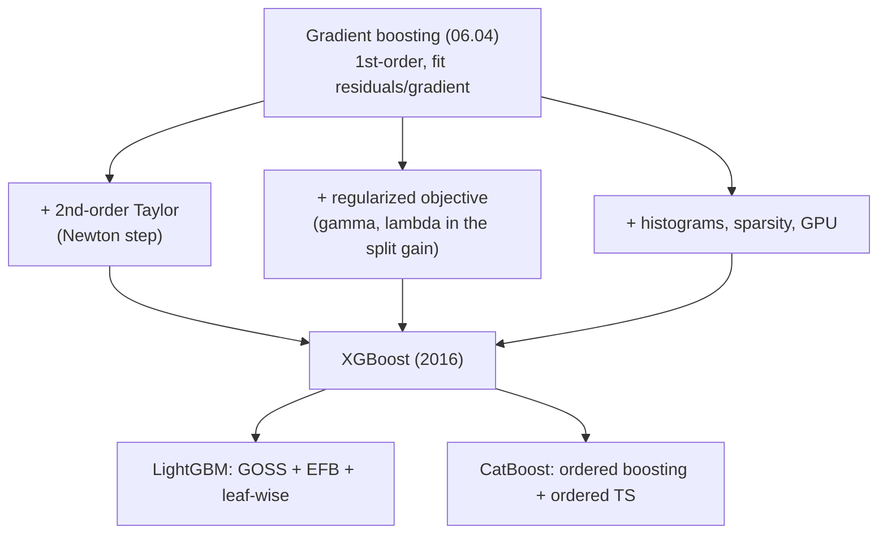
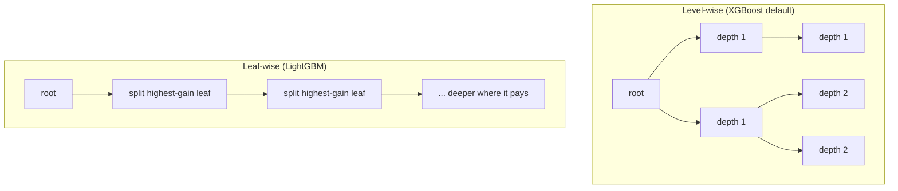

# 06.05 — XGBoost, LightGBM & CatBoost

> **Prerequisites**: [06.04](../04-gradient-boosting/) (gradient boosting — this chapter adds
> second-order info, regularization, and systems engineering to it),
> [03.08](../../03-supervised-learning/08-decision-trees/) (split finding),
> [00.02 §7](../../00-mathematical-foundations/02-calculus-and-optimization/) (Newton's method — the
> second-order step is exactly this).
> **You will be able to**: derive XGBoost's regularized second-order objective and its split-gain
> formula from a Taylor expansion, explain histogram split finding, GOSS, EFB, leaf-wise growth,
> ordered boosting, and ordered target statistics, and say which library to reach for and why.

---

## Table of contents

1. [The gap between the theory and the tool](#1-the-gap-between-the-theory-and-the-tool)
2. [The regularized objective](#2-the-regularized-objective)
3. [The second-order (Newton) step](#3-the-second-order-newton-step)
4. [The optimal leaf weight and the structure score](#4-the-optimal-leaf-weight-and-the-structure-score)
5. [The split-gain formula — the heart of XGBoost](#5-the-split-gain-formula--the-heart-of-xgboost)
6. [Histogram split finding](#6-histogram-split-finding)
7. [LightGBM: GOSS, EFB, and leaf-wise growth](#7-lightgbm-goss-efb-and-leaf-wise-growth)
8. [CatBoost: ordered boosting and ordered target statistics](#8-catboost-ordered-boosting-and-ordered-target-statistics)
9. [Categorical features and missing values](#9-categorical-features-and-missing-values)
10. [Which library, and when](#10-which-library-and-when)
11. [Why GBDTs still beat deep nets on tabular data](#11-why-gbdts-still-beat-deep-nets-on-tabular-data)
12. [Common misconceptions](#12-common-misconceptions)

---

## 1. The gap between the theory and the tool

Gradient boosting ([06.04](../04-gradient-boosting/)) is the algorithm. XGBoost, LightGBM, and
CatBoost are what happens when three teams spend years closing the gap between that algorithm and a
tool that wins Kaggle competitions and runs in production. Almost everything they add falls into
three buckets:

- **A better step** — use the *second derivative* of the loss, not just the first (Newton, not
  gradient descent). This is the mathematical core, and it is where the log-loss leaf value of
  [06.04 §6](../04-gradient-boosting/) — the gradient/Hessian ratio — becomes the whole objective.
- **An explicit regularizer** — put the penalty on tree complexity *inside* the objective that
  chooses the splits, so the tree is grown to trade fit against complexity directly.
- **Systems engineering** — histograms, sparsity-aware split finding, cache-friendly layouts,
  parallelism, GPU kernels. This is why they are fast, and most of the differences between the three
  libraries live here.

This chapter derives the first two from scratch (they are a page of algebra) and explains the third
conceptually. The `from_scratch.py` implements the second-order booster and checks it against the
real XGBoost library.

---

## 2. The regularized objective

At round $t$ we add one tree $f_t$ to the current model $F_{t-1}$. XGBoost writes the objective as
loss **plus an explicit complexity penalty** on the new tree:

$$
\mathcal{L}^{(t)} = \sum_{i=1}^{n} L\big(y_i,\, F_{t-1}(\mathbf{x}_i) + f_t(\mathbf{x}_i)\big) + \Omega(f_t),
\qquad
\Omega(f) = \gamma T + \tfrac12 \lambda \sum_{j=1}^{T} w_j^2 .
$$

Here $T$ is the number of leaves, $w_j$ the weight (output value) in leaf $j$, $\gamma$ a penalty per
leaf (it discourages splitting), and $\lambda$ an $L_2$ penalty on the leaf weights (it shrinks them
toward zero). This is the crucial move: the penalty is not a post-hoc pruning heuristic — it sits
*inside* the objective, so the tree-growing algorithm optimizes fit and complexity together.
Plain gradient boosting ([06.04](../04-gradient-boosting/)) is the special case $\gamma = \lambda = 0$.

---

## 3. The second-order (Newton) step

The loss $L(y_i, F_{t-1} + f_t)$ is awkward to minimize in $f_t$ for a general $L$. XGBoost expands
it to **second order** in $f_t$ with a Taylor series around $F_{t-1}$:

$$
L\big(y_i, F_{t-1} + f_t(\mathbf{x}_i)\big) \approx
L\big(y_i, F_{t-1}\big) + g_i\, f_t(\mathbf{x}_i) + \tfrac12 h_i\, f_t(\mathbf{x}_i)^2,
$$

where

$$
g_i = \frac{\partial L(y_i, F)}{\partial F}\Big|_{F_{t-1}}
\quad(\text{gradient}),
\qquad
h_i = \frac{\partial^2 L(y_i, F)}{\partial F^2}\Big|_{F_{t-1}}
\quad(\text{Hessian}).
$$

Gradient boosting ([06.04](../04-gradient-boosting/)) uses only $g_i$ (first order); XGBoost adds
$h_i$, the curvature. Dropping the constant $L(y_i, F_{t-1})$ (it does not depend on $f_t$), the
objective becomes a clean quadratic in the tree's outputs:

$$
\tilde{\mathcal{L}}^{(t)} = \sum_{i=1}^{n}\Big[ g_i f_t(\mathbf{x}_i) + \tfrac12 h_i f_t(\mathbf{x}_i)^2 \Big] + \gamma T + \tfrac12\lambda\sum_j w_j^2 .
$$

Using curvature is exactly Newton's method in function space: where gradient descent steps by
$-g$, Newton steps by $-g/h$, accounting for how fast the gradient itself is changing. For log loss
$g_i = p_i - y_i$ and $h_i = p_i(1 - p_i)$, and you are about to see the leaf value
$-\sum g/\sum h$ from [06.04 §6](../04-gradient-boosting/) fall out as a special case.

---

## 4. The optimal leaf weight and the structure score

A tree assigns every point to a leaf. Let $I_j = \lbrace i : \mathbf{x}_i \text{ falls in leaf } j\rbrace$
be the instance set of leaf $j$, and let all points in that leaf share the weight $w_j$. Group the
sum in $\tilde{\mathcal{L}}^{(t)}$ by leaf and define the leaf's totals

$$
G_j = \sum_{i \in I_j} g_i, \qquad H_j = \sum_{i \in I_j} h_i .
$$

Then

$$
\tilde{\mathcal{L}}^{(t)} = \sum_{j=1}^{T}\Big[ G_j w_j + \tfrac12(H_j + \lambda) w_j^2 \Big] + \gamma T .
$$

For a **fixed tree structure**, each leaf's weight is an independent one-variable quadratic. Setting
the derivative to zero, $G_j + (H_j + \lambda) w_j = 0$, gives the **optimal leaf weight**

$$
\boxed{\; w_j^\star = -\frac{G_j}{H_j + \lambda} \;}
$$

— gradient over Hessian, with $\lambda$ regularizing the denominator. (Compare [06.04 §6](../04-gradient-boosting/):
there the log-loss leaf was $\sum(y-p)/\sum p(1-p)$; here it is the *same ratio* for any loss, with
an $L_2$ term added.) Substituting $w_j^\star$ back gives the **structure score** — the best
achievable objective for that tree shape:

$$
\tilde{\mathcal{L}}^{(t)}(\text{structure}) = -\frac12 \sum_{j=1}^{T} \frac{G_j^2}{H_j + \lambda} + \gamma T .
$$

Lower is better. The term $\frac{G_j^2}{H_j + \lambda}$ is a per-leaf "quality," and $\gamma T$ pays
a fixed price per leaf. This single scalar is how XGBoost scores an entire tree.

---

## 5. The split-gain formula — the heart of XGBoost

We cannot enumerate all tree structures, so XGBoost grows greedily, exactly like CART
([03.08](../../03-supervised-learning/08-decision-trees/)) — but with the structure score of §4 as
the splitting criterion instead of Gini or SSE. Splitting one leaf (totals $G, H$) into left and
right children ($G_L, H_L$ and $G_R, H_R$, with $G = G_L + G_R$, $H = H_L + H_R$) changes the score
by

$$
\boxed{\;
\mathrm{Gain} = \frac12\left[ \frac{G_L^2}{H_L + \lambda} + \frac{G_R^2}{H_R + \lambda} - \frac{(G_L + G_R)^2}{H_L + H_R + \lambda} \right] - \gamma
\;}
$$

Read it piece by piece. The first two terms are the children's quality; the third is the parent's
quality we give up; $\gamma$ is the price of the extra leaf. XGBoost tries every feature and
threshold, computes this gain (cheaply, by scanning cumulative $G$ and $H$ just like the SSE scan of
[03.08 §7](../../03-supervised-learning/08-decision-trees/)), and takes the best split — **but only
if the gain is positive.** A split whose fit improvement does not beat $\gamma$ is not taken. This is
built-in **pre-pruning**: $\gamma$ is a minimum-gain-to-split threshold expressed in the units of the
objective, not a heuristic bolted on afterwards.

Two more regularizers live right here:

- **`min_child_weight`** is a floor on $H_j$ (the sum of Hessians) in a child. For log loss
  $H_j = \sum p(1-p)$ is an "effective count" of confident-enough points, so this refuses splits that
  isolate too few informative instances.
- **$\lambda$** in every denominator shrinks the gain of splits backed by little curvature, damping
  splits driven by a few high-gradient points — a direct handle on overfitting.

Everything else XGBoost does — shrinkage ($\nu$, [06.04 §7](../04-gradient-boosting/)), row and
column subsampling ([06.04 §8](../04-gradient-boosting/)) — it inherits from gradient boosting. The
gain formula above is the genuinely new idea, and `from_scratch.py` implements it verbatim and checks
it against the real library.

---

## 6. Histogram split finding

The exact greedy scan sorts every feature at every node and tries every distinct value as a
threshold: $O(n\log n)$ per feature per node. On millions of rows that dominates training. The
histogram trick (XGBoost's `hist`, and LightGBM's default) is:

1. **Once, up front**, bin each feature into (say) 255 buckets — by quantiles, so each bin holds
   roughly equal mass. A feature value is now a single byte.
2. **At each node**, build a histogram: for each bin, accumulate $\sum g$ and $\sum h$ of the points
   in it. Split finding then scans **bins, not rows** — $O(n_{\text{bins}})$ per feature, independent
   of $n$.
3. **Subtraction trick**: a node's two children partition its points, so
   $\text{hist}(\text{child}_2) = \text{hist}(\text{parent}) - \text{hist}(\text{child}_1)$. Build
   the histogram for only the smaller child and subtract for the other — halving the work at every
   split.

The cost is a tiny loss of precision (you can only split at bin edges), which is negligible with
100–255 bins and often *helps* by acting as regularization. Experiment 3 shows a histogram booster
matching the exact one's accuracy while scanning a fraction of the candidate thresholds.

---

## 7. LightGBM: GOSS, EFB, and leaf-wise growth

LightGBM (Microsoft, 2017) is a histogram GBDT with three ideas aimed at speed on large, sparse,
high-dimensional data:

- **GOSS (Gradient-based One-Side Sampling).** Instances with small gradients are already
  well-fit and contribute little to the next split's information. GOSS keeps all large-gradient
  instances and randomly subsamples the small-gradient ones, then up-weights the kept small-gradient
  sample to keep the gradient statistics unbiased. It is stochastic subsampling
  ([06.04 §8](../04-gradient-boosting/)) that *spends its sample budget where the signal is.*
- **EFB (Exclusive Feature Bundling).** In sparse data (e.g. one-hot encodings) many features are
  mutually exclusive — never nonzero on the same row. EFB bundles such features into a single
  feature (offsetting their value ranges so they do not collide), cutting the effective feature count
  and thus histogram-building cost, with no loss of information.
- **Leaf-wise (best-first) growth.** XGBoost by default grows **level-wise**: split every node at
  the current depth before going deeper. LightGBM grows **leaf-wise**: always split the single leaf
  with the largest gain, wherever it is in the tree. For a fixed number of leaves, leaf-wise reaches
  a lower training loss (it spends leaves where they help most), but it produces deeper, more
  unbalanced trees that overfit more readily — so it must be reined in with `num_leaves` and
  `min_child_samples` rather than `max_depth`. Experiment 4 shows leaf-wise reaching lower training
  loss than level-wise at equal leaf count, and overfitting sooner.

---

## 8. CatBoost: ordered boosting and ordered target statistics

CatBoost (Yandex, 2018) targets a subtle bias that ordinary gradient boosting shares with naive
target encoding: **using a data point's own label to build the model that then predicts it.**

- **Prediction shift / target leakage.** In standard boosting, the gradient $g_i$ for point $i$ is
  computed from a model $F_{t-1}$ that was *itself trained on point $i$*. The residuals are therefore
  optimistically small on the training set, and this bias compounds over rounds — the training
  gradients are not representative of test-time gradients. CatBoost calls the resulting bias
  *prediction shift*.
- **Ordered boosting.** The fix borrows the idea of a *hold-out that moves*. Fix a random permutation
  of the data. To compute the gradient for point $i$, use a model trained **only on the points that
  precede $i$** in the permutation — so a point never influences its own gradient. CatBoost
  maintains a set of such models efficiently and averages over several permutations. The result is
  nearly unbiased gradients at the cost of more bookkeeping.
- **Ordered target statistics for categoricals.** Mean/target encoding — replacing a category with
  the average label of rows having that category — is powerful but leaks the target: a category that
  appears once gets encoded as *its own label*, which is perfect on train and useless on test.
  CatBoost applies the same ordering trick: encode each row's category using only the target
  statistics of *preceding* rows in the permutation, so a row's own label never enters its encoding.
  Experiment 5 reproduces the leakage of naive encoding and the fix.
- **Oblivious (symmetric) trees.** CatBoost's base learners use the *same split (feature, threshold)
  across an entire level*. This is a strong regularizer (far fewer distinct structures), and makes
  inference a simple bit-indexing operation — very fast to serve.

---

## 9. Categorical features and missing values

**Categoricals.** A GBDT split needs an ordering. Options, roughly in order of sophistication:

| Approach | Idea | Watch out for |
|---|---|---|
| One-hot | one binary feature per level | explodes with high cardinality; splits isolate one level at a time |
| Ordinal | assign integers | imposes a fake order the tree may exploit spuriously |
| Target / mean encoding | replace level with its mean label | **leaks the target** unless done out-of-fold |
| LightGBM native | sorts levels by gradient stats, splits the ordering | fast; needs enough data per level |
| CatBoost ordered TS | out-of-time mean encoding via a permutation (§8) | the principled fix for leakage |

**Missing values.** XGBoost's *sparsity-aware* split finding learns a **default direction** for each
split: at training time it tries sending all missing (or zero, in sparse data) values left vs right
and keeps whichever gives more gain; at test time missing values follow that learned direction. No
imputation, and the missingness pattern itself can carry signal. LightGBM and CatBoost handle
missing values natively in the same spirit.

---

## 10. Which library, and when

All three are excellent; the differences are usually smaller than the difference good tuning makes.
As defaults:

| | XGBoost | LightGBM | CatBoost |
|---|---|---|---|
| **Growth** | level-wise (also leaf-wise option) | leaf-wise | symmetric / oblivious |
| **Speed on large $n$** | fast (`hist`) | **fastest** (GOSS, EFB) | fast |
| **Categoricals** | manual encoding | native | **native, ordered TS (best)** |
| **Out-of-the-box (little tuning)** | good | good | **often best** |
| **Overfitting temperament** | robust default | needs `num_leaves` care | conservative (ordered, oblivious) |
| **Reach for it when** | a robust default; wide adoption | large/wide data, speed matters | many categoricals, minimal tuning |

Practical guidance: **start with any of the three**; they will all beat a random forest on most
tabular problems with modest tuning. Pick LightGBM when training time on large data is the
constraint, CatBoost when the data is heavy on categoricals or you want strong defaults with little
tuning, and XGBoost as the widely-supported, battle-tested default. The gains from choosing among
them are second-order compared to the gains from good validation, early stopping
([06.04 §10](../04-gradient-boosting/)), and feature work.

---

## 11. Why GBDTs still beat deep nets on tabular data

As of the mid-2020s, gradient-boosted trees remain the top performers on most **tabular** problems,
a result documented repeatedly (Grinsztajn et al. 2022; Shwartz-Ziv & Armon 2022). The reasons are
structural, not incidental:

- **Piecewise-constant fits suit tabular targets.** Real tabular relationships are often irregular,
  non-smooth, and full of thresholds ("if age > 60 and claims > 3"). Axis-aligned tree splits
  represent these directly; a neural net must approximate them with smooth activations.
- **Rotational non-invariance is a feature.** GBDTs treat each column on its own scale and meaning;
  they are unbothered by uninformative features and heterogeneous units. Neural nets, being roughly
  rotation-invariant, dilute signal across mixed features unless heavily engineered.
- **Little preprocessing, robust defaults.** No scaling, tolerant of missing values and outliers
  (with a robust loss), and strong out-of-the-box behavior — a large practical edge on the messy,
  medium-sized datasets that dominate real tabular work.

Deep learning wins where structure is smooth and high-dimensional — images, audio, text
([Parts 07–11](../../)) — and where representation transfer matters. On a spreadsheet, reach for a
GBDT first. Understanding *why* is the payoff of this whole part: boosting builds a low-bias model by
accumulating simple, axis-aligned corrections, which is exactly the inductive bias tabular data
rewards.

---

## 12. Common misconceptions

**"XGBoost is a different algorithm from gradient boosting."**
It is gradient boosting ([06.04](../04-gradient-boosting/)) with a second-order step (§3), an explicit
regularized objective (§2), and fast split finding (§6). Set $\gamma = \lambda = 0$ and use only the
gradient and you are back to Friedman's GBM.

**"The second-order term is a minor optimization."**
It changes the leaf value from $-\sum g / \sum \mathbb{1}$ to $-\sum g / (\sum h + \lambda)$ and the
split criterion to the gain formula of §5 — it *is* the objective XGBoost optimizes. It also makes
the method a true Newton step, which converges in fewer rounds (Experiment 1).

**"$\gamma$ and $\lambda$ are just more knobs."**
They are the two terms of the complexity penalty $\Omega$ (§2), and they enter the *split gain*
directly (§5): $\gamma$ is the minimum gain to justify a split (pre-pruning), $\lambda$ shrinks leaf
weights and damps low-curvature splits. Tuning them is tuning the model's capacity at its source.

**"LightGBM is just a faster XGBoost."**
Mostly it is a *different tree-growth strategy* (leaf-wise, §7) plus sampling/bundling tricks. Leaf-
wise trees overfit differently and are tuned with `num_leaves`, not `max_depth` — a real behavioral
difference, not only speed.

**"CatBoost's advantage is only convenience for categoricals."**
Its deeper idea is *ordered boosting* (§8), which removes the target leakage baked into standard
boosting's own gradients — a statistical correction, not just an encoder.

**"Neural nets have surely overtaken GBDTs on tabular data by now."**
Repeated benchmarks through the mid-2020s say otherwise for typical tabular sizes and heterogeneity
(§11). The tree inductive bias matches tabular structure; that has not changed.

---

## What's in this chapter

- **[from_scratch.py](from_scratch.py)** — the second-order booster in NumPy: `XGBoostFromScratch`
  implementing the regularized objective, the exact leaf weight $-G/(H+\lambda)$, and the split-gain
  formula of §5, for squared and log loss. Verified against the real **xgboost** library. Five
  experiments: (1) Newton (2nd-order) vs gradient (1st-order) convergence; (2) $\gamma$ prunes and
  $\lambda$ shrinks — read straight off the gain formula; (3) histogram vs exact split finding
  (accuracy and candidate count); (4) leaf-wise vs level-wise growth; (5) CatBoost's ordered target
  statistics vs naive mean-encoding leakage.
- **[exercises.md](exercises.md)** — derive the leaf weight and gain, implement histogram binning and
  the sparsity-aware default direction, reproduce every experiment.
- **[references.md](references.md)** — the XGBoost, LightGBM, and CatBoost papers, and the tabular
  deep-learning benchmarks.

**Next**: [06.06 — Stacking & Blending](../06-stacking/) — the other way to combine models: let a
meta-learner learn how to weigh a *heterogeneous* set of base models, rather than boosting one family.
