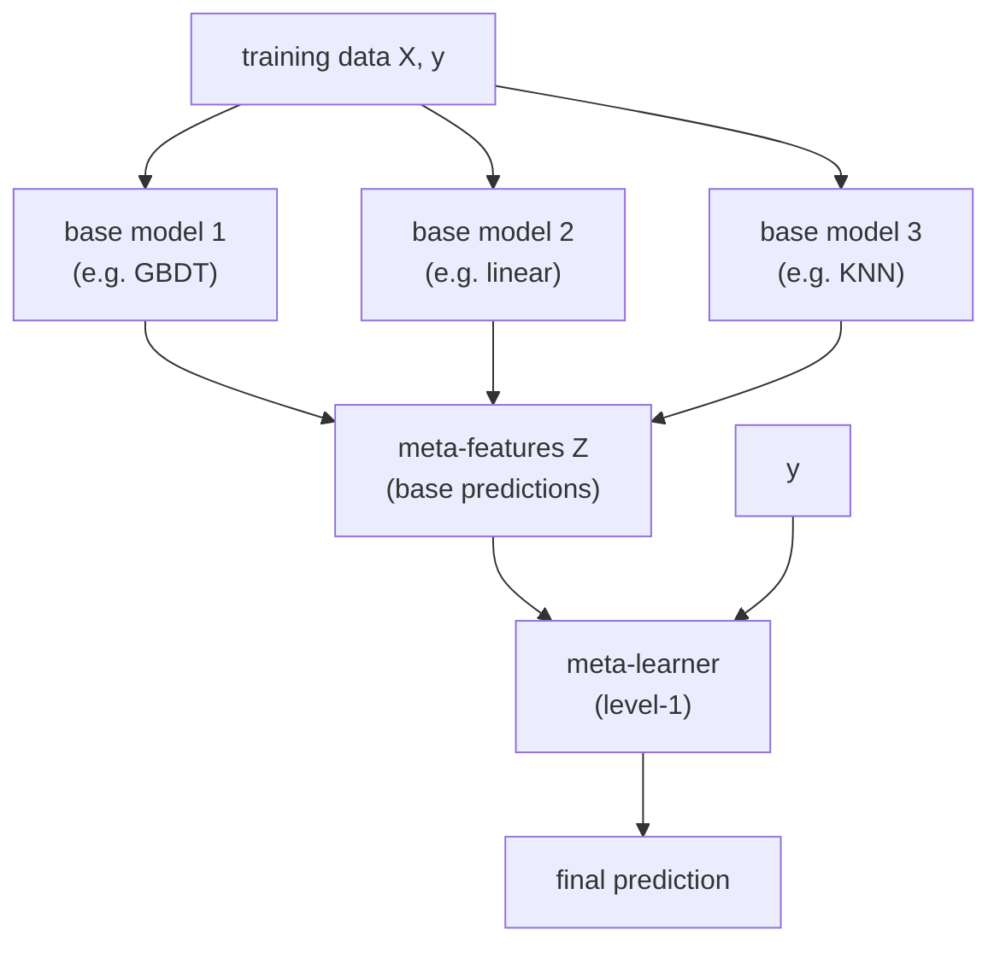

# 06.06 — Stacking & Blending

> **Prerequisites**: [06.01](../01-bagging/)–[06.05](../05-modern-gbdts/) (the ensembles stacking
> combines), [05.04](../../05-model-evaluation/04-cross-validation/) (cross-validation —
> stacking is built on out-of-fold prediction), [03.01](../../03-supervised-learning/01-linear-regression/)–[03.02](../../03-supervised-learning/02-logistic-regression/)
> (the usual meta-learner).
> **You will be able to**: build a stacked ensemble with leakage-free out-of-fold meta-features,
> explain exactly why in-sample stacking overfits and cross-validation fixes it, choose a meta-learner
> and diverse base learners, and place stacking against bagging and boosting.

---

## Table of contents

1. [A third way to combine models](#1-a-third-way-to-combine-models)
2. [The leakage trap](#2-the-leakage-trap)
3. [Out-of-fold predictions — the fix](#3-out-of-fold-predictions--the-fix)
4. [The stacking algorithm (Wolpert 1992)](#4-the-stacking-algorithm-wolpert-1992)
5. [Blending — the single-holdout shortcut](#5-blending--the-single-holdout-shortcut)
6. [Choosing the meta-learner](#6-choosing-the-meta-learner)
7. [Diversity is the whole point](#7-diversity-is-the-whole-point)
8. [Stacking vs a simple average](#8-stacking-vs-a-simple-average)
9. [Multi-layer stacking, and when to stop](#9-multi-layer-stacking-and-when-to-stop)
10. [Bagging vs boosting vs stacking](#10-bagging-vs-boosting-vs-stacking)
11. [Common misconceptions](#11-common-misconceptions)

---

## 1. A third way to combine models

The ensembles so far combine models by a **fixed rule**:

- **Bagging** ([06.01](../01-bagging/)) averages many homogeneous, high-variance models with equal
  weight.
- **Boosting** ([06.03](../03-boosting-theory/)–[06.05](../05-modern-gbdts/)) adds homogeneous weak
  learners sequentially, each with a weight set by the algorithm's own rule.

Stacking (Wolpert, 1992) asks a different question: **why fix the combination rule when we could
learn it?** Train a set of *diverse* base models (level-0), then train a second model (level-1, the
*meta-learner*) whose inputs are the base models' predictions and whose target is the true label. The
meta-learner learns how much to trust each base model, and in what combination — a learned weighting
that can beat any single model and any fixed average.

The idea is simple. The one subtlety — and it is the whole chapter — is **how to produce the
meta-features without leaking the label.**

---

## 2. The leakage trap

Here is the naive version, and why it is wrong.

Train each base model on the training set. Then ask each base model to predict *the same training
set*, and hand those predictions to the meta-learner as features. This leaks catastrophically.

Consider a base model that **overfits** — a 1-nearest-neighbour classifier, or a deep unpruned tree.
On the training set it is nearly perfect: it has *memorized* those labels. Its in-sample predictions
therefore look like an oracle. The meta-learner sees one column that matches $y$ almost exactly and
learns to **trust it completely** — assigning it nearly all the weight. But that column is a mirage:
at test time the overfitting base model predicts poorly, and the meta-learner, having bet everything
on it, follows it off the cliff.

The failure is precise: the meta-features must reflect how each base model behaves **on data it did
not train on**, because that is the only regime that exists at test time. In-sample predictions
reflect the opposite regime. This is the same leakage that CatBoost's ordered target statistics fix
([06.05 §8](../05-modern-gbdts/)) — using a point's own label (here, through a model trained on it)
to build the feature that predicts it. Experiment 1 reproduces the collapse.

---

## 3. Out-of-fold predictions — the fix

The cure is to generate every meta-feature from a model that **did not see that row during
training**, using cross-validation ([05.04](../../05-model-evaluation/04-cross-validation/)):

Split the training data into $K$ folds. For a given base model and a given fold $k$, train the model
on the *other* $K-1$ folds and predict the held-out fold $k$. Do this for every fold; concatenating
the held-out predictions gives one **out-of-fold (OOF) prediction for every training row** — each
produced by a copy of the base model that never saw that row. Stack the OOF columns of all $M$ base
models into the meta-feature matrix $Z \in \mathbb{R}^{n \times M}$, and train the meta-learner on
$(Z, y)$.

Because each entry of $Z$ is a genuine held-out prediction, the meta-learner now sees each base
model's *honest* out-of-sample behavior. The memorizing 1-NN, evaluated out-of-fold, is no longer an
oracle — it looks exactly as mediocre as it truly is, and the meta-learner weights it accordingly.
Experiment 1 shows OOF stacking assigning the overfitter a small weight where naive stacking gave it
almost all of it.

> **The one rule of stacking**: meta-features are *out-of-fold* predictions. Everything else is
> detail. Get this wrong and stacking is worse than the best single model; get it right and it is
> usually better.

---

## 4. The stacking algorithm (Wolpert 1992)

**Input**: training data $(X, y)$, base models $\lbrace f_1, \dots, f_M\rbrace$, meta-learner $g$,
fold count $K$.

**Build the meta-features (out-of-fold):**
1. Split the rows into $K$ folds.
2. For each base model $m = 1,\dots,M$ and each fold $k = 1,\dots,K$:
   - train a copy of $f_m$ on all folds except $k$;
   - predict fold $k$; store those predictions in column $m$, rows of fold $k$, of $Z$.
   After all folds, column $m$ of $Z$ holds OOF predictions for every training row.

**Train the meta-learner:**
3. Fit $g$ on $(Z, y)$.

**Refit base models for test time:**
4. Retrain each base model $f_m$ on the **full** training set (the OOF copies were only for building
   $Z$; for prediction we want each base model trained on all the data).

**Predict a new point $\mathbf{x}$:**
5. Form $\mathbf{z} = (f_1(\mathbf{x}), \dots, f_M(\mathbf{x}))$ from the full-data base models, and
   output $g(\mathbf{z})$.

For classification, the meta-features are usually predicted **probabilities** (one column per class
per base model), not hard labels — probabilities carry the base model's confidence, which the
meta-learner can use. `from_scratch.py` implements exactly this protocol and checks it against
scikit-learn's `StackingClassifier`/`StackingRegressor`.

---

## 5. Blending — the single-holdout shortcut

Blending is stacking with $K$ replaced by a single hold-out split. Carve off, say, 20% of the
training data as a *blend set*. Train the base models on the other 80%, predict the blend set, and
train the meta-learner on those blend-set predictions.

| | Stacking (K-fold OOF) | Blending (single holdout) |
|---|---|---|
| Meta-features cover | **all** training rows | only the held-out rows |
| Data efficiency | high (every row used) | lower (meta-learner sees ~20%) |
| Base-model retrain cost | $K\times$ per model | $1\times$ |
| Leakage risk | none (if folds are clean) | none, but small meta-set adds variance |
| Simplicity | more moving parts | simpler, easier to reason about |

Blending is simpler and was popular in Kaggle ensembles for that reason, but it wastes data (the
meta-learner trains on a fraction of the labels) and gives the meta-learner a noisier, smaller sample
to fit. Stacking with $K$-fold OOF is the more data-efficient default; blending is a reasonable
shortcut when base models are expensive to retrain $K$ times. Experiment 5 compares them.

---

## 6. Choosing the meta-learner

The instinct to use a powerful meta-learner is usually wrong. The meta-features are already strong,
low-dimensional, and highly correlated with the target (they *are* predictions of the target), so the
meta-learner's job is gentle: decide relative trust and combine. A **simple, regularized** model is
almost always best:

- **Linear / logistic regression** — the standard choice. Interpretable weights, hard to overfit $M$
  inputs.
- **Non-negative, sum-to-one weights** — constrain the linear meta-learner so the output is a convex
  combination of base predictions. This yields an interpretable "blend proportion" per model and
  resists overfitting further; it is the classic choice for regression stacks.
- **Mild regularization ($L_2$)** — with correlated base predictions (they often agree), ridge-style
  shrinkage stabilizes the weights.

A complex meta-learner (another GBDT, a deep net) tends to **overfit the meta-level**: with only $M$
inputs and $n$ rows of OOF predictions, it finds spurious interactions among base models that do not
generalize. Experiment 3 shows a linear meta-learner beating a GBDT meta-learner on held-out data.
Keep level-0 rich and diverse; keep level-1 simple.

---

## 7. Diversity is the whole point

Stacking gains come from base models that make **different errors**. If two base models are near-
duplicates (a random forest and an extra-trees model on the same features), their predictions are
redundant and the meta-learner has nothing to arbitrate — stacking them buys almost nothing, exactly
as averaging correlated estimators barely reduces variance ([06.01 §2](../01-bagging/)'s
$\rho\sigma^2$ floor).

The strongest stacks combine **heterogeneous** learners with different inductive biases:

- a **GBDT** (axis-aligned, captures interactions and thresholds),
- a **linear/logistic model** (smooth, global, extrapolates),
- a **KNN** (local, non-parametric),
- a **neural net** (smooth, high-capacity representations),
- optionally the same family on **different feature sets or preprocessings**.

Each is strong where the others are weak, so their errors decorrelate and the meta-learner can pick
the right model per region of input space. Experiment 2 shows a stack of three *diverse* models
beating both the best single model and a stack of three *near-identical* ones. The design rule:
**maximize base-model diversity, not individual base-model accuracy.** A slightly weaker but
differently-wrong model often helps the stack more than a marginally stronger clone.

---

## 8. Stacking vs a simple average

A uniform average of base predictions is itself a strong, hard-to-beat baseline — it is stacking with
the meta-learner frozen to equal weights. Stacking earns its extra complexity only when it can
improve on that:

- when base models **differ in quality** — the meta-learner down-weights the weak ones, where a
  uniform average is dragged down by them;
- when base models are **differently reliable in different regions** — a meta-learner with access to
  the raw features (feature-weighted stacking) can route between them.

When base models are of similar quality and similarly correlated, learned weights and equal weights
land in nearly the same place, and the average wins on simplicity. Experiment 4 shows the learned
weights recovering the stronger models when quality is uneven, and tying the average when it is even.
The practical takeaway: **always compare a stack against a plain average**; if the stack is not
clearly better on honest validation, ship the average.

---

## 9. Multi-layer stacking, and when to stop

Nothing stops you from treating the level-1 predictions as new features for a level-2 meta-learner,
and so on — multi-layer stacking. The Netflix Prize and many Kaggle wins were towering multi-level
stacks of hundreds of models. But each layer adds sharply diminishing returns and steeply rising
cost, complexity, and overfitting risk (every layer needs its own honest OOF discipline). Two layers
is almost always where the gains stop being worth it.

This is why stacking, despite winning competitions, is comparatively rare in production. A single
well-tuned GBDT ([06.05](../05-modern-gbdts/)) captures most of the achievable accuracy at a tiny
fraction of the training, serving, and maintenance cost of a multi-model stack that must retrain and
run every base learner. Stacking is a tool for squeezing out the last percent when that percent is
worth a great deal (a leaderboard, a high-stakes prediction); it is rarely the right default for a
system that must be maintained.

---

## 10. Bagging vs boosting vs stacking

| | Bagging | Boosting | Stacking |
|---|---|---|---|
| **Base models** | homogeneous, high-variance | homogeneous, weak | **heterogeneous, strong** |
| **Trained** | in parallel, independently | sequentially, each on the last's errors | in parallel (level-0), then meta |
| **Combined by** | equal-weight average | algorithm's weights (vote / additive) | **a learned meta-model** |
| **Attacks** | variance | bias | both — exploits complementary errors |
| **Needs** | unstable base learners | weak base learners | **diverse** base learners |
| **Key risk** | little (safe) | overfitting with too many rounds | **leakage** if meta-features are in-sample |
| **Canonical use** | random forest | XGBoost | competition ensembles |

The three are complementary, not competing: a strong stack often has a *bagged* random forest and a
*boosted* GBDT among its base learners, combined by a learned meta-model. Bagging and boosting build
better individual models; stacking is how you combine models that were built differently.

---

## 11. Common misconceptions

**"Stacking is just averaging predictions."**
A uniform average is one special case (frozen equal weights, §8). Stacking *learns* the weights — and
in general a nonlinear combination — from out-of-fold predictions, which is what lets it beat the
average when base models differ in quality or reliability.

**"Train the base models, predict the training set, feed that to the meta-learner."**
This is the leakage trap (§2) and it makes stacking *worse* than the best base model. Meta-features
must be out-of-fold (§3). This is the single most common stacking bug.

**"Use the most powerful meta-learner you can."**
Backwards. The meta-features are already strong and few; a powerful meta-learner overfits the
meta-level. Use a simple, regularized (often non-negative, sum-to-one) linear model (§6).

**"Stack many copies of your best model."**
Redundant models give the meta-learner nothing to arbitrate; the gain comes from *diverse* base
models that make different errors (§7). Diversity beats individual accuracy.

**"More stacking layers keep helping."**
Returns diminish fast and overfitting/complexity rise; two layers is almost always the practical
ceiling (§9). Beyond a competition, a single tuned GBDT is usually the better engineering choice.

**"If I did cross-validation somewhere, I'm safe from leakage."**
Only if *every* meta-feature for a row comes from a base model that excluded that row, *and* the
meta-learner is evaluated on a further outer split. Leakage sneaks back in through preprocessing fit
on all data, target encoding, or tuning on the same folds — audit the whole pipeline
([02.xx data leakage](../../)).

---

## What's in this chapter

- **[from_scratch.py](from_scratch.py)** — the stacking protocol in NumPy: `StackingClassifier` and
  `StackingRegressor` that generate leakage-free out-of-fold meta-features by $K$-fold
  cross-validation, with a from-scratch ridge / non-negative-least-squares meta-learner, verified
  against scikit-learn's `StackingClassifier`/`StackingRegressor`. Five experiments: (1) the leakage
  trap — naive in-sample stacking overweights an overfitter and collapses, OOF fixes it; (2) diverse
  base models beat clones and the best single model; (3) a simple meta-learner beats a complex one;
  (4) learned weights vs a plain average; (5) stacking (K-fold) vs blending (single holdout).
- **[exercises.md](exercises.md)** — implement OOF meta-features, a non-negative meta-learner, and
  multi-layer stacking; reproduce every experiment.
- **[references.md](references.md)** — Wolpert, Breiman's stacked regressions, the Super Learner, and
  the competition write-ups.

**Next**: this completes **Part 6 — Ensembles**. The natural continuation is
[Part 5 — Model Evaluation](../../05-model-evaluation/), which makes the validation and leakage
discipline this chapter depends on precise, then [Part 4 — Unsupervised Learning](../../04-unsupervised-learning/)
and [Part 7 — Deep Learning](../../07-deep-learning/).
