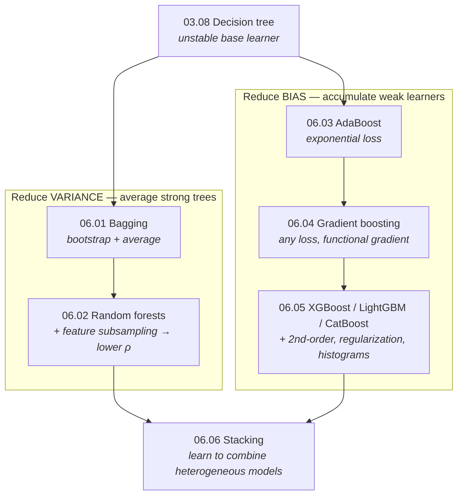

# Part 6 — Ensemble Methods

> **One weak model is a point estimate; an ensemble is a strategy against error.**
> Every method here is a different answer to the same question — *given a model that is not good
> enough, how do you combine many copies (or many different models) into one that is?*

A single decision tree ([03.08](../03-supervised-learning/08-decision-trees/)) is unstable and either
over- or under-fits. Ensembles turn that weakness into the most reliable family of models on tabular
data. This part builds every ensemble from first principles — derived, implemented in NumPy, and
verified against scikit-learn (and the real `xgboost`) to machine precision.

## The unifying view — the bias-variance decomposition

Test error splits into three pieces ([05.01](../05-model-evaluation/01-bias-variance-and-theory/)):

$$
\mathbb{E}\big[(y - \hat f(\mathbf{x}))^2\big] = \underbrace{\sigma^2}_{\text{irreducible}} + \underbrace{\mathrm{Bias}^2[\hat f]}_{\text{too simple}} + \underbrace{\mathrm{Var}[\hat f]}_{\text{too sensitive}} .
$$

Every ensemble in this part is a strategy against one of the two reducible terms — and that single
fact organizes the whole zoo:

| Strategy | Attacks | Base learner | How it combines | Canonical method |
|---|---|---|---|---|
| **Bagging** | **variance** | deep, low-bias, unstable | equal-weight average | random forest |
| **Boosting** | **bias** | shallow, weak, high-bias | sequential weighted sum | XGBoost |
| **Stacking** | **both** (complementary errors) | heterogeneous, strong | a learned meta-model | competition ensembles |

**Three ideas recur so often they are worth stating up front:**

1. **Averaging cuts variance only if errors decorrelate.** $B$ trees with pairwise correlation
   $\rho$ have ensemble variance $\rho\sigma^2 + \frac{1-\rho}{B}\sigma^2$ — a floor at $\rho\sigma^2$
   that no amount of trees removes. Random forests exist to push $\rho$ down; stacking wants diverse
   base models for the same reason.
2. **Boosting reduces bias by accumulation, so it *can* overfit; bagging cannot.** Adding trees to a
   forest refines an average (safe); adding rounds to a booster keeps descending the training loss
   (overfits). Hence `n_estimators` is "use enough" for a forest but an early-stopped capacity knob
   for a booster.
3. **The base learner's job depends on the strategy.** Bagging wants *strong, unstable* learners it
   can average; boosting wants *weak, biased* learners it can add slowly. Same tree, opposite depth.

## Chapters

| # | Chapter | The one idea | Status |
|---|---|---|:--:|
| 06.01 | [Bagging](01-bagging/) | the $\rho\sigma^2$ variance floor, and the bootstrap that lowers it | 🟢 |
| 06.02 | [Random Forests](02-random-forests/) | attack $\rho$ directly with feature subsampling | 🟢 |
| 06.03 | [Boosting & AdaBoost](03-boosting-theory/) | forward stagewise on exponential loss — bias by accumulation | 🟢 |
| 06.04 | [Gradient Boosting](04-gradient-boosting/) | free the loss: gradient descent in function space | 🟢 |
| 06.05 | [XGBoost / LightGBM / CatBoost](05-modern-gbdts/) | the second-order objective, verified against real `xgboost` | 🟢 |
| 06.06 | [Stacking & Blending](06-stacking/) | learn the combination — with leakage-free out-of-fold features | 🟢 |

## How the chapters connect

## What every chapter contains

- **`README.md`** — the full theory: intuition, the objective, a complete derivation, and the
  measured consequences. Claims are checked against experiments, and the prose is corrected to match
  what the code actually shows (e.g. AdaBoost's margins improve only in the *worst case*, not the
  median; shrinkage helps then plateaus).
- **`from_scratch.py`** — a NumPy-only implementation that self-verifies against the reference
  library (`scikit-learn`, and `xgboost` for 06.05) and runs experiments that *measure* each claim.
- **`exercises.md`** — derivation, implementation, and interview tiers, with checkpoints.
- **`references.md`** — the exact papers and books behind every section, so any claim can be traced.

## Where this leads

- **The bias-variance decomposition in full** → [05.01](../05-model-evaluation/01-bias-variance-and-theory/)
- **Honest feature attribution for GBDTs (SHAP)** → [17.02](../17-explainable-ai/02-post-hoc/)
- **Why GBDTs still beat deep nets on tabular data** → [06.05 §11](05-modern-gbdts/)
- **Deep learning, where the bias-variance strategy changes** → [Part 7](../07-deep-learning/)
