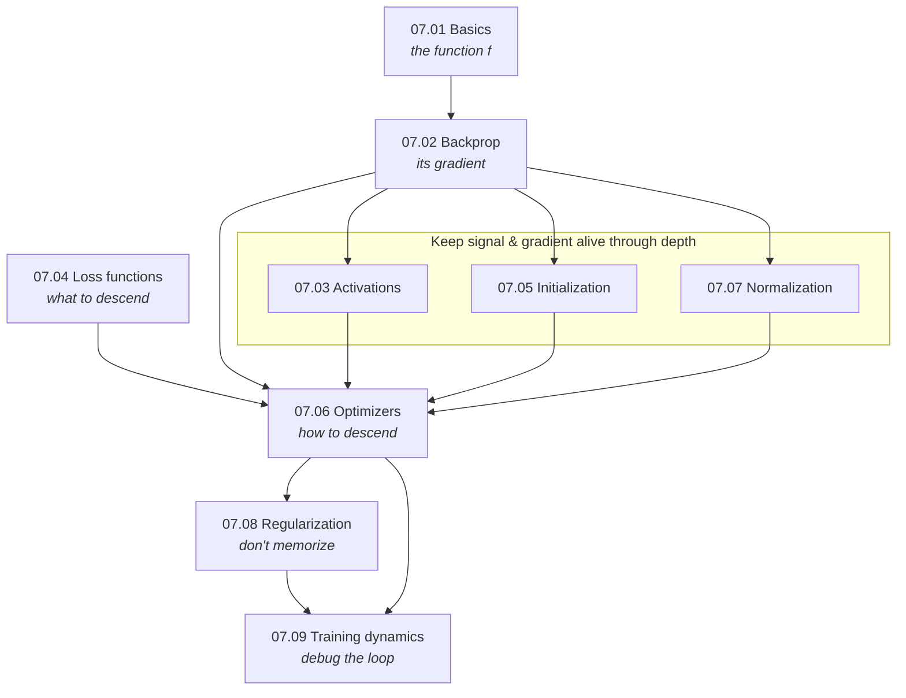

# Part 7 — Deep Learning Foundations

> **A neural network is one function, one loss, and one algorithm — repeated.**
> The function is a stack of linear maps and nonlinearities; the loss scores its output; and
> backpropagation, run inside an optimizer, moves the parameters downhill. Everything else in this
> part — activations, initialization, normalization, regularization — exists to keep that single loop
> *trainable* as the stack gets deep.

Classical ML ([Part 3](../03-supervised-learning/)) engineered features and fit a shallow model. Deep
learning flips that: fix a differentiable architecture, and let gradient descent *learn the features*.
This part builds the whole machine from first principles — every forward pass, every gradient, every
update rule derived on paper, implemented in NumPy, and **verified against PyTorch's autograd to
machine precision** (typically $10^{-15}$–$10^{-16}$).

## The unifying view — one training loop

Every deep model, no matter the domain, is trained by the same loop:

$$
\theta \leftarrow \theta - \eta \, \nabla_\theta \, \mathcal{L}\big(f_\theta(\mathbf{x}), y\big).
$$

Read left to right, that single line *is* Part 7, and it names the chapters:

| The loop needs… | …which is the chapter | The one question it answers |
|---|---|---|
| a function $f_\theta$ | [07.01 Basics](01-neural-network-basics/) | what can a stack of layers even represent? |
| its gradient $\nabla_\theta$ | [07.02 Backprop](02-backpropagation/) | how do you get every derivative in one backward pass? |
| a nonlinearity inside $f$ | [07.03 Activations](03-activations/) | which nonlinearity, and why do gradients die? |
| a loss $\mathcal{L}$ | [07.04 Losses](04-loss-functions/) | what should the loss be, and what gradient does it give? |
| a starting $\theta$ | [07.05 Initialization](05-initialization/) | where do you start so signal survives the depth? |
| the update rule | [07.06 Optimizers](06-optimizers/) | how do you use the gradient — plain, with momentum, adaptively? |
| stable activations | [07.07 Normalization](07-normalization/) | how do you keep each layer's inputs well-conditioned? |
| control on capacity | [07.08 Regularization](08-regularization/) | how do you stop it memorizing the training set? |
| the loop to actually work | [07.09 Training dynamics](09-training-dynamics/) | when it won't train, how do you debug it? |

**Three ideas recur across every chapter:**

1. **Depth is the point, and depth is the problem.** Stacking layers is what gives neural nets their
   representational power (07.01), but each extra layer multiplies gradients (07.02) — so signals and
   gradients can vanish or explode. Half of this part (activations, initialization, normalization) is
   about keeping that product near $1$ so deep stacks stay trainable.
2. **Everything is chosen by its gradient, not its value.** The softmax+cross-entropy pairing is
   beautiful because its gradient is $\hat p - y$ (07.04); ReLU wins not for its output but because
   its gradient is exactly $1$ where active (07.03); He vs Glorot init is a variance argument about
   gradients (07.05). Look at the backward pass, and the design choices explain themselves.
3. **Measure the loop from the inside.** A model can be silently mis-trained with no error. The fix is
   to instrument the loop — initial loss $\approx \log K$, overfit a single batch, watch the
   update-to-weight ratio (07.09) — and read the signals, not the code.

## Chapters

| # | Chapter | The one idea | Status |
|---|---|---|:--:|
| 07.01 | [Neural network basics](01-neural-network-basics/) | a stack of layers is a universal approximator; depth beats width exponentially | 🟢 |
| 07.02 | [Backpropagation](02-backpropagation/) | reverse-mode autodiff — every gradient in *one* backward pass, verified vs autograd | 🟢 |
| 07.03 | [Activations](03-activations/) | the nonlinearity decides whether gradients flow or die | 🟢 |
| 07.04 | [Loss functions](04-loss-functions/) | choose the loss by the gradient it hands the optimizer ($\hat p - y$) | 🟢 |
| 07.05 | [Initialization](05-initialization/) | start with unit-variance signal so it survives the depth (He / Glorot) | 🟢 |
| 07.06 | [Optimizers](06-optimizers/) | how to *use* the gradient: momentum on ravines, Adam's per-parameter scale | 🟢 |
| 07.07 | [Normalization](07-normalization/) | re-center and re-scale activations so each layer sees a clean distribution | 🟢 |
| 07.08 | [Regularization](08-regularization/) | trade a little training fit for generalization — weight decay, dropout, early stopping | 🟢 |
| 07.09 | [Training dynamics & debugging](09-training-dynamics/) | when it won't train, diagnose from the loop's own signals | 🟢 |

## How the chapters connect

## What every chapter contains

- **`README.md`** — the full theory: intuition, the objective, a complete derivation, and the
  measured consequences. Claims are checked against experiments and the prose corrected to match what
  the code actually shows (e.g. cross-entropy's gradient stays strong on confident errors where MSE's
  collapses; BatchNorm rescues an initialization so bad the un-normalized net overflows to $10^{114}$).
- **`from_scratch.py`** — a NumPy-only implementation that self-verifies against **PyTorch** (forward
  *and* backward) to machine precision, then runs experiments that *measure* each claim.
- **`exercises.md`** — derivation, implementation, and interview tiers, with checkpoints.
- **`references.md`** — the exact papers and books behind every section, so any claim can be traced.

## Where this leads

- **Convolutions — weight-sharing for images** → [Part 8](../08-computer-vision/)
- **Recurrence and attention over sequences** → [Part 9](../09-sequence-models/), [Part 11](../11-transformers-llms/)
- **The bias-variance strategy that deep learning bends (double descent)** → [05.01 §10](../05-model-evaluation/01-bias-variance-and-theory/)
- **Autodiff at scale — how PyTorch/JAX generalize 07.02** → [07.02 §9](02-backpropagation/)
- **Training and serving these models in production** → [Part 19](../19-mlops/)
