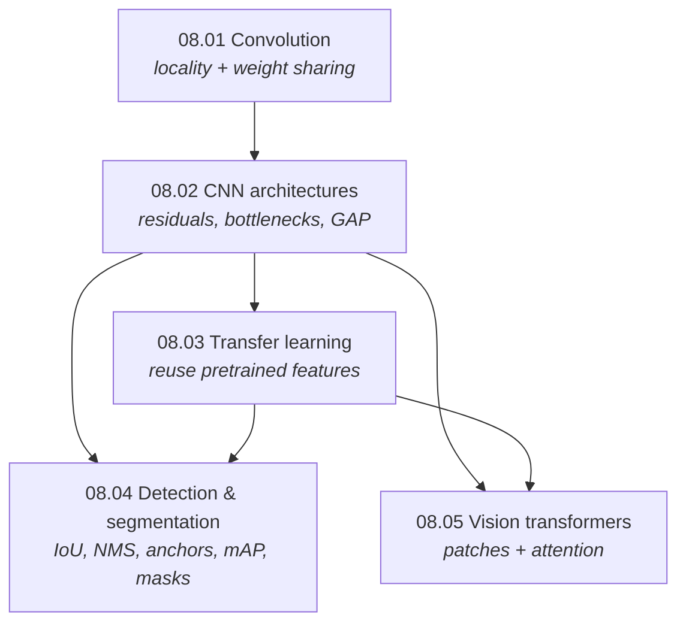

# Part 8 — Computer Vision

> **Vision is the problem that forced deep learning to grow up.** A dense layer on an image needs
> half a trillion parameters ([08.01 §5](01-convolution/)); the whole history of computer vision is
> the search for the right *inductive bias* to make that tractable — first the convolution's locality
> and weight sharing, then attention's flexibility. This part builds that arc from the convolution up
> to the Vision Transformer, every primitive verified against PyTorch/torchvision to machine precision.

Images are high-dimensional and structured: nearby pixels are related, and an object means the same
thing wherever it appears. Part 8 is about architectures that exploit that structure. It builds on the
[deep-learning foundations](../07-deep-learning/) (backprop, normalization, residuals) and leads into
the [transformer](../11-transformers-and-llms/) track.

## The unifying question — what is the right inductive bias?

Every architecture in this part is an answer to one question: *what should the model assume about
images before seeing data?*

| Assumption | Encoded by | Cost | Chapter |
|---|---|---|---|
| features are **local** and **position-independent** | convolution (weight sharing) | rigid prior, very data-efficient | [08.01](01-convolution/), [08.02](02-cnn-architectures/) |
| useful features are **reusable** across tasks | transfer learning | needs a related source | [08.03](03-transfer-learning/) |
| objects have **location and extent** | detection/segmentation heads | box/mask machinery | [08.04](04-detection-and-segmentation/) |
| **any** patch may relate to any other | self-attention (no locality prior) | needs lots of data | [08.05](05-vision-transformers/) |

**Three threads run through the whole part:**

1. **Parameter economy is destiny.** Locality + weight sharing turn an impossible $10^{11}$-parameter
   layer into a $10^3$-parameter one ([08.01](01-convolution/)); bottlenecks, depthwise-separable
   convs, and global average pooling ([08.02](02-cnn-architectures/)) each cut it further. Every
   architectural advance is, in part, a parameter- or FLOP-saving trick.
2. **Depth needs help to train.** Stacking layers grows the receptive field but breaks gradient flow;
   residual connections ([08.02 §4](02-cnn-architectures/)) are what actually made deep vision nets
   trainable — the same fix that later enabled transformers.
3. **Priors vs data.** A strong prior (the convolution) wins with little data; a flexible model (the
   ViT) wins with a lot ([08.05 §5](05-vision-transformers/)). The field's trajectory is the gradual
   trading of hand-designed priors for learned ones as data and compute grew.

## Chapters

| # | Chapter | The one idea | Status |
|---|---|---|:--:|
| 08.01 | [Convolution](01-convolution/) | a sparse, weight-shared matmul — locality + equivariance for free | 🟢 |
| 08.02 | [CNN Architectures](02-cnn-architectures/) | residuals, bottlenecks, depthwise convs, GAP — the recurring tricks | 🟢 |
| 08.03 | [Transfer Learning](03-transfer-learning/) | steal features from a big source task; fine-tune gently | 🟢 |
| 08.04 | [Detection & Segmentation](04-detection-and-segmentation/) | IoU, NMS, anchors, mAP, masks — "what *and where*" | 🟢 |
| 08.05 | [Vision Transformers](05-vision-transformers/) | an image is a sequence of patches; drop the conv prior | 🟢 |

## How the chapters connect

## What every chapter contains

- **`README.md`** — the full theory: the inductive bias, the operation, a complete derivation, and the
  measured consequences. Claims are checked against experiments and the prose corrected to match (e.g.
  a dense layer on ImageNet needs 483 billion params vs a conv's 1,792; residuals keep the gradient
  alive to 100 layers where a plain net's vanishes to $5\times10^{-5}$).
- **`from_scratch.py`** — NumPy-only implementations that self-verify against **PyTorch** /
  **torchvision** (conv forward+backward, pooling, IoU, NMS, patch embedding) to machine precision,
  then run experiments that *measure* each claim.
- **`exercises.md`** — derivation, implementation, and interview tiers, with checkpoints.
- **`references.md`** — the landmark papers behind every section, one per architecture.

## Where this leads

- **The deep-learning foundations underneath** → [Part 7](../07-deep-learning/)
- **Attention and the transformer block in full** → [Part 11](../11-transformers-and-llms/)
- **Sequence models (the other half of the architecture zoo)** → [Part 9](../09-sequence-models/)
- **Generative vision (diffusion, GANs, text-to-image)** → [Part 12](../12-generative-models/)
- **Explaining vision models (Grad-CAM, saliency)** → [Part 17](../17-explainable-ai/)
