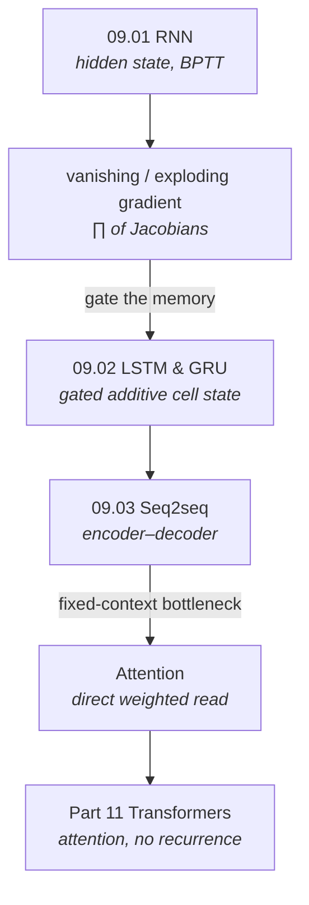

# Part 9 — Sequence Models

> **A sequence model's whole job is to move information across time — and its whole difficulty is that
> information (and gradients) fade as they travel.** This part is the three-act story of solving that:
> the RNN that carries a hidden state but forgets, the LSTM/GRU that gate the memory so gradients
> survive, and attention that abandons the single memory channel entirely and lets any position read
> any other. That last move led straight to the transformer.

Feedforward nets ([Part 7](../07-deep-learning/)) and CNNs ([Part 8](../08-computer-vision/)) assume a
fixed-size input. Sequences — language, audio, time series — are variable-length and ordered. Part 9
builds the architectures that handle them, every cell verified against PyTorch to machine precision.

## The unifying problem — information flow across time

Every architecture here is an answer to one question: *how does information from step $t$ reach a
computation many steps later, and does its gradient survive the trip?*

| Mechanism | How information travels | What limits it | Chapter |
|---|---|---|---|
| **Recurrence** | a hidden state passed step to step | gradient vanishes (∏ of Jacobians) | [09.01](01-rnn/) |
| **Gating** | an additive cell state, edited by gates | still sequential, finite memory | [09.02](02-lstm-gru/) |
| **Attention** | direct weighted read of all states | quadratic cost, order-agnostic | [09.03](03-seq2seq-and-attention/) |

**Three threads run through the part:**

1. **The gradient is a product, so it vanishes.** An RNN's long-range gradient is
   $\prod_t \text{diag}(1-h_t^2)W_{hh}$ — a product of many factors that collapses to zero
   ([09.01 §4](01-rnn/)). Every later idea is a way to turn that product into something that doesn't
   shrink.
2. **The fix is an additive, near-identity path.** The LSTM's cell state makes the per-step gradient a
   *forget gate* $\partial c_t/\partial c_{t-1}=f_t$ ([09.02 §4](02-lstm-gru/)); attention makes it a
   *direct* read with no intermediate steps at all. Both are the same idea residual connections use for
   depth ([08.02 §4](../08-computer-vision/02-cnn-architectures/)).
3. **Eventually the recurrence itself is the bottleneck.** Once attention can read any position
   directly, the sequential RNN is doing little — and it prevents parallelism. Dropping it is the
   transformer ([09.03 §7](03-seq2seq-and-attention/), [Part 11](../11-transformers-and-llms/)).

## Chapters

| # | Chapter | The one idea | Status |
|---|---|---|:--:|
| 09.01 | [Recurrent Neural Networks](01-rnn/) | carry a hidden state; the gradient is a Jacobian product that vanishes | 🟢 |
| 09.02 | [LSTM & GRU](02-lstm-gru/) | gate an additive cell state → a constant error carousel | 🟢 |
| 09.03 | [Seq2seq & Attention](03-seq2seq-and-attention/) | read all states directly — the bottleneck dissolves | 🟢 |

## How the chapters connect

## What every chapter contains

- **`README.md`** — the full theory: the mechanism, a complete derivation, and the measured
  consequences. Claims are checked against experiments and the prose corrected to match (e.g. an RNN's
  gradient vanishes to $10^{-11}$ at 100 steps; an LSTM's survives at $10^{-2}$; a fixed context loses
  87% of a long input's variance while attention loses none).
- **`from_scratch.py`** — NumPy-only cells (RNN, LSTM, GRU, attention) that self-verify against
  **PyTorch** (`nn.RNN`, `nn.LSTM`, `nn.GRU`) forward *and* backward to machine precision, then run
  experiments that *measure* each claim.
- **`exercises.md`** — derivation, implementation, and interview tiers, with checkpoints.
- **`references.md`** — the foundational papers behind every section.

## Where this leads

- **Transformers — attention without recurrence** → [Part 11](../11-transformers-and-llms/)
- **The deep-learning foundations underneath** → [Part 7](../07-deep-learning/)
- **NLP tasks these models solve** → [Part 10](../10-nlp/)
- **Positional encodings and self-attention** → [08.05](../08-computer-vision/05-vision-transformers/), [11.01](../11-transformers-and-llms/01-transformer/)
- **Time-series forecasting with sequence models** → [Part 15](../15-time-series/)
