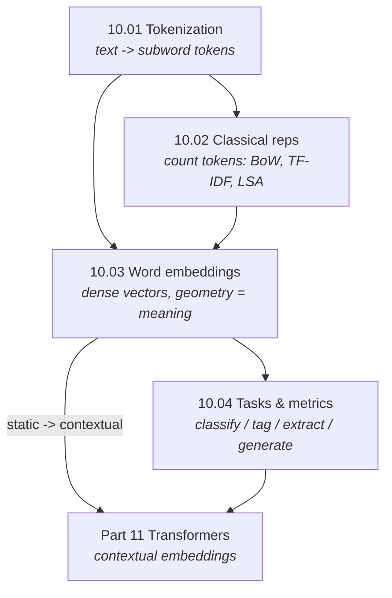

# Part 10 — Natural Language Processing

> **Text is the hardest data type to vectorize, and the whole history of NLP is the search for a better
> vector.** Words are discrete, order matters, meaning is contextual, and the vocabulary is unbounded.
> This part walks the representational ladder: from *counting* words (bag-of-words), to *learning* dense
> word vectors (embeddings), to the *subword* tokenization and *task metrics* that the transformer era
> ([Part 11](../11-transformers-llms/)) is built on. Every representation is built from scratch and
> verified against scikit-learn, tiktoken, or nltk.

Classical ML ([Part 3](../03-supervised-learning/)) needs numeric features; images have pixels
([Part 8](../08-computer-vision/)); sequences have a natural order ([Part 9](../09-sequence-models/)).
Language has none of these cleanly — so NLP's central problem is **representation**, and that is what
Part 10 is about.

## The unifying arc — better and better word vectors

Each chapter is a rung on the ladder from discrete symbols to meaning:

| Representation | Idea | Sees synonymy? | Sees order? | Handles OOV? | Chapter |
|---|---|:--:|:--:|:--:|---|
| tokenization | split text into subword units | — | — | ✅ (subwords) | [10.01](01-text-preprocessing/) |
| bag-of-words / TF-IDF | count words | ❌ | ❌ (n-grams patch it) | ❌ | [10.02](02-classical-representations/) |
| word embeddings | learn dense vectors from context | ✅ (static) | ❌ | ✅ (FastText) | [10.03](03-word-embeddings/) |
| task formulations | shapes + metrics for real problems | — | — | — | [10.04](04-nlp-tasks/) |

**Three threads run through the part:**

1. **The vocabulary is unbounded — so tokenize into subwords.** Words never end; BPE
   ([10.01](01-text-preprocessing/)) gives a bounded vocabulary that can still spell any string, the
   foundation every later model stands on.
2. **Meaning is distributional.** "A word is known by the company it keeps" — TF-IDF captures a little
   of this through co-occurrence ([10.02](02-classical-representations/)); embeddings turn it into
   geometry so that `king − man + woman ≈ queen` ([10.03](03-word-embeddings/)).
3. **The metric is where NLP is won.** Token accuracy hides NER failure, EM understates QA, BLEU games
   on short outputs — the right metric per task shape ([10.04](04-nlp-tasks/)) matters more than the
   model.

## Chapters

| # | Chapter | The one idea | Status |
|---|---|---|:--:|
| 10.01 | [Text Preprocessing & Tokenization](01-text-preprocessing/) | subword BPE — a bounded vocabulary that spells anything | 🟢 |
| 10.02 | [Classical Representations](02-classical-representations/) | count words: bag-of-words, TF-IDF, LSA, topic models | 🟢 |
| 10.03 | [Word Embeddings](03-word-embeddings/) | learn dense vectors where geometry = meaning | 🟢 |
| 10.04 | [NLP Tasks & Metrics](04-nlp-tasks/) | five task shapes, and the metric that won't lie | 🟢 |

## How the chapters connect

## What every chapter contains

- **`README.md`** — the full theory: the representation, a complete derivation, and the measured
  consequences. Claims are checked against experiments and the prose corrected to match (e.g. subword
  vocab 43 ≪ word vocab 170; king − man + woman → queen at cosine 0.99; token accuracy 0.80 but entity
  F1 0.50).
- **`from_scratch.py`** — pure-NumPy/Python implementations that self-verify against **scikit-learn**,
  **tiktoken**, or **nltk**, then run experiments that *measure* each claim.
- **`exercises.md`** — derivation, implementation, and interview tiers, with checkpoints.
- **`references.md`** — the foundational papers behind every section.

## Where this leads

- **Transformers & LLMs — contextual embeddings, the current paradigm** → [Part 11](../11-transformers-llms/)
- **The sequence models NLP was built on** → [Part 9](../09-sequence-models/)
- **Classification metrics in general** → [05.03](../05-model-evaluation/03-classification-metrics/)
- **Text-conditioned generation** → [Part 12](../12-generative-models/)
- **Fairness and bias in language models** → [Part 18](../18-fairness-privacy-robustness/)
