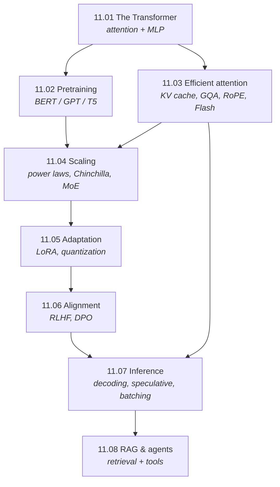

# Part 11 — Transformers & LLMs

> **One architecture, scaled and adapted, became the defining technology of the decade.** The
> transformer is a stack of two operations — self-attention and an MLP — and everything since is
> engineering: how to pretrain it, make its attention cheap enough to scale, adapt it without
> retraining, align it to human preferences, serve it fast, and wire it to memory and tools. This part
> builds that entire pipeline from the attention operation up to RAG and agents, every core mechanism
> verified against PyTorch or derived in an exactly-computable setting.

The transformer ([11.01](01-transformer/)) is the culmination of the whole book's architecture arc —
attention from seq2seq ([09.03](../09-sequence-models/03-seq2seq-and-attention/)), residuals and norm
from deep learning ([Part 7](../07-deep-learning/)), patches from vision
([08.05](../08-computer-vision/05-vision-transformers/)). From there, Part 11 is the life-cycle of a
modern LLM.

## The life-cycle of an LLM

Each chapter is one stage, and the through-line is: **the architecture is nearly fixed; the leverage is
in everything around it.**

| Stage | Question | Chapter |
|---|---|---|
| **Architecture** | what is a transformer? | [11.01](01-transformer/) |
| **Pretraining** | how do you learn from raw text without labels? | [11.02](02-pretraining/) |
| **Efficiency** | how do you make attention cheap and long-context? | [11.03](03-efficient-attention/) |
| **Scaling** | how big, on how much data, for what compute? | [11.04](04-scaling-and-architecture/) |
| **Adaptation** | how do you specialize it cheaply? | [11.05](05-adaptation/) |
| **Alignment** | how do you make it helpful and safe? | [11.06](06-alignment/) |
| **Inference** | how do you serve it fast? | [11.07](07-inference/) |
| **Augmentation** | how do you give it memory and tools? | [11.08](08-rag-and-agents/) |

**Three threads run through the whole part:**

1. **Attention is a differentiable lookup — everything specializes it.** Masking makes an encoder or a
   decoder ([11.02](02-pretraining/)); the KV cache and GQA make it cheap ([11.03](03-efficient-attention/));
   RoPE makes position relative; RAG makes the "lookup" literal ([11.08](08-rag-and-agents/)).
2. **Parallelism enabled scale, and scale is predictable.** Dropping recurrence made the transformer
   parallel ([11.01 §7](01-transformer/)), which made scale feasible, and scale turned out to follow
   power laws you can forecast ([11.04](04-scaling-and-architecture/)) — the fact that justified the
   whole enterprise.
3. **The same objective, reparameterized, recurs.** RLHF's KL-constrained optimum and DPO are the same
   objective ([11.06](06-alignment/)); speculative decoding changes nothing about the output
   distribution ([11.07](07-inference/)); LoRA and quantization change memory, not the function
   ([11.05](05-adaptation/)). Much of LLM engineering is *exactly-preserving* tricks.

## Chapters

| # | Chapter | The one idea | Status |
|---|---|---|:--:|
| 11.01 | [The Transformer](01-transformer/) | self-attention + MLP, fully parallel, verified vs PyTorch | 🟢 |
| 11.02 | [Pretraining Paradigms](02-pretraining/) | one block → BERT / GPT / T5 by mask + objective | 🟢 |
| 11.03 | [Efficient Attention](03-efficient-attention/) | KV cache, GQA, RoPE, FlashAttention — exact and cheap | 🟢 |
| 11.04 | [Scaling & Architecture](04-scaling-and-architecture/) | loss is a power law; Chinchilla; Mixture-of-Experts | 🟢 |
| 11.05 | [Adaptation](05-adaptation/) | LoRA + quantization: fine-tune a 65B model on one GPU | 🟢 |
| 11.06 | [Alignment](06-alignment/) | RLHF and DPO optimize the same preference objective | 🟢 |
| 11.07 | [Inference & Serving](07-inference/) | decoding, speculative decoding (exact), batching | 🟢 |
| 11.08 | [RAG & Agents](08-rag-and-agents/) | give the model memory (retrieval) and hands (tools) | 🟢 |

## How the chapters connect

## What every chapter contains

- **`README.md`** — the full theory: intuition, derivation, and the measured consequences. Claims are
  checked against experiments and the prose corrected to match (e.g. a full transformer block matches
  PyTorch to $10^{-16}$; RoPE scores depend only on relative distance to $10^{-15}$; the compute-optimal
  loss is a power law with $R^2 = 1.0$; speculative decoding is provably exact; DPO recovers the RLHF
  optimum).
- **`from_scratch.py`** — NumPy implementations that self-verify against **PyTorch** (attention,
  multi-head, transformer block) or run in **exactly-computable** discrete settings (RLHF/DPO, speculative
  decoding), then measure each claim.
- **`exercises.md`** — derivation, implementation, and interview tiers, with checkpoints.
- **`references.md`** — the landmark papers behind every section.

## Where this leads

- **The attention this generalizes (seq2seq)** → [09.03](../09-sequence-models/03-seq2seq-and-attention/)
- **Vision transformers — the same block on images** → [08.05](../08-computer-vision/05-vision-transformers/)
- **PPO and RL behind alignment** → [Part 13](../13-reinforcement-learning/)
- **Generative modeling (diffusion, the other frontier)** → [Part 12](../12-generative-models/)
- **Deploying and serving LLMs in production** → [Part 19](../19-mlops/), [Part 20](../20-ml-system-design/)
- **Fairness, safety, and evaluation of LLMs** → [Part 18](../18-fairness-privacy-robustness/)
