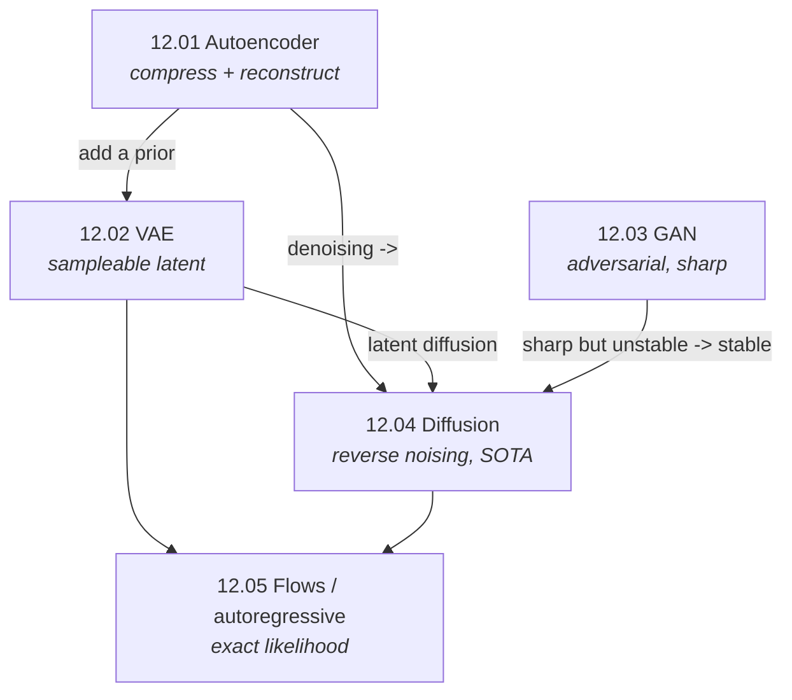

# Part 12 — Generative Models

> **A generative model learns the distribution of data itself — so it can create new samples, not just
> label existing ones.** Every model in this part answers the same question in a different way: *how do
> you represent and sample from* $p(x)$? The answers trade off three things you cannot have all of —
> exact likelihood, fast sampling, and sharp samples — and knowing which model buys which is the whole
> point of the part. From autoencoders to diffusion, each is built from scratch and its defining
> property verified.

Discriminative models ([Parts 3–11](../03-supervised-learning/)) learn $p(y \mid x)$. Generative models
learn $p(x)$ (or $p(x \mid y)$), which is harder and more powerful: it lets you *synthesize* data —
images, audio, text, molecules. This part builds the deep generative families that power text-to-image,
LLMs, and modern creative AI.

## The unifying question — how do you model p(x)?

Each chapter is a different answer, with a different trade-off:

| Model | How it represents $p(x)$ | Likelihood | Samples | Chapter |
|---|---|:--:|:--:|---|
| **Autoencoder** | a compressed code (not generative) | none | — | [12.01](01-autoencoders/) |
| **VAE** | latent + prior, ELBO | bound | blurry | [12.02](02-vae/) |
| **GAN** | adversarial game (implicit) | none | sharp | [12.03](03-gan/) |
| **Diffusion** | reverse a noising process | bound | sharp | [12.04](04-diffusion/) |
| **Flows / autoregressive** | invertible map / chain rule | **exact** | good/sharp | [12.05](05-flows-and-autoregressive/) |

**Three threads run through the whole part:**

1. **The generative trilemma.** No model gives exact likelihood *and* fast sampling *and* sharp samples.
   VAEs are fast but blurry; GANs are sharp but unstable and likelihood-free; flows/autoregressive give
   exact likelihood but constrain the architecture; diffusion is sharp and stable but slow to sample.
   Every choice is a point on this frontier ([12.05 §6](05-flows-and-autoregressive/)).
2. **Denoising is the through-line to the state of the art.** The denoising autoencoder
   ([12.01 §4](01-autoencoders/)) → diffusion's per-step denoising ([12.04](04-diffusion/)) is one idea
   scaled up, and it now dominates image generation.
3. **The pieces compose.** Latent diffusion runs a diffusion model inside a VAE's latent
   ([12.04 §7](04-diffusion/)); every LLM is an autoregressive generative model
   ([12.05 §5](05-flows-and-autoregressive/)). The families are building blocks, not rivals.

## Chapters

| # | Chapter | The one idea | Status |
|---|---|---|:--:|
| 12.01 | [Autoencoders](01-autoencoders/) | compress through a bottleneck; a linear one *is* PCA | 🟢 |
| 12.02 | [Variational Autoencoders](02-vae/) | make the latent a sampleable distribution (ELBO + reparameterization) | 🟢 |
| 12.03 | [GANs](03-gan/) | a generator vs a discriminator — sharp, but unstable | 🟢 |
| 12.04 | [Diffusion Models](04-diffusion/) | learn to reverse a noising process — the current SOTA | 🟢 |
| 12.05 | [Flows & Autoregressive](05-flows-and-autoregressive/) | exact likelihood by invertibility or the chain rule | 🟢 |

## How the chapters connect

## What every chapter contains

- **`README.md`** — the full theory: how the model represents $p(x)$, a complete derivation, and the
  measured consequences. Claims are checked against experiments and the prose corrected to match (e.g. a
  linear AE recovers PCA to 0.02°; a VAE generates where a plain AE lands 3.2× off-data; the GAN loss
  equals $2\,\mathrm{JS}-\log 4$; diffusion covers both modes the GAN collapses; a flow integrates to 1).
- **`from_scratch.py`** — NumPy implementations that train real generative models (VAE, GAN, diffusion)
  or verify the defining property exactly (invertibility, the JS identity, the score/noise equivalence).
- **`exercises.md`** — derivation, implementation, and interview tiers, with checkpoints.
- **`references.md`** — the landmark papers for each family.

## Where this leads

- **Autoregressive transformers / LLMs (the biggest generative models)** → [Part 11](../11-transformers-and-llms/)
- **The CNN/transformer backbones generators use** → [Part 8](../08-computer-vision/)
- **Information theory (KL, entropy) behind the objectives** → [00.05](../00-mathematical-foundations/05-information-theory/)
- **Reinforcement learning (RLHF uses generative policies)** → [Part 13](../13-reinforcement-learning/)
- **Deploying generative models** → [Part 19](../19-mlops/)
