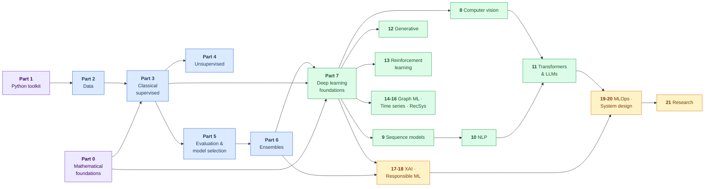

# Machine Learning — The Complete Reference

> A first-principles, end-to-end machine learning curriculum: **every topic derived from the mathematics, implemented from scratch in NumPy, then rebuilt with production libraries.**
> Not a link dump. Not a cheat sheet. A book you can run.


---

## Why this repository exists

Most ML repositories fall into one of two traps:

1. **The tutorial trap** — `model.fit(X, y)` on the iris dataset, with no explanation of what `fit` actually does.
2. **The paper-list trap** — 400 links to arXiv, no code, no build-up, no path through it.

This repository is the third thing. For every topic it answers **four questions in order**:

| # | Question | Where it lives |
|---|---|---|
| 1 | **What problem does this solve, and why?** | `README.md` — intuition, geometry, a worked toy example |
| 2 | **What is the math?** | `README.md` — objective function, full derivation, assumptions, complexity |
| 3 | **Can I build it myself?** | `from_scratch.py` — NumPy only, no sklearn, tested against sklearn |
| 4 | **How is it used for real?** | `notebook.ipynb` — real data, library version, diagnostics, failure modes |

If a topic is in this repo, it is derived, implemented, and used. That is the standard.

---

## The structure of every topic folder

```
<nn>-topic-name/
├── README.md          # Theory: intuition → math → derivation → assumptions →
│                      # complexity → when it fails → practical guidance
├── from_scratch.py    # Pure NumPy implementation, sklearn-compatible API,
│                      # verified numerically against the reference library
├── notebook.ipynb     # Applied walkthrough on real data with visual diagnostics
├── exercises.md       # Problems: derivation, implementation, and interview-style
└── references.md      # Exact book chapters, papers, and source repos used
```

Every `from_scratch.py` is runnable standalone (`python from_scratch.py`) and prints a
side-by-side comparison with the library implementation, so you can **see** that the
math you just read produces the same numbers the library does.

---

## Table of contents

### Part 0 — Mathematical foundations
> You cannot debug what you cannot derive. Everything else depends on this part.

| Chapter | Topics |
|---|---|
| [00.01 Linear algebra](00-mathematical-foundations/01-linear-algebra/) | Vectors, spaces, rank, projections, four fundamental subspaces, eigendecomposition, SVD, matrix calculus, condition number |
| [00.02 Calculus & optimization](00-mathematical-foundations/02-calculus-and-optimization/) | Gradients, Jacobians, Hessians, Taylor expansion, convexity, Lagrange duality, KKT, gradient descent family, Newton & quasi-Newton |
| [00.03 Probability](00-mathematical-foundations/03-probability/) | Random variables, distributions, expectation, covariance, conditional independence, Bayes, exponential family, concentration inequalities |
| [00.04 Statistics & inference](00-mathematical-foundations/04-statistics-and-inference/) | Estimators, bias-variance, MLE, MAP, Bayesian inference, confidence vs credible intervals, hypothesis testing, bootstrap |
| [00.05 Information theory](00-mathematical-foundations/05-information-theory/) | Entropy, cross-entropy, KL & JS divergence, mutual information, MDL, and why log-loss is *the* classification loss |
| [00.06 Numerical methods](00-mathematical-foundations/06-numerical-methods/) | Floating point, catastrophic cancellation, log-sum-exp, stable softmax, matrix factorizations, iterative solvers |

### Part 1 — The Python toolkit
| Chapter | Topics |
|---|---|
| [01.01 NumPy](01-python-for-ml/01-numpy/) | ndarray memory model, strides, broadcasting rules, vectorization, `einsum`, views vs copies |
| [01.02 pandas](01-python-for-ml/02-pandas/) | Index semantics, split-apply-combine, joins, reshaping, time indexes, memory and dtype tuning |
| [01.03 Visualization](01-python-for-ml/03-visualization/) | Matplotlib object model, statistical plots, encoding data honestly |
| [01.04 scikit-learn](01-python-for-ml/04-scikit-learn/) | Estimator API, transformers, `Pipeline`, `ColumnTransformer`, custom estimators, CV objects |
| [01.05 PyTorch](01-python-for-ml/05-pytorch/) | Tensors, autograd internals, `nn.Module`, data loading, training loops, device management |

### Part 2 — Data
| Chapter | Topics |
|---|---|
| [02.01 Exploratory data analysis](02-data/01-eda/) | Systematic EDA protocol, distributions, correlation vs causation, target leakage smells |
| [02.02 Cleaning & missing data](02-data/02-cleaning-and-missing-data/) | MCAR/MAR/MNAR, imputation strategies, when deletion is correct |
| [02.03 Feature engineering](02-data/03-feature-engineering/) | Encoding, binning, interactions, target encoding done safely, text/date/geo features |
| [02.04 Scaling & transformation](02-data/04-scaling-and-transformation/) | Standardization, normalization, power/quantile transforms, which models need what |
| [02.05 Class imbalance](02-data/05-class-imbalance/) | Resampling, SMOTE family, class weights, threshold moving, and why accuracy lies |
| [02.06 Data leakage](02-data/06-data-leakage/) | Taxonomy of leakage, real case studies, how to build a leak-proof pipeline |

### Part 3 — Classical supervised learning
| Chapter | Topics |
|---|---|
| [03.01 Linear regression](03-supervised-learning/01-linear-regression/) | Normal equations, QR/SVD solutions, geometry of least squares, Gauss-Markov, diagnostics |
| [03.02 Regularized linear models](03-supervised-learning/02-regularized-linear-models/) | Ridge, Lasso, Elastic Net, coordinate descent, LARS, the geometry of sparsity |
| [03.03 Polynomial & basis expansion](03-supervised-learning/03-basis-expansion/) | Polynomials, splines, natural cubic splines, GAMs |
| [03.04 Logistic regression](03-supervised-learning/04-logistic-regression/) | Log-odds, MLE, IRLS, Newton-Raphson, multinomial/softmax, separability |
| [03.05 Generative classifiers](03-supervised-learning/05-generative-classifiers/) | Naive Bayes variants, LDA, QDA, generative vs discriminative |
| [03.06 k-Nearest Neighbours](03-supervised-learning/06-knn/) | Distance metrics, curse of dimensionality, KD-trees, ball trees, LSH |
| [03.07 Support vector machines](03-supervised-learning/07-svm/) | Max-margin, hinge loss, the dual, KKT, kernel trick, SMO, SVR |
| [03.08 Decision trees](03-supervised-learning/08-decision-trees/) | Impurity criteria, CART, greedy splitting, pruning, regression trees, ID3/C4.5 |
| [03.09 Perceptron & linear separability](03-supervised-learning/09-perceptron/) | Perceptron algorithm, convergence proof, ADALINE, MADALINE |

### Part 4 — Unsupervised learning
| Chapter | Topics |
|---|---|
| [04.01 k-Means & variants](04-unsupervised-learning/01-kmeans/) | Lloyd's algorithm, k-means++, mini-batch, k-medoids, choosing k |
| [04.02 Hierarchical clustering](04-unsupervised-learning/02-hierarchical/) | Linkages, dendrograms, cophenetic correlation |
| [04.03 Density clustering](04-unsupervised-learning/03-density-clustering/) | DBSCAN, HDBSCAN, OPTICS, Mean Shift |
| [04.04 Model-based clustering](04-unsupervised-learning/04-gaussian-mixtures/) | GMMs, the EM algorithm derived, model selection via BIC |
| [04.05 Spectral clustering](04-unsupervised-learning/05-spectral-clustering/) | Graph Laplacians, eigenvector embeddings, normalized cuts |
| [04.06 Linear dimensionality reduction](04-unsupervised-learning/06-linear-dim-reduction/) | PCA (3 derivations), probabilistic PCA, kernel PCA, ICA, NMF, factor analysis |
| [04.07 Manifold learning](04-unsupervised-learning/07-manifold-learning/) | MDS, Isomap, LLE, Laplacian eigenmaps, t-SNE, UMAP — and how to read them honestly |
| [04.08 Anomaly detection](04-unsupervised-learning/08-anomaly-detection/) | Statistical tests, Mahalanobis, LOF, Isolation Forest, One-Class SVM, autoencoder-based |
| [04.09 Association rules](04-unsupervised-learning/09-association-rules/) | Apriori, FP-Growth, support/confidence/lift |

### Part 5 — Evaluation, validation, and model selection
| Chapter | Topics |
|---|---|
| [05.01 Bias-variance & learning theory](05-model-evaluation/01-bias-variance-and-theory/) | Decomposition derived, PAC learning, VC dimension, generalization bounds, double descent |
| [05.02 Regression metrics](05-model-evaluation/02-regression-metrics/) | MSE/RMSE/MAE/MAPE/Huber, R² and its traps |
| [05.03 Classification metrics](05-model-evaluation/03-classification-metrics/) | Confusion matrix, precision/recall/F-beta, ROC-AUC vs PR-AUC, MCC, log-loss, Brier |
| [05.04 Cross-validation](05-model-evaluation/04-cross-validation/) | k-fold, stratified, group, nested CV, time-series splits, and the CV mistakes everyone makes |
| [05.05 Hyperparameter optimization](05-model-evaluation/05-hyperparameter-optimization/) | Grid, random, Bayesian/TPE, Hyperband/ASHA, Optuna in practice |
| [05.06 Calibration](05-model-evaluation/06-calibration/) | Reliability diagrams, Platt scaling, isotonic regression, temperature scaling |

### Part 6 — Ensemble methods
| Chapter | Topics |
|---|---|
| [06.01 Bagging](06-ensembles/01-bagging/) | Bootstrap, variance reduction proof, out-of-bag estimates |
| [06.02 Random forests](06-ensembles/02-random-forests/) | Decorrelation, feature importance (and why impurity importance misleads), extra trees |
| [06.03 Boosting theory](06-ensembles/03-boosting-theory/) | Weak learnability, AdaBoost derived as forward stagewise additive modelling |
| [06.04 Gradient boosting](06-ensembles/04-gradient-boosting/) | Functional gradient descent, GBM, regularization, shrinkage, subsampling |
| [06.05 Modern GBDTs](06-ensembles/05-modern-gbdts/) | XGBoost (2nd-order + regularized objective), LightGBM (GOSS/EFB), CatBoost (ordered boosting) |
| [06.06 Stacking & blending](06-ensembles/06-stacking/) | Out-of-fold predictions, meta-learners, ensembling strategy |

### Part 7 — Deep learning foundations
| Chapter | Topics |
|---|---|
| [07.01 Neural network basics](07-deep-learning/01-neural-network-basics/) | Universal approximation, depth vs width, forward pass |
| [07.02 Backpropagation](07-deep-learning/02-backpropagation/) | Chain rule on computational graphs, reverse-mode autodiff, built from scratch |
| [07.03 Activations](07-deep-learning/03-activations/) | Sigmoid/tanh/ReLU/LeakyReLU/ELU/GELU/SiLU, dying ReLU, saturation |
| [07.04 Loss functions](07-deep-learning/04-loss-functions/) | MSE, cross-entropy, focal, contrastive, triplet — and how to choose |
| [07.05 Initialization](07-deep-learning/05-initialization/) | Xavier/Glorot, He, orthogonal, variance-preserving analysis |
| [07.06 Optimizers](07-deep-learning/06-optimizers/) | SGD, momentum, Nesterov, AdaGrad, RMSProp, Adam, AdamW, LAMB, schedules & warmup |
| [07.07 Normalization](07-deep-learning/07-normalization/) | Batch/Layer/Group/Instance/RMS norm, why they work, train vs eval behaviour |
| [07.08 Regularization](07-deep-learning/08-regularization/) | Weight decay, dropout, early stopping, label smoothing, augmentation, mixup |
| [07.09 Training dynamics](07-deep-learning/09-training-dynamics/) | Vanishing/exploding gradients, residual connections, loss landscapes, debugging playbook |

### Part 8 — Computer vision
| Chapter | Topics |
|---|---|
| [08.01 Convolution](08-computer-vision/01-convolution/) | The operation, padding/stride/dilation, receptive fields, pooling, parameter counting |
| [08.02 CNN architectures](08-computer-vision/02-cnn-architectures/) | LeNet → AlexNet → VGG → Inception → ResNet → DenseNet → EfficientNet → ConvNeXt |
| [08.03 Transfer learning](08-computer-vision/03-transfer-learning/) | Feature extraction, fine-tuning strategy, layer freezing, domain shift |
| [08.04 Detection & segmentation](08-computer-vision/04-detection-and-segmentation/) | R-CNN family, YOLO, SSD, FPN, U-Net, Mask R-CNN, DETR, IoU/mAP |
| [08.05 Vision transformers](08-computer-vision/05-vision-transformers/) | ViT, patch embeddings, DeiT, Swin, self-supervised vision (DINO, MAE, CLIP) |

### Part 9 — Sequence models
| Chapter | Topics |
|---|---|
| [09.01 RNNs](09-sequence-models/01-rnn/) | Recurrence, BPTT derived, gradient pathology |
| [09.02 LSTM & GRU](09-sequence-models/02-lstm-gru/) | Gating derived cell by cell, why gates fix gradient flow |
| [09.03 Seq2seq & attention](09-sequence-models/03-seq2seq-and-attention/) | Encoder-decoder, Bahdanau vs Luong attention, beam search |

### Part 10 — Natural language processing
| Chapter | Topics |
|---|---|
| [10.01 Text preprocessing](10-nlp/01-text-preprocessing/) | Tokenization, normalization, BPE/WordPiece/SentencePiece, subword theory |
| [10.02 Classical representations](10-nlp/02-classical-representations/) | Bag-of-words, TF-IDF, n-grams, LSA, topic models (LDA, NMF) |
| [10.03 Word embeddings](10-nlp/03-word-embeddings/) | Word2Vec (SG/CBOW, negative sampling derived), GloVe, FastText, embedding geometry |
| [10.04 NLP tasks](10-nlp/04-nlp-tasks/) | Classification, NER, POS, QA, summarization, NLI — task formulations and metrics |

### Part 11 — Transformers & large language models
| Chapter | Topics |
|---|---|
| [11.01 The Transformer](11-transformers-and-llms/01-transformer/) | Scaled dot-product attention derived, multi-head, positional encodings, full from-scratch build |
| [11.02 Pretraining paradigms](11-transformers-and-llms/02-pretraining/) | Encoder (BERT), decoder (GPT), encoder-decoder (T5), objectives compared |
| [11.03 Efficient attention](11-transformers-and-llms/03-efficient-attention/) | KV cache, MQA/GQA, FlashAttention, sparse/linear attention, RoPE & ALiBi, long context |
| [11.04 Scaling & modern architecture](11-transformers-and-llms/04-scaling-and-architecture/) | Scaling laws, Chinchilla, Mixture-of-Experts, modern LLM design choices |
| [11.05 Adaptation](11-transformers-and-llms/05-adaptation/) | Fine-tuning, instruction tuning, LoRA/QLoRA derived, PEFT, quantization |
| [11.06 Alignment](11-transformers-and-llms/06-alignment/) | RLHF (reward model + PPO), DPO derived, constitutional methods |
| [11.07 Inference & serving](11-transformers-and-llms/07-inference/) | Decoding strategies, speculative decoding, batching, throughput vs latency |
| [11.08 RAG & agents](11-transformers-and-llms/08-rag-and-agents/) | Embeddings, vector search, chunking, reranking, tool use, evaluation |

### Part 12 — Generative models
| Chapter | Topics |
|---|---|
| [12.01 Autoencoders](12-generative-models/01-autoencoders/) | Undercomplete, denoising, sparse, contractive |
| [12.02 VAEs](12-generative-models/02-vae/) | ELBO derived, reparameterization trick, posterior collapse, β-VAE |
| [12.03 GANs](12-generative-models/03-gan/) | Minimax game, JS divergence connection, mode collapse, WGAN-GP, StyleGAN |
| [12.04 Diffusion models](12-generative-models/04-diffusion/) | Forward/reverse process, DDPM derived, score matching, DDIM, classifier-free guidance, latent diffusion |
| [12.05 Normalizing flows & autoregressive](12-generative-models/05-flows-and-autoregressive/) | Change of variables, RealNVP, PixelCNN, tradeoffs across generative families |

### Part 13 — Reinforcement learning
| Chapter | Topics |
|---|---|
| [13.01 MDPs & dynamic programming](13-reinforcement-learning/01-mdp-and-dp/) | Bellman equations derived, policy/value iteration |
| [13.02 Model-free prediction & control](13-reinforcement-learning/02-model-free/) | Monte Carlo, TD(0), TD(λ), SARSA, Q-learning, exploration |
| [13.03 Deep RL](13-reinforcement-learning/03-deep-rl/) | DQN + tricks, Double/Dueling, Rainbow |
| [13.04 Policy gradients](13-reinforcement-learning/04-policy-gradients/) | REINFORCE derived, actor-critic, A2C/A3C, TRPO, PPO, SAC |
| [13.05 Bandits](13-reinforcement-learning/05-bandits/) | ε-greedy, UCB, Thompson sampling, contextual bandits |

### Part 14 — Graph machine learning
| Chapter | Topics |
|---|---|
| [14.01 Graph fundamentals](14-graph-ml/01-graph-fundamentals/) | Representations, spectral graph theory, node2vec/DeepWalk |
| [14.02 Graph neural networks](14-graph-ml/02-gnn/) | Message passing, GCN, GraphSAGE, GAT, GIN, over-smoothing |

### Part 15 — Time series
| Chapter | Topics |
|---|---|
| [15.01 Classical time series](15-time-series/01-classical/) | Stationarity, ACF/PACF, AR/MA/ARIMA/SARIMA, exponential smoothing, decomposition |
| [15.02 ML & DL for forecasting](15-time-series/02-ml-and-dl-forecasting/) | Feature-based forecasting, validation without leakage, DeepAR, N-BEATS, temporal transformers |

### Part 16 — Recommender systems
| Chapter | Topics |
|---|---|
| [16.01 Collaborative filtering](16-recommender-systems/01-collaborative-filtering/) | User/item-based, matrix factorization, ALS, BPR, implicit feedback |
| [16.02 Modern recommenders](16-recommender-systems/02-modern-recommenders/) | Content-based, hybrid, two-tower retrieval, ranking, cold start, evaluation |

### Part 17 — Interpretability & explainable AI
| Chapter | Topics |
|---|---|
| [17.01 Intrinsic interpretability](17-explainable-ai/01-intrinsic/) | Linear/tree interpretation, monotonic constraints, EBMs |
| [17.02 Post-hoc methods](17-explainable-ai/02-post-hoc/) | Permutation importance, PDP/ICE, ALE, LIME, SHAP (Shapley values derived), counterfactuals |
| [17.03 Deep model explanation](17-explainable-ai/03-deep-model-explanation/) | Saliency, Grad-CAM, integrated gradients, attention as (weak) explanation |

### Part 18 — Fairness, privacy, robustness, safety
| Chapter | Topics |
|---|---|
| [18.01 Fairness](18-responsible-ml/01-fairness/) | Definitions and their impossibility results, bias sources, mitigation |
| [18.02 Privacy](18-responsible-ml/02-privacy/) | Differential privacy, DP-SGD, federated learning, membership inference |
| [18.03 Robustness & security](18-responsible-ml/03-robustness/) | Adversarial examples, FGSM/PGD, adversarial training, distribution shift, poisoning |

### Part 19 — MLOps & production
| Chapter | Topics |
|---|---|
| [19.01 Experiment tracking & reproducibility](19-mlops/01-experiment-tracking/) | Seeds, determinism, MLflow/W&B, data & model versioning |
| [19.02 Pipelines & serving](19-mlops/02-pipelines-and-serving/) | Training pipelines, feature stores, batch vs online, REST/gRPC serving, containerization |
| [19.03 Monitoring](19-mlops/03-monitoring/) | Drift detection (data/concept/label), shadow deploys, A/B tests, retraining triggers |
| [19.04 Efficiency](19-mlops/04-efficiency/) | Quantization, pruning, distillation, ONNX, mixed precision, distributed training |

### Part 20 — ML system design
| Chapter | Topics |
|---|---|
| [20.01 Design framework](20-ml-system-design/01-framework/) | Problem framing, metric selection, requirements, tradeoffs |
| [20.02 Case studies](20-ml-system-design/02-case-studies/) | Feed ranking, search, ads CTR, fraud, recommendations, LLM assistant |

### Part 21 — Research
| Chapter | Topics |
|---|---|
| [21.01 Paper reading list](21-research/01-paper-reading-list/) | Annotated, chronological, must-read papers with what to take from each |
| [21.02 How to read & reproduce papers](21-research/02-how-to-read-papers/) | Three-pass reading, reproduction checklist, common reporting traps |

### Applied
| Section | Contents |
|---|---|
| [interview-prep/](interview-prep/) | Concept questions with model answers, derivation drills, coding problems, system design |
| [projects/](projects/) | End-to-end projects: problem → data → model → evaluation → deployment |
| [docs/](docs/) | [Roadmap](docs/roadmap.md) · [Notation](docs/notation.md) · [Glossary](docs/glossary.md) · [References](docs/references.md) |

---

## How the parts depend on each other



## Learning paths

You do not have to read this front to back. Pick a path:

**Path A — Complete beginner (≈6 months)**
`Part 1 (Python)` → `Part 0.03 Probability` → `Part 2 (Data)` → `Part 3 (Supervised)` → `Part 5 (Evaluation)` → `Part 6 (Ensembles)` → a project

**Path B — I can code, I want the math (≈3 months)**
`Part 0 (all)` → `Part 3` → `Part 5.01 Learning theory` → `Part 4` → `Part 7`

**Path C — Deep learning focus (≈4 months)**
`Part 0.01–0.02` → `Part 7 (all)` → `Part 8` or `Part 9→10→11`

**Path D — LLM engineer (≈3 months)**
`Part 7` → `Part 10.01, 10.03` → `Part 11 (all)` → `Part 19.04 Efficiency`

**Path E — Interview preparation (≈6 weeks)**
`Part 5` → `Part 3` → `Part 6` → `Part 20` → `interview-prep/`

---

## Setup

```bash
git clone https://github.com/A-K-M-Asifuzzaman/Machine-Learning.git
cd Machine-Learning

python -m venv .venv
source .venv/bin/activate        # Windows: .venv\Scripts\activate
pip install -r requirements.txt
```

Run any from-scratch implementation directly to see it validated against the library version:

```bash
python 03-supervised-learning/01-linear-regression/from_scratch.py
```

---

## Sources

This repository is written from primary sources. Full citations with chapter-level
detail are in [`docs/references.md`](docs/references.md). The backbone:

**Books**
- Hastie, Tibshirani & Friedman — *The Elements of Statistical Learning* (free, Stanford)
- James et al. — *An Introduction to Statistical Learning* (free)
- Bishop — *Pattern Recognition and Machine Learning* (free, Microsoft Research)
- Murphy — *Probabilistic Machine Learning: An Introduction* & *Advanced Topics* (free drafts)
- Goodfellow, Bengio & Courville — *Deep Learning* (free, deeplearningbook.org)
- Zhang et al. — *Dive into Deep Learning* (free, d2l.ai)
- Sutton & Barto — *Reinforcement Learning: An Introduction* (free)
- Boyd & Vandenberghe — *Convex Optimization* (free)
- Shalev-Shwartz & Ben-David — *Understanding Machine Learning: From Theory to Algorithms* (free)
- Molnar — *Interpretable Machine Learning* (free)
- Géron — *Hands-On Machine Learning with Scikit-Learn, Keras & TensorFlow*
- Huyen — *Designing Machine Learning Systems*

**Courses**: Stanford CS229 / CS231n / CS224n / CS234, MIT 6.036, Berkeley CS285, fast.ai

**Reference implementations studied**: `scikit-learn`, `pytorch`, `d2l-ai/d2l-en`,
`eriklindernoren/ML-From-Scratch`, `karpathy/nanoGPT` & `micrograd`, `huggingface/transformers`

> All prose here is written from scratch. Sources are cited for the ideas and the
> derivations they present; no book text is reproduced verbatim.

---

## Progress

This repository is built in public, chapter by chapter. See [`docs/roadmap.md`](docs/roadmap.md)
for the live status of every chapter.

**Complete so far:**

- ✅ **[Part 0 — Mathematical Foundations](00-mathematical-foundations/)** (6/6): linear algebra,
  calculus & optimization, probability, statistics & inference, information theory, numerical
  methods.
- ✅ **[Part 3 — Classical Supervised Learning](03-supervised-learning/)** (9/9): linear &
  regularized regression, basis expansion, logistic regression, generative classifiers, k-NN, SVM,
  decision trees, perceptron.

Every completed chapter has full theory, a self-verifying `from_scratch.py` (checked against
scikit-learn / statsmodels / scipy to machine precision), exercises, and per-chapter citations.
Every LaTeX expression is validated by [`tools/check_math.js`](tools/).

---

## License

[MIT](LICENSE) — use it, fork it, teach from it.
